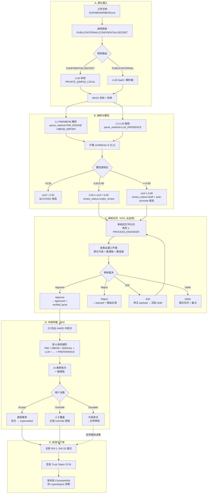
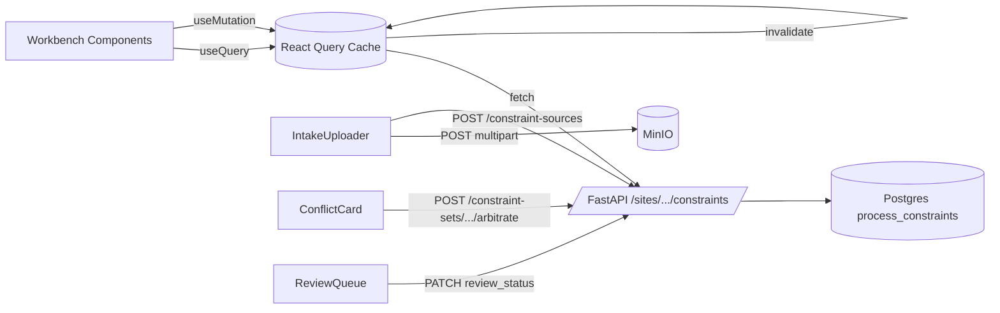

# Constraint Agent 前端开发执行计划 v1.0

> 状态：草案 · 编制日期 2026-05-07 · 适用里程碑 M1（源头摄入 UI）→ M2（工作台四区）→ M4（冲突仲裁）→ M5（审核队列与 CP-B）
> 上游依据：[constraint_subsystem_v3_execution_plan.md](constraint_subsystem_v3_execution_plan.md)、[step3.2-PRD-2 v3.0](../PRD/step3.2-PRD-2%20v3.0%EF%BC%9A%E5%B7%A5%E8%89%BA%E6%96%87%E6%A1%A3%E8%BD%AC%E6%95%B0%E5%AD%97%E7%BA%A6%E6%9D%9F%EF%BC%88%E7%9F%A5%E8%AF%86%E5%9B%BE%E8%B0%B1%2BMBD%E8%B7%AF%E7%BA%BF%EF%BC%89%E7%A0%94%E5%8F%91%E6%8E%92%E6%9C%9F%E7%BA%A7.md)、[step4.2 产品原型](../PRD/step4.2-PRD-2_%E5%B7%A5%E8%89%BA%E6%96%87%E6%A1%A3%E8%BD%AC%E6%95%B0%E5%AD%97%E7%BA%A6%E6%9D%9F_%E4%BA%A7%E5%93%81%E5%8E%9F%E5%9E%8B.html)
> 范围：本文交付三件套——① 人在回路活动 DAG；② 工作台 UI 设计；③ 前端研发执行计划。

---

## 0. 工作前提与边界

| 项 | 当前状态 | 影响 |
|---|---|---|
| M0 数据模型 | 已落地（migrations 0019/0020/0021、enums、state machine） | 前端可直接消费 `category`、`review_status`、`parse_method`、`verified_*` |
| 后端 CRUD | 已就绪（GET/POST/PATCH/DELETE + validate） | M2 列表/编辑/审核可全量对接 |
| 文档摄入 API | 未上线（M1 PR-2/3/4） | 上传 / 解析 / Excel 导入需与后端并行；前端先桩接口 |
| Z3 求解 | 未上线（M3） | 冲突仲裁 UI 用 mock 数据先行（M4 切真实） |
| 现有 UI | `ConstraintsPanel.tsx` 三栏只读 | 重构为 `ConstraintsWorkbench.tsx` 四区，旧组件做适配层渐进迁移 |
| 角色矩阵 | 默认 `PROCESS_ENGINEER` | 与 RBAC 投影联动；`viewer` 不见审核操作按钮 |

约束清单（不可违反）：
- 禁止 emoji；图标用 heroicons-outline SVG（`web/src/components/icons.tsx` 现有 Icon 体系）。
- 三态强制：empty / loading skeleton / error（带 retry 与可复制 `mcp_context_id`）。
- 配色冷白 + 浅灰底，强调色 `#2563eb`、`#14b8a6`；置信度色阶 红/琥珀/绿，与后端阈值 0.50 / 0.80 一致。
- TS 命名导出；接口前缀 `IXxx`；React Query 作为唯一数据源管理。
- 无障碍：axe-core 0 critical、Lighthouse a11y ≥ 95、键盘可达。

---

## 1. 输出一 · 人在回路（HITL）活动 DAG

### 1.1 全景：从文档到批准约束的生命周期



### 1.2 角色 × 活动矩阵

| 活动 | viewer | process_engineer | chief_engineer | system_admin |
|---|:-:|:-:|:-:|:-:|
| 浏览列表 / 图谱 / 详情 | R | R | R | R |
| 上传文档 + 选择密级 | – | C | C | C |
| 触发 LLM 抽取 / 重抽 | – | C | C | C |
| 审核 approve/reject | – | C（≤ HARD/SAFETY 之外） | C（全类目） | – |
| 冲突仲裁接受推荐 | – | C | C | – |
| 冲突仲裁人工覆盖 | – | – | C | – |
| 升级争议至总师 | – | C | – | – |
| 签发 CP-B | – | – | C | C |
| 撤销/Soft-delete | – | – | C | C |

R = Read · C = Change · `–` = 无权限。前端按 `useRole()` 渲染；越权操作返回 403 时弹出友好提示。

### 1.3 状态机映射（与后端一致）

```
draft        --submit-->        under_review
under_review --approve-->       approved   [写 verified_by/at]
under_review --reject-->        rejected
approved     --conflict-->      superseded [冲突败方]
rejected     --revise-->        draft
draft        --edit-->          draft      [bump updated_at, needs_re_review]
```

UI 层硬约束：
- 任何转换到 `approved` 必须在前端预校验 `verified_by_user_id` 已通过 `useAuth().userId` 注入。
- `superseded` 不出现在主列表，仅在「历史」抽屉中可见。
- `needs_re_review=true` 行加左侧琥珀竖条 + Tooltip。

---

## 2. 输出二 · 工作台 UI 设计

### 2.1 信息架构（IA）

```
/sites/[siteId]/constraints
├── TopBar       站点切换 · MCP Context · CP-A/B 徽章 · 角色 · 全局搜索
├── LeftRail     文档摄入 · 解析进度 · 队列计数 · 闸门状态 · 本体统计
├── CenterTabs
│   ├── Tab① 列表          7 列表格 + 高级筛选
│   ├── Tab② 知识图谱       Dagre DAG + 迷你地图
│   ├── Tab③ 冲突仲裁 (M4)  冲突对卡片 + AI 建议
│   └── Tab④ 审核队列 (M5)  待审行 + 批量操作
├── RightDrawer  详情 · 证据 · 本体邻居 · 审计轨迹
└── StatusBar    Z3 状态 · 闸门统计 · 最新事件流
```

### 2.2 屏幕线框（ASCII）

```
┌──────────────────────────────────────────────────────────────────────────────┐
│ TopBar  ProLine | Site:F22-Bay3 | MCP:ctx-7a3c | CP-A√ CP-B× | Role:工艺师  │
├────────────┬─────────────────────────────────────────────────┬───────────────┤
│ LeftRail   │  [列表] [图谱] [冲突 3] [审核 12]               │ RightDrawer   │
│            │                                                 │               │
│ 文档摄入    │  筛选: 类型▼ 类目▼ 来源▼ 状态▼  [新建] [导入]    │ 约束 c-0142   │
│  + 上传     │  ┌────────────────────────────────────────┐    │ ─────────     │
│             │  │ID│类型│类目│权威│置信度│规则摘要│状态  │    │ 类型: 先后    │
│ 解析进度    │  │c1│先后│顺序│PMI │■■■■□│A→B 30s │草稿  │    │ 类目: 顺序    │
│  3/12 完成  │  │c2│资源│资源│MBOM│■■■■■│夹具 ×2 │待审  │    │ 权威: PMI(0)  │
│             │  │…  │     │     │     │       │       │      │    │ 置信度: 0.92 │
│ 待审 12     │  └────────────────────────────────────────┘    │               │
│  - 高 3     │                                                 │ 证据          │
│  - 中 7     │  分页 1/12 · 共 142 条                          │  原文片段 ↗  │
│  - 低 2     │                                                 │  推理链 ▼     │
│             │                                                 │               │
│ 闸门 ●●●●○○ │                                                 │ 本体邻居      │
│ INV 8/10    │                                                 │  上游 c-001   │
│             │                                                 │  下游 c-203   │
│ 本体统计    │                                                 │               │
│  节点 142   │                                                 │ 审计轨迹      │
│  边 89      │                                                 │  2026-05-06   │
│             │                                                 │  Created…    │
├────────────┴─────────────────────────────────────────────────┴───────────────┤
│ StatusBar  Z3: idle | INV pass 8/10 | last event: c-0142 created 12:03:41   │
└──────────────────────────────────────────────────────────────────────────────┘
```

### 2.3 组件清单（src/components/constraints/）

| 组件 | 职责 | 里程碑 | 复用 |
|---|---|---|---|
| `ConstraintsWorkbench.tsx` | 顶层容器，路由 tab、布局、上下文 Provider | M2 | 替代 `ConstraintsPanel` |
| `LeftRail.tsx` | 摄入按钮、解析进度、队列计数、闸门、统计 | M1+M2 | 新建 |
| `IntakeUploader.tsx` | 拖拽上传 + 密级 Combobox + Hash 预览 | M1 | 新建 |
| `IntakeProgressList.tsx` | 解析任务流（SSE 或轮询） | M1 | 新建 |
| `ConstraintTable.tsx` | 7 列虚拟滚动表格 | M2 | 拆自 Panel |
| `ConfidenceBar.tsx` | 三档色阶 + 数值 + Tooltip | M2 | 新建 |
| `AuthorityBadge.tsx` | 6 级权威阶徽章（PMI/MBOM/…/PREFERENCE） | M2 | 新建 |
| `ReviewStatusChip.tsx` | 状态徽章（已存在样式，提炼） | M2 | 抽取 |
| `CategoryChip.tsx` | 类目徽章（已存在样式，提炼） | M2 | 抽取 |
| `ConstraintGraphView.tsx` | Dagre + xyflow，含迷你地图 | M2 | 重写 `ConstraintGraph` |
| `RightDrawer.tsx` | 详情容器，包四个面板 | M2 | 新建 |
| `EvidencePanel.tsx` | 文档片段高亮 + PMI CAD 链接 | M2/M3 | 新建 |
| `ReasoningChainPanel.tsx` | LLM 推理链折叠展示 | M3 | 新建 |
| `OntologyNeighborsPanel.tsx` | 上下游约束链接 | M2 | 新建 |
| `AuditTrailPanel.tsx` | created/updated/verified 时间线 | M2 | 新建 |
| `ConflictArbitrationCard.tsx` | 冲突对卡片 + AI 建议 + 决策按钮 | M4 | 新建 |
| `ReviewQueueTable.tsx` | 待审行表 + 批量审核 | M5 | 新建 |
| `ConstraintForm.tsx` | 新建/编辑表单（discriminated payload） | 既有，扩展 | 已存在 |
| `ImportExcelDialog.tsx` | Excel 模板下载 + 上传 + 错误回显 | M1 | 新建 |
| `KillswitchBanner.tsx` | 503 / 锁定状态条 | M2 | 复用全局 |

### 2.4 关键交互规范

| 场景 | 规范 |
|---|---|
| 行点击 | 主列表 → 右抽屉 ≤ 100ms 出详情；图谱节点点击同上 |
| 审核单行 | 抽屉底部三按钮：Approve（主色）/ Reject（次色 + 必填理由 Modal）/ Edit（打开 Form） |
| 批量审核 | 表头多选 → 浮出操作条；最多 200 行/批；后端逐行返回结果，UI 用绿色对勾/红叉覆盖 |
| 冲突弹窗 | 居中 Modal 80vw × 70vh；左侧约束 A，右侧约束 B，下方 AI 推荐区，底部 Accept / Override / Escalate |
| 错误态 | toast + 抽屉内 ErrorBanner，附 `Copy mcp_context_id` 按钮 |
| 加载态 | 表格 8 行骨架 / 图谱方框骨架 / 抽屉 6 段 LineSkeleton |
| 空态 | 图标 + 一句指引 + 主操作按钮（如「上传第一个 SOP」） |
| 键盘 | `j`/`k` 上下行，`Enter` 打开抽屉，`a`/`r` 批准/驳回（焦点在抽屉时），`/` 聚焦搜索 |
| 实时更新 | React Query `refetchInterval` 5s（仅 list/queue），SSE 后续接入 |
| 国际化 | 文案 zh-CN，键名 English；统一 `useT()` 钩子 |

### 2.5 数据流（前端视角）



缓存键约定：
- `['constraints', siteId, filters]`
- `['constraint', siteId, constraintId]`
- `['constraint-sources', siteId]`
- `['constraint-graph', siteId]`
- `['review-queue', siteId, conf_tier]`
- `['conflicts', siteId]`

任何 mutation 成功后 invalidate `['constraints', siteId, *]` 与受影响的子键。

### 2.6 设计 Token（Tailwind 静态映射，避免 JIT 失效）

```ts
// 置信度
conf >= 0.80 -> "bg-emerald-50 text-emerald-700 border-emerald-200"
conf >= 0.50 -> "bg-amber-50  text-amber-700  border-amber-200"
conf <  0.50 -> "bg-rose-50   text-rose-700   border-rose-200"

// 权威阶
PMI_ENGINE   -> "bg-indigo-50 text-indigo-700"   // 0
MBOM_IMPORT  -> "bg-blue-50   text-blue-700"     // 1
MANUAL_UI    -> "bg-slate-100 text-slate-700"    // 2
LLM_INFERENCE-> "bg-violet-50 text-violet-700"   // 3
EXCEL_IMPORT -> "bg-cyan-50   text-cyan-700"     // 4
PREFERENCE   -> "bg-zinc-100  text-zinc-600"     // 5
```

强调色仅 `#2563eb`（操作主色）与 `#14b8a6`（成功 / CP 通过）。错误统一 `text-rose-700`。

---

## 3. 输出三 · 前端研发执行计划

### 3.1 阶段划分（与后端 M1–M5 对齐）

| 阶段 | 主题 | 交付 | 依赖 | 估时 |
|---|---|---|---|---|
| **F0** | 脚手架与类型同步 | 路由 `/sites/[id]/constraints` 升级、`lib/types.ts` 与 0019/0020/0021 字段对齐、Storybook 引入（可选） | M0 已完成 | 0.5 周 |
| **F1** | 摄入与解析 UI | LeftRail + IntakeUploader + ImportExcelDialog + IntakeProgressList | 后端 M1 PR-2/3/4 | 1 周 |
| **F2** | 工作台四区骨架 | ConstraintsWorkbench、TopBar、Tabs、RightDrawer、StatusBar | F0 | 1 周 |
| **F3** | 列表 + 详情 + 图谱 | ConstraintTable、ConfidenceBar、AuthorityBadge、EvidencePanel、AuditTrailPanel、ConstraintGraphView | F2、后端 list/get | 1.5 周 |
| **F4** | 编辑 + 审核单行 | ConstraintForm 扩展、Approve/Reject/Edit 流、状态机前端校验 | F3、后端 PATCH 状态机 | 0.5 周 |
| **F5** | 冲突仲裁 UI | ConflictArbitrationCard、ReasoningChainPanel | 后端 M4 | 1 周 |
| **F6** | 审核队列 + 批量 | ReviewQueueTable、批量操作条、SSE 接入 | 后端 M5 | 1 周 |
| **F7** | 加固与发布 | a11y、性能、E2E、Killswitch、Lighthouse | 全部 | 0.5 周 |

合计 6.5 周，可与后端 M1–M5 并行（F1 与后端 M1 同窗口启动）。

### 3.2 PR 切片（建议）

| PR | 主题 | 包含组件/文件 | 验收 |
|---|---|---|---|
| FE-PR-1 | F0 脚手架 | 路由、`lib/types.ts` 同步、`lib/api.ts` constraint helpers、空 Workbench | 类型 0 错；页面可达 |
| FE-PR-2 | F1 摄入上传 | IntakeUploader、密级 Combobox、Hash 预览、错误三态 | 上传 100MB 不冻 UI；密级 routing 单测 |
| FE-PR-3 | F1 Excel 导入 | ImportExcelDialog、模板下载、错误表 | 上传 200 行返回错误能逐行高亮 |
| FE-PR-4 | F1 解析进度 | IntakeProgressList、轮询 | 多任务并行展示，完成态切换正确 |
| FE-PR-5 | F2 工作台骨架 | Workbench/TopBar/Tabs/RightDrawer/StatusBar | 切 tab 不丢状态；URL 同步 `?tab=` |
| FE-PR-6 | F3 列表 + 抽屉 | ConstraintTable、ConfidenceBar、AuthorityBadge、CategoryChip、ReviewStatusChip、AuditTrailPanel | 7 列 1:1 对齐 mockup；筛选生效 |
| FE-PR-7 | F3 图谱 | ConstraintGraphView + 迷你地图 | 100 节点 ≥ 30fps；click → 抽屉 ≤ 100ms |
| FE-PR-8 | F4 编辑 + 审核单行 | ConstraintForm 扩展、状态机前端校验、Reject 理由 Modal | 状态机非法转换被拦；approve 后 verified_by 写入 |
| FE-PR-9 | F5 冲突仲裁 | ConflictArbitrationCard、ReasoningChainPanel、Conflict tab | 接受推荐后败方变 superseded；override 记录原因 |
| FE-PR-10 | F6 审核队列 | ReviewQueueTable、批量操作、置信度 tier 筛选 | 批量 200 行回显完整；筛选 tier 一致 |
| FE-PR-11 | F6 SSE 实时 | EventSource 接入、StatusBar 事件流 | 断线自动重连；UI 不闪 |
| FE-PR-12 | F7 a11y + 性能 | axe 修复、键盘快捷键、Lighthouse | axe 0 critical；Lighthouse a11y ≥ 95；TTI ≤ 2.5s |

每个 PR 模板必填：风险面、回滚步骤、测试命令；遵循 Conventional Commits（`feat(web/constraints): …`）。

### 3.3 测试矩阵

| 层级 | 工具 | 目标数 | 覆盖 |
|---|---|---|---|
| 组件单测（Vitest + RTL） | jsdom + 本地 storage shim | ≥ 60 | Chip/Bar/Badge/Form schema/状态机分支 |
| 钩子单测 | Vitest | ≥ 20 | useConstraintsQuery、useReviewMutation、useRole 投影 |
| 集成（MSW mock API） | Vitest | ≥ 15 | 列表 → 抽屉 → 审核 → 缓存失效全链路 |
| E2E（Playwright） | Chromium + Firefox | ≥ 12 | 上传→解析→审核→批准；冲突仲裁；批量审核；503 Killswitch |
| 视觉回归 | Playwright snapshot | 关键页 8 张 | TopBar/LeftRail/Table/Drawer/Conflict/Queue 空/loading/error |
| a11y | axe-core in Playwright | 主页面 4 张 | 0 critical |
| 性能 | Lighthouse CI | 主页 1 张 | a11y ≥ 95、Performance ≥ 80 |

测试命令统一在 `web/package.json`：
```bash
npm --prefix web run test         # vitest unit + integration
npm --prefix web run test:e2e     # playwright
npm --prefix web run lint
npm --prefix web run typecheck
npm --prefix web run lh-ci        # local lighthouse run
```

### 3.4 风险与缓释

| 风险 | 触发面 | 缓释 |
|---|---|---|
| 后端 M1 / M3 / M4 API 节奏滞后 | F1/F5 阻塞 | 用 MSW mock + 契约 JSON Schema（与后端共仓 `shared/`）先行；上线前一日切真 |
| Excel 导入大文件超时 | FE-PR-3 | 客户端切片 + 进度条；后端响应 202 + 任务轮询 |
| 知识图谱 100+ 节点卡顿 | FE-PR-7 | 仅渲染视口节点；`React.memo` + `useDeferredValue`；Web Worker 算 layout |
| 状态机分支爆炸 | FE-PR-8 | 抽离 `reviewMachine.ts` 纯函数；表驱动单测 |
| 配色越界（强调色滥用） | 全程 | Storybook 视觉清单 + `eslint-plugin-tailwindcss` allowlist |
| 国际化遗漏 | 全程 | `useT()` 钩子 + i18n key lint；CI 检测裸字符串 |
| RBAC 越权按钮可见 | F4/F5/F6 | `<RoleGate role="…">` 包裹；E2E 用各角色登录跑一遍 |

### 3.5 准入与准出（DoR / DoD）

**Definition of Ready（一个 PR 可启动）**：
- 设计稿/线框已贴本文 §2.2 或对应组件 Issue。
- 后端契约（OpenAPI 片段或 mock JSON）已就绪。
- 类型 `lib/types.ts` 已同步；Pydantic schema 在 `shared/` 中可见。
- 所属测试用例已在 PR 描述中列出。

**Definition of Done（一个 PR 可合并）**：
- 三态全覆盖（empty/loading/error）。
- 单测 + 集成测试通过；新增组件覆盖率 ≥ 80%。
- `npm run lint && npm run typecheck` 0 错。
- Storybook（若启用）截图更新。
- axe-core 对受影响页 0 critical。
- PR 描述含：风险面、回滚、测试清单、相关 mcp_context_id。
- 至少 1 位评审人（前端 owner）+ 后端 owner 签字（涉及契约时）。

### 3.6 度量与里程碑闸门

| 指标 | 目标 | 度量 |
|---|---|---|
| 列表首屏 TTI | ≤ 2.5s | Lighthouse |
| 抽屉详情打开 | ≤ 100ms | React Profiler |
| 图谱 100 节点 FPS | ≥ 30 | Performance API 采样 |
| 审核单条耗时（点击→落库→刷新） | ≤ 800ms | E2E timing |
| a11y critical 缺陷 | 0 | axe-core CI |
| 单元 + 集成覆盖率 | ≥ 80% | Vitest coverage |
| E2E 通过率 | 100% | Playwright |

闸门策略：F3、F5、F6 完成后各拉一次「演示日」，邀请工艺师角色实操，缺陷分级（P0/P1/P2）后回灌待办。

### 3.7 与后端的协议清单（前端等待项）

| API | 用途 | 期望窗口 |
|---|---|---|
| `POST /sites/{id}/constraint-sources` | 文档上传（已规划 M1 PR-2） | F1 启动 |
| `GET  /sites/{id}/constraint-sources` | 摄入列表 | F1 |
| `POST /sites/{id}/constraints/import-excel` | Excel 批量 | F1 PR-3 |
| `GET  /sites/{id}/constraints/graph` | 图谱节点/边 | F3 PR-7 |
| `GET  /sites/{id}/constraints/conflicts` | 冲突对 | F5 |
| `POST /sites/{id}/constraints/{id}/arbitrate` | 仲裁结果落库 | F5 |
| `GET  /sites/{id}/constraints/review-queue` | 队列分档 | F6 |
| `POST /sites/{id}/constraints/batch-review` | 批量审批 | F6 |
| `GET  /sites/{id}/events` (SSE) | 实时事件流 | F6 PR-11 |

如后端窗口顺延，前端用 MSW handler 暂以契约骨架推进；切换真实 API 仅替换 base URL 与鉴权头。

---

## 4. 输出四 · 时空约束本体（4D Spacetime Constraint Ontology）

> 解决用户挑战："约束如何与产线实体（如装配工位）建立关联？" 答案不是把 `payload.asset_ids` 字符串当外键用，而是引入**时间维（生命周期阶段）+ 空间维（IEC 81346 三视角层级）** 的双维本体。
> 详细决策与权衡见 [ADR-0009 时空约束本体](../docs/adr/0009-spacetime-constraint-ontology.md)。

### 4.1 行业标准对齐（术语锚定）

| 维度 | 标准 | 采纳 |
|---|---|---|
| 资产生命周期阶段 | **ISO 55000** + CAPEX 项目阶段 | `LifecyclePhase` 8 值枚举 |
| 时空数据建模根隐喻 | **ISO 15926-2** 4D space-time data model | 每条约束携带 `temporal_scope + spatial_scope` |
| 设备层级 | **ISA-95 / IEC 62264** Equipment Hierarchy | `node_kind` 枚举（Enterprise → Site → Area → Line → WorkCenter → Station → Equipment → Module） |
| 参考标识系统（视角） | **IEC/ISO 81346** RDS（Function `=` / Product `-` / Location `+`） | `aspect` 枚举（FUNCTION / PRODUCT / LOCATION），同一物理对象可被多 aspect 引用 |

### 4.2 核心模型增量

```
Constraint
  ├─ semantic_payload   { kind, params … }                      [现有]
  ├─ temporal_scope     applicable_phases: Set<LifecyclePhase>  [新]
  │                     valid_from / valid_to (可选)
  └─ spatial_scope ──N:M──▶ HierarchyNode (经 ConstraintScope)  [新]
                            ├─ aspect: FUNCTION|PRODUCT|LOCATION
                            ├─ inherit_to_descendants: bool
                            └─ binding_strategy: S1|S2|S3|S4
```

**LifecyclePhase 枚举（8 阶段）**：
`CONCEPT · DESIGN · CONSTRUCTION · COMMISSIONING · OPERATION · MODIFICATION · MAINTENANCE · DECOMMISSION`

**HierarchyNode 表**（统一承载 Location/Equipment/Tool/Procedure/Document，避免扁平 enum 并列）：
- `rds_code` — IEC 81346 风格 `=A1.B2-K1+S03`，唯一可读 ID。
- `aspect ∈ {FUNCTION, PRODUCT, LOCATION}`。
- `node_kind ∈ {Enterprise, Site, Area, Line, WorkCenter, Station, Equipment, Tool, Fixture, Material, Procedure, Document}`。
- `parent_id` 自引用，组成层级树。
- `asset_guid` / `process_step_id` 链回既有 Asset / 工序。

**ConstraintScope 表**（约束 ↔ 节点多对多，带视角与继承）：
- `inherit_to_descendants=true`：挂在 Line 上的约束自动作用到下属 Station / Equipment，可被子节点覆盖。
- `binding_strategy`：S1 显式 ID / S2 类型匹配 / S3 语义召回 / S4 人工映射，与置信度联动。

### 4.3 不变量增量（INV-14..16）

- **INV-14**：`review_status='approved' ⇒ applicable_phases.size ≥ 1`（必须显式声明何时生效）。
- **INV-15**：`review_status='approved' ⇒ scopes.size ≥ 1`（必须显式声明作用对象）。
- **INV-16**：FUNCTION aspect 的 scope 必须指向 `node_kind='Procedure'` 的节点；PRODUCT / LOCATION 同理。

### 4.4 SOP ↔ 约束 ↔ 实体的正确链路

```
SOP/PMI Document (HierarchyNode kind=Document)
         │ extracts
         ▼
     Constraint ── temporal_scope ──▶ {Phase…}
         │ scope (S1..S4)                      ▲
         ▼                                     │
   HierarchyNode                               │
     ├─ FUNCTION:Procedure  ──── 工序应做/禁做 ┘
     ├─ PRODUCT:Equipment/Tool ── 资产能力/限制
     └─ LOCATION:Station/Area  ── 场所约束条件
```

同一句 SOP 文本（如"翼身对接铆接需在 24h 内完成"）可同时绑到 FUNCTION（工序时间约束）/ PRODUCT（设备占用资源约束）/ LOCATION（工位互斥约束）三视角，下游 Layout / Sim / 排程各取所需。

### 4.5 后端落地清单（M1.5 新里程碑，插于 M1 与 M2 之间）

| PR | 主题 | 内容 |
|---|---|---|
| BE-PR-M1.5-1 | 枚举 + Alembic | `LifecyclePhase` / `HierarchyAspect` / `node_kind` 扩展；migration 0022 `hierarchy_nodes`、0023 `constraint_scopes`、0024 `process_constraints.applicable_phases JSONB` + data migration 兜底默认值 |
| BE-PR-M1.5-2 | HierarchyService | 树 CRUD、`rds_code` 解析与校验、`parent_id` 环检测、批量导入 |
| BE-PR-M1.5-3 | ScopeBindingService | S1–S4 自动绑定 pipeline、`inherit_to_descendants` 展开、置信度门槛 |
| BE-PR-M1.5-4 | API 表层 | `GET /sites/{id}/hierarchy`、`POST /constraints/{id}/scopes`、`DELETE /constraints/{id}/scopes/{scope_id}`、`GET /constraints/4d-matrix?phase=&aspect=` |
| BE-PR-M1.5-5 | 不变量与 L0 | INV-14/15/16 入 `tests/db/test_constraint_invariants.py`；schema drift 检查 |

### 4.6 前端落地清单（追加到 §3.2 PR 表）

| 新增 PR | 主题 | 包含组件 | 验收 |
|---|---|---|---|
| FE-PR-6.5 | 列表「时空标签」列 + 抽屉「时空范围」面板 | `LifecyclePhaseChips.tsx`、`ScopePanel.tsx` | 列表新列展示 `[设计·建造]@FUNCTION:OP-WING-MATE-001` 形式；抽屉可增删 scope |
| FE-PR-6.6 | 层级树侧栏（替换/扩展 LeftRail） | `HierarchyTree.tsx`（Function/Product/Location 三 Tab） | 树筛选联动主列表；100 节点流畅滚动 |
| FE-PR-7.5 | Tab ⑥ 4D 时空矩阵（M2.5，可选） | `Spacetime4DMatrix.tsx` 热力图 | 横 8 阶段 × 纵层级树；点击格子下钻列表 |
| FE-PR-8.5 | 审批前置校验 | `ScopePanel` 与 `LifecyclePhaseChips` 强制必填 | `applicable_phases.size==0 || scopes.size==0` 时按钮禁用 + 提示 |

### 4.7 UI 增量交互规范

- **列表筛选条**新增两控件：`生命周期阶段` 多选 Chip 组、`层级节点` 树形 Picker（带 RDS 搜索框）。
- **审核抽屉**底部强制两段：① 8 阶段多选；② 当前 scopes 列表 + 「添加绑定」按钮（弹候选 Modal，展示 S1–S4 命中节点 + 置信度）。
- **配色扩展**（设计 token 静态映射）：
  - 阶段：`CONCEPT slate · DESIGN blue · CONSTRUCTION zinc · COMMISSIONING amber · OPERATION emerald · MODIFICATION violet · MAINTENANCE teal · DECOMMISSION rose`
  - 视角：`FUNCTION indigo · PRODUCT cyan · LOCATION lime`
- **快捷键扩展**：`p` 切换 Phase 筛选下拉，`h` 切换 Hierarchy 树 aspect 标签页。

### 4.8 与既有四种绑定策略的关系

§4 的 ConstraintScope 与上一稿讨论的 S1/S2/S3/S4 绑定策略**完全兼容**：
- S1 显式 ID → `node_id` 直绑某 `node_kind=Equipment/Station/Procedure` 实例。
- S2 类型匹配 → `node_id` 指向 `AssetType` 模板节点（`node_kind=AssetTypeTemplate`），落地时再实例化。
- S3 语义召回 → `confidence < 0.80` 进入审核队列，必须人工裁决。
- S4 人工 → 抽屉「添加绑定」走此路径，写 `verified_by_user_id`。

### 4.9 风险与缓释

| 风险 | 缓释 |
|---|---|
| HierarchyNode 表与既有 `assets` 表概念重叠 | 不复制 Asset 物理字段；仅持 `asset_guid` 指针；Asset 仍由 ParseAgent 生产 |
| 层级树深度膨胀导致 UI 卡顿 | 树虚拟滚动 + 懒加载；后端 `?depth=2` 分页 |
| 现有约束无 `applicable_phases` | data migration 默认 `{DESIGN, OPERATION}` + 标 `needs_re_review=true` 强制再审 |
| 用户混淆 aspect 概念 | UI 加 Tooltip + 一段微教学（首次进入弹一次性引导） |

---

## 5. 后续动作（本周内）

1. 评审本文（前端 owner + 后端 owner + 工艺师代表 1 人），回灌到 GitHub Project 看板。
2. 拆分 FE-PR-1 / FE-PR-5 两个 issue，立刻启动 F0 脚手架与 F2 骨架。
3. 与后端确认 M1 摄入接口 OpenAPI 片段的对齐时间，固化到 §3.7 表格。
4. 在 `web/.storybook/` 引入 Storybook（决策项；若不引入则用 dev page `/dev/components`）。
5. 评审 [ADR-0009 时空约束本体](../docs/adr/0009-spacetime-constraint-ontology.md)；通过后启动 BE-PR-M1.5-1（Alembic 0022/0023/0024）。
6. 起草 `ADR-XXXX-constraint-workbench-architecture.md`，沉淀本文 §1–§3 设计取舍。
