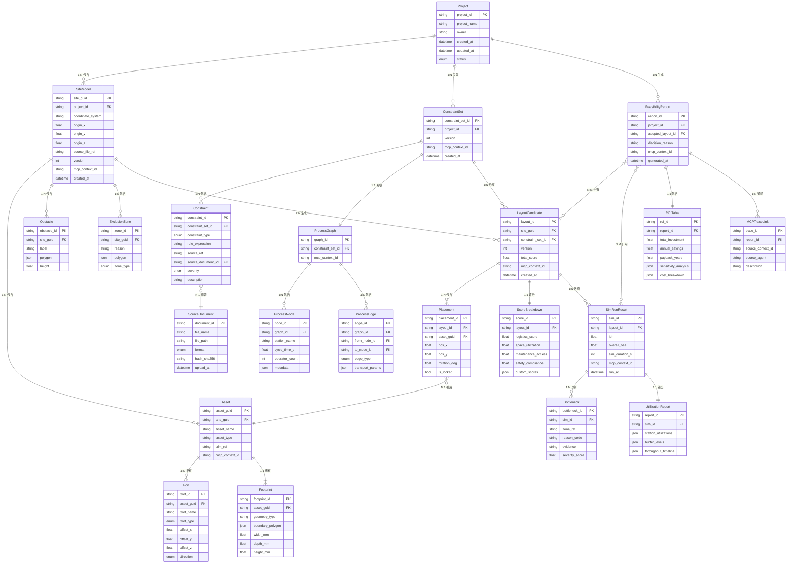
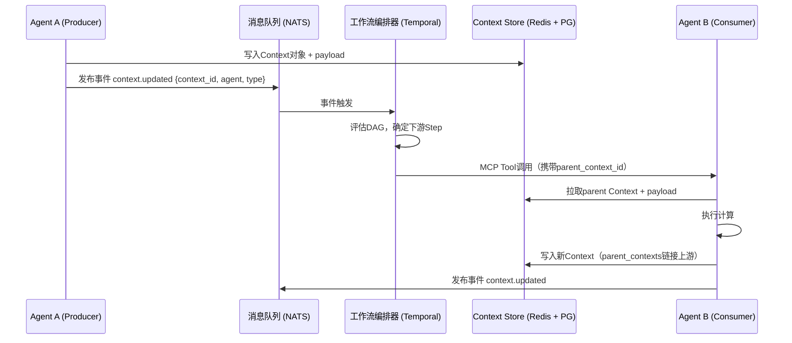

# PRD 全局附录：数据模型、MCP接口规范与决策记录

**版本**：v1.2（2026-05-06 修订）
**初版日期**：2026 年 4 月 10 日
**关联 PRD**：PRD-1 ~ PRD-5（产线+工艺 PRD v1.2 / v3.0）
**状态**：v1.0 概念性 ERD 仍然有效；**约束子系统**实际落地以下列权威文档为准

---

## 修订与权威指针（v1.2，**优先于 v1.0 同名章节**）

> 本附录 v1.0 中关于 **Constraint / SourceDocument / ProcessGraph** 的字段命名
> 与表结构是**概念性 ERD**，与最终数据库实现存在差异。下列文档为**单一事实来源**，
> 当本附录与之冲突时，**以下列文档为准**：

| 子系统 | 权威文档 | ADR |
|---|---|---|
| 约束子系统（ConstraintSet / ProcessConstraint / ConstraintSource / Citations） | [docs/constraint_subsystem_data_model.md](../docs/constraint_subsystem_data_model.md) | [ADR-0005](../docs/adr/0005-constraint-set-schema.md) · [ADR-0006](../docs/adr/0006-constraint-evidence-authority.md) |
| ParseAgent / SiteModel / Asset 分类 | [docs/parse_agent_steps_overview.md](../docs/parse_agent_steps_overview.md) · [shared/models.py](../shared/models.py) | — |
| 数据架构（仓储 / 时序 / 向量） | [docs/data_architecture.md](../docs/data_architecture.md) | — |
| MCP Context 实现 | [shared/mcp_protocol.py](../shared/mcp_protocol.py) · `mcp_contexts` 表 | — |

### 与 v1.0 ERD 的关键 Delta（截至 migration 0021）

1. **不存在 `Constraint` 单一表**。语义维度（kind / class / category /
   authority / conformance / scope / rationale / confidence）全部下沉到
   **`process_constraints`** 单表，多维正交。详见
   [约束蓝图 §0 §4](../docs/constraint_subsystem_data_model.md)。
2. **不存在 `SourceDocument` / `documents` 表**。SOP / MBOM / MBD / 法规等
   均为 **`constraint_sources`** 的实例，由 `authority` 字段（`statutory /
   industry / enterprise / project / heuristic / preference`）区分；文件二进制
   存 MinIO，`doc_object_key` 指向对象存储 key；`hash_sha256` 唯一去重。
3. **约束 ↔ 源 N:M 关系**走 **`constraint_citations`** 连接表（即知识图谱中的
   `SOURCED_FROM` 边），不通过 `process_constraints.source_document_id` 冗余字段
   表达（该字段计划在 G5 任务中废弃）。
4. **约束的业务类别**（SPATIAL / SEQUENCE / TORQUE / SAFETY / ENVIRONMENTAL /
   REGULATORY / QUALITY / RESOURCE / LOGISTICS / OTHER）通过 enum
   **`constraint_category`** 列承载（migration 0019）。
5. **行级审核生命周期**通过 **`constraint_review_status`** 列承载
   （`draft / under_review / approved / rejected / superseded`，migration 0020）；
   与 `constraint_sets.status`（集合层 `draft / active / archived`）正交。
6. **`constraint_sources.classification`** 决定 LLM 路由
   （`PUBLIC / INTERNAL / CONFIDENTIAL / SECRET`，migration 0021）。
7. **不变量 INV-1..INV-10** 由 DB CHECK / partial unique index / publish gate
   多层强制；CI 闸门：`pytest tests/db/test_constraint_invariants.py` +
   `python scripts/check_constraint_fk_matrix.py`。

下文 v1.0 章节保留作为**概念性参考**；具体落库字段以权威文档与
[shared/db_schemas.py](../shared/db_schemas.py) 为准。

---

## 目录

1. [全局实体关系图（ERD）](#1-全局实体关系图erd)
2. [全局数据字典](#2-全局数据字典)
3. [MCP Tool Schema 规范](#3-mcp-tool-schema-规范)
4. [MCP Context 传播规范](#4-mcp-context-传播规范)
5. [决策记录表（ADR）](#5-决策记录表adr)
6. [RBAC 权限矩阵](#6-rbac-权限矩阵)
7. [E2E 集成验收场景](#7-e2e-集成验收场景)

---

## 1. 全局实体关系图（ERD）

### 1.1 核心实体关系 Mermaid 图



### 1.2 实体关系说明

| 关系路径 | 基数 | 说明 |
|----------|------|------|
| Project → SiteModel | 1:N | 一个项目可包含多个版本的SiteModel |
| SiteModel → Asset | 1:N | 一个SiteModel包含多个设备资产 |
| SiteModel → LayoutCandidate | 1:N | 基于同一SiteModel生成多个布局方案 |
| ConstraintSet → LayoutCandidate | 1:N | 同一约束集可驱动多次布局生成 |
| LayoutCandidate → SimRunResult | 1:N | 同一布局可多次仿真（参数变化） |
| FeasibilityReport ↔ LayoutCandidate | N:M | 一份报告比选多个方案 |
| Constraint → SourceDocument | N:1 | 多条约束可溯源至同一文档 |
| MCPTraceLink → FeasibilityReport | N:1 | 报告中的每项结论均追溯到源Context |

---

## 2. 全局数据字典

### 2.1 枚举类型定义

> **以下表为 v1.0 概念枚举**。约束子系统的实际落地枚举（含 v1.2 新增）见
> [shared/models.py](../shared/models.py) 与
> [docs/constraint_subsystem_data_model.md §4](../docs/constraint_subsystem_data_model.md)。

| 枚举名 | 值域 | 说明 |
|--------|------|------|
| `ConstraintType` | `hard`, `soft`, `preference` | 概念命名；落库为 `process_constraints.class` |
| `ConstraintSeverity` | `critical`, `major`, `minor` | 约束违反的严重程度（落库为 `severity`） |
| `PortType` | `input`, `output`, `bidirectional`, `service` | 设备端口类型 |
| `PortDirection` | `north`, `south`, `east`, `west`, `up`, `down` | 端口朝向 |
| `ZoneType` | `structural_column`, `fire_escape`, `utility`, `custom` | 禁区类型 |
| `EdgeType` | `conveyor`, `agv`, `manual`, `crane` | 工序间物流方式 |
| `DocumentFormat` | `docx`, `pdf`, `txt`, `xlsx` | 源文档格式（落库为 `constraint_sources.url_or_ref` MIME 推断） |
| `ProjectStatus` | `draft`, `in_progress`, `review`, `approved`, `archived` | 项目状态（`projects` 表尚未建，VARCHAR 占位） |

#### v1.2 新增（约束子系统实际枚举）

| 枚举名 | 值域 | 落库列 | 来源 |
|--------|------|------|------|
| `ConstraintKind` | `predecessor / resource / takt / exclusion` | `process_constraints.kind` | ADR-0005 |
| `ConstraintClass` | `hard / soft / preference` | `process_constraints.class` | ADR-0005 |
| `ConstraintCategory` | `SPATIAL / SEQUENCE / TORQUE / SAFETY / ENVIRONMENTAL / REGULATORY / QUALITY / RESOURCE / LOGISTICS / OTHER` | `process_constraints.category` | migration 0019 |
| `ConstraintAuthority` | `statutory / industry / enterprise / project / heuristic / preference` | `process_constraints.authority` | ADR-0006 |
| `ConstraintConformance` | `MUST / SHOULD / MAY` | `process_constraints.conformance` | ADR-0006 |
| `ConstraintReviewStatus` | `draft / under_review / approved / rejected / superseded` | `process_constraints.review_status` | migration 0020 |
| `ConstraintParseMethod` | `MANUAL_UI / EXCEL_IMPORT / MBOM_IMPORT / PMI_ENGINE / LLM_INFERENCE` | `process_constraints.parse_method` | migration 0020 |
| `ConstraintSetStatus` | `draft / active / archived` | `constraint_sets.status` | ADR-0005 |
| `ConstraintSourceClassification` | `PUBLIC / INTERNAL / CONFIDENTIAL / SECRET` | `constraint_sources.classification` | migration 0021 |
| `AssetType`（22 闭枚举） | `Equipment / Conveyor / LiftingPoint / Zone / Wall / Door / Pipe / Column / Window / CncMachine / ElectricalPanel / StorageRack / Annotation / Other / StampingPress / WeldingRobot / HandlingRobot / Agv / Buffer / OperatorStation / InspectionStation / RobotCell` | `assets.type` | [shared/models.py](../shared/models.py) |

### 2.2 全局ID编码规则

| 实体 | ID格式 | 示例 |
|------|--------|------|
| Project | `proj_{uuid4_short}` | `proj_a1b2c3d4` |
| SiteModel | `site_{uuid4_short}` | `site_e5f6g7h8`（实际种子样本：`site_seed_001`） |
| Asset | `asset_{uuid4_short}` | `asset_i9j0k1l2`（ParseAgent 产出：`MDI-XXXXXXXX`） |
| Constraint | `cst_{uuid4_short}` | `cst_m3n4o5p6`（落库 `process_constraints.constraint_id`，UI 习惯 `PC-XXXXXX`） |
| Layout | `layout_{uuid4_short}` | `layout_q7r8s9t0` |
| SimRun | `sim_{uuid4_short}` | `sim_u1v2w3x4` |
| Report | `rpt_{uuid4_short}` | `rpt_y5z6a7b8` |
| MCP Context | `ctx_{agent}_{timestamp}_{seq}` | `ctx_parse_20260408T103000_001` |

#### v1.2 新增（约束子系统）

| 实体 | ID 列 | 格式约束 | 示例 |
|------|------|----------|------|
| ConstraintSet | `constraint_set_id` | `^cs_[a-z0-9_]+$` | `cs_default_active` |
| ConstraintSource | `source_id` | `^src_[a-z0-9_]+$`（DB CHECK 强制） | `src_gb50016_2014` |
| ConstraintCitation | `id` | UUID v4 | — |
| ProcessGraph | `id` | UUID v4 | — |

---

## 3. MCP Tool Schema 规范

### 3.1 通用约定

- **协议版本**：MCP v1.0（JSON-RPC 2.0 over stdio / SSE）
- **认证**：每次 Tool 调用必须携带 `Authorization: Bearer <OAuth2_token>`
- **上下文传播**：每次调用返回值必须包含 `mcp_context_id` 字段
- **错误码规范**：遵循 JSON-RPC 标准错误码 + 自定义业务错误码（5000~5999）

### 3.2 PRD-1：解析Agent Tool Schema

#### Tool: `parseDWG`

```json
{
  "name": "parseDWG",
  "description": "解析DWG/RVT底图文件，提取图层语义信息，生成SiteModel",
  "inputSchema": {
    "type": "object",
    "required": ["file_ref", "coordinate_config"],
    "properties": {
      "file_ref": {
        "type": "string",
        "description": "底图文件在对象存储中的引用路径（如 s3://bucket/drawings/plan.dwg）"
      },
      "file_format": {
        "type": "string",
        "enum": ["dwg", "rvt", "step"],
        "description": "文件格式"
      },
      "coordinate_config": {
        "type": "object",
        "properties": {
          "origin": { "type": "array", "items": { "type": "number" }, "minItems": 3, "maxItems": 3 },
          "unit": { "type": "string", "enum": ["mm", "cm", "m"], "default": "mm" },
          "up_axis": { "type": "string", "enum": ["Y", "Z"], "default": "Z" }
        },
        "required": ["origin", "unit"]
      },
      "layer_mapping": {
        "type": "object",
        "description": "可选的图层名到语义标签映射表",
        "additionalProperties": { "type": "string" }
      }
    }
  },
  "outputSchema": {
    "type": "object",
    "properties": {
      "site_model": { "$ref": "#/definitions/SiteModel" },
      "mcp_context_id": { "type": "string" },
      "parse_log": {
        "type": "array",
        "items": {
          "type": "object",
          "properties": {
            "level": { "type": "string", "enum": ["info", "warn", "error"] },
            "message": { "type": "string" },
            "layer": { "type": "string" }
          }
        }
      }
    }
  }
}
```

#### Tool: `instantiateAssets`

```json
{
  "name": "instantiateAssets",
  "description": "根据设备清单Excel实例化参数化Asset对象，挂载到SiteModel",
  "inputSchema": {
    "type": "object",
    "required": ["site_guid", "equipment_list_ref"],
    "properties": {
      "site_guid": {
        "type": "string",
        "description": "目标SiteModel的GUID"
      },
      "equipment_list_ref": {
        "type": "string",
        "description": "设备清单文件引用路径"
      },
      "plm_api_endpoint": {
        "type": "string",
        "description": "可选的PLM系统API端点，用于拉取设备参数"
      }
    }
  },
  "outputSchema": {
    "type": "object",
    "properties": {
      "assets": {
        "type": "array",
        "items": { "$ref": "#/definitions/Asset" }
      },
      "validation_result": {
        "type": "object",
        "properties": {
          "total_count": { "type": "integer" },
          "valid_count": { "type": "integer" },
          "issues": { "type": "array", "items": { "type": "string" } }
        }
      },
      "mcp_context_id": { "type": "string" }
    }
  }
}
```

#### Tool: `alignCoordinate`

```json
{
  "name": "alignCoordinate",
  "description": "执行坐标系校准与1:1对齐验证",
  "inputSchema": {
    "type": "object",
    "required": ["site_guid", "reference_points"],
    "properties": {
      "site_guid": { "type": "string" },
      "reference_points": {
        "type": "array",
        "items": {
          "type": "object",
          "properties": {
            "label": { "type": "string" },
            "dwg_coord": { "type": "array", "items": { "type": "number" } },
            "real_coord": { "type": "array", "items": { "type": "number" } }
          }
        },
        "minItems": 3
      }
    }
  },
  "outputSchema": {
    "type": "object",
    "properties": {
      "alignment_error_mm": { "type": "number" },
      "transform_matrix": { "type": "array" },
      "passed": { "type": "boolean" },
      "mcp_context_id": { "type": "string" }
    }
  }
}
```

### 3.3 PRD-2：约束Agent Tool Schema

#### Tool: `extractSOP`

```json
{
  "name": "extractSOP",
  "description": "从SOP/工艺文档中提取工艺顺序、安全规则，生成ConstraintSet与ProcessGraph",
  "inputSchema": {
    "type": "object",
    "required": ["document_refs"],
    "properties": {
      "document_refs": {
        "type": "array",
        "items": { "type": "string" },
        "description": "一个或多个SOP文档引用路径"
      },
      "industry_norm_refs": {
        "type": "array",
        "items": { "type": "string" },
        "description": "可选的行业规范引用"
      },
      "existing_constraint_set_id": {
        "type": "string",
        "description": "可选，追加到已有约束集"
      }
    }
  },
  "outputSchema": {
    "type": "object",
    "properties": {
      "constraint_set": { "$ref": "#/definitions/ConstraintSet" },
      "process_graph": { "$ref": "#/definitions/ProcessGraph" },
      "conflicts": {
        "type": "array",
        "items": {
          "type": "object",
          "properties": {
            "constraint_a": { "type": "string" },
            "constraint_b": { "type": "string" },
            "conflict_type": { "type": "string" },
            "suggestion": { "type": "string" }
          }
        }
      },
      "mcp_context_id": { "type": "string" }
    }
  }
}
```

#### Tool: `retrieveNorm`

```json
{
  "name": "retrieveNorm",
  "description": "基于RAG从知识库检索行业规范条款，辅助约束生成",
  "inputSchema": {
    "type": "object",
    "required": ["query"],
    "properties": {
      "query": { "type": "string", "description": "自然语言检索查询" },
      "top_k": { "type": "integer", "default": 5 },
      "filter_industry": { "type": "string", "description": "行业过滤（如 automotive, electronics）" }
    }
  },
  "outputSchema": {
    "type": "object",
    "properties": {
      "results": {
        "type": "array",
        "items": {
          "type": "object",
          "properties": {
            "norm_id": { "type": "string" },
            "title": { "type": "string" },
            "clause": { "type": "string" },
            "relevance_score": { "type": "number" }
          }
        }
      },
      "mcp_context_id": { "type": "string" }
    }
  }
}
```

### 3.4 PRD-3：布局Agent Tool Schema

#### Tool: `generateLayout`

```json
{
  "name": "generateLayout",
  "description": "基于SiteModel与ConstraintSet，执行多目标寻优生成布局候选方案",
  "inputSchema": {
    "type": "object",
    "required": ["site_guid", "constraint_set_id"],
    "properties": {
      "site_guid": { "type": "string" },
      "constraint_set_id": { "type": "string" },
      "candidate_count": { "type": "integer", "default": 5, "minimum": 1, "maximum": 10 },
      "optimization_weights": {
        "type": "object",
        "properties": {
          "logistics_efficiency": { "type": "number", "default": 0.3 },
          "space_utilization": { "type": "number", "default": 0.25 },
          "maintenance_access": { "type": "number", "default": 0.25 },
          "safety_compliance": { "type": "number", "default": 0.2 }
        }
      },
      "locked_placements": {
        "type": "array",
        "items": {
          "type": "object",
          "properties": {
            "asset_guid": { "type": "string" },
            "pos_x": { "type": "number" },
            "pos_y": { "type": "number" },
            "rotation_deg": { "type": "number" }
          }
        },
        "description": "已锁定位置的设备（不参与优化）"
      }
    }
  },
  "outputSchema": {
    "type": "object",
    "properties": {
      "layout_candidates": {
        "type": "array",
        "items": { "$ref": "#/definitions/LayoutCandidate" }
      },
      "mcp_context_id": { "type": "string" }
    }
  }
}
```

#### Tool: `collisionCheck`

```json
{
  "name": "collisionCheck",
  "description": "实时碰撞检测，返回干涉区域列表",
  "inputSchema": {
    "type": "object",
    "required": ["layout_id"],
    "properties": {
      "layout_id": { "type": "string" },
      "moved_asset": {
        "type": "object",
        "description": "可选，仅检测某个刚移动的设备",
        "properties": {
          "asset_guid": { "type": "string" },
          "new_pos_x": { "type": "number" },
          "new_pos_y": { "type": "number" },
          "new_rotation_deg": { "type": "number" }
        }
      }
    }
  },
  "outputSchema": {
    "type": "object",
    "properties": {
      "collisions": {
        "type": "array",
        "items": {
          "type": "object",
          "properties": {
            "asset_a": { "type": "string" },
            "asset_b": { "type": "string" },
            "overlap_mm": { "type": "number" },
            "region": { "type": "object" }
          }
        }
      },
      "zone_violations": {
        "type": "array",
        "items": {
          "type": "object",
          "properties": {
            "asset_guid": { "type": "string" },
            "zone_id": { "type": "string" },
            "violation_type": { "type": "string" }
          }
        }
      },
      "mcp_context_id": { "type": "string" }
    }
  }
}
```

#### Tool: `autoHeal`

```json
{
  "name": "autoHeal",
  "description": "对碰撞/违规区域执行自动修正，返回修正后的Placement",
  "inputSchema": {
    "type": "object",
    "required": ["layout_id", "collisions"],
    "properties": {
      "layout_id": { "type": "string" },
      "collisions": { "type": "array", "items": { "type": "object" } }
    }
  },
  "outputSchema": {
    "type": "object",
    "properties": {
      "healed_placements": {
        "type": "array",
        "items": { "$ref": "#/definitions/Placement" }
      },
      "unresolvable": {
        "type": "array",
        "items": { "type": "object" },
        "description": "无法自动修正的冲突，需人工介入"
      },
      "mcp_context_id": { "type": "string" }
    }
  }
}
```

### 3.5 PRD-4：仿真Agent Tool Schema

#### Tool: `runDES`

```json
{
  "name": "runDES",
  "description": "对选定布局执行离散事件仿真，输出产能报告与瓶颈诊断",
  "inputSchema": {
    "type": "object",
    "required": ["layout_id"],
    "properties": {
      "layout_id": { "type": "string" },
      "sim_params": {
        "type": "object",
        "properties": {
          "sim_duration_hours": { "type": "number", "default": 8 },
          "warm_up_hours": { "type": "number", "default": 1 },
          "oee_target": { "type": "number", "default": 0.85 },
          "order_sequence": {
            "type": "array",
            "items": {
              "type": "object",
              "properties": {
                "product_type": { "type": "string" },
                "quantity": { "type": "integer" }
              }
            }
          },
          "random_seed": { "type": "integer" }
        }
      },
      "use_pinn_surrogate": {
        "type": "boolean",
        "default": false,
        "description": "是否使用PINN代理模型加速（需已训练模型）"
      }
    }
  },
  "outputSchema": {
    "type": "object",
    "properties": {
      "sim_result": { "$ref": "#/definitions/SimRunResult" },
      "utilization_report": { "$ref": "#/definitions/UtilizationReport" },
      "bottlenecks": {
        "type": "array",
        "items": { "$ref": "#/definitions/Bottleneck" }
      },
      "mcp_context_id": { "type": "string" }
    }
  }
}
```

#### Tool: `identifyBottleneck`

```json
{
  "name": "identifyBottleneck",
  "description": "深度分析仿真结果，定位瓶颈根因并生成优化建议",
  "inputSchema": {
    "type": "object",
    "required": ["sim_id"],
    "properties": {
      "sim_id": { "type": "string" },
      "analysis_depth": { "type": "string", "enum": ["quick", "standard", "deep"], "default": "standard" }
    }
  },
  "outputSchema": {
    "type": "object",
    "properties": {
      "bottlenecks": {
        "type": "array",
        "items": { "$ref": "#/definitions/Bottleneck" }
      },
      "optimization_suggestions": {
        "type": "array",
        "items": {
          "type": "object",
          "properties": {
            "target": { "type": "string" },
            "action": { "type": "string" },
            "expected_improvement": { "type": "string" },
            "can_write_back_constraint": { "type": "boolean" }
          }
        }
      },
      "mcp_context_id": { "type": "string" }
    }
  }
}
```

#### Tool: `writeBackConstraint`

```json
{
  "name": "writeBackConstraint",
  "description": "将瓶颈诊断结果回写为新约束，触发布局重新优化",
  "inputSchema": {
    "type": "object",
    "required": ["constraint_set_id", "new_constraints"],
    "properties": {
      "constraint_set_id": { "type": "string" },
      "new_constraints": {
        "type": "array",
        "items": {
          "type": "object",
          "properties": {
            "rule_expression": { "type": "string" },
            "source_sim_id": { "type": "string" },
            "severity": { "type": "string", "enum": ["critical", "major", "minor"] }
          }
        }
      }
    }
  },
  "outputSchema": {
    "type": "object",
    "properties": {
      "updated_constraint_set_id": { "type": "string" },
      "added_count": { "type": "integer" },
      "mcp_context_id": { "type": "string" }
    }
  }
}
```

### 3.6 PRD-5：报告Agent Tool Schema

#### Tool: `gatherContext`

```json
{
  "name": "gatherContext",
  "description": "从前序模块（S1~S4）汇聚最新MCP Context，准备报告数据",
  "inputSchema": {
    "type": "object",
    "required": ["project_id"],
    "properties": {
      "project_id": { "type": "string" },
      "layout_ids": {
        "type": "array",
        "items": { "type": "string" },
        "description": "指定参与比选的布局方案ID列表"
      },
      "include_sim_results": { "type": "boolean", "default": true },
      "cost_db_endpoint": { "type": "string", "description": "成本数据库API端点" }
    }
  },
  "outputSchema": {
    "type": "object",
    "properties": {
      "gathered_data": {
        "type": "object",
        "properties": {
          "site_models": { "type": "array" },
          "constraint_sets": { "type": "array" },
          "layout_candidates": { "type": "array" },
          "sim_results": { "type": "array" },
          "cost_data": { "type": "object" }
        }
      },
      "trace_chain": {
        "type": "array",
        "items": { "$ref": "#/definitions/MCPTraceLink" }
      },
      "mcp_context_id": { "type": "string" }
    }
  }
}
```

#### Tool: `generateReport`

```json
{
  "name": "generateReport",
  "description": "基于汇聚数据生成可研报告（含ROI表、敏感性分析、比选结论）",
  "inputSchema": {
    "type": "object",
    "required": ["project_id", "gathered_context_id"],
    "properties": {
      "project_id": { "type": "string" },
      "gathered_context_id": { "type": "string" },
      "report_template": {
        "type": "string",
        "enum": ["standard", "executive_summary", "detailed"],
        "default": "standard"
      },
      "output_formats": {
        "type": "array",
        "items": { "type": "string", "enum": ["pdf", "docx", "xlsx"] },
        "default": ["pdf"]
      },
      "language": {
        "type": "string",
        "enum": ["zh-CN", "en-US"],
        "default": "zh-CN"
      }
    }
  },
  "outputSchema": {
    "type": "object",
    "properties": {
      "report": { "$ref": "#/definitions/FeasibilityReport" },
      "file_refs": {
        "type": "array",
        "items": {
          "type": "object",
          "properties": {
            "format": { "type": "string" },
            "file_ref": { "type": "string" }
          }
        }
      },
      "mcp_context_id": { "type": "string" }
    }
  }
}
```

#### Tool: `calculateROI`

```json
{
  "name": "calculateROI",
  "description": "执行投资回报计算与敏感性分析",
  "inputSchema": {
    "type": "object",
    "required": ["layout_candidates", "cost_data"],
    "properties": {
      "layout_candidates": {
        "type": "array",
        "items": { "type": "string" },
        "description": "参与比选的layout_id列表"
      },
      "cost_data": {
        "type": "object",
        "properties": {
          "equipment_costs": { "type": "object" },
          "labor_cost_per_year": { "type": "number" },
          "facility_cost": { "type": "number" },
          "discount_rate": { "type": "number", "default": 0.08 }
        }
      },
      "sensitivity_params": {
        "type": "array",
        "items": { "type": "string" },
        "description": "敏感性分析维度（如 equipment_costs, labor_cost_per_year）"
      }
    }
  },
  "outputSchema": {
    "type": "object",
    "properties": {
      "roi_table": { "$ref": "#/definitions/ROITable" },
      "comparison_matrix": {
        "type": "array",
        "items": {
          "type": "object",
          "properties": {
            "layout_id": { "type": "string" },
            "total_cost": { "type": "number" },
            "roi_percent": { "type": "number" },
            "payback_years": { "type": "number" },
            "rank": { "type": "integer" }
          }
        }
      },
      "mcp_context_id": { "type": "string" }
    }
  }
}
```

### 3.7 业务错误码定义

| 错误码 | 名称 | 说明 | 所属Agent |
|--------|------|------|-----------|
| 5001 | `INVALID_FILE_FORMAT` | 不支持的文件格式 | 解析Agent |
| 5002 | `COORDINATE_ALIGNMENT_FAILED` | 坐标对齐失败，误差超出阈值 | 解析Agent |
| 5003 | `ASSET_INCOMPLETE` | 设备清单缺少必要字段 | 解析Agent |
| 5101 | `DOCUMENT_PARSE_FAILED` | SOP文档解析失败 | 约束Agent |
| 5102 | `CONSTRAINT_CONFLICT` | 检测到约束冲突 | 约束Agent |
| 5201 | `NO_FEASIBLE_LAYOUT` | 在当前约束下无可行布局 | 布局Agent |
| 5202 | `HEAL_FAILED` | 自动修复失败，需人工介入 | 布局Agent |
| 5301 | `SIM_CONVERGENCE_FAILED` | 仿真未收敛 | 仿真Agent |
| 5302 | `SIM_TIMEOUT` | 仿真超时 | 仿真Agent |
| 5401 | `CONTEXT_MISSING` | 前序模块Context缺失 | 报告Agent |
| 5402 | `COST_DATA_INCOMPLETE` | 成本数据不完整 | 报告Agent |

---

## 4. MCP Context 传播规范

### 4.1 Context 对象结构

```json
{
  "context_id": "ctx_parse_20260408T103000_001",
  "source_agent": "parse-agent",
  "version": 3,
  "timestamp": "2026-04-08T10:30:00Z",
  "payload_type": "SiteModel",
  "payload_ref": "s3://proline/sites/site_e5f6g7h8/v3.json",
  "parent_contexts": ["ctx_upload_20260408T100000_001"],
  "subscribers": ["constraint-agent", "layout-agent"],
  "ttl_seconds": 86400,
  "checksum_sha256": "abc123..."
}
```

### 4.2 传播流程



### 4.3 Context 生命周期

| 状态 | 说明 | 触发条件 |
|------|------|----------|
| `active` | 当前有效，可被下游拉取 | Agent写入时 |
| `superseded` | 被新版本替代，保留用于追溯 | 同一Agent产出新版本时 |
| `expired` | 超过TTL，不可拉取 | TTL到期 |
| `archived` | 归档，仅审计用 | 项目归档时 |

---

## 5. 决策记录表（ADR）

### ADR-001：多人协同编辑

| 项目 | 内容 |
|------|------|
| **决策ID** | ADR-001 |
| **标题** | 是否支持实时多人协同编辑SiteModel/Layout |
| **状态** | 🟡 待决策 |
| **背景** | PRD-1/PRD-3中标注"是否支持云端多用户协同编辑（待确认）" |
| **选项A** | 不支持实时协同，采用"检出-锁定-检入"模式（简单，开发成本低） |
| **选项B** | 支持实时协同，采用CRDT或OT算法（体验好，开发成本高，需WebSocket长连接） |
| **建议** | MVP阶段选A，V2.0迭代选B |
| **影响** | 数据库隔离级别选型、前端状态同步方案、WebSocket基础设施 |
| **待输入** | 产品负责人确认目标用户并发场景数据 |

### ADR-002：并行多方案仿真

| 项目 | 内容 |
|------|------|
| **决策ID** | ADR-002 |
| **标题** | 是否支持多个布局方案并行仿真 |
| **状态** | 🟡 待决策 |
| **背景** | PRD-4标注"是否支持并行多方案仿真（待确认）" |
| **选项A** | 串行执行（简单，资源占用可控） |
| **选项B** | 并行执行（快但需多GPU/CPU资源，Kubernetes Job并行调度） |
| **建议** | 支持并行，通过K8s Job限制最大并发数（默认3） |
| **影响** | GPU资源规划、K8s调度策略、成本预算 |
| **待输入** | 基础设施团队确认GPU资源配额 |

### ADR-003：LLM部署模式

| 项目 | 内容 |
|------|------|
| **决策ID** | ADR-003 |
| **标题** | LLM推理采用云API还是本地部署 |
| **状态** | 🟡 待决策 |
| **选项A** | 纯云API（GPT-4o/Claude）—— 快速上线，按量付费 |
| **选项B** | 本地部署开源大模型（Qwen2.5-72B via vLLM）—— 数据不出域，长期成本低 |
| **选项C** | 混合：敏感数据用本地模型，非敏感用云API |
| **建议** | MVP阶段选A快速验证，生产环境选C |
| **影响** | GPU采购、网络带宽、数据安全合规 |

### ADR-004：实时文档编辑联动

| 项目 | 内容 |
|------|------|
| **决策ID** | ADR-004 |
| **标题** | 工艺文档编辑后是否实时联动更新ConstraintSet |
| **状态** | 🟡 待决策 |
| **选项A** | 手动触发重新生成（简单可控） |
| **选项B** | 自动检测文档变更并增量更新约束（体验好，复杂度高） |
| **建议** | MVP选A，V2.0选B |
| **影响** | 文件监听机制、增量NLP解析能力 |

### ADR-005：多语言报告

| 项目 | 内容 |
|------|------|
| **决策ID** | ADR-005 |
| **标题** | 是否支持多语言报告生成 |
| **状态** | 🟡 待决策 |
| **选项A** | 仅中文（MVP sufficient） |
| **选项B** | 中英双语（模板化+LLM翻译） |
| **建议** | MVP选A，通过模板参数化预留多语言扩展点 |
| **影响** | 报告模板设计、LLM prompt工程 |

---

## 6. RBAC 权限矩阵

### 6.1 角色定义

| 角色 | 说明 |
|------|------|
| `admin` | 系统管理员，全局权限 |
| `project_owner` | 项目负责人，项目级全部权限 |
| `designer` | 产线规划设计师，底图+布局操作 |
| `process_engineer` | 工艺工程师，约束管理 |
| `sim_engineer` | 仿真工程师，仿真运行与分析 |
| `viewer` | 只读查看者（售前、决策者） |

### 6.2 权限矩阵

| 资源/操作 | admin | project_owner | designer | process_engineer | sim_engineer | viewer |
|-----------|-------|---------------|----------|------------------|--------------|--------|
| **Project CRUD** | ✅ | ✅ | ❌ | ❌ | ❌ | ❌ |
| **SiteModel 创建/编辑** | ✅ | ✅ | ✅ | ❌ | ❌ | ❌ |
| **SiteModel 查看** | ✅ | ✅ | ✅ | ✅ | ✅ | ✅ |
| **Asset 管理** | ✅ | ✅ | ✅ | ❌ | ❌ | ❌ |
| **ConstraintSet 创建/编辑** | ✅ | ✅ | ❌ | ✅ | ❌ | ❌ |
| **ConstraintSet 查看** | ✅ | ✅ | ✅ | ✅ | ✅ | ✅ |
| **Layout 生成/编辑** | ✅ | ✅ | ✅ | ❌ | ❌ | ❌ |
| **Layout 查看** | ✅ | ✅ | ✅ | ✅ | ✅ | ✅ |
| **仿真 运行** | ✅ | ✅ | ❌ | ❌ | ✅ | ❌ |
| **仿真 查看结果** | ✅ | ✅ | ✅ | ✅ | ✅ | ✅ |
| **瓶颈回写约束** | ✅ | ✅ | ❌ | ✅ | ✅ | ❌ |
| **报告 生成** | ✅ | ✅ | ❌ | ❌ | ❌ | ❌ |
| **报告 查看/下载** | ✅ | ✅ | ✅ | ✅ | ✅ | ✅ |
| **MCP Context 审计日志** | ✅ | ✅ | ❌ | ❌ | ❌ | ❌ |

---

## 7. E2E 集成验收场景

### 场景1：Happy Path 全链路

**前置条件**：已准备DWG底图 + 设备清单Excel + SOP文档

| 步骤 | 操作 | 预期结果 | 关联PRD |
|------|------|----------|---------|
| 1 | 上传DWG底图 + 设备清单 | SiteModel生成，坐标对齐误差≤1cm，Asset全部实例化 | PRD-1 |
| 2 | 上传SOP文档 | ConstraintSet + ProcessGraph生成，无冲突或冲突已标注 | PRD-2 |
| 3 | 点击"生成布局" | 3-5个LayoutCandidate生成，100%满足硬约束 | PRD-3 |
| 4 | 拖拽设备至禁区边缘 | 碰撞检测触发，自动修复在0.5秒内完成 | PRD-3 |
| 5 | 选择最佳方案运行仿真 | SimRunResult生成，JPH数值合理，瓶颈清单非空 | PRD-4 |
| 6 | 确认瓶颈回写约束 | ConstraintSet版本+1，新约束可见 | PRD-4→PRD-2 |
| 7 | 点击"生成报告" | PDF报告生成，含ROI表+比选结论，追溯链完整 | PRD-5 |
| 8 | 验证追溯链 | 点击任意结论，可跳转到源SiteModel/Layout/SimResult | PRD-5 |

### 场景2：异常恢复链路

| 步骤 | 触发条件 | 预期行为 |
|------|----------|----------|
| 1 | 上传损坏的DWG文件 | 系统提示错误码5001，建议替代格式 |
| 2 | SOP文档存在逻辑矛盾 | 约束Agent返回conflicts数组，UI高亮矛盾项 |
| 3 | 所有约束下无可行布局 | 布局Agent返回5201，提示放松软约束 |
| 4 | 仿真未收敛 | 仿真Agent返回5301，提供参数调整建议 |
| 5 | 报告生成时S2 Context缺失 | 报告Agent返回5401，提示先完成仿真 |

---

**文档结束**  
本附录应与 `产线+工艺PRD20260408.md` 配套使用，所有PRD中引用的数据结构、接口定义以本附录为准。
