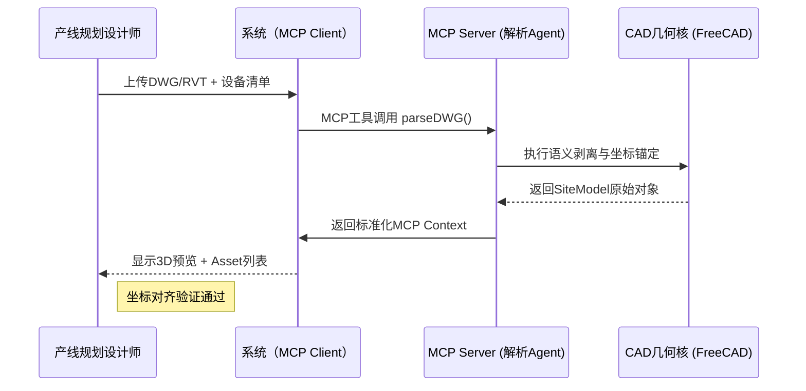
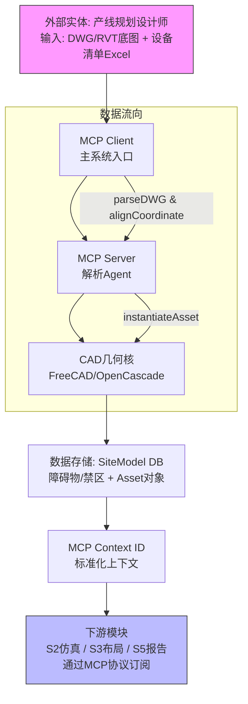
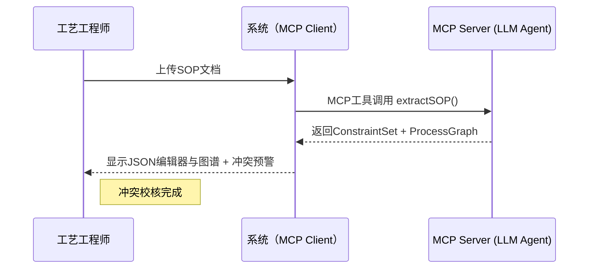
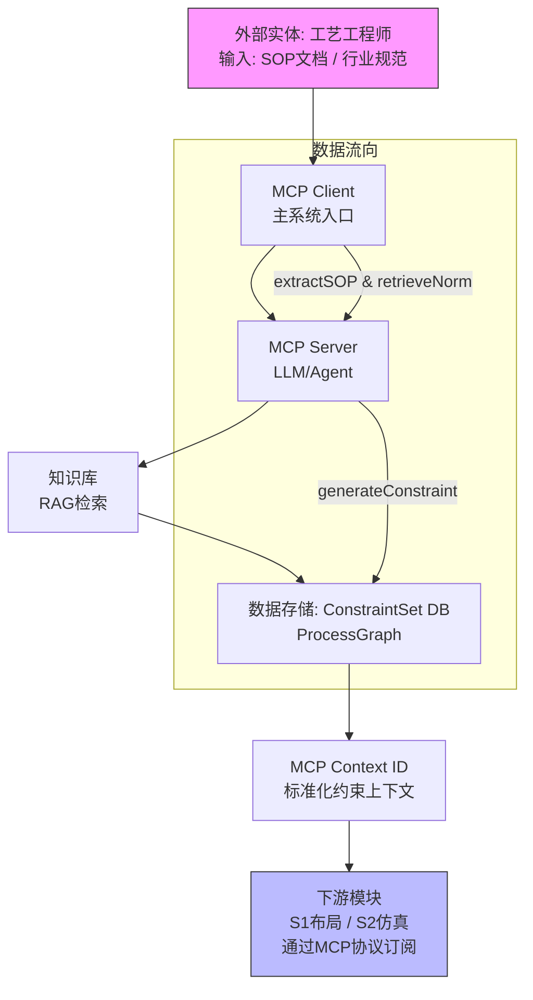
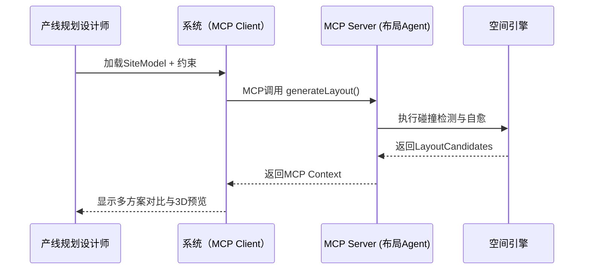
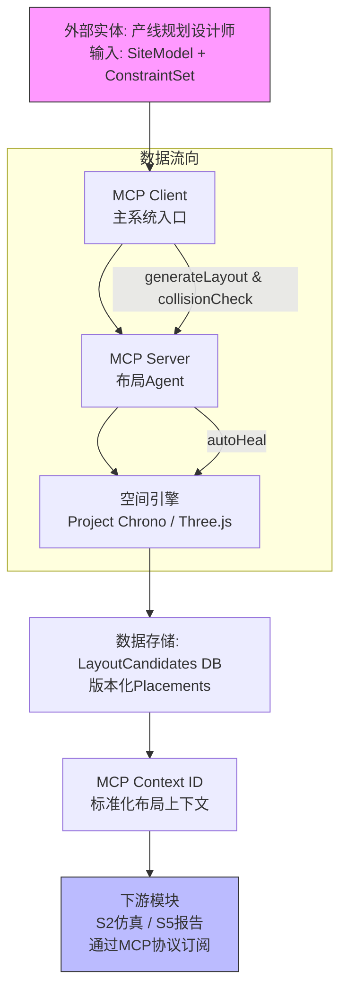
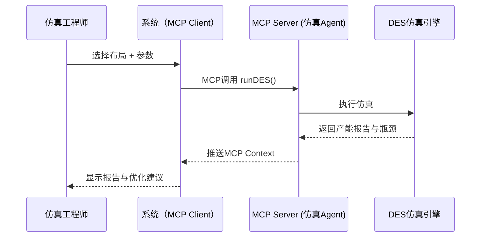
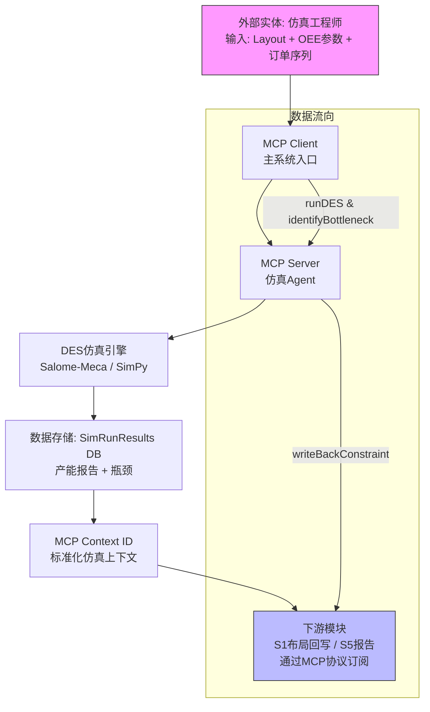
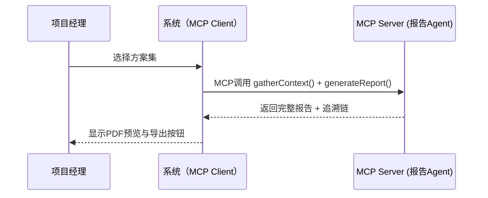
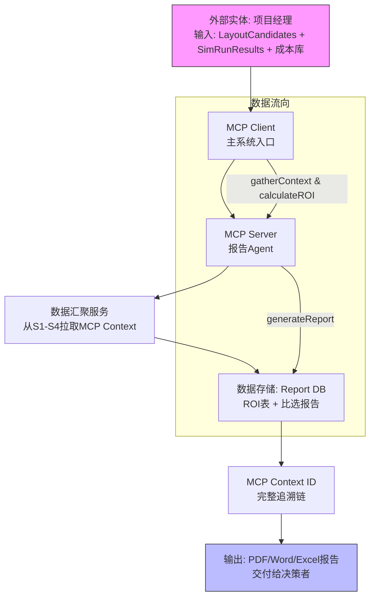

**尊敬的用户，**

为满足您的要求，我已在每份PRD的末尾新增**第13节：数据流图**（Detailed Data Flow Diagram）。  
每张数据流图均采用Mermaid标准语法绘制，清晰展示：

- 外部实体（用户/输入源）  
- 主要过程（MCP Client/Server、核心引擎）  
- 数据存储（SiteModel、ConstraintSet等）  
- 数据流向（输入→处理→输出→下游MCP Context传播）  
- MCP协议作为强制上下文交换通道  

您可直接将以下完整内容复制到Word或Markdown编辑器中。Mermaid代码块可在 https://mermaid.live 渲染为高清矢量图后插入Word文档。

以下为**5份完整、无任何省略的PRD文档**（v1.2版，已包含数据流图）。

---

# PRD-1：1 底图 —— 语义化底图解析与环境构建 (S1_设计 × CAD几何核)

## 1. 文档信息

**文档标题**：PRD-1：语义化底图解析与环境构建  
**版本**：v1.2（数据流图增强版）  
**日期**：2026年4月8日  
**作者**：资深产品经理  
**状态**：已完成原型、UML与数据流图  

### 版本历史

| 版本 | 日期       | 作者         | 变更说明                     |
|------|------------|--------------|------------------------------|
| v1.0 | 2026-04-08 | 产品经理     | 结构优化                     |
| v1.1 | 2026-04-08 | 产品经理     | 新增原型设计与UML序列图      |
| v1.2 | 2026-04-08 | 产品经理     | 新增详细数据流图             |

## 2. 需求背景与问题陈述

当前产线规划依赖人工解析DWG/RVT底图，存在图纸转译误差、坐标系不一致、资产信息缺失等问题，导致后续布局、仿真、报告阶段变更传播链断裂，整体交付效率低下且质量风险高。本模块旨在构建统一语义化SiteModel单一真理源（SoT），为全生命周期提供可靠几何与语义底座。

## 3. 业务目标与成功指标（OKR）

- **Objective**：实现非结构化底图向AI可计算语义化环境的自动化转换。  
- **Key Results**：  
  - KR1：底图转译耗时从2天缩短至≤10分钟（可衡量）。  
  - KR2：坐标系1:1对齐准确率≥99%，障碍物/禁区识别率≥85%。  
  - KR3：输出Asset对象100%携带asset_guid、Footprint、Ports，支持全链路追溯（F̂≥0.99）。

## 4. 目标用户与用户画像

- **主要用户**：产线规划设计师（5年以上经验，熟悉DWG/RVT，需快速生成可协作3D沙箱）。  
- **次要用户**：布局工程师、仿真工程师（依赖本模块输出作为输入）。

## 5. 使用场景与用户故事

### P0（必须）
- **As a** 产线规划设计师, **I want** 自动解析DWG/RVT底图并生成语义化SiteModel, **so that** 为后续布局与仿真提供统一坐标系几何底座。  
  **验收标准（AC）**：  
  - 系统支持DWG/RVT格式输入，输出SiteModel包含障碍物/禁区集合。  
  - 坐标系对齐误差≤1cm，可视化验证通过。  
  - 处理时间≤10分钟（单张A0图纸）。

- **As a** 产线规划设计师, **I want** 扫描设备清单自动实例化参数化Asset对象, **so that** 每个设备具备完整Footprint、Ports及asset_guid。  
  **AC**：  
  - Asset对象数量与清单一致，属性完整性100%。  
  - 支持碰撞与间距预检查。

### P1（重要）
- **As a** 仿真工程师, **I want** 通过MCP协议直接获取最新SiteModel上下文, **so that** 无需手动导入即可启动仿真工作流。

## 6. 非功能性需求

- **性能**：单张复杂底图处理时间≤30秒，内存占用≤2GB。  
- **MCP协议要求（强制）**：所有AI解析与上下文交换必须通过MCP Client/Server架构实现；输出对象携带MCP Context ID，支持后续模块实时拉取与订阅。  
- **安全**：MCP连接采用OAuth2最小权限，审计所有上下文访问。  
- **兼容性**：支持DWG 2018+、RVT 2022+、STEP格式。  
- **可扩展性**：支持新增图层语义规则配置。

## 7. 业务规则与流程

1. 输入验证 → 图层语义剥离 → 空间锚定 → 资产实例化 → 预检查 → 输出SiteModel。  
2. 规则：坐标系必须绝对对齐；最小检修距离强制执行；禁区不可穿越。

## 8. 边缘案例与异常处理

- 底图图层命名不规范时，系统提供人工校核入口并记录日志。  
- 文件损坏或格式不支持时，提示具体错误并建议替代格式。

## 9. 假设、风险、依赖与未决问题

- **假设**：输入底图包含必要图层与设备清单。  
- **风险**：图层识别准确率受图纸质量影响（缓解：人工校核入口）。  
- **依赖**：上游PLM系统提供设备库接口。  
- **未决问题**：是否支持云端多用户协同编辑（待确认）。

## 10. 附录

**数据字典示例**（SiteModel）：
```json
{
  "site_guid": "string",
  "coordinate_system": "1:1 origin",
  "obstacles": ["array of polygons"],
  "assets": [{"asset_guid": "...", "footprint": "...", "ports": "..."}]
}
```

## 11. 原型设计（Wireframe建议）

**主界面布局**（建议使用Figma实现）：  
- 左侧：文件上传区（拖拽DWG/RVT）+ 设备清单表格。  
- 中间：3D预览画布（实时显示SiteModel，障碍物高亮红色）。  
- 右侧：属性面板（选中Asset后显示Footprint、Ports参数）。  
- 顶部工具栏：一键“解析底图”按钮 + “导出SiteModel”按钮。  
- 底部状态栏：处理进度、错误提示。  

**关键交互**：点击障碍物弹出语义标签编辑弹窗；拖拽Asset自动触发间距检查高亮。

## 12. UML序列图



## 13. 数据流图（Detailed Data Flow Diagram）



---

# PRD-2：2 工艺 —— 基于工艺文档的生产逻辑自动转化为数字约束 (S1_设计 × LLM/Agent)

## 1. 文档信息

**文档标题**：PRD-2：基于工艺文档的生产逻辑自动转化为数字约束  
**版本**：v1.2（数据流图增强版）  
**日期**：2026年4月8日  
**作者**：资深产品经理  
**状态**：已完成原型、UML与数据流图  

### 版本历史

| 版本 | 日期       | 作者         | 变更说明                     |
|------|------------|--------------|------------------------------|
| v1.0 | 2026-04-08 | 产品经理     | 结构优化                     |
| v1.1 | 2026-04-08 | 产品经理     | 新增原型设计与UML序列图      |
| v1.2 | 2026-04-08 | 产品经理     | 新增详细数据流图             |

## 2. 需求背景与问题陈述

工艺SOP与规范以自然语言形式存在，无法直接被布局算法使用，导致人工转述错误与合规风险。本模块旨在将文档转化为结构化ProcessGraph与ConstraintSet，为布局算法提供可执行约束。

## 3. 业务目标与成功指标（OKR）

- **Objective**：实现工艺文档到可执行数字约束的自动化转换。  
- **Key Results**：  
  - KR1：约束生成时间≤2分钟。  
  - KR2：冲突检测覆盖率100%，约束可追溯至原文。

## 4. 目标用户与用户画像

- **主要用户**：工艺工程师 / AI Agent（需快速结构化工艺逻辑）。  
- **次要用户**：布局工程师（依赖约束作为输入）。

## 5. 使用场景与用户故事

### P0（必须）
- **As a** 工艺工程师, **I want** 上传SOP文档后自动提取工艺顺序与安全规则, **so that** 生成结构化ConstraintSet。  
  **验收标准（AC）**：  
  - 输出JSON格式，规则可追溯至原文。  
  - 冲突自动检测并高亮。

### P1（重要）
- **As a** AI Agent, **I want** 通过MCP协议提供约束上下文, **so that** 布局模块可直接使用。

## 6. 非功能性需求

- **性能**：文档处理时间≤2分钟。  
- **MCP协议要求（强制）**：LLM/Agent必须基于MCP Client/Server实现工具发现与上下文传播；所有约束对象携带MCP Context ID。  
- **安全**：OAuth2最小权限，审计所有上下文访问。  
- **兼容性**：支持Word、PDF、TXT格式。  
- **可扩展性**：支持新增行业规范库。

## 7. 业务规则与流程

1. 文档上传 → 意图解析 → 知识检索 → 逻辑硬化 → 冲突检测 → 输出ConstraintSet与ProcessGraph。  
2. 规则：每条约束必须携带source_ref；冲突必须预警并提供人工校核入口。

## 8. 边缘案例与异常处理

- 文档存在逻辑矛盾时，系统高亮冲突项并提供人工校核入口。  
- 文档格式不支持时，提示具体错误并建议转换格式。

## 9. 假设、风险、依赖与未决问题

- **假设**：输入文档包含可提取的工艺流程与规范条款。  
- **风险**：文档逻辑矛盾导致约束错误（缓解：人工校核入口）。  
- **依赖**：PRD-1输出的SiteModel（用于约束应用验证）。  
- **未决问题**：是否支持实时文档编辑联动（待确认）。

## 10. 附录

**数据字典示例**（ConstraintSet）：
```json
{
  "constraints": [{"id": "...", "type": "hard/soft", "source_ref": "...", "rule": "..."}],
  "process_graph": {"nodes": [...], "edges": [...]}
}
```

## 11. 原型设计（Wireframe建议）

**主界面布局**：  
- 左侧：文件上传区（拖拽SOP文档）+ 文档预览面板。  
- 中间：约束JSON实时编辑器（高亮冲突行）。  
- 右侧：ProcessGraph可视化（节点连线图）。  
- 顶部工具栏：一键“生成约束”按钮 + “导出JSON”按钮。  
- 底部状态栏：处理进度、冲突数量统计。

**关键交互**：点击冲突行弹出原文溯源弹窗；编辑约束后实时触发验证。

## 12. UML序列图



## 13. 数据流图（Detailed Data Flow Diagram）



---

# PRD-3：3 布局 —— 多目标寻优下的产线自动布局与干涉自愈 (S1_设计 × 空间引擎)

## 1. 文档信息

**文档标题**：PRD-3：多目标寻优下的产线自动布局与干涉自愈  
**版本**：v1.2（数据流图增强版）  
**日期**：2026年4月8日  
**作者**：资深产品经理  
**状态**：已完成原型、UML与数据流图  

### 版本历史

| 版本 | 日期       | 作者         | 变更说明                     |
|------|------------|--------------|------------------------------|
| v1.0 | 2026-04-08 | 产品经理     | 结构优化                     |
| v1.1 | 2026-04-08 | 产品经理     | 新增原型设计与UML序列图      |
| v1.2 | 2026-04-08 | 产品经理     | 新增详细数据流图             |

## 2. 需求背景与问题陈述

传统布局依赖人工摆放设备，易产生干涉、物流路径低效等问题。本模块需基于语义化SiteModel与工艺约束，实现约束驱动的多方案自动生成与实时自愈，提升设计效率并消除人为疏忽。

## 3. 业务目标与成功指标（OKR）

- **Objective**：生成无碰撞、可仿真的优化布局方案。  
- **Key Results**：  
  - KR1：方案生成时间≤30秒。  
  - KR2：100%满足硬约束（柱网/禁区/检修间距）。  
  - KR3：支持实时自愈修正，版本化输出。

## 4. 目标用户与用户画像

- **主要用户**：产线规划设计师（需快速探索多个布局变体）。  
- **次要用户**：仿真工程师（依赖布局输出作为输入）。

## 5. 使用场景与用户故事

### P0（必须）
- **As a** 产线规划设计师, **I want** 输入SiteModel与工艺约束后自动生成3-5个布局候选方案, **so that** 获得物流热力评分与无碰撞结果。  
  **验收标准（AC）**：  
  - 方案数量3-5个，包含score_breakdown。  
  - 100%避开禁区，满足检修间距。

- **As a** 产线规划设计师, **I want** 手动拖拽设备后系统自动执行干涉自愈, **so that** 实时保持约束合规。  
  **AC**：  
  - 拖拽后0.5秒内完成修正。  
  - 可视化高亮冲突区域。

### P1（重要）
- **As a** 布局工程师, **I want** 通过MCP协议订阅SiteModel变更, **so that** 布局自动更新。

## 6. 非功能性需求

- **性能**：实时碰撞检测≤100ms。  
- **MCP协议要求（强制）**：布局Agent必须以MCP Server形式提供工具调用；所有布局版本携带MCP Context ID，支持S2模块订阅。  
- **安全**：OAuth2最小权限，审计所有上下文访问。  
- **可用性**：支持多人协同预览。  
- **可扩展性**：支持新增优化目标权重配置。

## 7. 业务规则与流程

1. 约束加载 → 启发搜索 → 碰撞检测 → 自愈修正 → 多方案评分 → 输出LayoutCandidates。  
2. 规则：禁区/柱网不可穿透；最小检修通道宽度强制执行。

## 8. 边缘案例与异常处理

- 约束冲突时，系统高亮冲突项并提供人工调整入口。  
- 优化陷入局部最优时，提示用户调整权重并重新生成。

## 9. 假设、风险、依赖与未决问题

- **假设**：SiteModel已通过PRD-1验证。  
- **风险**：局部最优导致高成本方案（缓解：多目标优化算法）。  
- **依赖**：PRD-1输出的SiteModel与PRD-2输出的ConstraintSet。  
- **未决问题**：是否支持实时多人协同布局（待确认）。

## 10. 附录

**数据字典示例**（LayoutCandidates）：
```json
{
  "layouts": [{"version": "...", "placements": [...], "score_breakdown": {...}}]
}
```

## 11. 原型设计（Wireframe建议）

**主界面布局**：  
- 左侧：SiteModel加载区 + 约束列表。  
- 中间：交互式3D布局画布（支持拖拽设备，实时碰撞高亮）。  
- 右侧：方案对比面板（卡片式展示3-5个方案，热力图缩略）。  
- 顶部工具栏：生成按钮 + 导出布局版本。  
- 底部状态栏：优化进度、冲突统计。

**关键交互**：拖拽设备时自动显示自愈动画；点击方案卡片切换3D视图。

## 12. UML序列图



## 13. 数据流图（Detailed Data Flow Diagram）



---

# PRD-4：4 仿真 —— 离散事件仿真与AI闭环下的产线节拍优化 (S2_仿真 × CAE/PINN)

## 1. 文档信息

**文档标题**：PRD-4：离散事件仿真与AI闭环下的产线节拍优化  
**版本**：v1.2（数据流图增强版）  
**日期**：2026年4月8日  
**作者**：资深产品经理  
**状态**：已完成原型、UML与数据流图  

### 版本历史

| 版本 | 日期       | 作者         | 变更说明                     |
|------|------------|--------------|------------------------------|
| v1.0 | 2026-04-08 | 产品经理     | 结构优化                     |
| v1.1 | 2026-04-08 | 产品经理     | 新增原型设计与UML序列图      |
| v1.2 | 2026-04-08 | 产品经理     | 新增详细数据流图             |

## 2. 需求背景与问题陈述

传统仿真依赖手动配置与串行计算，难以快速识别瓶颈并反向优化布局。本模块旨在对选定布局执行高保真离散事件仿真（DES），输出产能报告、瓶颈诊断，并通过AI闭环反向优化布局。

## 3. 业务目标与成功指标（OKR）

- **Objective**：实现产线节拍优化与瓶颈闭环反馈。  
- **Key Results**：  
  - KR1：仿真节拍误差≤5%。  
  - KR2：投产前识别95%以上逻辑死锁与物流瓶颈。  
  - KR3：瓶颈诊断结果可回写为约束。

## 4. 目标用户与用户画像

- **主要用户**：仿真工程师（需快速验证布局效能）。  
- **次要用户**：项目负责人、布局工程师。

## 5. 使用场景与用户故事

### P0（必须）
- **As a** 仿真工程师, **I want** 基于选定布局运行DES仿真并输出产能报告, **so that** 识别瓶颈并反向优化布局。  
  **验收标准（AC）**：  
  - 输出包含JPH、稼动率、瓶颈清单。  
  - 节拍误差≤5%。  
  - 瓶颈输出可回写约束。

### P1（重要）
- **As a** 仿真工程师, **I want** 通过MCP协议订阅布局变更, **so that** 仿真结果自动更新。

## 6. 非功能性需求

- **性能**：仿真运行时间≤3分钟（单方案）。  
- **MCP协议要求（强制）**：仿真Agent通过MCP Server暴露工具；仿真结果作为MCP Context实时推送给S1与S5模块。  
- **安全**：OAuth2最小权限，审计所有上下文访问。  
- **兼容性**：支持多种布局格式。  
- **可扩展性**：支持多物理场耦合扩展。

## 7. 业务规则与流程

1. 布局加载 → 动力学配置 → DES运行 → 瓶颈溯源 → 不确定性量化 → 输出报告与优化建议。  
2. 规则：节拍误差必须<5%；瓶颈必须附带证据与原因代码。

## 8. 边缘案例与异常处理

- 仿真收敛失败时，提供参数调整建议并记录日志。  
- 布局数据不完整时，提示缺失项并建议回溯PRD-1。

## 9. 假设、风险、依赖与未决问题

- **假设**：输入布局来自PRD-3验证。  
- **风险**：复杂物理仿真耗时过长（缓解：PINN代理加速）。  
- **依赖**：PRD-1、PRD-3输出的SiteModel与Layout。  
- **未决问题**：是否支持并行多方案仿真（待确认）。

## 10. 附录

**数据字典示例**（仿真报告）：
```json
{
  "jph": 120,
  "utilization": [...],
  "bottlenecks": [{"zone": "...", "reason_code": "...", "evidence": "..."}]
}
```

## 11. 原型设计（Wireframe建议）

**主界面布局**：  
- 左侧：布局选择区 + 参数配置表（OEE、订单序列）。  
- 中间：运行进度条 + 3D动画预览。  
- 右侧：结果仪表盘（JPH柱状图、稼动率热力图、瓶颈清单）。  
- 顶部工具栏：一键“运行仿真”按钮 + “导出报告”按钮。  
- 底部状态栏：误差统计、优化建议。

**关键交互**：点击瓶颈项自动跳转对应布局高亮位置。

## 12. UML序列图



## 13. 数据流图（Detailed Data Flow Diagram）



---

# PRD-5：5 报告 —— 贯穿全生命周期的可研报告与投资决策一键生成 (S5_交付 × LLM/Agent)

## 1. 文档信息

**文档标题**：PRD-5：贯穿全生命周期的可研报告与投资决策一键生成  
**版本**：v1.2（数据流图增强版）  
**日期**：2026年4月8日  
**作者**：资深产品经理  
**状态**：已完成原型、UML与数据流图  

### 版本历史

| 版本 | 日期       | 作者         | 变更说明                     |
|------|------------|--------------|------------------------------|
| v1.0 | 2026-04-08 | 产品经理     | 结构优化                     |
| v1.1 | 2026-04-08 | 产品经理     | 新增原型设计与UML序列图      |
| v1.2 | 2026-04-08 | 产品经理     | 新增详细数据流图             |

## 2. 需求背景与问题陈述

全生命周期数据分散于各阶段，无法快速转化为投资决策材料，导致交付文档编制耗时且追溯困难。本模块旨在自动汇聚数据，生成投资估算表、多方案比选报告及可行性研究报告。

## 3. 业务目标与成功指标（OKR）

- **Objective**：实现全生命周期数据的自动化报告生成与决策支持。  
- **Key Results**：  
  - KR1：报告生成时间≤5分钟。  
  - KR2：金额计算准确率100%，结论可追溯。  
  - KR3：追溯链完整性100%（F̂≥0.99）。

## 4. 目标用户与用户画像

- **主要用户**：项目经理 / 决策者（需快速产出可签单材料）。  
- **次要用户**：售前咨询、交付质量工程师。

## 5. 使用场景与用户故事

### P0（必须）
- **As a** 项目经理, **I want** 系统自动汇聚全生命周期数据并生成比选报告与PDF, **so that** 支持投资决策。  
  **验收标准（AC）**：  
  - 输出包含ROI表、敏感性分析、PDF可研报告。  
  - 所有结论携带MCP Context ID，可追溯至源数据。  
  - 金额计算准确率100%。

### P1（重要）
- **As a** 项目经理, **I want** 通过MCP协议拉取前序模块最新上下文, **so that** 实现零断层闭环。

## 6. 非功能性需求

- **性能**：报告生成时间≤5分钟。  
- **MCP协议要求（强制）**：报告Agent以MCP Server形式运行；通过MCP从前序模块拉取最新Context ID，实现零断层。  
- **安全**：OAuth2最小权限，审计所有上下文访问。  
- **兼容性**：支持Word、PDF、Excel导出。  
- **可扩展性**：支持自定义报告模板配置。

## 7. 业务规则与流程

1. 数据汇聚（S1~S4） → 多方案对比分析 → ROI/敏感性计算 → 文档合成 → 输出报告。  
2. 规则：计算公式必须透明可追溯；结论必须附带source_ref。

## 8. 边缘案例与异常处理

- 数据缺失时，高亮缺项并阻断生成，提供回溯入口。  
- 单价波动时，提示敏感性分析结果。

## 9. 假设、风险、依赖与未决问题

- **假设**：前序模块已通过MCP提供完整上下文。  
- **风险**：外部单价波动导致估算偏差（缓解：实时价格库接口）。  
- **依赖**：PRD-1至PRD-4的所有输出。  
- **未决问题**：是否支持多语言报告生成（待确认）。

## 10. 附录

**数据字典示例**（报告输出）：
```json
{
  "roi_table": [...],
  "decision_record": {"adopted_layout": "...", "reason": "..."},
  "mcp_trace": ["context_id1", "context_id2"]
}
```

## 11. 原型设计（Wireframe建议）

**主界面布局**：  
- 左侧：方案选择卡片列表（3-5个布局）。  
- 中间：ROI仪表盘 + 敏感性分析图表。  
- 右侧：报告预览面板（PDF实时渲染）。  
- 顶部工具栏：一键“生成报告”按钮 + 导出Word/PDF/Excel按钮。  
- 底部状态栏：数据来源追溯链。

**关键交互**：点击方案卡片更新仪表盘；追溯链点击跳转源模块上下文。

## 12. UML序列图



## 13. 数据流图（Detailed Data Flow Diagram）



---

**尊敬的用户**，5份PRD现已完整包含详细数据流图。如需将Mermaid图渲染为PNG/SVG并打包为单个Word文件、或进一步调整图中节点/流程，请随时告知，我将立即提供优化版本。