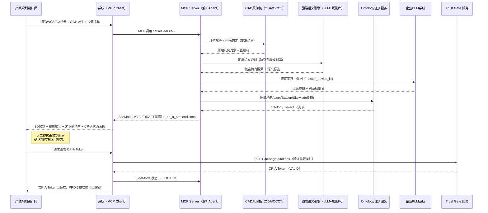
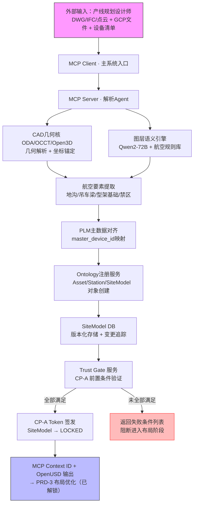

# PRD-1：语义化底图解析与环境构建
## 产品需求文档 v3.0 · 可直接进入研发排期

---

## 文档信息

| 项目 | 内容 |
|------|------|
| **文档编号** | PRD-1-v3.0 |
| **模块代号** | S1_底图 |
| **版本** | v3.0 |
| **状态** | ✅ 评审通过，可进入研发排期 |
| **优先级** | P0（核心基础，全链路 Ontology 真理源） |
| **上游依赖** | 无（本模块为全链路第一站） |
| **下游输出** | SiteModel → PRD-2（约束引擎）、PRD-3（布局优化）|
| **Trust Gate** | 输出 CP-A Token，解锁 PRD-3 |
| **v3.0 主要修订** | 新增 Ontology 层定义；检查点升级为 Trust Token Gate；所有 KR 配套 Metric Definition Card；全 US 补齐接口参数、错误码、权限、审计字段 |

---

## 版本历史

| 版本 | 日期 | 变更说明 |
|------|------|---------|
| v1.0 | 2026-04-08 | 初始结构 |
| v2.0 | 2026-04-09 | 航空场景校准；数据模型补强 |
| v3.0 | 2026-04-09 | Palantir 重构：补 Ontology；Trust Token Gate；Metric Definition Cards；完整 API 规格 |

---

## 如何阅读本文档

> **后端工程师**：每个 US 下有完整 API 签名、请求/响应 Schema、错误码表。  
> **QA 工程师**：每个 KR 下有 Metric Definition Card，含 ground truth 来源、测试集要求、告警/阻断阈值。  
> **项目经理**：CP-A Trust Token 机制替代人工 checkbox，前置条件均为机器可验证的布尔值。

---

## 1. 需求背景与问题陈述

当前航空制造厂房规划依赖人工解析 DWG/RVT/IFC 底图，存在四大结构性问题：

| 问题 | 量化表现 | 业务损失 |
|------|---------|---------|
| 图层数量庞大 | 航空厂房底图图层数达 500+ | 人工识别 1 张图需 3～5 天 |
| 航空特有要素无法自动识别 | 地沟/地坑、吊车梁、型架基础、防爆区现有通用工具零识别率 | 遗漏导致下游布局严重错误 |
| 坐标精度不足 | 关键结合面要求 ≤0.1mm，通用工具 1cm 级 | 型架安装失败，返工成本极高 |
| 无版本管理 | 设计变更后下游继续使用旧图数据 | 方案论证结论作废，重做成本高 |

---

## 2. Ontology 层定义（v3.0 新增，本模块涉及对象）

> 遵循全系统 Ontology 规范（PRD-0.6），本模块负责创建和维护以下对象类型：

### 本模块创建的 Object Types

| Object Type | 中文名 | 唯一键 | 生命周期状态 |
|-------------|--------|--------|------------|
| `SiteModel` | 厂房语义模型 | `site_guid` | `DRAFT → LOCKED → ARCHIVED` |
| `Asset` | 工装/设备 | `master_device_id` | `PROPOSED → ACTIVE → RETIRED` |
| `Station` | 装配站位 | `station_id` | `PLANNED → ACTIVE → DECOMMISSIONED` |

### 本模块创建的 Link Types

| 关系 | From | To | 创建时机 |
|------|------|----|---------|
| `DESCRIBES` | SiteModel | Station | 底图解析完成时 |
| `DESCRIBES` | SiteModel | Asset | 设备实例化完成时 |
| `PLACED_IN` | Asset | Station | 坐标定位后 |

### Asset Ontology 必填属性（v3.0 强制）

```typescript
interface Asset {
  master_device_id: string;        // 格式：MDI-{YYYY}-{SEQ}，唯一，不可变
  lifecycle_state: AssetLifecycle; // PROPOSED | ACTIVE | RETIRED | UNDER_MAINTENANCE
  weight_kg: number;               // 大型工装 > 5000kg 时触发强制校验
  movement_mode: MovementMode;     // CRANE_ONLY | RAIL | MANUAL | FIXED | AGV
  ontology_version: string;        // 写入时的 Ontology 版本号，用于兼容性校验
}
```

> ⚠️ **规则**：weight_kg > 5000 的 Asset，必须携带 `crane_requirement` 和 `foundation_requirement`，缺失时 Ontology 注册接口返回 `S1_021` 错误，拒绝注册。

---

## 3. 业务目标与成功指标（OKR + Metric Definition Cards）

**Objective**：构建航空制造厂房的统一语义化 SiteModel，作为全链路 Ontology 单一真理源，为下游布局优化、仿真验证提供可靠几何与语义底座。

---

### KR0（业务层）：底图准备时间 5 天 → 1 天

**Metric Definition Card**：

| 项目 | 内容 |
|------|------|
| **分子** | 从设计师启动上传到 SiteModel 状态变为 `LOCKED` 的自然天数 |
| **分母** | N/A |
| **基准值** | 当前 5 天（人工处理） |
| **目标值** | ≤ 1 天（含人工校核） |
| **ground_truth 来源** | 系统后端自动打点 `upload_started_at` 和 `sitemodel_locked_at` |
| **测量触发** | 每次 SiteModel 进入 `LOCKED` 状态时自动计算并写入 `business_kr_log` |
| **持续监控** | Dashboard `[PRD-1] 底图准备周期趋势`，按月统计 P50/P90 |

---

### KR1（系统层）：全流程完成时间 ≤ 60 分钟

**Metric Definition Card**：

| 项目 | 内容 |
|------|------|
| **计算公式** | `sitemodel_confirmed_at - upload_completed_at`（分钟） |
| **测试集** | 20 张标准航空厂房图（总装/部装/发动机/卫星各 5 张），由内测工程师构建，版本化存储于 `test_dataset_v{N}` |
| **测量触发** | 每次新版本发布后自动回归；每新增 5 张测试图时触发增量评测 |
| **告警阈值** | > 75 分钟 → 邮件告警工程团队 |
| **Oncall 阈值** | > 90 分钟 → 触发 Oncall |
| **阻断行为** | 不阻断功能，但影响 CP-A 前置条件 `SM_TIME_OK` 评估 |
| **持续监控** | Dashboard `[PRD-1] 解析时长 P50/P90/P99` |

---

### KR2（系统层）：坐标精度 ≤ 1mm（一般）/ ≤ 0.1mm（关键结合面）

**Metric Definition Card**：

| 项目 | 内容 |
|------|------|
| **测量方式** | 系统解析坐标与 GCP 控制点实测坐标的欧氏距离（mm） |
| **ground_truth 来源** | 甲方提供厂房 GCP 控制点实测坐标（测绘报告），存入 `gcp_reference_table`，每次上传时引用 |
| **测量触发** | 每次 SiteModel 生成后，自动对所有 GCP 控制点执行精度验证，结果写入 `precision_audit_log` |
| **阻断行为** | 一般区域 > 2mm 或关键结合面 > 0.5mm → 返回 `S1_004` 错误，阻断 SiteModel 进入 `DRAFT` 状态；CP-A 前置条件 `SM003/SM004` 不满足 |
| **持续监控** | Dashboard `[PRD-1] 精度验证通过率` |

---

### KR3（系统层）：大型障碍物自动识别率 ≥ 92%

**Metric Definition Card**：

| 项目 | 内容 |
|------|------|
| **分子** | 系统正确标注语义类别的障碍物数量（类别正确 AND Footprint 重叠率 ≥ 80%） |
| **分母** | 测试集中所有 footprint > 500mm² 且类别在白名单中的实体总数 |
| **障碍物类别白名单** | `COLUMN, WALL, GROUND_PIT, CRANE_RUNWAY, FIXTURE_FOUNDATION, RESTRICTED_ZONE` |
| **ground_truth 来源** | 甲方工艺师 + 内测工程师联合手动标注，版本化存储 `obstacle_gt_dataset_v{N}`，每季度更新 |
| **测试集规模** | Phase 1 最低 20 张；目标 50 张航空厂房图 |
| **测量触发** | 每次新版本部署后 CI/CD 自动触发；每新增 5 张 ground truth 图时触发增量评测 |
| **告警阈值** | < 90% → 邮件告警 |
| **阻断阈值** | < 85% → 阻断新版本发布（CI/CD Pipeline 卡点） |
| **持续监控** | Dashboard `[PRD-1] 障碍物识别率趋势` |

---

### KR4（系统层）：Asset 自动关联 master_device_id 率 ≥ 95%

**Metric Definition Card**：

| 项目 | 内容 |
|------|------|
| **分子** | 系统自动正确匹配 `master_device_id` 的 Asset 数量 |
| **分母** | 设备清单中的 Asset 总数（含设备清单输入时） |
| **ground_truth 来源** | 甲方 PLM/ERP 系统导出的设备主数据清单（每次导入时作为 ground truth） |
| **测量触发** | 每次设备清单导入后自动计算，结果写入 `mdid_match_log` |
| **告警阈值** | < 92% → 警告，提示人工补全 |
| **阻断阈值** | < 85% → 阻断 CP-A 前置条件 `SM002` |

---

### KR5（工程层）：图层语义规则库 ≥ 320 条

**Metric Definition Card**：

| 项目 | 内容 |
|------|------|
| **计算方式** | 四类场景（总装/部装/发动机/卫星）各 ≥ 80 条核心规则，合计 ≥ 320 条 |
| **测量方式** | 系统配置管理页面规则计数 API `GET /api/v1/semantic-rules/count` |
| **验收条件** | Phase 1 交付时 `count >= 320` 且全部规则有对应测试用例 |

---

## 4. 目标用户

| 角色 | 背景 | 核心诉求 | 权限角色 |
|------|------|---------|---------|
| 产线规划设计师（主） | 5 年以上航空制造经验，熟悉 DWG/CATIA | 快速生成可协作 3D 语义底座，减少手工重绘 | `ROLE_ENGINEER` |
| 布局工程师（次） | 依赖 SiteModel 作为布局输入 | 数据准确、版本可追溯 | `ROLE_VIEWER` |
| 仿真工程师（次） | 依赖 SiteModel 作为仿真边界 | 坐标系统一、工装尺寸准确 | `ROLE_VIEWER` |
| 检查点授权人 | 项目经理 / 主任工程师 | 确认 SiteModel 质量后签发 CP-A Token | `ROLE_CHECKPOINT_APPROVER` |

---

## 5. Trust Gate CP-A 定义（v3.0 新增，替代人工 checkbox）

### CP-A 前置条件（机器可验证，全部满足才可签发 Token）

| 条件 ID | 验证内容 | 数据来源 |
|---------|---------|---------|
| `SM001` | 所有图层已识别或已人工标注（`unrecognized_layers == 0`） | `parse_result.unrecognized_layers` |
| `SM002` | `master_device_id` 匹配率 ≥ 95% | `mdid_match_log.match_rate` |
| `SM003` | 一般区域坐标精度 ≤ 1mm | `precision_audit_log.general_precision_mm` |
| `SM004` | 关键结合面精度 ≤ 0.1mm | `precision_audit_log.critical_precision_mm` |
| `SM005` | 地沟/地坑已由甲方书面确认（`client_confirmed == true`） | `ground_pit_confirmation` 表 |
| `SM006` | 禁区已由甲方书面确认 | `restricted_zone_confirmation` 表 |
| `SM007` | 无 Asset Footprint 超出厂房边界 | `boundary_check_result.violations == 0` |

### CP-A Token 签发 API

**POST** `/api/v1/trust-gate/tokens`  
**权限**：`ROLE_CHECKPOINT_APPROVER`

**请求体**：
```json
{
  "checkpoint_type": "SITE_TO_LAYOUT",
  "site_model_id": "SM-001",
  "site_model_version": "v1.2.3",
  "site_model_hash": "sha256:abc123def456",
  "approver_comment": "已现场核实地坑及禁区，同意进入布局阶段"
}
```

**响应 201**：
```json
{
  "token_id": "CP-A-uuid-20260409-001",
  "checkpoint_type": "SITE_TO_LAYOUT",
  "authorized_by": "user_id_zhang",
  "authorized_at": "2026-04-09T14:30:00Z",
  "locked_inputs": {
    "site_model_id": "SM-001",
    "site_model_version": "v1.2.3",
    "site_model_hash": "sha256:abc123def456"
  },
  "validity_rule": "SM-001 site_model_hash 变更时本令牌自动失效",
  "downstream_modules_unblocked": ["PRD-3_LayoutOptimization"],
  "status": "VALID"
}
```

**错误码**：

| 错误码 | HTTP | 说明 |
|--------|------|------|
| `TG_001` | 403 | 无 `ROLE_CHECKPOINT_APPROVER` 权限 |
| `TG_002` | 422 | 前置条件未全部满足，`failed_conditions` 数组列出失败项 |
| `TG_003` | 409 | 该 SiteModel 已存在有效 Token |
| `TG_004` | 400 | `checkpoint_type` 不合法 |

**审计字段**：
```json
{
  "audit_event": "TRUST_TOKEN_ISSUED",
  "actor_user_id": "string",
  "token_id": "string",
  "site_model_id": "string",
  "site_model_hash": "string",
  "failed_conditions": [],
  "timestamp": "ISO8601",
  "deployment_mode": "SAAS | PRIVATE"
}
```

---

## 6. 使用场景与用户故事（完整 AC + API 规格）

### P0：US-1-01 底图自动解析

**As a** 产线规划设计师  
**I want** 上传航空厂房 DWG/IFC/点云数据后，系统自动识别地沟、吊车梁、型架基础、防爆区域等航空特有要素  
**So that** 无需人工逐层标注，直接获得语义化 SiteModel

**验收标准（AC）**：

| AC-ID | 验收项 | 验证方式 |
|-------|--------|---------|
| AC-1-01-01 | 支持 DWG 2018+、RVT 2022+、IFC 2x3/4、.LAS、.E57 格式 | 各格式测试文件上传，验证 202 响应 |
| AC-1-01-02 | 自动识别地沟/地坑（附 `TRAVERSE_PROHIBITED` 约束）、吊车梁（附 `CRANE_PATH` + 净高约束）、型架基础（附锚定点坐标）、防爆区（附 `EXPLOSION_PROOF` 约束） | 对比 ground truth 标注结果 |
| AC-1-01-03 | 一般区域坐标精度 ≤ 1mm | `precision_audit_log` 对比 GCP 实测值 |
| AC-1-01-04 | 关键结合面精度 ≤ 0.1mm | 同上 |
| AC-1-01-05 | 纯计算时间 ≤ 10 分钟（500 图层以内） | 计时测试，`processing_time_sec ≤ 600` |
| AC-1-01-06 | 全流程含人工校核 ≤ 60 分钟 | 端到端计时 |
| AC-1-01-07 | 未识别图层在 UI 红色高亮并计数，提供人工标注入口 | UI 功能测试 |
| AC-1-01-08 | 解析完成后 SiteModel 状态为 `DRAFT`，不自动跳转 `LOCKED` | 状态机测试 |
| AC-1-01-09 | 识别到的每个航空特有要素在 Ontology 中完成对象注册 | 调用 `GET /api/v1/ontology/objects?site_model_id=` 验证数量 |

**API 规格**：

`POST /api/v1/site-model/parse`  
**权限**：`ROLE_ENGINEER`  
**Content-Type**：`multipart/form-data`

| 参数 | 类型 | 必填 | 说明 |
|------|------|------|------|
| `file` | File | ✅ | 底图文件，DWG/IFC/RVT/LAS/E57 |
| `gcp_reference_file` | File | ✅ | GCP 控制点 CSV，列：`gcp_id,x_mm,y_mm,z_mm` |
| `device_list_file` | File | ❌ | 设备清单 XLSX，含 `master_device_id` 列 |
| `coordinate_system_ref` | string | ✅ | 坐标系基准点 ID，如 `"GCP-001"` |
| `project_id` | string | ✅ | 所属项目 ID |
| `deployment_mode` | string | ✅ | `"SAAS"` 或 `"PRIVATE"` |

**响应 202**（异步任务已接受）：
```json
{
  "task_id": "task-uuid-001",
  "status": "QUEUED",
  "estimated_duration_sec": 420,
  "poll_url": "/api/v1/tasks/task-uuid-001",
  "webhook_registration_url": "/api/v1/tasks/task-uuid-001/webhook"
}
```

**任务完成 Webhook / Poll 响应**：
```json
{
  "task_id": "task-uuid-001",
  "status": "COMPLETED",
  "site_model_id": "SM-001",
  "site_model_version": "v1.0.0",
  "site_model_hash": "sha256:abc123",
  "lifecycle_state": "DRAFT",
  "ontology_version": "v3.0.1",
  "summary": {
    "total_layers": 487,
    "recognized_layers": 480,
    "unrecognized_layers": 7,
    "assets_registered": 243,
    "assets_matched_mdid": 231,
    "mdid_match_rate": 0.951,
    "ground_pits_found": 3,
    "crane_runways_found": 2,
    "restricted_zones_found": 5,
    "precision_general_mm": 0.72,
    "precision_critical_mm": 0.08,
    "processing_time_sec": 387
  },
  "warnings": [
    {
      "code": "W_LAYER_UNRECOGNIZED",
      "count": 7,
      "layer_ids": ["L047", "L203", "L318", "L401", "L422", "L455", "L489"],
      "action_required": "MANUAL_ANNOTATION"
    },
    {
      "code": "W_MDID_UNMATCHED",
      "count": 12,
      "asset_ids": ["A091", "A092"],
      "action_required": "MANUAL_FILL"
    }
  ],
  "cp_a_preconditions": {
    "SM001": false,
    "SM002": true,
    "SM003": true,
    "SM004": true,
    "SM005": false,
    "SM006": false,
    "SM007": true
  }
}
```

**错误码**：

| 错误码 | HTTP | 触发条件 | 前端处理建议 |
|--------|------|---------|------------|
| `S1_001` | 400 | 文件格式不支持 | 返回支持格式列表 |
| `S1_002` | 400 | 文件损坏或无法解析 | 建议重新从 CAD 工具导出 |
| `S1_003` | 400 | GCP 控制点 CSV 格式错误 | 返回期望格式模板下载链接 |
| `S1_004` | 422 | 坐标精度验证失败（超阈值） | 高亮失败控制点，提示人工校正 |
| `S1_005` | 422 | Asset Footprint 超出厂房边界 | 返回超界 Asset 列表及坐标 |
| `S1_006` | 413 | 文件大小超限（默认 500MB） | 建议压缩或拆分后上传 |
| `S1_007` | 503 | CAD 解析服务不可用 | 触发 Oncall，返回预计恢复时间 |
| `S1_008` | 409 | 文件 hash 与已有版本一致，无变更 | 提示可直接使用现有版本 |
| `S1_009` | 422 | `gcp_reference_file` 控制点数量 < 3 | 提示最少需要 3 个 GCP 控制点 |

**审计字段**：
```json
{
  "audit_event": "SITEMODEL_PARSE_INITIATED | COMPLETED | FAILED",
  "actor_user_id": "string",
  "project_id": "string",
  "file_hash": "sha256:string",
  "file_format": "DWG | IFC | RVT | LAS | E57",
  "site_model_id": "string",
  "site_model_version": "string",
  "processing_time_sec": "number",
  "mdid_match_rate": "number",
  "precision_general_mm": "number",
  "precision_critical_mm": "number",
  "timestamp": "ISO8601",
  "deployment_mode": "SAAS | PRIVATE"
}
```

---

### P0：US-1-02 设备实例化与主数据对齐

**As a** 产线规划设计师  
**I want** 上传设备/工装清单后，系统自动实例化 Asset Ontology 对象并与企业主数据 ID 对齐  
**So that** 每套工装具备完整 Footprint、Ports、master_device_id 及跨系统别名

**验收标准（AC）**：

| AC-ID | 验收项 | 验证方式 |
|-------|--------|---------|
| AC-1-02-01 | Asset 数量与清单行数一致，属性完整性 100% | 对比导入数量与系统 Asset 数量 |
| AC-1-02-02 | `master_device_id` 匹配率 ≥ 95%（含设备清单） | `mdid_match_log.match_rate ≥ 0.95` |
| AC-1-02-03 | 大型工装（> 5 吨）必须携带 `crane_requirement` 和 `foundation_requirement`，缺失时拒绝注册 | 提交缺失字段的大型工装，验证返回 `S1_021` |
| AC-1-02-04 | 未匹配 Asset 显示"待匹配"标签，支持手动填写 `master_device_id` | UI 功能测试 |
| AC-1-02-05 | Asset 注册成功后自动触发 Ontology 注册接口 `POST /api/v1/ontology/objects` | 接口调用日志验证 |
| AC-1-02-06 | `master_device_id` 格式校验：必须匹配 `MDI-\d{4}-\d{3,6}` | 提交格式错误 ID，验证返回 `S1_022` |

**API 规格**：

`POST /api/v1/assets/batch-register`  
**权限**：`ROLE_ENGINEER`

**请求体**：
```json
{
  "site_model_id": "SM-001",
  "source": "DEVICE_LIST_XLSX | PLM_API | MANUAL",
  "assets": [
    {
      "dwg_label": "主装配型架-01",
      "erp_id": "2000001",
      "plm_id": "CAT-F-2024-007",
      "weight_kg": 12000,
      "movement_mode": "CRANE_ONLY",
      "footprint": {
        "length_mm": 8000,
        "width_mm": 3000,
        "height_mm": 4500
      },
      "crane_requirement": {
        "min_hook_height_mm": 5000,
        "required_crane_id": "CRANE-A"
      },
      "foundation_requirement": {
        "anchor_pattern": "4-POINT",
        "compatible_foundation_id": "FOUND-001"
      }
    }
  ]
}
```

**响应 200**：
```json
{
  "registered_count": 243,
  "matched_count": 231,
  "unmatched_count": 12,
  "match_rate": 0.951,
  "ontology_objects_created": 243,
  "unmatched_assets": [
    {
      "dwg_label": "专用工装-091",
      "reason": "PLM 中无对应记录",
      "suggested_action": "MANUAL_FILL",
      "partial_matches": ["MDI-2024-088", "MDI-2024-092"]
    }
  ]
}
```

**错误码**：

| 错误码 | HTTP | 触发条件 |
|--------|------|---------|
| `S1_020` | 422 | `weight_kg > 5000` 且缺少 `crane_requirement` |
| `S1_021` | 422 | `weight_kg > 5000` 且缺少 `foundation_requirement` |
| `S1_022` | 422 | `master_device_id` 格式不匹配正则 `MDI-\d{4}-\d{3,6}` |
| `S1_023` | 409 | `master_device_id` 已在当前项目中注册 |
| `S1_024` | 424 | PLM 系统连接超时（> 30s），无法验证主数据 |
| `S1_025` | 422 | Asset Footprint 数据缺失（length/width/height 任一为 0） |

---

### P1：US-1-03 增量解析与版本管理

**As a** 产线规划设计师  
**I want** 底图发生设计变更时，系统自动识别变更区域并增量更新 SiteModel  
**So that** 无需重新全量解析，版本变更可追溯，下游模块自动感知

**验收标准（AC）**：

| AC-ID | 验收项 | 验证方式 |
|-------|--------|---------|
| AC-1-03-01 | 基于文件 sha256 hash 检测变更，仅重新解析变更图层，处理时间 ≤ 全量解析的 40% | 对比新旧文件，计时增量解析 |
| AC-1-03-02 | 每次更新生成新语义化版本号（`vMAJOR.MINOR.PATCH`），携带 `change_summary` | 版本号规则测试 |
| AC-1-03-03 | 版本变更时，所有引用该 SiteModel 的有效 TrustToken **自动失效**，并向 Token 签发人推送通知 | 检查 Token 状态变为 `EXPIRED`，通知日志 |
| AC-1-03-04 | UI 提供 Diff 视图：新增要素标绿，修改标黄，删除标红 | UI 功能测试 |
| AC-1-03-05 | 历史版本可查询和回溯，保留 ≥ 30 个版本快照 | 版本列表 API 测试 |

**API 规格**：

`POST /api/v1/site-model/{site_model_id}/update`  
**权限**：`ROLE_ENGINEER`

**请求体**：（同 US-1-01 parse，multipart/form-data，新文件）

**响应 202**（同 parse，包含 `delta_summary`）：
```json
{
  "task_id": "task-uuid-002",
  "status": "QUEUED",
  "parent_version": "v1.2.3",
  "new_version": "v1.2.4",
  "estimated_delta_layers": 23,
  "invalidated_trust_tokens": ["CP-A-uuid-20260409-001"]
}
```

**错误码**：

| 错误码 | HTTP | 触发条件 |
|--------|------|---------|
| `S1_030` | 409 | SiteModel 处于 `LOCKED` 状态，不可更新（须先撤销 Trust Token） |
| `S1_031` | 400 | 新旧文件格式不一致（如从 DWG 改为 IFC） |
| `S1_032` | 422 | 新文件 hash 与当前版本一致，无变更内容 |

---

### P1：US-1-04 MCP 协议下游分发

**As a** 仿真工程师 / 布局工程师  
**I want** 通过 MCP 协议订阅最新 SiteModel，SiteModel 更新时自动推送通知  
**So that** 无需手动导入，且能第一时间感知版本失效

**验收标准（AC）**：

| AC-ID | 验收项 | 验证方式 |
|-------|--------|---------|
| AC-1-04-01 | `GET /api/v1/mcp/context/{mcp_context_id}` 返回当前最新 SiteModel 摘要 | 接口测试 |
| AC-1-04-02 | SiteModel 版本更新时，已注册的 Webhook 收到推送（≤ 30 秒延迟） | Webhook 接收测试 |
| AC-1-04-03 | Webhook 通知包含：`site_model_id`、新旧版本号、`change_summary`、`invalidated_trust_tokens` | 校验 Webhook payload 字段 |
| AC-1-04-04 | Webhook 推送失败时自动重试（3 次，指数退避），最终失败记录告警日志 | 模拟 Webhook 端点超时测试 |

---

## 7. 数据模型（SiteModel v3.0）

> v3.0 在 v2.0 基础上新增：`ontology_version`、`lifecycle_state`、`active_trust_token`、`cp_a_preconditions` 字段。

```json
{
  "site_guid": "SM-001",
  "ontology_version": "v3.0.1",
  "version": "v1.2.3",
  "lifecycle_state": "DRAFT | LOCKED | ARCHIVED",
  "parent_version": "v1.2.2",
  "base_file_hash": "sha256:abc123",
  "change_summary": "新增3号地坑，更新吊车梁B轨迹",
  "active_trust_token": "CP-A-uuid-20260409-001",
  "cp_a_preconditions": {
    "SM001": true,
    "SM002": true,
    "SM003": true,
    "SM004": true,
    "SM005": false,
    "SM006": false,
    "SM007": true
  },
  "coordinate_system": {
    "origin": [0, 0, 0],
    "unit": "mm",
    "reference": "厂房基准点GCP-001",
    "precision_general_mm": 1.0,
    "precision_critical_mm": 0.1
  },
  "boundary": {
    "type": "Polygon",
    "area_sqm": 28000,
    "polygon_wkt": "POLYGON((...))"
  },
  "aviation_special_elements": {
    "ground_pits": [
      {
        "id": "PIT-001",
        "ontology_object_id": "uuid-v4",
        "type": "GROUND_PIT | GROUND_SLOT | UTILITY_TRENCH",
        "polygon_wkt": "POLYGON((...))",
        "depth_mm": 1500,
        "constraint": "TRAVERSE_PROHIBITED",
        "cover_load_capacity_kg": 5000,
        "client_confirmed": false
      }
    ],
    "crane_runways": [
      {
        "id": "CRANE-A",
        "ontology_object_id": "uuid-v4",
        "type": "OVERHEAD_CRANE",
        "span_mm": 24000,
        "rail_elevation_mm": 12000,
        "max_load_kg": 50000,
        "path_wkt": "LINESTRING((...))",
        "clearance_below_mm": 500
      }
    ],
    "fixture_foundations": [
      {
        "id": "FOUND-001",
        "type": "HEAVY_FIXTURE_BASE",
        "anchor_points": [
          {"id": "AP-001", "position_mm": [1000, 2000, 0], "load_capacity_kg": 30000}
        ],
        "compatible_fixtures": ["MDI-2024-007", "MDI-2024-008"]
      }
    ],
    "restricted_zones": [
      {
        "id": "RZ-001",
        "type": "EXPLOSION_PROOF | CLEANROOM | NOISE_ZONE | SAFETY_BUFFER",
        "polygon_wkt": "POLYGON((...))",
        "constraint_description": "防爆区域，禁止明火作业，人员进入须防静电服",
        "client_confirmed": false
      }
    ]
  },
  "assets": [
    {
      "asset_guid": "uuid-v4",
      "ontology_object_id": "uuid-v4",
      "master_device_id": "MDI-2024-001",
      "lifecycle_state": "ACTIVE",
      "aliases": {
        "dwg_label": "主装配型架-01",
        "erp_id": "2000001",
        "plm_id": "CAT-F-2024-007",
        "sop_name": "蒙皮对接型架A"
      },
      "category": "MAIN_JIGS",
      "weight_kg": 12000,
      "movement_mode": "CRANE_ONLY",
      "footprint": {
        "length_mm": 8000,
        "width_mm": 3000,
        "height_mm": 4500,
        "polygon_wkt": "POLYGON((...))"
      },
      "crane_requirement": {
        "min_hook_height_mm": 5000,
        "required_crane_id": "CRANE-A",
        "lift_points": [{"id": "LP-001", "position_relative_mm": [1000, 500, 4500]}]
      },
      "foundation_requirement": {
        "anchor_pattern": "4-POINT",
        "compatible_foundation_id": "FOUND-001"
      },
      "constraints_ref": ["C001", "C008"],
      "mbd_ref": "CATIA://model/main_jig_001.CATProduct"
    }
  ],
  "ar_anchor": {
    "type": "SPATIAL_ANCHOR | QR_CODE | BIM_REFERENCE",
    "precision_mm": 5
  },
  "created_by": "user_id_001",
  "created_at": "2026-04-09T10:00:00Z",
  "mcp_context_id": "ctx-uuid-001"
}
```

---

## 8. 航空专属图层语义库

| 类别 | 典型图层名称 | 语义标签 | 自动生成约束 | 规则数（Phase 1 目标）|
|------|------------|---------|------------|---------------------|
| 装配站位 | `STATION-01~20`, `ASSY_STN_*` | `station_boundary` | 站位边界不可穿越 | ≥ 20 |
| 型架基础 | `JIGS_FOUNDATION`, `FIXTURE_BASE` | `heavy_fixture_base` | 关联地基锚定点 | ≥ 15 |
| 地沟/地坑 | `PIT_*`, `GROUND_SLOT`, `*_PIT` | `restricted_zone_pit` | 禁止穿越，覆盖承重 | ≥ 15 |
| 吊车梁 | `CRANE_RUNWAY_*`, `BRIDGE_CRANE` | `overhead_crane_path` | 下方净高约束 | ≥ 20 |
| AGV 路径 | `AGV_PATH`, `FORKLIFT_LANE`, `*_AISLE` | `logistics_path` | 通道宽度约束 | ≥ 15 |
| 检修通道 | `MAINTENANCE_*`, `MTC_AISLE` | `clearance_zone` | ≥ 1200mm（国标） | ≥ 10 |
| 电气桥架 | `CABLE_TRAY_*`, `CABLE_BRIDGE` | `utility_overhead` | 下方净高约束 | ≥ 10 |
| 气源/液压 | `UTILITY_AIR_*`, `HYDRAULIC_STN` | `supply_point` | 快连接口位置 | ≥ 10 |
| 防爆区域 | `EXPLOSION_PROOF_*`, `HAZARD_ZONE` | `safety_restricted` | 禁止明火，防静电 | ≥ 15 |
| 洁净室 | `CLEANROOM_*`, `CR_CLASS_*` | `environment_controlled` | 温湿度环境约束 | ≥ 15 |
| 噪声隔离 | `NOISE_ZONE_*`, `ACOUSTIC_*` | `environment_restricted` | 防护装备要求 | ≥ 10 |
| 承重限制 | `LOAD_LIMIT_*`, `WEAK_FLOOR` | `load_restricted` | 最大承重约束 | ≥ 15 |

---

## 9. 技术选型声明

| 功能模块 | 选型方案 | 选型理由 | 备选 |
|---------|---------|---------|------|
| DWG 解析 | ODA（Open Design Alliance） | 全球最高 DWG 兼容性，支持 DWG 2024 | LibreCAD（功能弱）|
| RVT/IFC 解析 | Revit API + IfcOpenShell | 官方支持 RVT；IfcOpenShell 是 IFC 开源标准库 | IfcOpenShell 单独（RVT 支持有限）|
| CATIA 轻量化 | PythonOCC + JT 格式转换 | 读取 CATIA 工装 3D 边界 | 3DEXPERIENCE API（成本高）|
| 点云处理 | Open3D + PCL | 开源工业级，支持 .LAS/.E57 | CloudCompare（交互工具，非 API）|
| CAD 几何核 | OpenCASCADE（OCCT） | 开源工业级，FreeCad 底层 | CGAL（学术，缺乏工业验证）|
| 语义识别 AI | Qwen2-72B（私有化）/ GPT-4o（SaaS） | 中文图层名识别强；私有化满足军工要求 | — |
| 3D 渲染 | Three.js + React | Web 原生，无需插件 | Babylon.js |
| 版本存储 | PostgreSQL + 行级版本快照 | 结构化查询，无需专用版本系统 | — |
| 输出格式 | OpenUSD（主）+ glTF 2.0（AR） | OpenUSD 是 NVIDIA Omniverse 生态标准；glTF 是 AR/MR 标准 | — |

---

## 10. 非功能性需求（NFR）

| 类别 | 要求 | 验证方式 |
|------|------|---------|
| **性能** | 纯计算 ≤ 10 分钟（500 图层）；内存 ≤ 4GB | 性能测试 |
| **精度** | 一般 ≤ 1mm；关键结合面 ≤ 0.1mm | `precision_audit_log` |
| **MCP 协议（强制）** | 所有解析通过 MCP Client/Server；SiteModel 携带 `mcp_context_id` | 接口测试 |
| **安全（民用）** | TLS 1.3 + OAuth 2.0 + RBAC | 安全审计 |
| **安全（军工）** | 国密 SM4 加密；内网隔离；审计日志 append-only | 等保测评 |
| **离线能力** | 军机场景完全离线运行（LLM 本地私有化） | 断网测试 |
| **可扩展性** | 图层语义规则支持客户自定义配置；规则库支持版本化热更新 | 配置管理测试 |
| **审计** | 所有关键操作写入 append-only 审计日志，军工客户由甲方 IT 持有 `ROLE_SYSTEM_ADMIN` | 审计日志完整性测试 |

---

## 11. 权限矩阵（本模块）

| 操作 | VIEWER | ENGINEER | REVIEWER | APPROVER | SYSTEM_ADMIN |
|------|--------|----------|----------|----------|--------------|
| 查看 SiteModel | ✅ | ✅ | ✅ | ✅ | ✅ |
| 上传底图/文档 | ❌ | ✅ | ❌ | ❌ | ✅ |
| 手动标注图层 | ❌ | ✅ | ✅ | ❌ | ✅ |
| 确认地坑/禁区 | ❌ | ❌ | ✅ | ✅ | ✅ |
| 签发 CP-A Token | ❌ | ❌ | ❌ | ✅ | ✅ |
| 撤销 CP-A Token | ❌ | ❌ | ❌ | ✅ | ✅ |
| 导出 OpenUSD | ❌ | ✅ | ✅ | ✅ | ✅ |
| 查看审计日志 | ❌ | ❌ | ❌ | ❌ | ✅ |

---

## 12. 业务规则与异常处理

### 业务规则（不可妥协）

1. 坐标系必须绝对对齐基准点（厂房 GCP），相对坐标无效
2. 地沟/地坑一经识别，**立即自动**生成 `TRAVERSE_PROHIBITED` 约束，不可被下游模块覆盖
3. 大型工装（> 5 吨）必须携带 `crane_requirement` 和 `foundation_requirement`，缺失时 **拒绝** Ontology 注册
4. 禁区（`EXPLOSION_PROOF`, `SAFETY_BUFFER`）约束优先级最高，不可被后续模块覆盖
5. SiteModel `LOCKED` 状态下不可更新，须先由 `ROLE_CHECKPOINT_APPROVER` 撤销 Trust Token

### 异常处理

| 异常场景 | 系统行为 | 用户提示 |
|---------|---------|---------|
| 图层命名不规范 | 标记为 `UNRECOGNIZED`，高亮，提供手动标注入口 | "发现 7 个未识别图层，请手动标注语义类别" |
| 地坑图层缺失 | 发出警告，不阻断 | "未检测到地坑图层，请人工确认是否存在地下结构" |
| 工装 Footprint 超出边界 | 阻断 Asset 注册（S1_005），返回冲突坐标 | "工装 MDI-XXX 超出厂房边界 X=14520mm 处" |
| 坐标精度不达标 | 阻断 SiteModel 进入 DRAFT（S1_004） | "GCP-003 精度 1.8mm 超标，请检查坐标系对齐" |
| 文件损坏 | 返回 S1_002，建议重新导出 | "文件解析失败，建议从 CAD 工具重新导出" |
| 设计变更版本冲突 | 展示 Diff 视图，等待人工确认 | "检测到 23 处变更，请确认后生成新版本" |
| SiteModel 更新导致 Token 失效 | Token 状态自动变为 EXPIRED，推送通知给签发人 | "CP-A Token 已因版本更新失效，请重新审核签发" |

---

## 13. 假设、风险与依赖

### 假设
- 输入底图包含 GCP 控制点标注
- 设备清单包含 `master_device_id` 或可从 PLM 导出

### 风险

| 风险 | 等级 | 缓解措施 |
|------|------|---------|
| 航空厂房地基预埋件信息不在建筑图纸中 | 高 | 提供人工录入型架基础锚定点的独立工具，允许单独上传结构专业图纸 |
| ODA/IfcOpenShell 对特定版本 DWG/IFC 兼容性问题 | 中 | 建立格式兼容性测试矩阵，每季度更新；维护官方 SDK 版本日志 |
| Qwen2-72B 对中文图层名识别率不足 | 中 | 建立航空图层名 fine-tuning 数据集；实测后决定是否微调 |
| 甲方 PLM 接口响应慢或不稳定 | 低 | 实现异步匹配 + 缓存机制；手动导入作为降级路径 |

### 依赖
- 企业 PLM 系统（Teamcenter/3DEXPERIENCE）提供工装主数据接口
- 甲方提供 GCP 控制点实测坐标报告
- PRD-0.6 Ontology 注册服务已上线

---

## 14. Wireframe 原型说明

**主界面三栏布局**：
- **左侧**：文件上传区（拖拽支持 DWG/IFC/点云/设备清单）+ 图层树（可展开，未识别图层红色高亮，支持手动标注语义）+ CP-A 前置条件状态卡（7 项逐一显示 ✅/❌）
- **中间**：3D 预览画布（地沟蓝色，吊车梁橙色虚线，型架基础黄色，禁区红色半透明；设备拖拽时实时碰撞检测）+ 版本 Diff 叠加显示
- **右侧**：属性面板（选中要素显示语义标签、约束、Ontology 对象 ID、尺寸参数）+ Trust Token 面板（CP-A 状态、签发人、失效规则）
- **顶部**："解析底图"按钮 + "导出 OpenUSD"按钮 + 版本选择器（含 Diff 视图入口）+ "签发 CP-A Token"按钮（仅 APPROVER 可见，前置条件全满足时高亮）
- **底部状态栏**：解析进度条 + 精度验证状态（绿色通过/红色警告）+ 未识别图层数量 + MCP Context ID

**关键交互**：
- 点击地沟/地坑弹出"约束配置"弹窗（禁止穿越状态、覆盖承重要求、甲方确认按钮）
- 点击吊车梁弹出"吊运约束"弹窗（净高、额定载荷、轨道坐标）
- 设备拖拽时实时检查禁区/地坑/边界，违规立即高亮红色并提示
- CP-A 前置条件面板实时更新，全部通过时"签发 Token"按钮变绿可点击

---

## 15. UML 序列图



---

## 16. 数据流图



---

## 17. 研发排期建议（Sprint 规划参考）

| Sprint | 周期 | 核心交付物 |
|--------|------|---------|
| Sprint 1 | 2 周 | DWG/IFC 基础解析；GCP 坐标锚定；Ontology 注册服务接入 |
| Sprint 2 | 2 周 | 航空专属要素识别（地沟/吊车梁/型架基础/禁区）；图层语义规则库 v1（80 条）|
| Sprint 3 | 2 周 | Asset 实例化；PLM 主数据对齐；`master_device_id` 匹配 |
| Sprint 4 | 2 周 | 版本管理；Diff 视图；MCP 协议下游分发 |
| Sprint 5 | 1 周 | Trust Gate CP-