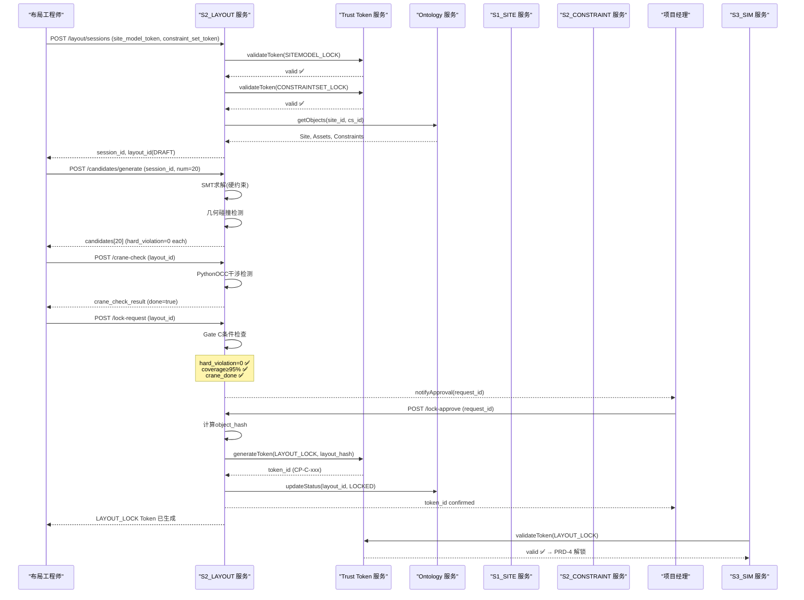
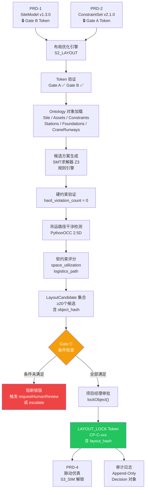

# PRD-3：约束驱动布局优化

## 产品需求文档（PRD）v3.0
### 产线+工艺 AI+CAD 系统 · 子产品文档

---

## 文档信息

| 项目 | 内容 |
|------|------|
| **文档编号** | PRD-3 |
| **模块代号** | S2_LAYOUT |
| **文档版本** | v3.0 |
| **基于版本** | PRD-0 总纲 v3.0；PRD-1 v3.0（SiteModel）；PRD-2 v3.0（ConstraintSet） |
| **日期** | 2026年4月13日 |
| **状态** | Draft for Build（待立项） |
| **优先级** | P0（Phase 1 需最小可用） |
| **上游依赖 Token** | `SITEMODEL_LOCK`（Gate B）、`CONSTRAINTSET_LOCK`（Gate A） |
| **下游输出 Token** | `LAYOUT_LOCK`（Gate C）→ 解锁 PRD-4 脉动仿真 |
| **适用场景** | 航空总装脉动线 / 飞机部件装配车间 / 航空发动机总装线 / 卫星柔性总装 |
| **关键词** | 约束驱动布局、LayoutCandidate、Trust Gate C、硬约束验证、吊运路径干涉、DRL优化、Ontology对齐 |
| **文档作者** | 产品团队 |
| **审核人** | 总架构师、工艺负责人、布局工程师代表 |

---

## 版本历史

| 版本 | 日期 | 变更说明 |
|------|------|---------|
| v1.0 | 2026-03-01 | 初稿，基于人工布局流程梳理 |
| v2.0 | 2026-04-09 | 航空场景约束细化；DRL 算法路线引入；吊运路径干涉检测需求补全 |
| **v3.0** | 2026-04-13 | **全章节按 PRD-N 标准模板补全（18章）；对齐 Ontology 层；引入 Trust Gate C 机制；补齐 Metric Definition Cards；新增 Action Catalog；Phase 1/2 拆分明确；DRL 降为 Phase 2** |

---

## 如何阅读本文档

- **🆕 标注**：v3.0 新增章节或字段，须重点评审。
- **[P0]**：Phase 1 必须交付；**[P1]**：Phase 1 可选/Phase 2 必须；**[P2]**：Phase 2 目标。
- **Ontology ID**（如 `layout_id`、`station_id`、`master_device_id`）：跨模块引用必须使用这些 ID，禁止仅用名称字符串。
- **Trust Token**：带 🔒 图标的流程节点表示需要机器可验证的授权信号，不可跳过。
- 本文档须与 PRD-0（总纲）、PRD-1（SiteModel）、PRD-2（ConstraintSet）配套阅读。

---

## §1 需求背景与问题陈述

### 1.1 业务痛点

航空制造总装厂房的产线布局规划是一项高度专业化、高约束密度的工程任务，当前面临以下核心问题：

| # | 痛点 | 量化描述 |
|---|------|---------|
| P1 | **人工摆放效率低** | 布局工程师基于经验逐台摆放工装，单次方案产出耗时 3~5 天，多方案对比需 2~3 周 |
| P2 | **约束隐性、易遗漏** | 工艺约束散落在 MBD/SOP/MBOM 中，布局时靠人脑记忆对照，吊运净高、防爆分区等关键约束常被遗漏 |
| P3 | **硬约束违规难发现** | 传统 CAD 工具缺乏语义层，无法自动校验"型架地基承重 > 20t 需专用基础"等约束，违规发现滞后至施工阶段 |
| P4 | **方案缺乏可比性** | 不同布局方案之间缺少统一量化指标（硬约束违规数、软约束得分、空间利用率），决策者难以客观比较 |
| P5 | **变更传播不透明** | 上游 SiteModel 或 ConstraintSet 发生变更后，布局方案未能及时失效，导致基于过期数据继续推进 |

### 1.2 目标场景

- **典型场景 A**：C919/C929 类大型客机总装脉动线，单机身段装配站位 4~6 个，工装总重可达数百吨
- **典型场景 B**：航空发动机总装线，站位间距要求精密（±5mm），吊运路径与装配操作空间高度重叠
- **典型场景 C**：卫星总装洁净室，严格分区（洁净区/非洁净区/防爆区），空间利用率要求极高
- **典型场景 D**：新型号厂房改造，需在保留既有建筑障碍物前提下重新规划产线

### 1.3 现有方案局限

| 维度 | 当前方案 | 局限 |
|------|---------|------|
| 工具 | AutoCAD/CATIA + 工程师经验 | 无约束自动校验，无多目标优化，方案不可重复 |
| 流程 | 人工布局 → 专家评审 → 反复修改 | 单轮迭代 1~2 周，严重制约论证效率 |
| 数据 | 约束散落于文档，布局结果存于 DWG | 无结构化数据，无审计链，无变更传播机制 |

---

## §2 🆕 Ontology 层定义

> 本模块涉及的 Ontology 对象类型与关系类型须严格遵循 PRD-0.6 定义，以下为本模块特定映射说明。

### 2.1 本模块核心对象类型

| ObjectType | Ontology 来源 | 本模块语义 | 生命周期 |
|---|---|---|---|
| **LayoutCandidate** | PRD-0.6.1 | 布局方案（工装摆放 + 站位分配的一个完整方案） | `DRAFT → VALIDATED → LOCKED` |
| **Station** | PRD-0.6.1 | 布局中的工位/站位，包含空间边界多边形 | `PROPOSED → ACTIVE` |
| **Asset** | PRD-0.6.1 | 待摆放的工装/设备，由 SiteModel 继承 | `ACTIVE` |
| **Foundation** | PRD-0.6.1 | 型架重载基础，约束工装摆放位置 | `ACTIVE` |
| **CraneRunway** | PRD-0.6.1 | 吊车梁系统，约束吊运路径与净高 | `ACTIVE` |
| **RestrictedZone** | PRD-0.6.1 | 禁区/防爆区/洁净区，约束工装类型与操作 | `ACTIVE` |
| **Constraint** | PRD-0.6.1 | 被本模块消费（来自 ConstraintSet），用于验证布局 | `ENFORCED` |
| **LayoutViolation** | 本模块新增 | 硬约束违规记录（violation_id + 关联 constraint_id + 关联 layout_id） | `OPEN → RESOLVED` |

### 2.2 本模块核心关系类型

| LinkType | 方向 | 语义 |
|---|---|---|
| `Asset PLACED_IN Station` | Asset → Station | 工装被分配到某站位（布局核心关系） |
| `Asset ANCHORED_TO Foundation` | Asset → Foundation | 工装锚定在特定型架基础上 |
| `LayoutCandidate REFERENCES Site` | Layout → Site | 布局方案基于某厂房模型 |
| `LayoutCandidate REFERENCES Asset` | Layout → Asset | 布局方案包含某工装的摆放 |
| `LayoutCandidate REFERENCES Station` | Layout → Station | 布局方案包含某站位定义 |
| `Constraint GOVERNS Asset` | Constraint → Asset | 某约束管辖某工装的摆放规则 |
| `Constraint GOVERNS Station` | Constraint → Station | 某约束管辖某站位的空间规则 |
| `LayoutViolation VIOLATES Constraint` | Violation → Constraint | 违规记录关联到具体约束 |
| `LayoutViolation OCCURS_IN LayoutCandidate` | Violation → Layout | 违规发生在某个布局方案中 |

### 2.3 LayoutCandidate 关键属性

| 属性名 | 类型 | 说明 |
|--------|------|------|
| `layout_id` | string | 全局唯一，格式 `LC-{YYYYMM}-{seq}` |
| `layout_guid` | uuid | 系统内部唯一标识 |
| `version` | semver | 布局方案版本号 |
| `object_hash` | sha256 | 方案内容快照哈希，用于 Trust Token 锁定 |
| `site_model_ref` | object | 引用的 SiteModel（site_id + version + token_id） |
| `constraint_set_ref` | object | 引用的 ConstraintSet（cs_id + version + token_id） |
| `hard_violation_count` | int | 硬约束违规数量（Gate C 通过条件：= 0） |
| `soft_violation_score` | float | 软约束违规加权得分（越低越优） |
| `space_utilization_rate` | float | 有效作业面积/总可用面积（%） |
| `optimization_method` | enum | `MANUAL \| RULE_ENGINE \| SMT \| DRL` |
| `status` | enum | `DRAFT \| VALIDATED \| LOCKED \| SUPERSEDED` |
| `created_by` | user_id | 创建者 |
| `locked_by` | user_id | 锁版授权者 |
| `mcp_context_id` | string | MCP 会话上下文 ID |

---

## §3 业务目标与成功指标（OKR + Metric Definition Cards）

### 3.1 Objective

> **在 Phase 1 内实现：布局工程师能在 1 个工作日内生成 ≥ 20 个满足全部硬约束的布局候选方案，并通过 Trust Gate C 锁版，解锁下游仿真流程。**

### 3.2 KR 列表

| KR 编号 | 关键结果 | 目标值 | 阶段 |
|---------|---------|--------|------|
| KR1 | 硬约束自动验证覆盖率 | ≥ 95%（覆盖 ConstraintSet 中 HARD 类型约束） | Phase 1 |
| KR2 | 单次布局方案生成时间 | 单方案生成 + 验证 ≤ 30 分钟（含吊运路径干涉检测） | Phase 1 |
| KR3 | 候选方案数量 | 单次优化会话产出 ≥ 20 个可行候选 | Phase 1 |
| KR4 | 硬约束违规漏检率 | ≤ 2%（即系统标记"无违规"但实际有违规的比例） | Phase 1 |
| KR5 | 吊运路径干涉检测准确率 | 几何碰撞检测精度 ≤ 10mm 误差 | Phase 1 |
| KR6 | Trust Gate C 通过率 | 提交锁版请求中，首次通过率 ≥ 70% | Phase 1 |
| KR7 | DRL 优化 vs 人工基线软约束得分提升 | ≥ 15% 软约束得分改善 | Phase 2 |

### 3.3 Metric Definition Cards

---

**KR1 指标卡：硬约束自动验证覆盖率**

- **KR 编号**：PRD-3 / KR1
- **Metric 名称**：Hard Constraint Auto-Validation Coverage Rate
- **严格定义**：
  - 分母：当前 ConstraintSet 中 `type = "HARD"` 且 `verification_state = "ENFORCED"` 的约束总数
  - 分子：布局验证引擎实际执行校验的 HARD 约束数量
- **Ground Truth 来源**：由工艺工程师在 ConstraintSet 锁版时确认的 HARD 约束清单（版本化，`cs_id + version`）
- **测量触发**：每次布局验证会话结束后自动计算；每次 ConstraintSet 版本更新后重新评估
- **生产监控**：Dashboard 显示"已覆盖/总计/未覆盖约束列表"；未覆盖约束自动标红
- **阈值行为**：
  - < 95%：触发告警，列出未覆盖约束，强制工程师确认
  - < 85%：阻断 Gate C（禁止生成 `LAYOUT_LOCK` Token）

---

**KR2 指标卡：单次布局方案生成时间**

- **KR 编号**：PRD-3 / KR2
- **Metric 名称**：Layout Generation Latency (P95)
- **严格定义**：
  - 计时起点：用户点击"生成布局"或 API 调用 `generateLayoutCandidates()` 的时间戳
  - 计时终点：系统返回含 `hard_violation_count` 的完整 `LayoutCandidate` JSON 的时间戳
  - 统计口径：P95 延迟（95% 的请求在此时间内完成）
- **Ground Truth 来源**：服务端请求日志（含 `layout_id`、`start_ts`、`end_ts`）
- **测量触发**：每次生产环境布局生成请求；每周汇总报告
- **生产监控**：APM 看板（P50/P95/P99 延迟分布）；超 30 分钟触发超时告警
- **阈值行为**：
  - P95 > 30 分钟：触发性能告警
  - P95 > 60 分钟：阻断新建布局会话，提示降级（减少候选数量或简化约束集）

---

**KR4 指标卡：硬约束违规漏检率**

- **KR 编号**：PRD-3 / KR4
- **Metric 名称**：Hard Constraint Violation Miss Rate
- **严格定义**：
  - 分母：经专家人工复核确认的真实硬约束违规总数（在测试集上）
  - 分子：系统未检出（标记为"无违规"）但实际存在违规的数量
  - 漏检率 = 分子 / 分母
- **Ground Truth 来源**：专家人工标注的测试用例集（`testset_layout_violation_v1`，版本化）；至少覆盖 50 个典型违规场景
- **测量触发**：每次验证引擎规则库更新；每季度全量回归
- **生产监控**：违规漏检告警（当生产环境发现已通过 Gate C 的方案存在漏检时自动记录）
- **阈值行为**：
  - > 2%：触发告警 + 强制补充测试用例
  - > 5%：阻断 Gate C（暂停 `LAYOUT_LOCK` 签发，直至修复）

---

## §4 目标用户

| 角色 | 职责 | 与本模块交互 | 技术背景 |
|------|------|-------------|---------|
| **布局工程师** | 主要用户。负责生成、评估、调整布局方案，最终申请锁版 | 全流程使用 | 熟悉 CAD，了解基本工艺要求；非编程背景 |
| **工艺工程师** | 约束的最终权威。在约束冲突仲裁时协作介入 | 查看违规报告，仲裁约束 | 深度工艺专家 |
| **产线规划设计师** | 提供已锁版的 SiteModel，参与布局评审 | 输入方（Gate B Token 提供者） | 熟悉厂房建筑与工艺 |
| **项目经理** | 跟踪布局进度，触发 Gate C 授权 | 看板查看，Gate C 最终授权 | 管理背景 |
| **仿真工程师** | 消费 Gate C Token，进入下游仿真 | 输出方（Gate C Token 消费者） | 仿真专业 |
| **系统管理员** | 管理权限矩阵，查看审计日志 | 权限配置，日志审计 | IT/系统背景 |

### 4.1 用户痛点优先级矩阵

| 用户 | 最高优先级痛点 | 本模块解决方案 |
|------|--------------|--------------|
| 布局工程师 | 手工摆放耗时 + 约束漏检 | 自动生成候选 + 实时硬约束校验 |
| 工艺工程师 | 布局违规发现晚 | 违规即时推送 + 约束溯源到文档 |
| 项目经理 | 无法量化方案质量 | KPI 看板 + 候选方案对比表 |
| 仿真工程师 | 无法确认布局是否稳定 | Gate C Token 提供"机器可信"的方案版本 |

---

## §5 🆕 Trust Gate 定义

### 5.1 本模块涉及的 Gate

| Gate | Token 类型 | 角色 | 说明 |
|------|-----------|------|------|
| **Gate A**（上游输入） | `CONSTRAINTSET_LOCK` | 消费 | 来自 PRD-2；无有效 Gate A Token 禁止启动布局优化 |
| **Gate B**（上游输入） | `SITEMODEL_LOCK` | 消费 | 来自 PRD-1；无有效 Gate B Token 禁止启动布局优化 |
| **Gate C**（本模块输出） | `LAYOUT_LOCK` | 生成 | 本模块核心输出；解锁 PRD-4 脉动仿真 |

### 5.2 Gate C 通过条件（Phase 1 必须全部满足）

| 条件 | 检查方式 | 阻断行为 |
|------|---------|---------|
| `hard_violation_count = 0` | 系统自动计算 | 违规 > 0 禁止锁版 |
| 硬约束自动验证覆盖率 ≥ 95% | 系统自动计算（见 KR1 指标卡） | 覆盖率不足禁止锁版 |
| 吊运路径干涉检测已执行 | 系统状态标记 `crane_check_done = true` | 未执行禁止锁版 |
| 布局工程师完成人工确认 | 人工操作（点击"确认并申请锁版"） | 未确认禁止锁版 |
| 项目经理/授权人完成审批 | 人工操作（点击"批准锁版"） | 未审批禁止生成 Token |

### 5.3 Gate C Token 数据结构

```json
{
  "token_id": "CP-C-uuid-20260413-001",
  "token_type": "LAYOUT_LOCK",
  "authorized_by": "user_id_pm_001",
  "authorized_at": "2026-04-13T14:30:00Z",
  "locked_inputs": {
    "layout_id": "LC-202604-007",
    "layout_version": "v1.2.0",
    "layout_hash": "sha256:layoutContentHash_abc",
    "site_model_token": "CP-B-uuid-20260412-003",
    "constraint_set_token": "CP-A-uuid-20260411-001"
  },
  "gate_conditions_snapshot": {
    "hard_violation_count": 0,
    "hard_constraint_coverage_rate": 0.97,
    "crane_check_done": true,
    "engineer_confirmed": true
  },
  "validity_rule": "当 layout_version 或 layout_hash 变化时自动失效；上游 Gate A/B Token 失效时自动失效",
  "downstream_unblocked": ["PRD-4_SIM"]
}
```

### 5.4 Token 失效场景

| 失效触发 | 系统行为 |
|---------|---------|
| `layout_hash` 变化（方案被修改） | 自动失效，触发 `invalidateDownstream(token_id)` |
| 上游 `SITEMODEL_LOCK` Token 失效 | 联动失效，通知布局工程师重新验证 |
| 上游 `CONSTRAINTSET_LOCK` Token 失效 | 联动失效，通知布局工程师重新验证 |
| 手动撤销（授权人操作） | 立即失效，记录审计日志 |

---

## §6 🆕 权限矩阵

| 操作 | 布局工程师 | 工艺工程师 | 产线规划设计师 | 项目经理 | 仿真工程师 | 系统管理员 |
|------|:---:|:---:|:---:|:---:|:---:|:---:|
| 查看 LayoutCandidate 列表 | ✅ | ✅ | ✅ | ✅ | ✅ | ✅ |
| 创建/修改 LayoutCandidate | ✅ | ❌ | ❌ | ❌ | ❌ | ❌ |
| 执行硬约束自动验证 | ✅ | ✅ | ❌ | ❌ | ❌ | ❌ |
| 执行吊运路径干涉检测 | ✅ | ❌ | ❌ | ❌ | ❌ | ❌ |
| 提交 Gate C 锁版申请 | ✅ | ❌ | ❌ | ❌ | ❌ | ❌ |
| 审批 Gate C（生成 Token） | ❌ | ❌ | ❌ | ✅ | ❌ | ❌ |
| 撤销 LAYOUT_LOCK Token | ❌ | ❌ | ❌ | ✅ | ❌ | ✅ |
| 查看违规报告 | ✅ | ✅ | ✅ | ✅ | ✅ | ✅ |
| 仲裁约束冲突（影响布局） | ❌ | ✅ | ❌ | ❌ | ❌ | ❌ |
| 消费 Gate C Token（启动仿真） | ❌ | ❌ | ❌ | ❌ | ✅ | ❌ |
| 查看审计日志 | ❌ | ❌ | ❌ | ✅ | ❌ | ✅ |
| 配置权限矩阵 | ❌ | ❌ | ❌ | ❌ | ❌ | ✅ |

---

## §7 使用场景与用户故事

### US-3-01（P0）：启动布局会话（前置条件：Gate A + B 有效）

- **As a** 布局工程师
- **I want** 在系统中创建新布局会话时，系统自动验证 Gate A（ConstraintSet Token）和 Gate B（SiteModel Token）的有效性
- **So that** 我的布局工作基于的是已审核、已锁版的约束与厂房数据，而非过期版本

**验收条件（AC）**：
- AC1：用户点击"新建布局会话"，系统检查关联的 `CONSTRAINTSET_LOCK` 和 `SITEMODEL_LOCK` Token
- AC2：任一 Token 无效或已失效，系统显示明确错误提示（"Token 已失效，请联系 [角色] 重新锁版"），禁止继续
- AC3：双 Token 有效，系统在会话头部展示 Token 摘要（token_id + authorized_by + authorized_at）
- AC4：会话创建成功，记录 `mcp_context_id`，并在审计日志中写入 `{event: "LAYOUT_SESSION_CREATED", site_model_token, constraint_set_token}`

**API 规格**：
```
POST /api/v3/layout/sessions
Request: { site_model_token_id, constraint_set_token_id, layout_name }
Response: { session_id, layout_id (DRAFT), token_validation_result, mcp_context_id }
Error: 401 TOKEN_INVALID | 409 TOKEN_EXPIRED
```

---

### US-3-02（P0）：约束驱动自动生成布局候选集

- **As a** 布局工程师
- **I want** 点击"自动生成候选方案"后，系统基于 ConstraintSet 中的 HARD 约束自动生成 ≥ 20 个满足硬约束的布局候选
- **So that** 我能在 1 天内获得多方案对比基础，而非手工逐一摆放

**验收条件（AC）**：
- AC1：系统读取 Gate A 锁定的 ConstraintSet，提取所有 `type = "HARD"` 约束作为不可违反条件
- AC2：基于规则引擎/SMT 求解器（Phase 1），在满足所有硬约束的搜索空间中生成 ≥ 20 个可行布局
- AC3：每个候选方案包含：`layout_id`、`hard_violation_count`（必须=0）、`soft_violation_score`、`space_utilization_rate`、`object_hash`
- AC4：生成耗时 P95 ≤ 30 分钟（见 KR2）
- AC5：无法找到 20 个满足条件的候选时，系统提示"可行空间不足，建议放宽以下软约束：[约束列表]"

**API 规格**：
```
POST /api/v3/layout/candidates/generate
Request: { session_id, num_candidates: 20, optimization_method: "RULE_ENGINE" }
Response: { candidates: [{ layout_id, hard_violation_count, soft_violation_score, space_utilization_rate, object_hash }], generation_latency_ms }
```

---

### US-3-03（P0）：硬约束实时验证与违规报告

- **As a** 布局工程师
- **I want** 在手动调整工装位置时，系统实时校验硬约束并高亮显示违规
- **So that** 我能即时发现并修正违规，而非等到方案提交后才得知

**验收条件（AC）**：
- AC1：用户拖拽工装时（或输入坐标时），系统实时触发硬约束验证（延迟 ≤ 500ms）
- AC2：检测到 HARD 约束违规，在画布上以红色高亮显示违规工装/区域，并在右侧面板显示：`constraint_id`、违规类型、来源文档溯源（`document_id` + page）
- AC3：违规修复后，高亮自动消除，`hard_violation_count` 实时更新为 0
- AC4：所有违规事件写入审计日志：`{layout_id, constraint_id, violation_type, detected_at, resolved_at}`

---

### US-3-04（P0）：吊运路径干涉检测

- **As a** 布局工程师
- **I want** 针对选定布局方案，一键执行吊运路径干涉检测
- **So that** 确保吊装操作路径不与工装、障碍物、建筑结构发生几何碰撞，满足航空总装吊运安全要求

**验收条件（AC）**：
- AC1：检测输入：`CraneRunway`（来自 SiteModel）、`Asset`（含高度 + 轮廓）、`Obstacle`（来自 SiteModel）、最小净高约束（来自 ConstraintSet）
- AC2：检测引擎执行三维几何碰撞检测（Phase 1：2.5D 简化模型，即平面轮廓 + 高度属性；Phase 2：完整 3D BIM 模型）
- AC3：输出：干涉路径列表（每条含 `asset_id`、`obstacle_id/crane_id`、干涉几何描述、净高余量）
- AC4：净高余量 < 安全阈值（可配置，默认 200mm）的路径以警告方式展示（SOFT 违规）
- AC5：检测完成后，系统标记 `crane_check_done = true`，记录检测版本（hash），Gate C 验证时读取此状态
- AC6：检测结果作为 `LayoutCandidate` 的附属对象持久化

---

### US-3-05（P0）：布局方案对比与选优

- **As a** 布局工程师 / 项目经理
- **I want** 在多个 LayoutCandidate 之间进行量化对比，选出最优方案提交锁版
- **So that** 决策有数据依据，而非依赖主观判断

**验收条件（AC）**：
- AC1：对比视图支持同时展示 2~5 个候选方案的关键指标：`hard_violation_count`、`soft_violation_score`、`space_utilization_rate`、`crane_check_done` 状态
- AC2：支持按指标排序与筛选（如"仅显示 hard_violation_count=0 的方案"）
- AC3：支持并排可视化（画布并排/叠加展示）
- AC4：用户标记某方案为"推荐方案"（`is_recommended = true`），记录标记人与时间

---

### US-3-06（P0）：布局方案锁版（Trust Gate C）🔒

- **As a** 布局工程师
- **I want** 完成方案调整与验证后，提交锁版申请，由项目经理审批后生成 `LAYOUT_LOCK` Token
- **So that** 仿真工程师只能消费经过权威授权、可审计的布局方案版本

**验收条件（AC）**：
- AC1：布局工程师提交锁版申请时，系统自动检查 Gate C 所有通过条件（见 §5.2），任一不满足则阻断申请并提示原因
- AC2：所有条件满足，系统向项目经理发送审批通知（站内信 + 可选邮件）
- AC3：项目经理审批通过，系统生成 `LAYOUT_LOCK` Token（见 §5.3 数据结构），包含 `layout_hash`、关联的上游 Token ID
- AC4：Token 生成后，`LayoutCandidate.status` 变更为 `LOCKED`，审计日志记录 `{event: "LAYOUT_LOCKED", token_id, authorized_by}`
- AC5：PRD-4 仿真模块可消费此 Token；消费前自动验证 Token 有效性
- AC6：若布局方案被任何修改（`layout_hash` 变化），Token 自动失效，触发 `invalidateDownstream(token_id)`

**API 规格**：
```
POST /api/v3/layout/lock-request
Request: { layout_id, layout_version, requester_id }
Response: { request_id, gate_check_result: { passed: true, conditions: [...] } }

POST /api/v3/layout/lock-approve
Request: { request_id, approver_id }
Response: { token_id, token_type: "LAYOUT_LOCK", layout_hash, locked_at }
```

---

### US-3-07（P1）：上游 Token 失效联动通知

- **As a** 布局工程师
- **I want** 当上游 SiteModel 或 ConstraintSet 被更新导致 Gate A/B Token 失效时，立即收到通知并了解影响范围
- **So that** 我不会继续在过期数据上工作

**验收条件（AC）**：
- AC1：系统监听上游 Token 失效事件（`invalidateDownstream` 被调用）
- AC2：收到事件后，标记关联的 `LayoutCandidate.status = SUPERSEDED`，`LAYOUT_LOCK` Token（若存在）自动失效
- AC3：向布局工程师推送通知："上游 [SiteModel v1.3.0 / ConstraintSet v2.1.0] 已更新，以下 [N] 个布局方案已失效：[方案列表]，请重新验证"
- AC4：失效事件记录审计日志

---

### US-3-08（P2）：DRL 多目标布局优化

- **As a** 布局工程师（Phase 2）
- **I want** 系统能使用深度强化学习（DRL）对软约束进行多目标优化（物流路径最短、产能利用率最高、面积浪费最少）
- **So that** 获得比规则引擎更优的方案集

**验收条件（AC）**：
- AC1：DRL 优化在 Phase 1 规则引擎方案基础上进行精化（Phase 1 作为热启动种群）
- AC2：软约束得分较人工基线提升 ≥ 15%（见 KR7）
- AC3：DRL 优化结果同样须通过 Gate C 所有条件才可锁版（DRL 不可绕过硬约束验证）

> ⚠️ **Phase 1 不作为验收点，DRL 路线保留待 Phase 2 启动。**

---

## §8 数据模型

### 8.1 LayoutCandidate 完整 JSON（v3.0）

```json
{
  "layout_id": "LC-202604-007",
  "layout_guid": "550e8400-e29b-41d4-a716-446655440000",
  "version": "v1.2.0",
  "parent_version": "v1.1.0",
  "object_hash": "sha256:layoutContentHash_abc123",
  "status": "VALIDATED",
  "optimization_method": "RULE_ENGINE",
  "site_model_ref": {
    "site_id": "SM-001",
    "version": "v1.3.0",
    "sitemodel_lock_token_id": "CP-B-uuid-20260412-003"
  },
  "constraint_set_ref": {
    "constraint_set_id": "CS-001",
    "version": "v2.1.0",
    "constraintset_lock_token_id": "CP-A-uuid-20260411-001"
  },
  "stations": [
    {
      "station_id": "STATION_01",
      "station_name": "总装站位1",
      "polygon_wkt": "POLYGON((0 0, 20000 0, 20000 15000, 0 15000, 0 0))",
      "assets_placed": ["MDI-2024-001", "MDI-2024-002"]
    },
    {
      "station_id": "STATION_02",
      "station_name": "总装站位2",
      "polygon_wkt": "POLYGON((22000 0, 42000 0, 42000 15000, 22000 15000, 22000 0))",
      "assets_placed": ["MDI-2024-003"]
    }
  ],
  "asset_placements": [
    {
      "master_device_id": "MDI-2024-001",
      "station_id": "STATION_01",
      "position": { "x_mm": 5000, "y_mm": 7500, "rotation_deg": 0 },
      "foundation_id": "FD-001",
      "placement_confidence": 1.0
    },
    {
      "master_device_id": "MDI-2024-002",
      "station_id": "STATION_01",
      "position": { "x_mm": 12000, "y_mm": 7500, "rotation_deg": 0 },
      "foundation_id": "FD-002",
      "placement_confidence": 1.0
    }
  ],
  "validation_result": {
    "hard_violation_count": 0,
    "soft_violation_score": 0.23,
    "hard_constraint_coverage_rate": 0.97,
    "violations": [],
    "validated_at": "2026-04-13T11:00:00Z"
  },
  "crane_check_result": {
    "crane_check_done": true,
    "interference_count": 0,
    "clearance_warnings": [
      {
        "crane_id": "CR-001",
        "asset_id": "MDI-2024-001",
        "min_clearance_mm": 320,
        "threshold_mm": 200,
        "status": "OK"
      }
    ],
    "checked_at": "2026-04-13T11:15:00Z",
    "check_hash": "sha256:craneCheckHash_xyz"
  },
  "kpis": {
    "space_utilization_rate": 0.74,
    "logistics_path_total_m": 1240,
    "station_area_waste_rate": 0.12
  },
  "is_recommended": true,
  "created_by": "user_layout_eng_001",
  "created_at": "2026-04-13T09:00:00Z",
  "locked_by": null,
  "locked_at": null,
  "mcp_context_id": "ctx-uuid-003"
}
```

### 8.2 LayoutViolation 对象（v3.0 新增）

```json
{
  "violation_id": "VIO-LC202604007-001",
  "layout_id": "LC-202604-007",
  "constraint_id": "C001",
  "violation_type": "MIN_DISTANCE_VIOLATED",
  "severity": "HARD",
  "description": "MDI-2024-001 与 MDI-2024-002 实际间距 150mm，最小要求 200mm",
  "entity_a": "MDI-2024-001",
  "entity_b": "MDI-2024-002",
  "actual_value_mm": 150,
  "required_value_mm": 200,
  "status": "OPEN",
  "detected_at": "2026-04-13T10:30:00Z",
  "resolved_at": null,
  "resolved_by": null
}
```

---

## §9 航空专属内容

### 9.1 航空总装布局核心约束类型库

| 约束类别 | 典型约束 | 来源 | 优先级 |
|---------|---------|------|--------|
| **型架基础约束** | 重型工装（>5t）需锚定在专用地基基础（`foundation_id`），不可任意移动 | MBD/结构设计 | HARD |
| **吊运净高约束** | 吊运路径上方净高 ≥ 最大工装高度 + 安全余量（通常 ≥ 200mm） | 安全规程 | HARD |
| **吊运路径畅通约束** | 吊车梁覆盖范围内不得有永久性障碍物阻断吊运路径 | 工艺规程 | HARD |
| **防爆分区约束** | 防爆区内不得放置非防爆电气设备；易燃材料存储区须隔离 | 安全/消防规程 | HARD |
| **洁净区约束** | 洁净室内工装须满足洁净度等级要求（如 ISO 7/ISO 8） | 质量规程 | HARD |
| **最小操作空间约束** | 工装与工装之间/工装与墙体之间须保留人员操作通道（≥ 1200mm） | 人机工程 | HARD |
| **设备间距约束** | 特定工装对之间的最小/最大距离（来自工艺装配精度要求） | MBD PMI | HARD |
| **站位节拍平衡约束** | 相邻站位工作内容工时差 ≤ 节拍时间 × 10%（软约束） | 工艺规划 | SOFT |
| **物流路径优化约束** | 零件/组件配送路径总长度尽量最短（软约束） | 精益制造 | SOFT |
| **噪声/振动隔离约束** | 高精密装配站位须与产生振动的加工设备保持隔离距离（≥ 5m） | 质量规程 | SOFT |

### 9.2 航空专属坐标系要求

- 所有布局坐标以 `Site` 参考点（`GCP-001`）为原点，单位 mm
- 关键工装（型架/大部件对接设备）位置精度要求：±1mm（须由激光跟踪仪校验，非系统计算值）
- 一般设备摆放位置精度：±10mm

### 9.3 脉动线特殊逻辑

- **站位顺序约束**：脉动线各站位顺序固定，站位间转移方向（前进/后退）须与 `Operation PRECEDES Operation` 关系一致
- **站位间距约束**：相邻站位工装边界最小间距 ≥ 牵引设备通过宽度（通常 ≥ 3000mm）
- **同步移动约束**（Phase 2）：脉动线全线整体移动时，所有站位同步推进，布局系统须验证每个站位移动后仍满足约束

---

## §10 技术选型声明

### 10.1 核心技术选型

| 模块 | Phase 1 选型 | Phase 2 选型 | 选型理由 |
|------|-------------|-------------|---------|
| **约束求解（硬约束验证）** | Z3 SMT Solver（Python binding）| Z3 + 自定义航空规则引擎 | 工业级 SAT/SMT 求解，支持几何约束推理；开源，可私有化部署 |
| **几何引擎（碰撞检测）** | PythonOCC（OpenCASCADE Python 绑定）| 同左 + 可选 Three.js WebGL 前端 | 无需自研几何核；支持 STEP/IGES；开源，符合私有化要求 |
| **布局优化（软约束）** | 规则引擎 + 贪心算法（Phase 1）| PPO/SAC DRL（PyTorch + RLlib）| Phase 1 快速可交付；Phase 2 DRL 路线已验证（参考 Siemens 工厂规划研究） |
| **前端布局画布** | Konva.js（2D Canvas）| 同左 + 可选 Three.js 3D 视图 | 航空布局以 2D 平面视图为主；Konva 性能适合大型工装密集场景 |
| **知识图谱（约束关系）** | Neo4j（私有化部署）| 同左 | 与 PRD-2 保持一致；约束关系天然适合图数据库 |
| **数据存储** | PostgreSQL（方案/日志）+ MinIO（文件） | 同左 | 国产私有化友好；成熟 |
| **MCP 接口** | FastAPI（Python）+ gRPC（跨服务） | 同左 | 与全链路 MCP 架构对齐 |

### 10.2 不采用技术说明

| 技术 | 不采用原因 |
|------|----------|
| Siemens Plant Sim | 闭源，无法深度集成约束驱动逻辑；不支持私有化部署 |
| Unity/Unreal Engine（Phase 1 3D） | Phase 1 2D 已满足需求；引入成本高，后端工程师曲线陡 |
| 自研 SMT 求解器 | 没有必要，Z3 已经是工业级标准 |

---

## §11 非功能性需求（NFR）

### 11.1 性能

| 指标 | 要求 | 备注 |
|------|------|------|
| 布局生成 P95 延迟 | ≤ 30 分钟（20 个候选，含验证） | 见 KR2 |
| 实时约束验证响应 | ≤ 500ms（单次拖拽触发） | 用户体验关键 |
| 吊运路径干涉检测 | ≤ 5 分钟（单方案，含 2.5D 几何计算） | Phase 1 简化模型 |
| 前端画布渲染 | 100+ 工装元素流畅渲染（≥ 30fps） | Konva.js Canvas |
| API 响应 P99 | ≤ 3 秒（非布局生成类接口） | |

### 11.2 可靠性

| 指标 | 要求 |
|------|------|
| 服务可用性 | ≥ 99.5%（月度，私有化部署） |
| 数据持久化 | 每次 LayoutCandidate 更新须原子写入 PostgreSQL，失败须回滚 |
| 审计日志不可删除 | 审计日志采用 append-only 存储，禁止 UPDATE/DELETE |
| Token 防篡改 | Trust Token 使用 HMAC-SHA256 签名，服务端验证 |

### 11.3 安全性

| 要求 | 说明 |
|------|------|
| 私有化部署 | 军工客户场景：完全离线，无外部网络依赖；数据不出本地环境 |
| 数据加密 | 传输：TLS 1.3；存储：AES-256（关键字段） |
| 权限控制 | 基于角色的访问控制（RBAC），见 §6 权限矩阵 |
| 操作审计 | 所有写操作（创建/修改/锁版/撤销）记录审计日志（user_id + timestamp + object_id） |

### 11.4 可维护性

| 要求 | 说明 |
|------|------|
| 约束规则可配置 | 约束规则（最小间距阈值等）通过配置文件/数据库管理，无需修改代码 |
| 测试覆盖率 | 约束验证核心逻辑单元测试覆盖率 ≥ 80% |
| 接口版本化 | API 采用 `/api/v3/` 路径版本控制 |
| 日志结构化 | 所有服务日志采用结构化 JSON 格式，包含 `trace_id`、`mcp_context_id` |

---

## §12 业务规则与异常处理

### 12.1 核心业务规则

| 规则编号 | 规则描述 |
|---------|---------|
| BR-3-01 | 无有效 Gate A + Gate B Token，禁止创建布局会话 |
| BR-3-02 | `hard_violation_count > 0` 时，禁止提交 Gate C 锁版申请 |
| BR-3-03 | `crane_check_done = false` 时，禁止提交 Gate C 锁版申请 |
| BR-3-04 | 布局方案锁版（`LOCKED`）后，禁止直接修改；必须创建新版本（`parent_version` 指向当前版本） |
| BR-3-05 | `LayoutCandidate` 任何字段变更须重新计算 `object_hash`；hash 变化自动触发 `invalidateDownstream` |
| BR-3-06 | 所有 Ontology 对象引用必须使用 ID（`master_device_id`、`station_id` 等），禁止仅使用名称字符串 |
| BR-3-07 | 软约束违规不阻断锁版，但须在对比报告中展示，并由布局工程师确认知晓 |
| BR-3-08 | Gate C Token 中必须引用生成该 Token 时所依赖的上游 Gate A、Gate B Token ID |

### 12.2 异常处理

| 异常场景 | 系统行为 | 用户提示 |
|---------|---------|---------|
| Gate A/B Token 在布局会话进行中失效 | 会话标记为"上游已失效"；现有草稿不删除（可查看）；阻断新的验证和锁版操作 | "上游数据已更新，此布局会话已失效。请基于新版本重建会话。" |
| SMT 求解器超时（> 60 分钟） | 返回已找到的候选（可能 < 20 个）；触发告警；建议用户简化约束集 | "求解超时，已生成 [N] 个候选。建议放宽以下约束：[列表]。" |
| 约束验证覆盖率 < 95% | 触发 `requestHumanReview(constraint_id)` for 未覆盖约束；阻断 Gate C | "以下 [N] 条硬约束未被系统覆盖，需人工确认：[列表]" |
| 吊运路径干涉检测引擎错误 | 标记 `crane_check_done = false` + error_code；记录异常日志 | "吊运路径检测失败（错误码：ERR-CRANE-001），请联系技术支持。" |
| 并发修改冲突（两用户同时修改同一方案） | 乐观锁机制：后提交方收到冲突错误（409）；提示合并建议 | "方案已被 [用户名] 修改，请刷新后重新编辑。" |

---

## §13 假设、风险与依赖

### 13.1 假设

| # | 假设 |
|---|------|
| A1 | SiteModel（PRD-1）和 ConstraintSet（PRD-2）在 Phase 1 启动时已具备稳定的锁版能力 |
| A2 | 航空工装的 3D 模型（STEP/IGES）或至少 2D 轮廓（含高度属性）可由甲方提供 |
| A3 | 约束中的几何参数（间距、净高等）以 mm 为单位，且在 ConstraintSet 中已数值化（非文本描述） |
| A4 | Phase 1 布局以 2D 俯视图为主要操作视图；3D 可视化为 Phase 2 增强功能 |
| A5 | 用户（布局工程师）具备基本 CAD 软件操作能力，无需系统内置 CAD 建模功能 |

### 13.2 风险

| # | 风险描述 | 概率 | 影响 | 应对策略 |
|---|---------|------|------|---------|
| R1 | SMT 求解器在约束密度高时求解空间爆炸，无法在 30 分钟内找到 20 个可行解 | 中 | 高 | Phase 1 降低候选数量要求（≥ 5 个）作为兜底；引入随机化种群算法辅助 |
| R2 | 甲方工装模型未提供高度属性，吊运净高检测无法执行 | 中 | 中 | 提供高度属性导入模板；Phase 1 允许手动输入高度作为 fallback |
| R3 | 上游 PRD-1/PRD-2 延期，Gate A/B Token 不可用 | 低 | 高 | 开发阶段使用 Mock Token；与 PRD-1/PRD-2 团队对齐里程碑 |
| R4 | 用户习惯"先布局后验约束"，抵制 Gate 强制顺序 | 中 | 中 | 提供"草稿模式"（不验 Gate，但标记为"不可锁版"）；加强培训 |
| R5 | DRL Phase 2 训练数据不足（航空场景样本少） | 高 | 低（Phase 2） | 迁移学习 + 领域专家仿真数据扩增；Phase 1 不依赖 DRL |

### 13.3 依赖

| 依赖项 | 类型 | 负责方 | 备注 |
|--------|------|--------|------|
| PRD-1 SiteModel Lock Token | 上游模块 | PRD-1 团队 | Phase 1 必须 |
| PRD-2 ConstraintSet Lock Token | 上游模块 | PRD-2 团队 | Phase 1 必须 |
| Ontology 服务（对象 ID 注册与查询） | 平台服务 | 基础架构团队 | Phase 1 必须 |
| Trust Token 服务（签发/验证/失效） | 平台服务 | 基础架构团队 | Phase 1 必须 |
| Z3 SMT Solver 集成 | 第三方库 | 本团队 | 开源，无授权风险 |
| PythonOCC 几何引擎 | 第三方库 | 本团队 | 开源，需性能基准测试 |
| 甲方工装模型文件（STEP/DXF + 高度属性） | 数据 | 甲方 | 需在项目启动时明确提供格式与时间节点 |

---

## §14 原型设计（Wireframe）

### 14.1 布局工作台主界面

```
┌─────────────────────────────────────────────────────────────────────┐
│  [产线规划系统]  PRD-3 布局优化                    [用户] [帮助] [退出] │
├──────────────┬──────────────────────────────┬──────────────────────┤
│  会话信息面板  │        布局画布（主操作区）         │    约束与违规面板     │
│              │                              │                      │
│ 会话ID: S-007 │  ┌──────── 厂房边界 ──────┐  │  ● 硬约束违规 [0]    │
│ SiteModel:   │  │   [MDI-001]  [MDI-002]  │  │  ○ 软约束警告 [2]    │
│  v1.3.0 🔒   │  │                         │  │                      │
│ ConstraintSet│  │   [STATION_01]           │  │ ▼ 软约束详情         │
│  v2.1.0 🔒   │  │                         │  │  C045: 物流路径偏长  │
│              │  │  ████ 禁区 ████          │  │  建议: 顺时针旋转90° │
│ Gate A: ✅   │  │                         │  │                      │
│ Gate B: ✅   │  │   [MDI-003]  [STATION_02]│  │  C067: 站位面积利用  │
│              │  └─────────────────────────┘  │  率偏低(68%)         │
│ 当前方案:     │                              │                      │
│ LC-202604-007│  [自动生成候选↓] [吊运检测]    │ ─────────────────── │
│ 硬违规: 0    │  [人工调整] [对比方案]          │  约束溯源:           │
│ 空间利用: 74%│                              │  C001 < MBOM v3.2   │
│              │  ◉ 吊车梁覆盖范围 ────────   │  DOC-456, Page 12   │
│ [申请锁版 🔒]│  ╔═══════════════════════╗  │                      │
│              │  ║    CraneRunway CR-001  ║  │ [查看完整约束列表]    │
│              │  ╚═══════════════════════╝  │                      │
└──────────────┴──────────────────────────────┴──────────────────────┘
```

### 14.2 候选方案对比面板

```
┌────────────────────────────────────────────────────────────────┐
│  候选方案对比                                      [返回布局]    │
├──────────────┬──────────────┬──────────────┬──────────────────┤
│   指标        │ LC-007 ⭐推荐 │ LC-008        │ LC-009           │
├──────────────┼──────────────┼──────────────┼──────────────────┤
│ 硬约束违规    │    0 ✅      │    0 ✅      │    2 ❌          │
│ 软约束得分    │    0.23      │    0.31      │    0.18          │
│ 空间利用率    │    74%       │    71%       │    79%           │
│ 物流路径(m)   │    1240      │    1380      │    1180          │
│ 吊运检测      │    通过 ✅   │    通过 ✅   │   未执行 ⚠️     │
├──────────────┼──────────────┼──────────────┼──────────────────┤
│              │  [设为推荐]  │  [设为推荐]  │  [执行检测]      │
│              │  [查看详情]  │  [查看详情]  │  [查看详情]      │
└──────────────┴──────────────┴──────────────┴──────────────────┘
```

---

## §15 UML 序列图（Mermaid）



---

## §16 数据流图（Mermaid）



---

## §17 🆕 Action Catalog

> 本模块所有自动化动作通过 MCP Action 接口调用，并强制写入审计日志。

### 17.1 本模块 Action 列表

| Action | 触发条件 | 执行主体 | 输入 | 输出 | 是否可阻断 | 优先级 |
|--------|---------|---------|------|------|:---:|:---:|
| `validateGateTokens(session_id)` | 创建布局会话时 | 系统自动 | `site_model_token_id`, `constraint_set_token_id` | `validation_result` | ✅ | P0 |
| `generateLayoutCandidates(session_id, num)` | 用户触发/自动 | 系统（SMT/规则引擎） | `session_id`, `num_candidates` | `candidates[]` | ✅ | P0 |
| `validateHardConstraints(layout_id)` | 每次方案修改 | 系统自动 | `layout_id` | `violation_report` | ✅ | P0 |
| `runCraneInterferenceCheck(layout_id)` | 用户触发 | 系统（PythonOCC） | `layout_id` | `crane_check_result` | ✅ | P0 |
| `requestHumanReview(constraint_id)` | 约束覆盖率 < 95% | Agent 自动 | `constraint_id`, `layout_id` | `review_task_id` | ✅ | P0 |
| `lockObject(layout_id, version, hash)` | Gate C 全部条件满足 + 人工审批 | 人工授权（项目经理） | `layout_id`, `version`, `object_hash` | `LAYOUT_LOCK` Token | ✅ | P0 |
| `invalidateDownstream(token_id)` | `layout_hash` 变化 / 上游 Token 失效 | 系统自动 | `token_id` | `event_id` + 下游失效通知 | ✅ | P0 |
| `notifyStakeholders(event)` | Gate C 通过/失效/告警 | 系统自动 | `event_type`, `recipients[]`, `payload` | 消息通知 | ❌ | P0 |
| `escalateViolation(violation_id)` | 硬约束违规在阈值时间内未解决（> 24h） | Agent 自动 | `violation_id`, `layout_id` | 升级工单 + 通知工艺负责人 | ✅ | P1 |
| `generateComparisonReport(layout_ids[])` | 用户触发（对比面板） | 系统自动 | `layout_ids[]` | 对比报告 PDF/JSON | ❌ | P1 |
| `triggerDRLOptimization(session_id)` | Phase 2，用户触发 | DRL Agent（PyTorch） | `session_id`, `optimization_target` | `optimized_candidates[]` | ✅ | P2 |

### 17.2 Action 审计日志格式

```json
{
  "audit_id": "AUD-uuid-001",
  "action": "lockObject",
  "triggered_by": "user_pm_001",
  "triggered_at": "2026-04-13T14:30:00Z",
  "mcp_context_id": "ctx-uuid-003",
  "inputs": {
    "layout_id": "LC-202604-007",
    "version": "v1.2.0",
    "object_hash": "sha256:layoutContentHash_abc123"
  },
  "outputs": {
    "token_id": "CP-C-uuid-20260413-001",
    "token_type": "LAYOUT_LOCK"
  },
  "result": "SUCCESS",
  "gate_conditions_snapshot": {
    "hard_violation_count": 0,
    "hard_constraint_coverage_rate": 0.97,
    "crane_check_done": true
  }
}
```

---

## §18 🆕 研发排期建议（Sprint 规划表）

> 基于 2 周 Sprint 节奏，Phase 1 目标 8 Sprint（16 周）完成最小可用版本。

| Sprint | 周期 | 目标 | 交付物 | 验收标准 |
|--------|------|------|--------|---------|
| **S1** | W1-W2 | 基础架构搭建 | 布局服务骨架（FastAPI）；Ontology 对象注册（LayoutCandidate/LayoutViolation）；Trust Token 服务对接（Gate A/B 验证） | API `/layout/sessions` 可调用；Token 验证通过/失败正确区分 |
| **S2** | W3-W4 | 布局画布 MVP | Konva.js 布局画布；SiteModel 对象渲染（工装/障碍/禁区/吊车梁）；工装拖拽与坐标更新 | 100 个工装对象流畅渲染；拖拽后坐标正确写入 LayoutCandidate |
| **S3** | W5-W6 | 硬约束实时验证 | Z3 SMT Solver 集成；SPATIAL/MIN_DISTANCE 约束验证；实时违规高亮（≤ 500ms）；`LayoutViolation` 对象写入 | 测试集 KR4 漏检率 ≤ 2%；拖拽响应延迟 ≤ 500ms |
| **S4** | W7-W8 | 候选方案自动生成 | 规则引擎 + Z3 自动生成候选；`generateLayoutCandidates()` API；KR1/KR2/KR3 指标监控 Dashboard | ≥ 20 候选生成 P95 ≤ 30 分钟；KR1 覆盖率 ≥ 95% |
| **S5** | W9-W10 | 吊运路径干涉检测 | PythonOCC 2.5D 干涉检测集成；`runCraneInterferenceCheck()` API；检测结果可视化（高亮路径）；`crane_check_done` 状态管理 | KR5 检测精度 ≤ 10mm；检测完成 ≤ 5 分钟 |
| **S6** | W11-W12 | Gate C 锁版流程 | Gate C 条件检查引擎；锁版申请/审批工作流；`LAYOUT_LOCK` Token 生成；Token 失效联动（`invalidateDownstream`） | Gate C Token 端到端流程联调通过；Token 失效触发正确 |
| **S7** | W13-W14 | 方案对比 + 审计 | 多方案对比面板（指标表 + 并排画布）；Action 审计日志（append-only）；Metric Dashboard（KR1-KR6） | KR6 Gate C 首次通过率统计可读；审计日志不可篡改验证 |
| **S8** | W15-W16 | 联调 + 验收准备 | PRD-1/2/4 端到端全链路联调；性能压测（KR2 P95）；安全测试（权限矩阵）；用户验收测试（UAT）脚本准备 | 全链路 Gate A→B→C Token 流程通过；所有 P0 KR 达标 |

### Phase 2 规划（参考，待立项）

| Sprint | 目标 |
|--------|------|
| P2-S1~S3 | DRL 环境搭建（RLlib + 仿真环境封装）；训练数据准备 |
| P2-S4~S6 | DRL 模型训练（PPO/SAC）；与 Phase 1 规则引擎集成（热启动） |
| P2-S7~S8 | 3D 可视化增强（Three.js）；完整 3D 碰撞检测（PythonOCC） |
| P2-S9~S10 | DRL 效果评估（KR7）；脉动线同步移动约束验证 |

---

*文档结束*

*PRD-3 v3.0 · S2_LAYOUT · 产线+工艺 AI+CAD 系统 · 2026年4月13日*
