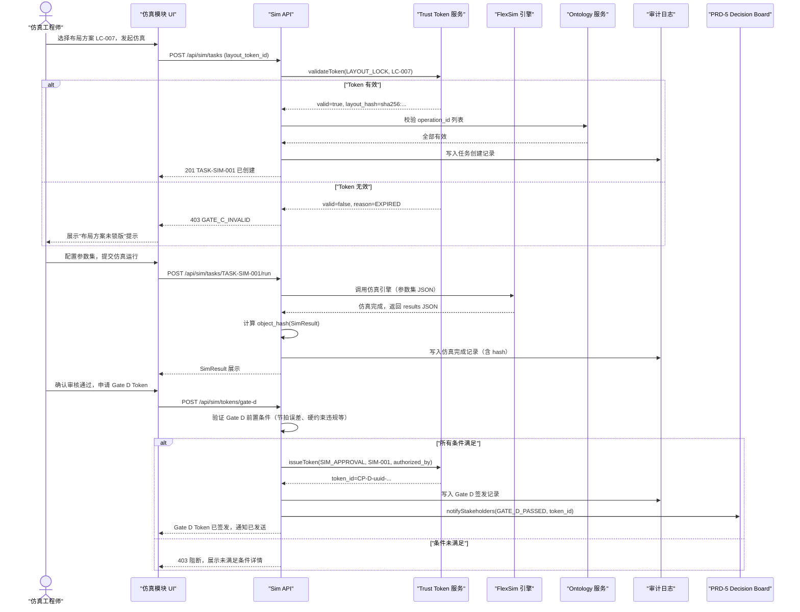
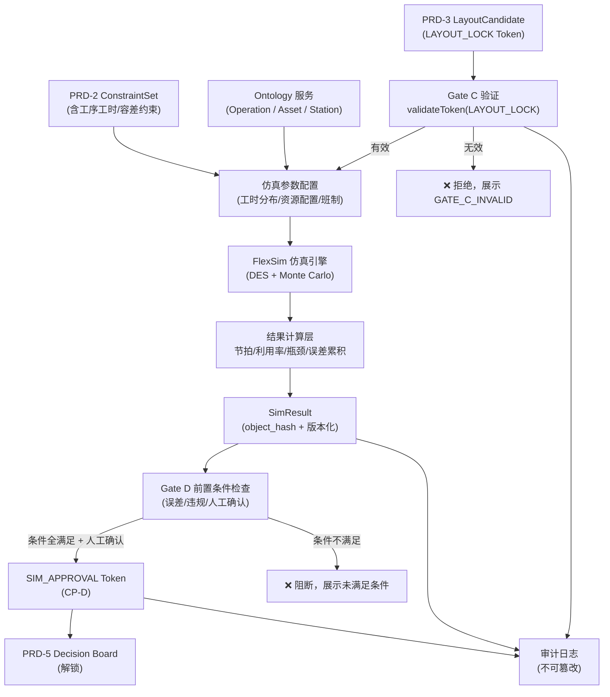

# PRD-4：脉动仿真验证

**模块代号**：S3_SIM
**版本**：v3.0
**优先级**：P1（Phase 1 可集成最小闭环）
**文档状态**：已修正待立项（Draft for Build）
**日期**：2026-04-13

---

## 文档信息表

| 项目 | 内容 |
|------|------|
| **文档编号** | PRD-4 |
| **模块代号** | S3_SIM |
| **文档版本** | v3.0 |
| **上游依赖** | PRD-1（SiteModel）、PRD-2（ConstraintSet）、PRD-3（LayoutCandidate） |
| **下游输出** | PRD-5（Living Decision Board） |
| **Trust Gate 入口** | Gate C：`LAYOUT_LOCK` Token（有效时才可触发仿真） |
| **Trust Gate 出口** | Gate D：`SIM_APPROVAL` Token（通过后解锁 PRD-5） |
| **优先级** | P1 |
| **适用场景** | 航空总装脉动线 / 飞机部件装配 / 航空发动机总装 / 卫星柔性总装 |
| **关键词** | 脉动仿真、离散事件仿真、节拍分析、瓶颈识别、误差累积、Trust Token、Action Catalog |

---

## 版本历史

| 版本 | 日期 | 变更说明 |
|------|------|---------|
| v1.0 | 2026-03-01 | 初版：基础仿真功能定义 |
| v2.0 | 2026-04-09 | 航空场景校准；FlexSim 集成路线确定；DES 引擎技术选型；新增误差累积预测模型 |
| **v3.0** | 2026-04-13 | **对齐 Ontology 层（PRD-0.6）；输入强制绑定 `LAYOUT_LOCK` Token；SimResult 结构化并带 object_hash；新增 Gate D `SIM_APPROVAL` Token；补全 Action Catalog；新增 Metric Definition Cards；补全 UML 序列图与数据流图** |

---

## 如何阅读本文档

- **§1-§4** 为背景、目标、用户定义层，项目经理/产品经理重点阅读。
- **§5-§6** 为 Trust Gate 与权限矩阵，架构师/DevOps 工程师重点阅读。
- **§7-§9** 为用户故事、数据模型、航空专属内容，仿真工程师/研发工程师重点阅读。
- **§10-§13** 为技术选型、NFR、业务规则、风险，全员阅读。
- **§14-§18** 为原型、UML、数据流、Action Catalog、排期，研发/设计师重点阅读。
- 🆕 标记表示 v3.0 新增或重大修改内容。

---

## §1 需求背景与问题陈述

### 1.1 业务背景

航空总装脉动线是当前国内外先进航空制造的主流模式。与汽车流水线不同，航空脉动线具有以下核心特征：

- **节拍长且不均匀**：单型号脉动周期从数天到数周不等，不同站位工时差异极大
- **工序高度并行但强耦合**：多个站位同时作业，但存在前序约束、工装共享约束、人员资源约束
- **误差累积效应显著**：各站位装配偏差会在总装阶段放大，导致协调成本骤增
- **试产阶段验证代价极高**：一旦线体设计不合理，实体调整成本极高，调整周期以月计

### 1.2 核心问题

| 问题编号 | 问题描述 | 当前痛点 |
|---------|---------|---------|
| P4-01 | 产能节拍评估依赖经验拍脑袋 | 缺乏量化仿真支撑，方案论证说服力弱 |
| P4-02 | 瓶颈站位识别滞后 | 只能在试产后靠观察发现，整改成本高 |
| P4-03 | 误差累积路径不可预测 | 关键装配特征偏差传递未量化建模 |
| P4-04 | 仿真输入不可信 | 仿真参数手工录入，与布局方案脱节，结论不可追溯 |
| P4-05 | 仿真结果与决策断链 | 仿真报告是孤立文件，未与后续决策工作台实时绑定 |

### 1.3 问题根因分析

```
布局方案无法机器化传递 → 仿真输入手工录入（误差大）
        ↓
仿真结果与约束不绑定 → 修改布局后仿真结论自动过时（不知道）
        ↓
决策者看到的仿真报告可能已失效 → 决策基础不可信
```

v3.0 通过 Trust Token 机制切断上述失效链：仿真只消费持有有效 `LAYOUT_LOCK` Token 的布局方案，布局一旦变更，Token 自动失效，仿真结论同步标记"需重新运行"。

---

## §2 🆕 Ontology 层定义

> 本模块操作的所有数据对象必须映射到 PRD-0.6 Ontology。禁止使用局部字段名引用跨模块对象。

### 2.1 本模块涉及的 Object Types

| ObjectType | 模块内角色 | 关键字段 | 说明 |
|---|---|---|---|
| `LayoutCandidate` | 仿真输入（只读） | `layout_id`, `object_hash` | 必须持有有效 Gate C Token |
| `Station` | 仿真单元 | `station_id`, `cycle_time_s` | 每站位的标称工时与资源配置 |
| `Asset` | 资源实体 | `master_device_id`, `availability_rate` | 工装/设备可用率 |
| `Operation` | 仿真节点 | `operation_id`, `mean_duration_s`, `std_dev_s` | 工序时长分布 |
| `Constraint` | 仿真约束 | `constraint_id`, `type` | 约束驱动仿真逻辑分支 |
| `SimResult` | 仿真输出 | `sim_id`, `object_hash` | 仿真结果实体，携带版本与哈希 |
| `Decision` | 下游消费 | `decision_id` | 基于 SimResult 生成的决策记录 |

### 2.2 本模块涉及的 Link Types

| LinkType | 方向 | 语义 |
|---|---|---|
| `SimResult EVALUATES LayoutCandidate` | SimResult → LayoutCandidate | 本次仿真评估的布局方案 |
| `SimResult GOVERNED_BY ConstraintSet` | SimResult → ConstraintSet | 仿真参数受约束集约束 |
| `Operation USES Asset` | Operation → Asset | 工序资源占用 |
| `Operation PRECEDES Operation` | Operation → Operation | 前序工序关系（制约节拍） |
| `Decision BASED_ON SimResult` | Decision → SimResult | 决策引用仿真结论 |

### 2.3 🆕 本模块新增属性

| 对象 | 新增属性 | 类型 | 说明 |
|---|---|---|---|
| `SimResult` | `sim_scenario_version` | String | 参数集版本（可回溯） |
| `SimResult` | `object_hash` | String (sha256) | 内容哈希，用于 Gate D 签发 |
| `SimResult` | `bottleneck_stations` | Array[station_id] | 识别出的瓶颈站位 |
| `Operation` | `mean_duration_s` | Float | 工序标称工时（秒） |
| `Operation` | `std_dev_s` | Float | 工时标准差（正态/韦布尔） |
| `Station` | `utilization_rate` | Float(0~1) | 仿真输出的资源利用率 |

---

## §3 业务目标与成功指标（OKR + Metric Definition Cards）

### 3.1 Objective

**O4**：为脉动线方案提供可信、可追溯的量化仿真验证，使"布局优化 → 仿真结论 → 决策"全链路闭环可审计。

### 3.2 Key Results

| KR 编号 | 指标 | Phase 1 目标 | Phase 2 目标 |
|---------|------|------------|------------|
| KR4-01 | 单次仿真运行时长（10站位标准场景） | ≤ 15 分钟 | ≤ 5 分钟 |
| KR4-02 | 节拍预测误差（vs 实际试产数据） | ≤ 15% | ≤ 8% |
| KR4-03 | 瓶颈站位识别准确率 | ≥ 80% | ≥ 92% |
| KR4-04 | 仿真结果与布局版本绑定率 | 100%（Gate 强制） | 100% |
| KR4-05 | 参数集版本化覆盖率 | 100% | 100% |
| KR4-06 | Gate D Token 自动签发成功率 | ≥ 95% | ≥ 99% |

### 3.3 🆕 Metric Definition Cards

---

**KR4-01：单次仿真运行时长**

- **KR 编号**：PRD-4 / KR4-01
- **Metric 名称**：Simulation Execution Duration
- **严格定义**：
  - 分子：从提交仿真任务（含参数集锁定）到 `SimResult` 写入完成的墙钟时间（秒）
  - 分母：标准测试场景（10 站位、5 工装、200 工序节点、Monte Carlo 样本量 = 500）
  - 阈值：≤ 900 秒（15 分钟）
- **Ground Truth 来源**：系统自动计时，写入 `SimResult.execution_duration_s`
- **测量触发**：每次仿真任务完成后自动记录
- **生产监控**：Dashboard 展示 P50/P95 执行时长趋势
- **阈值行为**：> 900 秒连续 3 次触发告警，提示仿真引擎配置检查

---

**KR4-02：节拍预测误差**

- **KR 编号**：PRD-4 / KR4-02
- **Metric 名称**：Takt Time Prediction Error
- **严格定义**：
  - 分子：`|预测平均节拍 - 实际节拍|`
  - 分母：实际节拍（来源：试产阶段真实采集或历史线体数据）
  - 阈值：≤ 15%
- **Ground Truth 来源**：试产数据录入系统后，由仿真工程师在标注工具中确认并版本化
- **测量触发**：每次有对标真实数据时执行回归评估
- **生产监控**：按型号、按站位分类统计误差分布
- **阈值行为**：
  - > 15%：触发 `requestHumanReview`，提示参数调整
  - > 25%：阻断 Gate D（禁止签发 `SIM_APPROVAL` Token）

---

**KR4-03：瓶颈站位识别准确率**

- **KR 编号**：PRD-4 / KR4-03
- **Metric 名称**：Bottleneck Station Recall
- **严格定义**：
  - 分母：测试集中由仿真工程师人工标注的 ground truth 瓶颈站位数量
  - 分子：系统自动识别且与 ground truth 一致的瓶颈站位数量
  - 阈值：≥ 80%（Phase 1）
- **Ground Truth 来源**：仿真工程师在基准测试场景中人工标注，版本化为 `testset_bottleneck_v1`
- **测量触发**：仿真引擎版本发布时、参数模型更新时自动回归
- **生产监控**：按站位类型（关键站位/普通站位）分类展示
- **阈值行为**：
  - < 80%：告警，要求人工复核仿真参数配置
  - < 70%：阻断 Gate D 签发

---

## §4 目标用户

| 角色 | 职责 | 与本模块交互 | 痛点 |
|------|------|------------|------|
| **仿真工程师** | 负责配置仿真参数、运行仿真、解读结果 | 主要操作者 | 参数录入繁琐，与布局方案脱节 |
| **布局工程师** | 上游输出者，关注仿真对布局方案的评价 | 只读消费方 | 需要快速了解自己的布局方案是否通过仿真验证 |
| **工艺工程师** | 提供工序时长、资源配置等仿真输入参数 | 参数录入 | 工时数据散落在 SOP 中，难以结构化导入 |
| **项目经理 / 决策者** | 基于仿真结论做资源/投资决策 | 结果消费方 | 不知道仿真结论是否仍然有效（布局是否已修改） |
| **IT 运维** | 保障仿真引擎稳定运行 | 系统监控 | 仿真任务执行时间长，资源调度困难 |

### 4.1 用户旅程（主线）

```
仿真工程师
    │
    ├── [1] 系统验证 LAYOUT_LOCK Token 有效性 → 通过后解锁仿真配置面板
    │
    ├── [2] 导入/配置仿真参数集（工时分布、资源可用率、班制）
    │
    ├── [3] 提交仿真任务 → 引擎执行（FlexSim OEM / 自研 DES）
    │
    ├── [4] 查看仿真结果（节拍/瓶颈/利用率/误差累积）
    │
    ├── [5] 人工审核结论 → 满足 Gate D 条件 → 申请签发 SIM_APPROVAL Token
    │
    └── [6] Token 签发 → 通知 PRD-5 Decision Board 解锁
```

---

## §5 🆕 Trust Gate 定义（本模块涉及的 CP Token）

### 5.1 入口 Gate C：`LAYOUT_LOCK` Token（消费）

| 字段 | 要求 |
|------|------|
| `token_type` | `LAYOUT_LOCK` |
| `locked_inputs.object_id` | 必须匹配当前仿真任务引用的 `layout_id` |
| `locked_inputs.object_hash` | 必须匹配 LayoutCandidate 当前快照 hash |
| **验证失败行为** | 禁止创建仿真任务；返回错误码 `GATE_C_INVALID`；展示"布局方案未锁版或已失效"提示 |

**工程要求**：
- 仿真任务创建接口（`POST /api/sim/tasks`）在后端强制校验 Gate C Token，前端不可绕过。
- 若布局方案在仿真进行中发生变更导致 Token 失效，仿真任务自动挂起（`SUSPENDED`），触发 `invalidateDownstream(token_id)`。

### 5.2 出口 Gate D：`SIM_APPROVAL` Token（签发）

**签发条件（全部满足才可签发）**：

| 条件 | 判断逻辑 |
|------|---------|
| ① 仿真任务状态 | `SimResult.status == COMPLETED` |
| ② 参数集已版本化 | `sim_scenario_version` 已写入且不为空 |
| ③ object_hash 已生成 | `SimResult.object_hash` 非空 |
| ④ 关键 KPI 达标 | 节拍预测误差 ≤ 25%（阻断阈值）；至少一个方案无严重瓶颈 |
| ⑤ 人工审核确认 | 仿真工程师点击"审核通过"，记录 `authorized_by` + 时间戳 |

**Token 数据结构（Gate D）**：

```json
{
  "token_id": "CP-D-uuid-20260413-001",
  "token_type": "SIM_APPROVAL",
  "authorized_by": "sim_engineer_user_id",
  "authorized_at": "2026-04-13T16:00:00Z",
  "locked_inputs": {
    "object_id": "SIM-001",
    "object_version": "v1.0.0",
    "object_hash": "sha256:simResultContentHash",
    "layout_ref": {
      "layout_id": "LC-007",
      "layout_version": "v3.1.0",
      "layout_hash": "sha256:layoutHash"
    }
  },
  "validity_rule": "当 SimResult object_hash 或引用的 layout_hash 变化时自动失效",
  "downstream_unblocked": ["PRD-5_DECISION_BOARD"]
}
```

**Token 失效触发条件**：
- 上游 `LAYOUT_LOCK` Token 失效（布局被修改）
- `SimResult` 内容被人工覆盖（hash 变化）
- 手动撤销（`revokeToken(token_id, reason)`）

---

## §6 🆕 权限矩阵

| 操作 | 仿真工程师 | 布局工程师 | 工艺工程师 | 项目经理 | IT 运维 | 系统 Agent |
|------|-----------|-----------|-----------|---------|--------|-----------|
| 创建仿真任务 | ✅ | ❌ | ❌ | ❌ | ❌ | ❌ |
| 编辑仿真参数集 | ✅ | ❌ | ✅（工时数据） | ❌ | ❌ | ❌ |
| 提交仿真运行 | ✅ | ❌ | ❌ | ❌ | ❌ | ❌ |
| 查看仿真结果（只读） | ✅ | ✅ | ✅ | ✅ | ❌ | ❌ |
| 审核通过并申请 Gate D Token | ✅ | ❌ | ❌ | ❌ | ❌ | ❌ |
| 撤销 Gate D Token | ❌ | ❌ | ❌ | ✅（需复核） | ❌ | ❌ |
| 挂起仿真任务（Token 失效触发） | ❌ | ❌ | ❌ | ❌ | ❌ | ✅ |
| 查看仿真任务队列与资源状态 | ✅ | ❌ | ❌ | ❌ | ✅ | ❌ |
| 导出仿真报告（PDF） | ✅ | ✅ | ❌ | ✅ | ❌ | ❌ |

---

## §7 使用场景与用户故事

### US-4-01（P0）：基于锁版布局创建仿真任务

**As a** 仿真工程师
**I want to** 基于已通过 Gate C 锁版的布局方案创建仿真任务
**So that** 仿真结论与布局方案之间存在可追溯的绑定关系

**前置条件**：
- 存在有效的 `LAYOUT_LOCK` Token，对应 `layout_id = LC-007, version = v3.1.0`
- 仿真工程师已登录，具有创建任务权限

**AC**：

| AC 编号 | 验收条件 |
|---------|---------|
| AC-4-01-1 | 系统在创建任务前自动调用 `validateToken(LAYOUT_LOCK, LC-007)` |
| AC-4-01-2 | Token 无效时返回 `GATE_C_INVALID` 错误，禁止创建任务，展示明确提示 |
| AC-4-01-3 | Token 有效时，仿真任务自动绑定 `layout_id`、`layout_version`、`layout_hash` |
| AC-4-01-4 | 仿真任务创建成功后写入审计日志，包含创建者、时间戳、绑定的 layout 引用 |

**API 规格**：

```
POST /api/sim/tasks
Request:
{
  "layout_token_id": "CP-C-uuid-...",
  "sim_scenario_id": "SCENARIO-003",
  "description": "J-XX 型总装脉动线仿真 v3.1"
}
Response (201):
{
  "task_id": "TASK-SIM-001",
  "status": "PENDING",
  "layout_ref": { "layout_id": "LC-007", "version": "v3.1.0", "hash": "sha256:..." },
  "created_at": "2026-04-13T14:00:00Z"
}
Error (403):
{
  "error_code": "GATE_C_INVALID",
  "message": "布局方案未锁版或 Token 已失效，请先完成 Gate C 锁版。"
}
```

---

### US-4-02（P0）：配置仿真参数集

**As a** 仿真工程师（协同工艺工程师）
**I want to** 配置并版本化仿真参数集（工时分布、资源可用率、班制）
**So that** 每次仿真结论都有对应的参数快照可回溯

**AC**：

| AC 编号 | 验收条件 |
|---------|---------|
| AC-4-02-1 | 参数集支持从 ConstraintSet 中自动提取工序时长参数（`Operation.mean_duration_s`） |
| AC-4-02-2 | 每次"提交仿真"前，系统自动生成 `sim_scenario_version`（语义版本号）并锁定参数快照 |
| AC-4-02-3 | 工时分布支持：固定值 / 正态分布（μ, σ）/ 韦布尔分布（α, β） |
| AC-4-02-4 | 参数集支持 Excel 模板批量导入（列名映射到 `operation_id`） |
| AC-4-02-5 | 导入时自动校验 `operation_id` 必须能在 Ontology 中找到对应 Operation 对象 |

**API 规格**：

```
POST /api/sim/scenarios
Request:
{
  "task_id": "TASK-SIM-001",
  "operations": [
    {
      "operation_id": "OP-A03-001",
      "mean_duration_s": 7200,
      "std_dev_s": 600,
      "distribution": "NORMAL"
    }
  ],
  "resources": [
    {
      "master_device_id": "MDI-2024-007",
      "availability_rate": 0.95,
      "shift_hours": 8
    }
  ],
  "shift_config": { "shifts_per_day": 2, "hours_per_shift": 8 }
}
Response (201):
{
  "scenario_id": "SCENARIO-003",
  "sim_scenario_version": "v1.0.0",
  "param_hash": "sha256:...",
  "created_at": "2026-04-13T14:30:00Z"
}
```

---

### US-4-03（P0）：运行脉动仿真并查看结果

**As a** 仿真工程师
**I want to** 提交仿真运行并在完成后查看节拍、瓶颈、资源利用率等关键结果
**So that** 能够量化评估布局方案的产能表现

**AC**：

| AC 编号 | 验收条件 |
|---------|---------|
| AC-4-03-1 | 仿真执行过程中展示进度条（含预计剩余时间） |
| AC-4-03-2 | 仿真完成后自动计算：平均节拍、最大节拍、节拍方差、各站位利用率、瓶颈站位列表 |
| AC-4-03-3 | 瓶颈站位以红色高亮展示在布局平面图叠加层上 |
| AC-4-03-4 | 支持 Monte Carlo 模式（样本量 ≥ 500），输出结果为分布统计（P50/P80/P95） |
| AC-4-03-5 | 仿真结果生成 `SimResult` 对象，写入 `object_hash` |
| AC-4-03-6 | 单次仿真（标准场景，10 站位，MC=500）完成时长 ≤ 15 分钟 |

**结果展示要求（UI）**：

| 指标 | 展示方式 |
|------|---------|
| 节拍时间分布 | 直方图 + P50/P80/P95 标注 |
| 各站位利用率 | 热力图叠加在平面布局图上 |
| 瓶颈站位 | 红色高亮 + 利用率数字 |
| 误差累积路径 | 关键装配特征偏差传递链路图（有向图，可展开） |
| 仿真动画 | 可回放（FlexSim 3D 动画或简化 2D 甘特图） |

---

### US-4-04（P1）：仿真结果对比分析（多方案横评）

**As a** 仿真工程师 / 项目经理
**I want to** 对多个布局候选方案的仿真结果进行横向对比
**So that** 支持多方案决策选择

**AC**：

| AC 编号 | 验收条件 |
|---------|---------|
| AC-4-04-1 | 支持最多 5 个 SimResult 同时加入对比视图 |
| AC-4-04-2 | 对比维度：平均节拍、P95 节拍、瓶颈站数量、最大利用率、硬约束违规数 |
| AC-4-04-3 | 支持雷达图 + 表格双视图切换 |
| AC-4-04-4 | 每个对比方案必须携带有效的 `SIM_APPROVAL` Token 才可加入对比（保证结论可信） |
| AC-4-04-5 | 对比结果可导出为 PDF 快照，快照中记录所有引用的 token_id |

---

### US-4-05（P0）：Gate D 审核通过并签发 SIM_APPROVAL Token

**As a** 仿真工程师
**I want to** 在确认仿真结论满足质量要求后，一键签发 `SIM_APPROVAL` Token
**So that** 决策工作台（PRD-5）可以消费可信的仿真结论

**AC**：

| AC 编号 | 验收条件 |
|---------|---------|
| AC-4-05-1 | 系统展示 Gate D 签发前置条件检查单，所有条件满足时方可点击"审核通过" |
| AC-4-05-2 | 节拍误差 > 25% 时，系统自动阻断 Gate D，展示具体超标原因 |
| AC-4-05-3 | 签发后生成 `SIM_APPROVAL` Token，写入 `authorized_by`（用户 ID）+ `authorized_at` |
| AC-4-05-4 | Token 签发触发 `notifyStakeholders(GATE_D_PASSED)`，通知项目经理和 PRD-5 看板 |
| AC-4-05-5 | 签发记录写入不可篡改审计日志（含 Gate D 前置条件检查快照） |

---

### US-4-06（P1）：布局修改导致 Token 失效的自动处理

**As a** 系统
**I want to** 在上游 `LAYOUT_LOCK` Token 失效时，自动挂起相关仿真任务并通知干系人
**So that** 防止基于过期布局方案的仿真结论进入决策层

**AC**：

| AC 编号 | 验收条件 |
|---------|---------|
| AC-4-06-1 | 当 `LAYOUT_LOCK` Token 失效时，系统自动将相关 `SIM_APPROVAL` Token 标记为 `INVALIDATED` |
| AC-4-06-2 | PRD-5 Decision Board 中引用该 Token 的决策条目自动标记"仿真依据已过期" |
| AC-4-06-3 | 触发 `invalidateDownstream(token_id)` Action，写入事件日志 |
| AC-4-06-4 | 自动向仿真工程师和项目经理发送通知，内容包含失效原因和受影响的仿真任务列表 |

---

## §8 数据模型（SimResult v3.0）

```json
{
  "sim_id": "SIM-001",
  "sim_guid": "uuid-v4",
  "version": "v1.0.0",
  "parent_version": null,
  "object_hash": "sha256:simResultContentHash",
  "status": "COMPLETED",
  "task_id": "TASK-SIM-001",
  "layout_ref": {
    "layout_id": "LC-007",
    "layout_version": "v3.1.0",
    "layout_hash": "sha256:layoutHash"
  },
  "constraint_set_ref": {
    "constraint_set_id": "CS-001",
    "version": "v2.1.0"
  },
  "sim_scenario": {
    "scenario_id": "SCENARIO-003",
    "sim_scenario_version": "v1.0.0",
    "param_hash": "sha256:paramHash",
    "monte_carlo_samples": 500,
    "shift_config": {
      "shifts_per_day": 2,
      "hours_per_shift": 8
    }
  },
  "results": {
    "takt_time": {
      "mean_s": 86400,
      "std_dev_s": 3600,
      "p50_s": 85000,
      "p80_s": 90000,
      "p95_s": 96000
    },
    "station_utilization": [
      {
        "station_id": "STATION_03",
        "utilization_rate": 0.92,
        "is_bottleneck": true
      },
      {
        "station_id": "STATION_05",
        "utilization_rate": 0.65,
        "is_bottleneck": false
      }
    ],
    "bottleneck_stations": ["STATION_03"],
    "hard_constraint_violations": 0,
    "error_accumulation_paths": [
      {
        "path_id": "EA-001",
        "critical_feature": "机翼对接面",
        "operations_chain": ["OP-A03-001", "OP-A03-002", "OP-B01-005"],
        "accumulated_deviation_mm": 0.32,
        "risk_level": "MEDIUM"
      }
    ]
  },
  "gate_d_status": "APPROVED",
  "gate_d_token_id": "CP-D-uuid-20260413-001",
  "execution_duration_s": 720,
  "engine": "FlexSim_OEM_v2024",
  "created_at": "2026-04-13T16:00:00Z",
  "authorized_by": "sim_engineer_001",
  "mcp_context_id": "ctx-uuid-004"
}
```

**v3.0 新增字段说明**：

| 字段 | 新增原因 |
|------|---------|
| `object_hash` | Gate D 签发时用于内容绑定 |
| `layout_ref.layout_hash` | 追溯仿真所基于的具体布局快照 |
| `sim_scenario.param_hash` | 参数集版本化 |
| `gate_d_status` / `gate_d_token_id` | Trust Token 机制绑定 |
| `error_accumulation_paths` | 误差累积路径（v3.0 新增建模） |

---

## §9 航空专属内容

### 9.1 脉动线仿真专属约束类型

| 约束类型 | 说明 | 仿真影响 |
|---------|------|---------|
| `TAKT_SYNCHRONIZATION` | 各站位节拍需在允许偏差内同步（脉动推进） | 触发节拍方差计算 |
| `CRANE_EXCLUSIVE_USE` | 共用吊车梁在同一时间段只能服务一个站位 | 触发资源竞争冲突检测 |
| `FOUNDATION_LOAD_LIMIT` | 型架基础承重上限，影响并行工序上限 | 工序并行度约束 |
| `CLEAN_ROOM_ENTRY_PROTOCOL` | 洁净室进出需缓冲时间 | 增加转运时间建模 |
| `HUMAN_ERGONOMIC_LIMIT` | 单站位连续作业工时上限（疲劳模型） | 影响有效工时计算 |
| `INTERSTATION_TRANSPORT` | 站位间转运时间（与吊车梁速度/路径相关） | 增加节拍间隔时长 |

### 9.2 误差累积建模（航空特有）

航空总装中，装配偏差具有路径传递性：

```
关键特征 [容差 ±0.1mm]
    → 子装配偏差 [±0.3mm]
        → 总装对接偏差 [±0.8mm]  ← 超标风险
```

**仿真中的误差累积模型**：
- 每个工序定义 `tolerance_band`（容差带）和 `error_transfer_ratio`（偏差传递系数）
- 仿真引擎在工序链路上计算累积偏差的概率分布
- 当 P95 累积偏差超过总装容差时，触发 `requestHumanReview` 告警

### 9.3 典型仿真场景库（Phase 1 内置）

| 场景编号 | 场景名称 | 适用型号类别 | 说明 |
|---------|---------|------------|------|
| SCENE-001 | 双通道客机总装脉动线基准 | 大型客机 | 5 站位，2 班制 |
| SCENE-002 | 战斗机总装脉动线基准 | 军机 | 4 站位，1 班制 |
| SCENE-003 | 航空发动机总装线 | 发动机 | 8 站位，3 班制 |
| SCENE-004 | 直升机旋翼总装 | 直升机 | 3 站位，2 班制 |

---

## §10 技术选型声明

### 10.1 仿真引擎

| 选项 | Phase 1 决策 | 理由 |
|------|------------|------|
| **FlexSim OEM 授权** | ✅ **采用** | 成熟 DES 引擎，支持 3D 可视化，API 接口完善，OEM 模式可私有化集成 |
| 自研 DES 引擎 | ❌ Phase 2 评估 | 开发周期长，Phase 1 不纳入 |
| AnyLogic | ❌ | 许可证费用高，国产化不友好 |
| SimPy（Python） | ❌ 仅作 POC | 可用于快速验证，不作为生产引擎 |

**FlexSim 集成方式**：
- REST API 调用 FlexSim 命令行批处理
- 参数通过 JSON 传入，结果通过 JSON 读出
- 3D 动画回放通过 FlexSim Web Player 嵌入前端

### 10.2 Monte Carlo 引擎

- **Python NumPy / SciPy**：概率分布采样（正态/韦布尔/对数正态）
- 后端计算服务：独立微服务，支持水平扩展

### 10.3 误差累积计算

- 基于有向图的偏差传递计算（NetworkX + 自定义传递矩阵）
- 依赖 PRD-2 ConstraintSet 中的容差约束数据

### 10.4 前端可视化

| 组件 | 技术选型 |
|------|---------|
| 节拍分布直方图 | ECharts 5 |
| 站位利用率热力图 | ECharts 5 + Canvas 叠加 |
| 误差传递链路图 | AntV G6（有向图） |
| 仿真动画 | FlexSim Web Player（嵌入 iframe）|
| 多方案对比雷达图 | ECharts 5 |

---

## §11 非功能性需求（NFR）

### 11.1 性能

| 指标 | 要求 |
|------|------|
| 仿真任务提交响应 | ≤ 2 秒（任务入队确认） |
| 标准场景执行时长 | ≤ 15 分钟（10 站位，MC=500） |
| 结果查询响应 | ≤ 1 秒 |
| 并发仿真任务 | Phase 1：支持 ≥ 3 个并发任务 |

### 11.2 可靠性

| 指标 | 要求 |
|------|------|
| 仿真任务成功率 | ≥ 99%（任务一旦进入运行状态，99% 概率正常完成） |
| 系统可用性 | ≥ 99.5% |
| 仿真数据持久化 | SimResult 写入后不可丢失，支持 3 年历史查询 |

### 11.3 安全与合规

| 要求 | 说明 |
|------|------|
| 私有化部署 | 军机场景必须完全离线部署，FlexSim OEM 授权需支持离线激活 |
| 仿真数据分级 | 按输入数据密级继承：若 LayoutCandidate 为涉密数据，SimResult 同级处理 |
| 审计日志不可篡改 | 所有 Gate D 签发、Token 失效事件写入 append-only 审计存储 |
| 权限隔离 | 仿真结果查看权限与仿真参数修改权限严格分离（见 §6） |

### 11.4 可维护性

- 仿真参数集版本化，支持历史版本回放
- FlexSim 引擎版本与系统版本解耦（通过适配器层隔离）
- 所有 API 接口遵循 OpenAPI 3.0 规范

---

## §12 业务规则与异常处理

### 12.1 核心业务规则

| 规则编号 | 规则描述 |
|---------|---------|
| BR-4-01 | 无有效 `LAYOUT_LOCK` Token 时，禁止创建仿真任务 |
| BR-4-02 | 仿真任务运行中，若关联 Token 失效，任务自动挂起（不中止，等待人工处理） |
| BR-4-03 | Gate D 签发必须由人工确认，禁止系统自动签发 |
| BR-4-04 | 节拍误差 > 25% 时，系统强制阻断 Gate D，不可由用户手动覆盖 |
| BR-4-05 | 同一 LayoutCandidate 可运行多次仿真（不同参数集），但每次独立生成 SimResult |
| BR-4-06 | SimResult 一旦写入，内容不可修改（只可新建版本或废弃） |
| BR-4-07 | 对比分析中只能加入持有有效 `SIM_APPROVAL` Token 的 SimResult |

### 12.2 异常处理

| 异常场景 | 系统行为 | 用户提示 |
|---------|---------|---------|
| 仿真引擎超时（> 15 分钟） | 自动重试 1 次；仍失败则标记 FAILED，触发告警 | "仿真执行超时，系统已自动重试，请联系 IT 运维" |
| 参数集校验失败（operation_id 不存在） | 导入被拒绝，返回具体错误字段列表 | "参数导入失败：以下 operation_id 在 Ontology 中未找到：[...]" |
| Gate D 前置条件未满足 | 阻断签发，高亮未满足的条件 | "Gate D 签发条件未满足：节拍误差超标 28%（阈值 25%）" |
| Token 自动失效（上游变更） | 相关仿真任务挂起，邮件+站内通知 | "您的仿真任务 SIM-001 已挂起：关联布局方案已更新，需重新运行仿真" |
| FlexSim 服务不可达 | 任务进入等待队列，展示服务状态 | "仿真引擎暂时不可用，任务已排队，预计恢复时间 XX 分钟" |
| Monte Carlo 样本不收敛 | 警告但不阻断，标记结果置信度低 | "Monte Carlo 结果未收敛，建议增加样本量后重新运行" |

---

## §13 假设、风险与依赖

### 13.1 假设

| 假设编号 | 内容 |
|---------|------|
| A4-01 | FlexSim OEM 授权可在项目启动 3 个月内完成商务谈判 |
| A4-02 | 工艺工程师能够提供格式化的工序工时数据（不低于 Excel 级别的结构化程度） |
| A4-03 | Phase 1 仿真精度以"相对比较（方案间排序）"为主，绝对精度作为 Phase 2 目标 |
| A4-04 | 私有化部署环境服务器配置满足：≥ 32 核 CPU，≥ 128GB RAM，用于并发仿真任务 |

### 13.2 风险

| 风险编号 | 风险描述 | 概率 | 影响 | 缓解措施 |
|---------|---------|------|------|---------|
| R4-01 | FlexSim OEM 授权谈判失败 | 中 | 高 | 备选：SimPy 自研 DES（降级方案，精度有限） |
| R4-02 | 工时数据质量差（散落在非结构化 SOP 中） | 高 | 中 | PRD-2 工艺约束解析提供工时自动提取；手动导入兜底 |
| R4-03 | 仿真精度达不到 KR4-02 目标（误差 > 15%） | 中 | 中 | Phase 1 放宽至相对排序精度，绝对精度 Phase 2 迭代 |
| R4-04 | 仿真引擎在私有化环境中性能不达标 | 低 | 高 | 提前进行性能压测；确认服务器硬件配置 |
| R4-05 | Token 失效处理不及时，导致 PRD-5 消费过期结论 | 低 | 高 | Gate D Token 失效立即触发事件流，PRD-5 实时监听 |

### 13.3 依赖

| 依赖 | 说明 | 阻断级别 |
|------|------|---------|
| PRD-1 SiteModel | 站位空间信息 | P0 阻断 |
| PRD-2 ConstraintSet | 工序约束、工时数据、容差约束 | P0 阻断 |
| PRD-3 LayoutCandidate + Gate C Token | 仿真输入 | P0 阻断 |
| Ontology 服务 | operation_id、master_device_id 校验 | P0 阻断 |
| Trust Token 服务 | Gate C 验证、Gate D 签发 | P0 阻断 |
| FlexSim OEM License | 仿真引擎 | P0 阻断（需提前采购） |

---

## §14 原型设计（Wireframe）

### 14.1 仿真任务创建面板

```
┌─────────────────────────────────────────────────────────────┐
│  脉动仿真验证                                    [帮助] [历史] │
├─────────────────────────────────────────────────────────────┤
│  布局方案                                                      │
│  ┌─────────────────────────────────────────────────────────┐ │
│  │ ✅ LC-007 / v3.1.0（已锁版）  [Gate C Token: 有效]       │ │
│  │    布局工程师 张三 · 2026-04-13 10:30 锁版               │ │
│  └─────────────────────────────────────────────────────────┘ │
│                                                               │
│  仿真场景                                                      │
│  [SCENE-001 双通道客机基准 ▼]  [+ 自定义场景]                  │
│                                                               │
│  参数配置                                                      │
│  ┌──────────────┬──────────────┬───────────────────────────┐ │
│  │ 工序         │ 标称工时(h)  │ 分布类型                   │ │
│  ├──────────────┼──────────────┼───────────────────────────┤ │
│  │ 总装 A03-001 │ 2.0          │ 正态 σ=0.1h               │ │
│  │ 总装 A03-002 │ 3.5          │ 韦布尔 α=3.5 β=1.2        │ │
│  └──────────────┴──────────────┴───────────────────────────┘ │
│  [导入 Excel 模板]  [从约束集自动填充]                         │
│                                                               │
│  Monte Carlo 样本量：[500 ▼]  班制：[2班/8小时 ▼]             │
│                                                               │
│                          [取消]  [提交仿真运行 →]              │
└─────────────────────────────────────────────────────────────┘
```

### 14.2 仿真结果看板

```
┌─────────────────────────────────────────────────────────────┐
│  仿真结果 SIM-001 · v1.0.0                    [申请 Gate D ▼] │
├───────────────────────┬─────────────────────────────────────┤
│  关键 KPI             │  站位利用率热力图                     │
│                       │  ┌────────────────────────────────┐ │
│  平均节拍：24.0h      │  │ [S01]  [S02]  [S03🔴] [S04]    │ │
│  P95 节拍：26.7h      │  │  62%    71%    92%    68%      │ │
│  瓶颈站位：S03 🔴     │  │ [S05]  [S06]  [S07]  [S08]    │ │
│  硬约束违规：0        │  │  65%    58%    75%    61%      │ │
│                       │  └────────────────────────────────┘ │
├───────────────────────┴─────────────────────────────────────┤
│  节拍分布（Monte Carlo n=500）                               │
│  ████████████████████████░░░░░  P50:24.0h  P95:26.7h        │
├─────────────────────────────────────────────────────────────┤
│  误差累积路径                                                  │
│  机翼对接面 → 翼身对接 → 总装 → 累积偏差 P95: 0.32mm [中风险] │
├─────────────────────────────────────────────────────────────┤
│  Gate D 签发前置检查                                          │
│  ✅ 仿真已完成          ✅ 参数集已版本化                      │
│  ✅ 硬约束违规 = 0      ⚠️ 节拍误差 12%（阈值 15%，通过）     │
│  ✅ object_hash 已生成                                        │
│                              [确认审核通过，签发 Gate D Token] │
└─────────────────────────────────────────────────────────────┘
```

---

## §15 UML 序列图（Mermaid）



---

## §16 数据流图（Mermaid）



---

## §17 🆕 Action Catalog

> 本模块所有可执行动作通过 MCP Action 调用，并写入审计日志。

| Action | 触发条件 | 执行主体 | 输入参数 | 输出 | 是否可阻断 |
|--------|---------|---------|---------|------|-----------|
| `validateToken(token_type, object_id)` | 创建仿真任务时 | 系统自动 | token_type, object_id | valid/invalid | ✅ 失败则阻断任务创建 |
| `suspendSimTask(task_id, reason)` | 关联 Token 失效时 | 系统自动 | task_id, reason | suspend_event_id | ✅ |
| `invalidateDownstream(token_id)` | 上游布局变更时 | 系统自动 | token_id | event_id（级联失效 SIM_APPROVAL） | ✅ |
| `issueGateDToken(sim_id, authorized_by)` | Gate D 条件全满足后人工触发 | 人工确认 | sim_id, user_id, object_hash | trust_token | ✅ 条件不满足则阻断 |
| `requestParamReview(sim_id, reason)` | 节拍误差 > 15% 时 | Agent 自动 | sim_id, reason | review_task_id | ✅ |
| `notifyStakeholders(event_type, refs)` | Gate D 通过/失效/告警 | 系统自动 | event_type, token_id | message_id | ❌ |
| `revokeToken(token_id, reason)` | 项目经理手动撤销 | 人工 | token_id, reason | revoke_event_id | ✅ |
| `exportSimReport(sim_id, format)` | 用户触发导出 | 用户 | sim_id, format(PDF/Word) | file_url | ❌ |

**Phase 1 必须实现的 Action**（最小集）：

- `validateToken`
- `suspendSimTask`
- `invalidateDownstream`
- `issueGateDToken`
- `notifyStakeholders`

---

## §18 🆕 研发排期建议（Sprint 规划表）

> 基准：2周/Sprint，团队配置：2 后端工程师 + 1 前端工程师 + 1 仿真专家 + 0.5 产品经理

| Sprint | 周期 | 交付目标 | 验收标准 |
|--------|------|---------|---------|
| **S1**（Week 1-2） | Phase 1 基础 | FlexSim OEM 集成 POC；Gate C Token 验证接口；仿真任务创建 API | US-4-01 AC 全通过；FlexSim 可成功调用 |
| **S2**（Week 3-4） | 参数配置 | 仿真参数集配置 UI；Excel 导入；Ontology operation_id 校验 | US-4-02 AC 全通过；参数版本化可回溯 |
| **S3**（Week 5-6） | 仿真执行 | Monte Carlo 引擎集成；仿真任务执行；基础结果计算（节拍/利用率） | US-4-03 AC 全通过；标准场景 ≤ 15 分钟 |
| **S4**（Week 7-8） | 可视化 + 误差累积 | 热力图/雷达图/直方图前端；误差累积路径计算与展示 | 结果看板 UI 验收；误差累积路径可展示 |
| **S5**（Week 9-10） | Gate D + Action | Gate D 前置条件检查；Token 签发；invalidateDownstream；notifyStakeholders | US-4-05/4-06 AC 全通过；Gate D 端到端联调通过 |
| **S6**（Week 11-12） | 多方案对比 + 联调 | 多方案横评 UI；PRD-5 联调（Gate D Token 消费）；性能压测 | US-4-04 AC 全通过；KR4-01/KR4-04/KR4-06 达标 |
| **Phase 2 预留** | — | DRL 优化调度；绝对精度提升；自研 DES 引擎评估 | KR4-02/KR4-03 Phase 2 目标 |

**Phase 1 里程碑验收要求**：

- [ ] Gate C → Gate D 完整 Token 链路端到端可运行
- [ ] 至少 1 个真实航空场景数据集仿真结果可展示
- [ ] KR4-01（运行时长）、KR4-04（版本绑定率）、KR4-06（Gate D 签发率）达标
- [ ] 审计日志可查询（创建、运行、签发、失效全覆盖）

---

*文档结束 · PRD-4 脉动仿真验证 v3.0*
*上游：PRD-3（Gate C）→ 本模块 → 下游：PRD-5（Gate D）*
