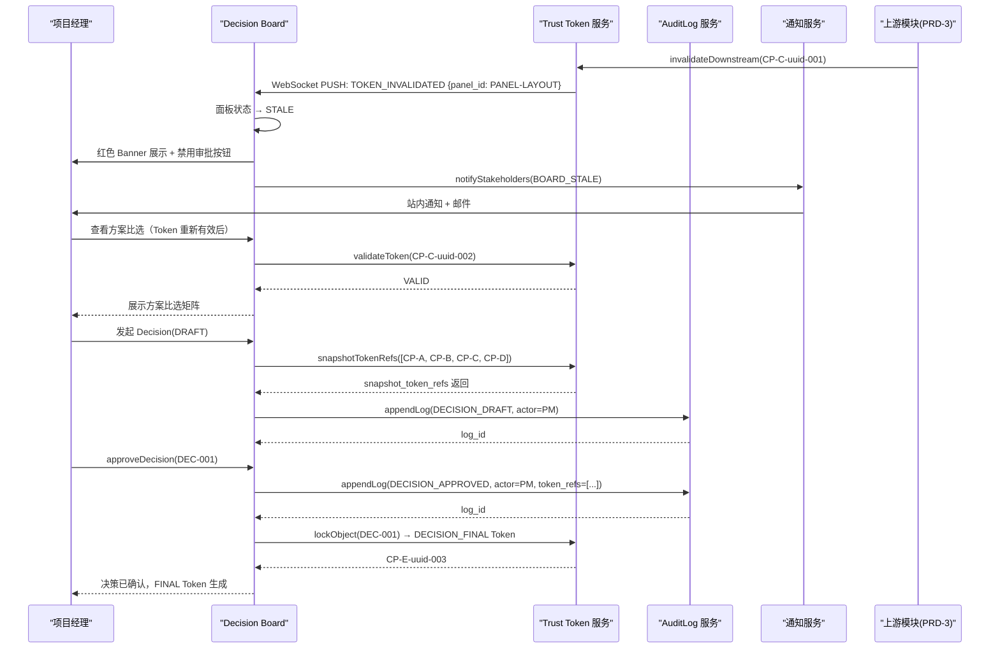
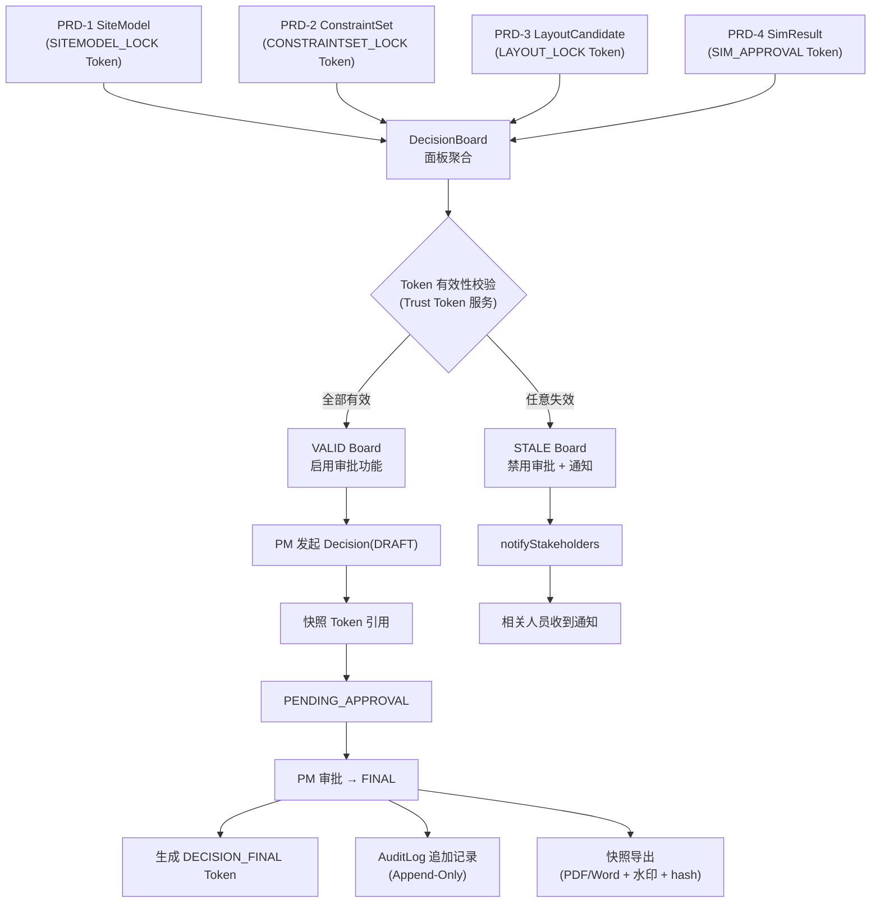

# PRD-5：Living Decision Board（活体决策工作台）

**模块代号**：S4_DECISION  
**版本**：v3.0  
**优先级**：P1  
**基于总纲**：产线+工艺 AI+CAD 系统 PRD v3.0  

---

## 文档信息表

| 项目 | 内容 |
|------|------|
| **文档版本** | v3.0 |
| **模块代号** | S4_DECISION |
| **优先级** | P1 |
| **日期** | 2026年4月13日 |
| **状态** | Draft for Build |
| **上游依赖 Trust Gate** | Gate A（`CONSTRAINTSET_LOCK`）、Gate B（`SITEMODEL_LOCK`）、Gate C（`LAYOUT_LOCK`）、Gate D（`SIM_APPROVAL`） |
| **关键词** | Living Decision Board、活体看板、决策日志、审计链、快照导出、Trust Token 绑定 |
| **编写人** | — |
| **评审人** | — |

---

## 版本历史

| 版本 | 日期 | 变更说明 |
|------|------|---------|
| v2.0 | 2026-04-09 | 初始版本，仅输出静态决策报告（PDF/Word） |
| **v3.0** | 2026-04-13 | **重大修正：静态报告升级为 Living Decision Board；新增活体看板、不可篡改决策日志、Trust Token 实时绑定与失效感知；产出物三层分层架构确立** |

---

## 如何阅读本文档

本文档描述 PRD-5 模块的完整产品需求。阅读建议：

1. **首先阅读 §1、§2** 了解本模块解决的核心问题与 Ontology 定位；
2. **§5（Trust Gate）** 是理解本模块前置条件的关键，所有展示内容均以有效 Token 为前提；
3. **§7（用户故事）** 提供了主要使用场景的完整验收标准；
4. **§8（数据模型）** 定义 `Decision` 与 `DecisionBoard` 对象；
5. **§17（Action Catalog）** 描述本模块可触发的自动化动作；
6. `🆕` 标注为 v3.0 新增内容。

---

## §1 需求背景与问题陈述

### 1.1 背景

在航空制造厂房论证场景中，项目决策者（总工程师、规划总师、项目经理）需要在多方案比选、仿真结果审阅、专家评审会等关键节点做出高影响决策。v2.0 的做法是在全链路末端生成一份静态 PDF/Word 报告，存在以下根本性问题：

- **报告生成即过期**：一旦上游任意数据变更（如约束集修订、底图更新），报告中的数据即失去有效性，但决策者无感知；
- **决策无审计链**："谁看了哪个版本的报告、基于什么做了什么决策"无法追溯，在军工审查中是合规红线；
- **洞察无法落地**：报告只能"看"，无法从中直接触发流程动作（如批准方案、要求复核、暂停工程）；
- **多轮评审成本高**：每次上游数据更新须重新出具报告，人工周期长。

### 1.2 问题陈述

| # | 问题 | 影响 | 现状解法（不足） |
|---|------|------|-----------------|
| P1 | 决策依据数据与上游版本脱节 | 决策基于过期数据，存在返工风险 | 人工确认报告日期 |
| P2 | 决策过程不可追溯 | 军工合规风险、责任不清 | 会议纪要（非结构化） |
| P3 | 无法从决策界面触发工作流 | 洞察→行动链路断裂 | 电话/邮件传达 |
| P4 | 多方案比选缺乏量化维度 | 依赖主观判断 | Excel 手工对比 |

---

## §2 🆕 Ontology 层定义

### 2.1 本模块涉及的 Object Types

| ObjectType | 说明 | 唯一键 | 生命周期 |
|---|---|---|---|
| **Decision** | 决策记录（审计核心对象） | `decision_id` | `DRAFT → PENDING_APPROVAL → FINAL` |
| **DecisionBoard** | 活体看板实例 | `board_id` | `ACTIVE → ARCHIVED` |
| **Snapshot** | 某时刻全链路数据快照 | `snapshot_id`（含内容 hash） | `VALID → SUPERSEDED` |
| **AuditLog** | 不可篡改操作日志条目 | `log_id` | `IMMUTABLE` |

### 2.2 本模块涉及的 Link Types

| LinkType | 方向 | 语义 |
|---|---|---|
| `Decision BASED_ON {SiteModel, ConstraintSet, LayoutCandidate, SimResult}` | Decision → * | 决策依据（需绑定对应 Token） |
| `DecisionBoard AGGREGATES {SiteModel, ConstraintSet, LayoutCandidate, SimResult}` | Board → * | 看板聚合展示的数据对象 |
| `Snapshot CAPTURES DecisionBoard` | Snapshot → Board | 快照记录的是某一时刻的 Board 状态 |
| `AuditLog RECORDS Decision/Action` | Log → * | 审计日志关联决策与动作 |

### 2.3 Ontology 对齐要求

- 所有 `Decision` 对象中的依据引用，必须使用 Ontology ID（`layout_id`、`sim_id`、`site_id`、`constraint_set_id`），不得仅用文件名或时间戳；
- `DecisionBoard` 的每个数据面板必须绑定对应 Trust Token，Token 失效时面板自动标记为 `STALE`；
- `AuditLog` 条目不可更新/删除，仅可追加（Append-Only）。

---

## §3 业务目标与成功指标（OKR + Metric Definition Cards）

### Objective

> 将航空制造厂房论证的决策环节从"静态报告审阅"升级为"实时感知、可审计、可行动"的活体决策工作台，使关键决策效率提升并满足军工合规要求。

### KR 表

| KR# | 关键结果 | 目标值 | 测量方式 |
|-----|---------|--------|---------|
| KR1 | 决策工作台数据新鲜度感知率 | 上游 Token 失效后 ≤ 60 秒内看板标记 `STALE` | 自动化回归测试 |
| KR2 | 决策日志完整率 | 所有 `FINAL` Decision 100% 可在 AuditLog 查询到完整证据链 | 日志完整性扫描 |
| KR3 | 快照导出成功率 | PDF/Word 快照导出成功率 ≥ 99.5% | 导出接口监控 |
| KR4 | 多方案比选效率 | 决策者从进入看板到完成方案选择的操作步骤 ≤ 5 步 | 用户行为埋点 |
| KR5 | 合规审查通过率 | 审计日志在内部合规审查中 100% 通过（可追溯性维度） | 合规审计报告 |

### Metric Definition Cards

---

**KR1 指标卡：数据新鲜度感知**

- **KR 编号**：PRD-5 / KR1
- **Metric 名称**：Board Staleness Detection Latency
- **严格定义**：
  - 分子：上游 Token 失效事件触发后，对应 Board Panel 状态变为 `STALE` 的时间（秒）
  - 分母：N/A（时延指标）
  - 目标阈值：≤ 60 秒
- **Ground Truth 来源**：Trust Token 服务的 `invalidateDownstream` 事件时间戳 vs. Board Panel 状态变更时间戳
- **测量触发**：每次 `invalidateDownstream` 事件触发时自动记录
- **生产监控**：Board 状态变更延迟 P99 Dashboard
- **阈值行为**：
  - > 60s：告警
  - > 300s：自动触发 `notifyStakeholders(BOARD_STALE_DELAY)`

---

**KR2 指标卡：决策日志完整率**

- **KR 编号**：PRD-5 / KR2
- **Metric 名称**：Decision Audit Completeness Rate
- **严格定义**：
  - 分母：所有状态为 `FINAL` 的 Decision 数量
  - 分子：其中在 AuditLog 中可检索到完整证据链（含 `authorized_by`、`authorized_at`、`token_refs`、`decision_rationale`）的数量
  - 阈值：= 100%
- **Ground Truth 来源**：AuditLog 服务查询接口
- **测量触发**：每日定时扫描 + 每次 `FINAL` Decision 写入后即时验证
- **生产监控**：完整率 Dashboard（按项目/时间维度）
- **阈值行为**：
  - < 100%：立即告警 + 阻断后续快照导出（`blockSnapshotExport`）

---

## §4 目标用户

| 角色 | 诉求 | 使用频率 |
|------|------|---------|
| **项目经理 / 总工程师** | 在一个界面看到全链路最新数据，快速对比方案，做出批准/退回决策 | 每轮评审（每周 1~3 次） |
| **规划总师** | 追踪各子模块进展，感知数据失效，管理多版本方案 | 高频（每日） |
| **质量/合规审查员** | 查阅决策日志与证据链，验证决策可追溯性 | 低频（审查节点） |
| **工艺工程师 / 布局工程师** | 接收来自决策层的反馈动作（如"退回重做"、"方案锁定"） | 按需 |
| **系统管理员** | 管理看板权限、审计日志导出、Token 状态监控 | 低频 |

---

## §5 🆕 Trust Gate 定义（本模块涉及的 CP Token）

### 5.1 本模块消费的 Token（前置条件）

| Token 类型 | 来源模块 | 用途 |
|---|---|---|
| `CONSTRAINTSET_LOCK` | PRD-2 Gate A | 验证约束集版本有效性，绑定 Decision 证据链 |
| `SITEMODEL_LOCK` | PRD-1 Gate B | 验证底图版本有效性，绑定 Board 面板 |
| `LAYOUT_LOCK` | PRD-3 Gate C | 验证布局方案有效性，方可进行方案比选 |
| `SIM_APPROVAL` | PRD-4 Gate D | 验证仿真结果有效性，方可展示仿真 KPI |

### 5.2 本模块生成的 Token

| Token 类型 | 触发条件 | 下游解锁 |
|---|---|---|
| `DECISION_FINAL` 🆕 | 决策者对 Decision 记录执行 `approveDecision` | 外部流程（如工程变更单、概念设计报告归档） |

### 5.3 Token 失效传播规则

```
上游任意 Token 失效
    ↓ invalidateDownstream(token_id)
Board Panel 标记 STALE（≤60s）
    ↓ notifyStakeholders(BOARD_STALE)
所有基于该 Token 的 FINAL Decision 标记 EVIDENCE_STALE
    ↓
已导出的 Snapshot PDF 追加水印："依据数据已更新，请重新确认"
```

---

## §6 🆕 权限矩阵

| 功能 | 项目经理/总工 | 规划总师 | 工艺/布局工程师 | 合规审查员 | 系统管理员 |
|------|:---:|:---:|:---:|:---:|:---:|
| 查看 Decision Board | ✅ | ✅ | ✅（只读） | ✅（只读） | ✅ |
| 方案比选（切换面板） | ✅ | ✅ | ❌ | ❌ | ❌ |
| 发起 Decision（DRAFT） | ✅ | ✅ | ❌ | ❌ | ❌ |
| 审批 Decision（FINAL） | ✅ | ❌ | ❌ | ❌ | ❌ |
| 导出 Snapshot（PDF/Word） | ✅ | ✅ | ❌ | ✅ | ✅ |
| 查阅 AuditLog | ✅ | ✅ | ❌ | ✅ | ✅ |
| 导出 AuditLog | ❌ | ❌ | ❌ | ✅ | ✅ |
| 触发 `invalidateDownstream` | ❌ | ❌ | ❌ | ❌ | ✅（手动补偿） |
| 管理 Board 权限配置 | ❌ | ❌ | ❌ | ❌ | ✅ |

---

## §7 使用场景与用户故事

### US-5-01（P0）：活体看板实时感知上游数据失效

**As a** 项目经理  
**I want** 当上游任意模块数据更新导致 Trust Token 失效时，看板自动高亮标记过期面板  
**So that** 我不会基于过期数据做出关键决策

**AC**：
- 上游 `invalidateDownstream` 事件触发后，≤ 60 秒内对应 Board Panel 标记为 `STALE`，并展示红色警告 Banner："数据已更新，以下面板数据可能不再有效，请确认后再做决策"；
- 告警 Banner 包含：失效 Token ID、失效时间、上游变更描述；
- STALE 状态下，"批准方案"按钮自动置灰，阻止基于过期数据的审批操作；
- 通过 `notifyStakeholders` 向相关角色发送站内通知和邮件。

**API 规格**：
```
POST /api/v1/board/{board_id}/panels/{panel_id}/stale
Request: { token_id, invalidated_at, upstream_change_summary }
Response: { panel_id, new_state: "STALE", notified_users: [...] }
```

---

### US-5-02（P0）：多方案量化比选

**As a** 总工程师  
**I want** 在看板中并排查看 ≥ 3 个布局候选方案的关键 KPI（产能、节拍、软约束违规数、面积利用率）  
**So that** 做出基于数据的方案选择，而非依赖直觉

**AC**：
- 看板展示方案比选矩阵：行=方案（LayoutCandidate），列=KPI 维度；
- 每列支持排序，高亮当前"最优"项（用户可自定义权重）；
- 方案来自有效 `LAYOUT_LOCK` Token，无效 Token 的方案不得纳入比选；
- 用户可固定 1 个"基准方案"，其余方案以 delta 形式展示差异；
- 操作记录写入 AuditLog（谁、何时、查看了哪些方案的比对）。

**API 规格**：
```
GET /api/v1/board/{board_id}/comparison
Query: layout_ids[]=LC-001&layout_ids[]=LC-002&kpis[]=throughput&kpis[]=takt_time
Response: { comparison_matrix: [...], valid_token_status: {...} }
```

---

### US-5-03（P0）：发起并审批决策（Decision 生命周期）

**As a** 项目经理  
**I want** 在看板中基于当前数据发起正式决策记录，填写决策说明，并提交最终批准  
**So that** 每一个关键决策都有结构化记录与不可篡改的证据链

**AC**：
- 发起 Decision（DRAFT 状态）时，系统自动快照当前所有绑定 Token（`token_refs`）；
- Decision 表单必填项：`decision_type`（选型/批准/退回/暂停）、`decision_rationale`（≥ 20 字）、`layout_ref`（若适用）、`sim_ref`（若适用）；
- DRAFT → PENDING_APPROVAL 需规划总师会签（可选配）；
- PENDING_APPROVAL → FINAL 需具有审批权限的角色签署；
- FINAL 状态不可修改；若上游数据失效，在 Decision 记录上追加 `EVIDENCE_STALE` 标记，但不修改原记录；
- 写入 AuditLog 包含：`decision_id`、`authorized_by`、`authorized_at`、`token_refs[]`、`decision_rationale`；
- 生成 `DECISION_FINAL` Token。

**API 规格**：
```
POST /api/v1/decisions
Request: { board_id, decision_type, decision_rationale, layout_ref, sim_ref }
Response: { decision_id, state: "DRAFT", snapshot_token_refs: [...] }

PATCH /api/v1/decisions/{decision_id}/approve
Request: { authorized_by, comment }
Response: { decision_id, state: "FINAL", decision_final_token: {...} }
```

---

### US-5-04（P0）：不可篡改审计日志查阅

**As a** 合规审查员  
**I want** 查阅某个决策的完整证据链，包括"谁基于哪些 Token 做了什么决策"  
**So that** 在军工合规审查中能提供完整的决策可追溯性证明

**AC**：
- AuditLog 支持按 `decision_id`、`board_id`、`user_id`、`time_range` 检索；
- 每条 AuditLog 展示：操作类型、操作人、时间戳、关联对象 ID、关联 Token ID 列表；
- AuditLog 不支持编辑/删除接口，仅支持追加（API 层强制 Append-Only）；
- 支持导出为 JSON 和 PDF（含数字签名摘要）；
- AuditLog 存储后端支持 WORM（Write Once Read Many）策略（NFR 约束）。

**API 规格**：
```
GET /api/v1/audit-logs
Query: decision_id=DEC-001&time_from=2026-01-01&time_to=2026-04-13
Response: { logs: [{ log_id, operation, actor, timestamp, related_objects, token_refs }] }

POST /api/v1/audit-logs/export
Request: { query_params, format: "pdf|json" }
Response: { download_url, file_hash }
```

---

### US-5-05（P1）：快照导出（PDF/Word）

**As a** 规划总师  
**I want** 将当前看板状态导出为带 Token 引用的 PDF/Word 报告，用于线下评审会  
**So that** 线下会议有规范的书面材料，且材料能追溯到具体数据版本

**AC**：
- 快照包含：封面（项目名、导出时间、导出人）、Token 有效性声明、多方案比选矩阵、仿真 KPI 汇总、决策日志摘要；
- 每个 Token 引用在快照中以注脚形式展示（token_id + locked_at + object_hash 前 8 位）；
- 若导出时任意 Token 已失效，PDF 首页添加醒目水印："⚠️ 本报告部分数据依据已更新，仅供参考，不作为最终决策依据"；
- 快照文件本身计算 SHA-256 并记录入 AuditLog；
- Word 格式满足内部公文模板要求（Arial/宋体双语标题，A4 页面）。

**API 规格**：
```
POST /api/v1/board/{board_id}/snapshots
Request: { format: "pdf|word", include_sections: [...], authorized_by }
Response: { snapshot_id, download_url, file_hash, token_validity_status: {...} }
```

---

### US-5-06（P1）：从决策界面触发工作流动作

**As a** 项目经理  
**I want** 在看板中直接触发"退回重做"、"方案暂停"等动作，而不是打电话或发邮件  
**So that** 洞察→行动的链路全部在系统内完成，不依赖线下沟通

**AC**：
- 支持触发的动作（需有 Action Catalog 授权）：
  - `requestHumanReview(layout_id)`：要求布局工程师重新校核指定方案；
  - `escalateConstraintConflict(conflict_id)`：将约束冲突上报给工艺负责人；
  - `suspendOperation(op_id, reason)`：暂停某工序（硬约束违规场景）；
  - `notifyStakeholders(event)`：向相关人员推送决策结论；
- 每个动作触发后写入 AuditLog，并更新 Decision 的 `related_actions` 字段；
- 动作触发需二次确认弹窗，展示"即将执行：xxx，影响范围：xxx，确认继续？"。

---

## §8 数据模型（完整 JSON，标注 v3.0 新增字段）

### 8.1 Decision 对象

```json
{
  "decision_id": "DEC-20260413-001",
  "board_id": "BOARD-001",
  "project_id": "PROJ-2024-007",
  "decision_type": "APPROVE | REJECT | SUSPEND | ESCALATE",
  "state": "DRAFT | PENDING_APPROVAL | FINAL",
  "decision_rationale": "基于方案 LC-003 的仿真结果，节拍满足 T≤72h 要求，且硬约束违规为 0，批准进入详细设计阶段。",
  "layout_ref": {
    "layout_id": "LC-003",
    "layout_lock_token_id": "CP-C-uuid-001"
  },
  "sim_ref": {
    "sim_id": "SIM-007",
    "sim_approval_token_id": "CP-D-uuid-002"
  },
  "token_refs": [
    {
      "token_id": "CP-A-uuid-001",
      "token_type": "CONSTRAINTSET_LOCK",
      "locked_object_hash": "sha256:abc..."
    },
    {
      "token_id": "CP-B-uuid-001",
      "token_type": "SITEMODEL_LOCK",
      "locked_object_hash": "sha256:def..."
    },
    {
      "token_id": "CP-C-uuid-001",
      "token_type": "LAYOUT_LOCK",
      "locked_object_hash": "sha256:ghi..."
    },
    {
      "token_id": "CP-D-uuid-002",
      "token_type": "SIM_APPROVAL",
      "locked_object_hash": "sha256:jkl..."
    }
  ],
  "evidence_state": "VALID | EVIDENCE_STALE",
  "authorized_by": "user_id_zhangsan",
  "authorized_at": "2026-04-13T14:30:00Z",
  "co_signed_by": "user_id_lisi",
  "related_actions": [
    {
      "action_type": "notifyStakeholders",
      "triggered_at": "2026-04-13T14:31:00Z",
      "triggered_by": "user_id_zhangsan"
    }
  ],
  "decision_final_token": {
    "token_id": "CP-E-uuid-003",
    "token_type": "DECISION_FINAL",
    "authorized_by": "user_id_zhangsan",
    "authorized_at": "2026-04-13T14:30:00Z"
  },
  "created_at": "2026-04-13T10:00:00Z",
  "updated_at": "2026-04-13T14:30:00Z",
  "mcp_context_id": "ctx-uuid-005"
}
```

### 8.2 DecisionBoard 对象 🆕

```json
{
  "board_id": "BOARD-001",
  "project_id": "PROJ-2024-007",
  "board_name": "C919 总装线 03 厂房方案评审工作台",
  "state": "ACTIVE | ARCHIVED",
  "panels": [
    {
      "panel_id": "PANEL-SITE",
      "panel_type": "SITEMODEL",
      "bound_token_id": "CP-B-uuid-001",
      "bound_object_id": "SM-001",
      "panel_state": "VALID | STALE",
      "last_updated_at": "2026-04-13T09:30:00Z"
    },
    {
      "panel_id": "PANEL-CONSTRAINT",
      "panel_type": "CONSTRAINTSET",
      "bound_token_id": "CP-A-uuid-001",
      "bound_object_id": "CS-001",
      "panel_state": "VALID",
      "last_updated_at": "2026-04-12T16:00:00Z"
    },
    {
      "panel_id": "PANEL-LAYOUT-COMPARE",
      "panel_type": "LAYOUT_COMPARISON",
      "candidate_ids": ["LC-001", "LC-002", "LC-003"],
      "valid_token_ids": ["CP-C-uuid-001", "CP-C-uuid-002", "CP-C-uuid-003"],
      "panel_state": "VALID",
      "pinned_baseline_id": "LC-001"
    },
    {
      "panel_id": "PANEL-SIM",
      "panel_type": "SIMRESULT",
      "bound_token_id": "CP-D-uuid-002",
      "bound_object_id": "SIM-007",
      "panel_state": "VALID",
      "kpi_summary": {
        "throughput_per_year": 42,
        "avg_takt_time_h": 68.5,
        "bottleneck_station": "STATION_05",
        "hard_violation_count": 0
      }
    }
  ],
  "decisions": ["DEC-20260413-001"],
  "created_at": "2026-04-10T08:00:00Z",
  "last_active_at": "2026-04-13T14:30:00Z",
  "mcp_context_id": "ctx-uuid-005"
}
```

### 8.3 AuditLog 条目 🆕

```json
{
  "log_id": "LOG-uuid-20260413-0042",
  "operation": "DECISION_APPROVED | DECISION_DRAFT | SNAPSHOT_EXPORTED | ACTION_TRIGGERED | PANEL_STALE | TOKEN_INVALIDATED",
  "actor": "user_id_zhangsan",
  "timestamp": "2026-04-13T14:30:00Z",
  "related_objects": {
    "decision_id": "DEC-20260413-001",
    "board_id": "BOARD-001"
  },
  "token_refs": ["CP-A-uuid-001", "CP-B-uuid-001", "CP-C-uuid-001", "CP-D-uuid-002"],
  "metadata": {
    "ip_address": "192.168.1.100",
    "user_agent": "Mozilla/5.0...",
    "session_id": "sess-uuid-xxx"
  },
  "entry_hash": "sha256:logEntryContentHash"
}
```

---

## §9 航空专属内容

### 9.1 决策分级与快照格式规范

| 决策类型 | 对应节点 | 快照签章要求 | 存档要求 |
|---|---|---|---|
| 方案概念批准 | 厂房可行性论证 | 项目经理 + 总工程师 | 归入项目设计包，保存 ≥ 10 年 |
| 布局方案锁定 | 详细设计启动前 | 规划总师签章 | 归入 CAD 版本库 |
| 仿真结果确认 | 投产前验证 | 仿真工程师 + 项目经理 | 归入工艺档案 |
| 紧急暂停决策 | 安全/质量事件响应 | 即时记录，事后补充审批 | 归入质量事件台账 |

### 9.2 军工合规要求

- 审计日志存储须满足**等保三级**要求：数据加密存储（AES-256）、传输加密（TLS 1.3）、访问日志独立保存；
- `DECISION_FINAL` Token 生成后，相关 AuditLog 须在 **48 小时内** 备份至离线存储（私有化部署场景）；
- 涉密等级标记（`SECRET_LEVEL: 秘密/机密/绝密`）挂载在 `Decision` 和 `Snapshot` 对象上，高密级对象不得导出至未经授权终端；
- 快照 PDF 须嵌入不可见数字水印（包含导出人 ID + 时间戳）。

---

## §10 技术选型声明

| 技术维度 | 选型 | 理由 |
|---|---|---|
| **前端框架** | React 18 + TypeScript | 组件化看板，支持实时状态响应（配合 WebSocket） |
| **状态实时推送** | WebSocket / SSE | Token 失效事件实时推送至前端，≤60s 延迟要求 |
| **审计日志存储** | Apache Kafka（事件流） + ClickHouse（OLAP 查询） | Kafka 保证 Append-Only 顺序性；ClickHouse 支持大规模审计日志检索 |
| **PDF 生成** | Puppeteer（Headless Chrome） | 高保真渲染，支持 CSS 打印样式，支持中文字体 |
| **Word 生成** | python-docx / Pandoc | 满足内部公文模板，格式可配置 |
| **后端** | Python FastAPI + PostgreSQL | 与全链路其他模块技术栈统一 |
| **数字签名/水印** | iText PDF（内嵌 PDF 数字签名） | 满足军工合规对文件完整性的要求 |
| **私有化部署** | Docker + K8s（离线镜像包） | 军工客户全离线部署，无外网依赖 |

---

## §11 非功能性需求（NFR）

| 类别 | 需求 | 指标 |
|---|---|---|
| **性能** | 看板加载时间 | 首屏渲染 ≤ 3 秒（含所有面板 Token 状态查询） |
| **性能** | 快照导出耗时 | PDF（≤ 30 页）导出 ≤ 15 秒 |
| **实时性** | Token 失效传播延迟 | ≤ 60 秒（P99） |
| **可靠性** | AuditLog 写入成功率 | ≥ 99.99%（任何 FINAL Decision 的日志不得丢失） |
| **安全** | 审计日志防篡改 | WORM 策略 + 每条日志含 `entry_hash` 自校验 |
| **安全** | 数据加密 | AES-256（存储）+ TLS 1.3（传输） |
| **合规** | 访问控制 | RBAC，所有权限变更写入 AuditLog |
| **可用性** | 系统可用性 | SLA ≥ 99.5%（工作时间内） |
| **可维护性** | 日志保留期 | AuditLog ≥ 10 年（私有化部署由客户管理） |
| **国产化** | 私有化部署兼容性 | 支持麒麟 OS + 龙芯/飞腾 CPU 环境离线运行 |

---

## §12 业务规则与异常处理

### 12.1 核心业务规则

| 规则ID | 规则描述 | 执行方式 |
|---|---|---|
| BR-5-01 | 无有效 `LAYOUT_LOCK` Token 时，禁止展示方案比选面板 | 系统强制（前端置灰 + API 拦截） |
| BR-5-02 | 无有效 `SIM_APPROVAL` Token 时，禁止展示仿真 KPI 面板 | 系统强制 |
| BR-5-03 | 任意 Token 失效时，"批准方案"按钮自动禁用 | 前端实时响应 WebSocket 事件 |
| BR-5-04 | `FINAL` Decision 不可修改；若依据失效，只追加 `EVIDENCE_STALE` 标记 | 数据库层 Immutable 约束 |
| BR-5-05 | 快照导出必须记录 AuditLog，且导出文件 hash 须入库 | 服务层强制 |
| BR-5-06 | 高密级（机密/绝密）Decision 不得在未登记终端上导出 PDF | 权限校验 + 终端白名单 |

### 12.2 异常处理

| 异常场景 | 系统响应 | 用户提示 |
|---|---|---|
| Token 服务不可达 | 看板所有面板降级为"无法验证有效性"状态，阻断审批 | "当前无法验证数据有效性，请联系系统管理员" |
| AuditLog 写入失败 | 回滚 Decision 状态变更，不允许 FINAL | "决策记录保存失败，操作已回滚" |
| PDF 导出超时（>30s） | 异步队列重试 ≤ 3 次，超出后通知用户 | "导出耗时较长，完成后将通过通知中心告知" |
| 并发审批冲突（2人同时批准） | 乐观锁（version check），后到者返回 409 Conflict | "决策状态已被更新，请刷新后重试" |
| 看板数据加载部分失败 | 降级显示：已加载面板正常展示，失败面板显示 error 状态 | "部分面板加载失败，已显示可用数据" |

---

## §13 假设、风险与依赖

### 13.1 假设

- 上游模块（PRD-1/2/3/4）均已正确实现 Trust Token 机制，且 Token 服务提供稳定的查询与失效通知接口；
- 客户有 RBAC 用户体系，本模块可对接 LDAP/SSO；
- 军工私有化部署客户已规划审计日志的长期存储方案（WORM 硬件或离线备份）。

### 13.2 风险

| 风险 | 概率 | 影响 | 缓解措施 |
|---|---|---|---|
| 上游 Token 服务不稳定导致看板频繁 STALE | 中 | 高 | Token 服务 SLA 要求 ≥ 99.9%；看板降级策略（本地缓存最后有效状态） |
| AuditLog 存储增长超预期 | 低 | 中 | 按项目归档；WORM 策略不影响读性能；ClickHouse 压缩率高 |
| 决策者不信任"活体"看板，仍依赖邮件 | 中 | 中 | 产品侧：提供导出功能作为过渡；培训侧：上线前演练 |
| 多方案比选 KPI 权重争议 | 高 | 低 | 权重由用户自定义并保存，争议通过 Decision 记录化解，不由产品预设 |

### 13.3 外部依赖

| 依赖项 | 来源模块 | 风险 |
|---|---|---|
| Trust Token 服务（查询/失效通知） | 基础设施层（PRD-0.8） | P0 依赖，必须优先交付 |
| `LAYOUT_LOCK` Token | PRD-3 | PRD-3 延期则 Layout 面板无法展示 |
| `SIM_APPROVAL` Token | PRD-4 | PRD-4 延期则仿真 KPI 面板无法展示（可 Phase 2 补齐） |
| Ontology 服务（ID 解析） | PRD-0.6 | 方案比选中需用 Ontology ID 查询对象名称 |

---

## §14 原型设计（Wireframe）

### 14.1 主看板布局

```
┌─────────────────────────────────────────────────────────────┐
│  📋 C919 总装线 03 厂房 · 决策工作台        [导出快照] [⚙️]  │
├──────────────┬──────────────┬──────────────┬────────────────┤
│ 🟢 底图面板  │ 🟢 约束集面板 │ 🔴 布局面板   │ 🟢 仿真面板    │
│ SM-001 v1.3 │ CS-001 v2.1  │ ⚠️ STALE     │ SIM-007        │
│ Token ✅     │ Token ✅     │ Token 已失效  │ Token ✅       │
│             │             │ [刷新依据]    │                │
│             │             │               │ 产能: 42架/年  │
│             │             │               │ 节拍: 68.5h    │
│             │             │               │ 违规: 0        │
├──────────────┴──────────────┴──────────────┴────────────────┤
│  📊 方案比选矩阵                                              │
│  ┌─────────┬──────────┬──────────┬──────────┐              │
│  │ 指标    │ LC-001⭐  │ LC-002   │ LC-003   │              │
│  │ 产能    │ 38架/年  │ 42架/年▲ │ 40架/年  │              │
│  │ 节拍    │ 75h      │ 68.5h▲   │ 71h      │              │
│  │ 软违规  │ 2        │ 0 ▲      │ 1        │              │
│  └─────────┴──────────┴──────────┴──────────┘              │
│                                                              │
│  ⚠️ 警告：布局面板数据已过期，"批准方案"已暂时禁用           │
├──────────────────────────────────────────────────────────────┤
│  📝 决策日志                              [查看全部] [导出]  │
│  2026-04-13 14:30  张三  批准方案 LC-002  [FINAL] [查看]    │
│  2026-04-12 10:00  李四  发起评审 DEC-002 [DRAFT] [查看]    │
└──────────────────────────────────────────────────────────────┘
```

### 14.2 Decision 发起弹窗

```
┌──────────────────────────────────────────────────┐
│  新建决策记录                               [×]  │
├──────────────────────────────────────────────────┤
│  决策类型：[批准方案 ▼]                           │
│                                                   │
│  选择布局方案：[LC-002 (已锁版 ✅) ▼]             │
│  关联仿真结果：[SIM-007 (已审批 ✅) ▼]            │
│                                                   │
│  决策说明（必填，≥20字）：                        │
│  ┌───────────────────────────────────────────┐   │
│  │ LC-002 节拍满足 T≤72h，硬约束违规 0，    │   │
│  │ 综合评分最优，批准进入详细设计。          │   │
│  └───────────────────────────────────────────┘   │
│                                                   │
│  📌 将快照以下 Token 作为决策依据：               │
│     ✅ CONSTRAINTSET_LOCK / CP-A-001             │
│     ✅ SITEMODEL_LOCK / CP-B-001                 │
│     ✅ LAYOUT_LOCK / CP-C-002                    │
│     ✅ SIM_APPROVAL / CP-D-002                   │
│                                                   │
│         [取消]          [提交待审批]              │
└──────────────────────────────────────────────────┘
```

---

## §15 UML 序列图（Mermaid）



---

## §16 数据流图（Mermaid）



---

## §17 🆕 Action Catalog

| Action | 触发条件 | 执行主体 | 输出 | 是否可阻断 |
|---|---|---|---|---|
| `invalidateBoard(board_id, panel_id)` | 上游 Token 失效 | 系统自动（WebSocket 推送） | Panel 状态 = `STALE` | ✅ |
| `notifyStakeholders(BOARD_STALE)` | Panel 变为 `STALE` | 系统自动 | 站内通知 + 邮件 | ❌ |
| `blockApprovalButton(board_id)` | 任意 Panel 为 `STALE` | 系统自动（前端） | 审批按钮置灰 | ✅ |
| `lockObject(decision_id)` → `DECISION_FINAL` | Decision 审批通过 | 人工授权 | `DECISION_FINAL` Trust Token | ✅ |
| `exportSnapshot(board_id, format)` | 用户主动触发 | 人工授权 | PDF/Word + file_hash | ✅ |
| `appendAuditLog(operation, actor, refs)` | 任何关键操作 | 系统自动 | AuditLog 条目 | ✅（写入失败则回滚操作） |
| `markEvidenceStale(decision_id)` | FINAL Decision 的依据 Token 失效 | 系统自动 | Decision.evidence_state = `EVIDENCE_STALE` | ❌（不修改原记录，仅追加标记） |
| `requestHumanReview(layout_id)` | PM 从看板触发退回 | 人工触发 | 审核任务（派给布局工程师） | ✅ |
| `suspendOperation(op_id, reason)` | PM 从看板触发暂停 | 人工触发（需二次确认） | 生产暂停指令 + AuditLog | ✅ |

---

## §18 🆕 研发排期建议（Sprint 规划表）

> 基于 2 周 Sprint，前序依赖 PRD-0.8（Trust Token 服务）、PRD-1/2/3/4 MVP 完成。

| Sprint | 时间（参考） | 目标 | 交付物 |
|--------|------------|------|--------|
| **S5-1** | Week 1~2 | Board 基础框架 + Token 绑定 | DecisionBoard CRUD API；Token 状态查询集成；面板 STALE 机制（WebSocket）；前端框架搭建 |
| **S5-2** | Week 3~4 | 决策生命周期 MVP | Decision DRAFT/FINAL API；AuditLog Append-Only 服务；`DECISION_FINAL` Token 生成；前端 Decision 发起/审批流程 |
| **S5-3** | Week 5~6 | 多方案比选 + 快照导出 | 方案比选矩阵组件；PDF/Word 快照导出（含 Token 注脚 + 水印）；AuditLog 查询界面 |
| **S5-4** | Week 7~8 | Action 层 + 合规加固 | 看板内 Action 触发（requestHumanReview / suspendOperation）；AuditLog 导出（JSON/PDF）；军工合规加固（加密/WORM/数字水印）；端到端集成测试 |
| **S5-5（Buffer）** | Week 9~10 | 性能优化 + 用户验收测试 | 首屏加载优化；P99 延迟达标验证；客户试用反馈修复；文档与部署手册 |

**Phase 1 最小交付范围（S5-1 + S5-2 + S5-3 核心功能）**：
- ✅ DecisionBoard 活体绑定 + STALE 感知
- ✅ Decision DRAFT → FINAL 生命周期
- ✅ AuditLog Append-Only（满足基础合规）
- ✅ 快照导出（PDF 含 Token 引用）
- ⏳ 多方案比选矩阵（S5-3，可 Phase 2 补全）
- ⏳ Action 触发（S5-4，可 Phase 2 补全）

---

*文档结束 · PRD-5 v3.0 · S4_DECISION · 2026-04-13*
