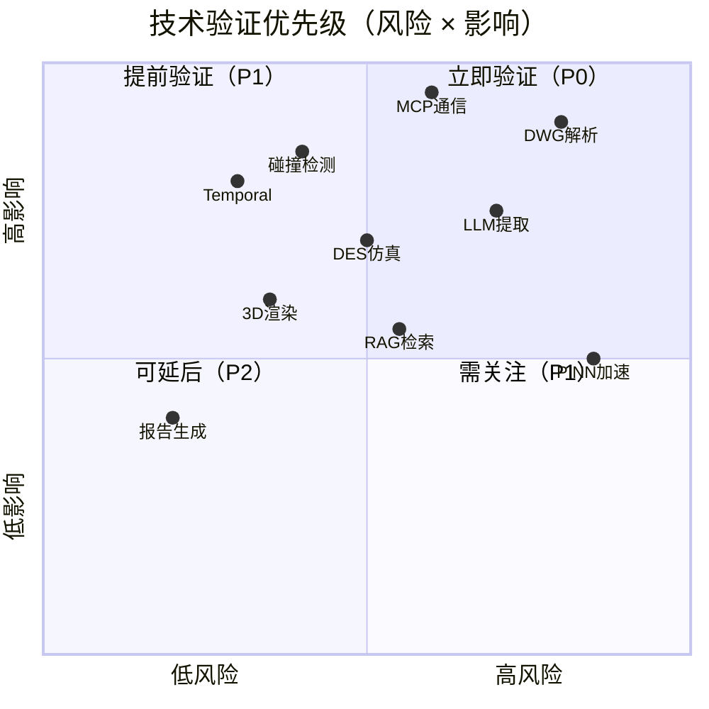
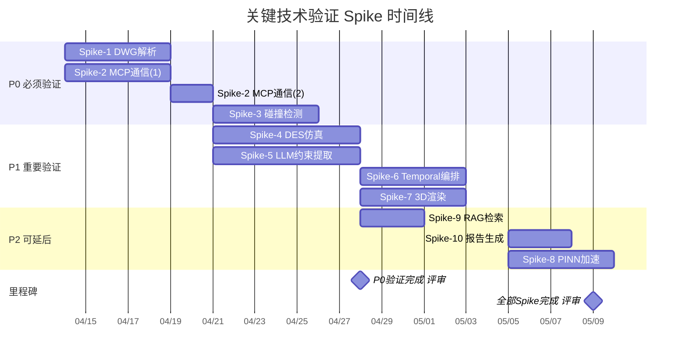

# ProLine CAD 关键技术点验证计划（Spike Plan）

**版本**：v1.0  
**日期**：2026年4月10日  
**关联文档**：技术方案文档 v1.0、PRD全局附录 v1.0  
**状态**：待启动  

---

## 目录

1. [验证总览](#1-验证总览)
2. [Spike-1：DWG/RVT 底图解析可行性](#2-spike-1dwgrvt-底图解析可行性)
3. [Spike-2：MCP 协议端到端通信](#3-spike-2mcp-协议端到端通信)
4. [Spike-3：空间碰撞检测与实时自愈性能](#4-spike-3空间碰撞检测与实时自愈性能)
5. [Spike-4：SimPy DES 仿真精度与性能](#5-spike-4simpy-des-仿真精度与性能)
6. [Spike-5：LLM 工艺约束提取准确性](#6-spike-5llm-工艺约束提取准确性)
7. [Spike-6：Temporal 工作流编排可靠性](#7-spike-6temporal-工作流编排可靠性)
8. [Spike-7：3D 渲染与实时交互性能](#8-spike-7-3d-渲染与实时交互性能)
9. [Spike-8：PINN 代理模型加速可行性](#9-spike-8pinn-代理模型加速可行性)
10. [Spike-9：RAG 知识检索召回率](#10-spike-9rag-知识检索召回率)
11. [Spike-10：PDF/Word 报告生成质量](#11-spike-10pdfword-报告生成质量)
12. [验证时间线与资源分配](#12-验证时间线与资源分配)
13. [Go/No-Go 决策矩阵](#13-gono-go-决策矩阵)

---

## 1. 验证总览

### 1.1 验证目标

在 PoC 阶段（W1~W4，共4周）内，通过10个独立 Spike 实验验证核心技术栈的可行性、性能和集成能力，为 MVP 阶段的技术选型提供数据支撑。

### 1.2 验证优先级矩阵



### 1.3 验证全景表

| Spike ID | 验证点 | 优先级 | 关联PRD | 计划周 | 验证人 | 状态 |
|----------|--------|--------|---------|--------|--------|------|
| Spike-1 | DWG/RVT底图解析 | **P0** | PRD-1 | W1 | 后端工程师A | 🔴待启动 |
| Spike-2 | MCP协议端到端通信 | **P0** | 全局 | W1-W2 | 后端工程师B | 🔴待启动 |
| Spike-3 | 碰撞检测与实时自愈 | **P0** | PRD-3 | W2 | 后端工程师C | 🔴待启动 |
| Spike-4 | SimPy DES仿真 | **P1** | PRD-4 | W2-W3 | 仿真工程师 | 🔴待启动 |
| Spike-5 | LLM工艺约束提取 | **P1** | PRD-2 | W2-W3 | AI工程师 | 🔴待启动 |
| Spike-6 | Temporal工作流编排 | **P1** | 全局 | W3 | 后端工程师B | 🔴待启动 |
| Spike-7 | 3D渲染与实时交互 | **P1** | PRD-1,3 | W3-W4 | 前端工程师 | 🔴待启动 |
| Spike-8 | PINN代理模型加速 | **P2** | PRD-4 | W4+ | AI工程师 | 🔴待启动 |
| Spike-9 | RAG知识检索召回率 | **P2** | PRD-2 | W3 | AI工程师 | 🔴待启动 |
| Spike-10 | PDF/Word报告生成 | **P2** | PRD-5 | W4 | 后端工程师A | 🔴待启动 |

---

## 2. Spike-1：DWG/RVT 底图解析可行性

### 2.1 基本信息

| 项目 | 内容 |
|------|------|
| **Spike ID** | Spike-1 |
| **优先级** | P0（阻塞型——解析失败则整个系统无法启动） |
| **验证周期** | W1（5个工作日） |
| **负责人** | 后端工程师A |
| **关联风险** | TR-001：DWG图层命名不规范导致解析失败 |

### 2.2 验证问题

1. ODA File Converter + ezdxf 能否可靠解析产线DWG底图？
2. 图层语义映射的准确率如何？（柱网/墙体/禁区/设备区）
3. 坐标系对齐的精度能否达到 ≤1cm？
4. 大文件（>50MB DWG）处理的内存和耗时表现？
5. RVT→IFC 转换路径是否可行？

### 2.3 测试用例

| 用例ID | 输入 | 操作 | 预期结果 | 通过标准 |
|--------|------|------|----------|----------|
| S1-TC01 | 标准产线DWG（A0, ~10MB） | ODA转DXF → ezdxf解析 → 输出JSON | 成功提取所有图层，实体数量与CAD软件一致 | 实体数量差异 ≤ 1% |
| S1-TC02 | 非标准图层命名DWG | 同上 + 人工映射表 | 正确分类 ≥ 85% 的实体 | 识别率 ≥ 85% |
| S1-TC03 | 大文件DWG（50MB+） | 同上，监控内存和时间 | 内存 ≤ 2GB，耗时 ≤ 30s | 同左 |
| S1-TC04 | 含3个参考点的DWG | 坐标对齐（仿射变换） | 对齐误差计算 | 误差 ≤ 1cm（≤10mm） |
| S1-TC05 | RVT文件（Revit 2022） | pyRevit/IFC OpenShell → IFC → 解析 | 成功提取房间/构件/空间信息 | IFC转换成功且可解析 |
| S1-TC06 | 损坏的DWG文件 | 尝试解析 | 优雅失败 + 错误信息 | 不崩溃，返回错误码5001 |

### 2.4 验证脚本框架

```python
"""
Spike-1 验证脚本：DWG解析能力测试
文件：spikes/spike_01_dwg_parse/validate.py
"""
import time
import tracemalloc
import ezdxf
from pathlib import Path

def test_dwg_parse(dwg_path: str) -> dict:
    """TC01/TC02: 解析DWG并提取图层统计"""
    tracemalloc.start()
    start = time.perf_counter()
    
    doc = ezdxf.readfile(dwg_path)
    msp = doc.modelspace()
    
    # 图层统计
    layer_stats = {}
    entity_count = 0
    for entity in msp:
        layer = entity.dxf.layer
        layer_stats[layer] = layer_stats.get(layer, 0) + 1
        entity_count += 1
    
    elapsed = time.perf_counter() - start
    current, peak = tracemalloc.get_traced_memory()
    tracemalloc.stop()
    
    return {
        "total_entities": entity_count,
        "layer_count": len(layer_stats),
        "layers": layer_stats,
        "elapsed_seconds": round(elapsed, 3),
        "peak_memory_mb": round(peak / 1024 / 1024, 1)
    }

def test_coordinate_alignment(ref_points: list[dict]) -> dict:
    """TC04: 坐标对齐精度测试
    ref_points格式: [{"dwg": [x,y], "real": [x,y]}, ...]
    """
    import numpy as np
    
    src = np.array([p["dwg"] for p in ref_points])
    dst = np.array([p["real"] for p in ref_points])
    
    # 计算仿射变换矩阵 (最小二乘)
    n = len(ref_points)
    A = np.zeros((2*n, 6))
    b = np.zeros(2*n)
    for i in range(n):
        A[2*i] = [src[i,0], src[i,1], 1, 0, 0, 0]
        A[2*i+1] = [0, 0, 0, src[i,0], src[i,1], 1]
        b[2*i] = dst[i,0]
        b[2*i+1] = dst[i,1]
    
    params, residuals, _, _ = np.linalg.lstsq(A, b, rcond=None)
    
    # 计算残差（对齐误差）
    errors = []
    for p in ref_points:
        tx = params[0]*p["dwg"][0] + params[1]*p["dwg"][1] + params[2]
        ty = params[3]*p["dwg"][0] + params[4]*p["dwg"][1] + params[5]
        err = ((tx - p["real"][0])**2 + (ty - p["real"][1])**2) ** 0.5
        errors.append(err)
    
    return {
        "max_error_mm": round(max(errors), 2),
        "mean_error_mm": round(sum(errors)/len(errors), 2),
        "transform_params": params.tolist(),
        "passed": max(errors) <= 10  # ≤10mm = ≤1cm
    }

def test_layer_semantic_mapping(layer_stats: dict, mapping: dict) -> dict:
    """TC02: 图层语义分类准确率"""
    total = sum(layer_stats.values())
    classified = 0
    for layer, count in layer_stats.items():
        if layer in mapping:
            classified += count
    
    accuracy = classified / total if total > 0 else 0
    return {
        "total_entities": total,
        "classified_entities": classified,
        "accuracy": round(accuracy, 4),
        "passed": accuracy >= 0.85
    }
```

### 2.5 所需资源

| 资源 | 说明 |
|------|------|
| **样例文件** | 至少3份真实产线DWG底图（不同规模：小/中/大） |
| **RVT样例** | 1份Revit 2022+工厂模型 |
| **软件** | ODA File Converter（需申请免费授权）、FreeCAD 0.21 |
| **机器** | CPU：4核+，内存：8GB+，磁盘：10GB+（临时文件） |

### 2.6 成功标准 & Go/No-Go

| 标准 | 阈值 | 类型 |
|------|------|------|
| DWG解析成功率 | 100%（样例文件均可解析） | **必须** |
| 图层识别率（有映射表时） | ≥ 85% | **必须** |
| 坐标对齐误差 | ≤ 10mm | **必须** |
| 大文件内存 | ≤ 2GB | **必须** |
| 大文件耗时 | ≤ 30s | 期望 |
| RVT→IFC转换可行 | 至少1条路径可行 | 期望 |

**No-Go 触发条件**：DWG解析成功率 < 100% 或 坐标误差 > 50mm → 重新评估技术路线（考虑商业SDK如Teigha）

### 2.7 备选方案

| 方案 | 条件 | 说明 |
|------|------|------|
| 方案A（主选） | ODA + ezdxf | 开源、免费、Python原生 |
| 方案B | LibreDWG + ezdxf | 纯开源替代ODA |
| 方案C | Teigha (ODA商业SDK) | 商业授权，支持更多格式 |
| 方案D | 用户先转DXF/IFC再上传 | 最后兜底，体验差但零风险 |

---

## 3. Spike-2：MCP 协议端到端通信

### 3.1 基本信息

| 项目 | 内容 |
|------|------|
| **Spike ID** | Spike-2 |
| **优先级** | P0（架构脊柱——MCP不通则所有Agent无法集成） |
| **验证周期** | W1-W2（7个工作日） |
| **负责人** | 后端工程师B |
| **关联风险** | TR-005：MCP协议版本升级不兼容 |

### 3.2 验证问题

1. Python MCP SDK 的 stdio 传输在 Temporal Activity 内是否稳定？
2. SSE 传输在跨容器（Docker网络）场景下延迟和可靠性如何？
3. MCP Context ID 传播链是否能自动串联？
4. Tool 调用的错误处理和重试机制是否可靠？
5. 并发多 Tool 调用时是否有竞态问题？

### 3.3 测试用例

| 用例ID | 场景 | 操作 | 预期结果 | 通过标准 |
|--------|------|------|----------|----------|
| S2-TC01 | stdio 单次Tool调用 | Client调用echo Tool | 返回正确结果 + context_id | 成功率 100% |
| S2-TC02 | stdio 连续100次调用 | 循环调用parseDWG mock | 全部成功，无连接泄漏 | 成功率 100%，内存稳定 |
| S2-TC03 | SSE 跨容器调用 | Docker容器A调容器B的SSE Server | 返回结果，延迟可接受 | 延迟 ≤ 200ms (网络) |
| S2-TC04 | Tool调用超时 | 调用模拟慢Tool（10s） | Client正确超时处理 | 超时后不卡死 |
| S2-TC05 | Tool返回错误 | Server返回错误码5001 | Client收到结构化错误 | 错误码正确传递 |
| S2-TC06 | Context传播链 | Agent_A → Agent_B，B读A的context | B能读到A产出的context | parent_context链接正确 |
| S2-TC07 | 并发Tool调用 | 同时调5个不同Agent的Tool | 全部独立返回 | 无竞态，全部成功 |
| S2-TC08 | SSE连接断线重连 | 强制kill Server容器再恢复 | Client重连并重试 | 重试成功 |

### 3.4 验证脚本框架

```python
"""
Spike-2 验证脚本：MCP通信端到端测试
文件：spikes/spike_02_mcp_e2e/validate.py
"""
import asyncio
import time
from mcp import ClientSession, StdioServerParameters
from mcp.client.stdio import stdio_client

# ===== TC01: stdio 单次调用 =====
async def test_stdio_single_call():
    server_params = StdioServerParameters(
        command="python",
        args=["-m", "agents.parse_agent.server"]
    )
    async with stdio_client(server_params) as (read, write):
        async with ClientSession(read, write) as session:
            await session.initialize()
            
            # 列出可用 Tools
            tools = await session.list_tools()
            assert len(tools.tools) > 0, "No tools found"
            
            # 调用 parseDWG Tool
            result = await session.call_tool(
                "parseDWG",
                arguments={
                    "file_ref": "s3://test/sample.dwg",
                    "coordinate_config": {
                        "origin": [0, 0, 0],
                        "unit": "mm"
                    }
                }
            )
            assert result.content is not None
            assert "mcp_context_id" in str(result.content)
            return {"status": "pass", "tools_count": len(tools.tools)}

# ===== TC02: stdio 连续100次调用稳定性 =====
async def test_stdio_stability(iterations=100):
    import tracemalloc
    tracemalloc.start()
    
    server_params = StdioServerParameters(
        command="python",
        args=["-m", "agents.parse_agent.server"]
    )
    
    success_count = 0
    errors = []
    
    async with stdio_client(server_params) as (read, write):
        async with ClientSession(read, write) as session:
            await session.initialize()
            
            for i in range(iterations):
                try:
                    result = await session.call_tool("parseDWG", arguments={
                        "file_ref": f"s3://test/sample_{i}.dwg",
                        "coordinate_config": {"origin": [0,0,0], "unit": "mm"}
                    })
                    success_count += 1
                except Exception as e:
                    errors.append({"iteration": i, "error": str(e)})
    
    _, peak = tracemalloc.get_traced_memory()
    tracemalloc.stop()
    
    return {
        "iterations": iterations,
        "success": success_count,
        "failure": len(errors),
        "errors": errors[:5],  # 只记录前5个
        "peak_memory_mb": round(peak / 1024 / 1024, 1),
        "passed": success_count == iterations
    }

# ===== TC03: SSE 跨容器调用延迟 =====
async def test_sse_cross_container():
    from mcp.client.sse import sse_client
    
    latencies = []
    for _ in range(20):
        start = time.perf_counter()
        async with sse_client("http://constraint-agent:8001/sse") as (read, write):
            async with ClientSession(read, write) as session:
                await session.initialize()
                result = await session.call_tool("extractSOP", arguments={
                    "document_refs": ["s3://test/sop.docx"]
                })
        latency_ms = (time.perf_counter() - start) * 1000
        latencies.append(latency_ms)
    
    return {
        "avg_latency_ms": round(sum(latencies)/len(latencies), 1),
        "p99_latency_ms": round(sorted(latencies)[int(len(latencies)*0.99)], 1),
        "max_latency_ms": round(max(latencies), 1),
        "passed": max(latencies) <= 500
    }

# ===== TC06: Context传播链验证 =====
async def test_context_propagation():
    """验证 Agent_A 输出的context_id 是否能被 Agent_B 正确引用"""
    import json
    import redis.asyncio as redis
    
    r = redis.Redis(host="redis", port=6379)
    
    # Step 1: Agent A 产出 context
    ctx_a = {
        "context_id": "ctx_test_parse_001",
        "source_agent": "parse-agent",
        "version": 1,
        "payload_type": "SiteModel",
        "payload_ref": "s3://test/site_model_v1.json",
        "parent_contexts": [],
        "status": "active"
    }
    await r.set(f"mcp:ctx:{ctx_a['context_id']}", json.dumps(ctx_a))
    
    # Step 2: Agent B 读取 parent context
    parent_ctx_raw = await r.get(f"mcp:ctx:ctx_test_parse_001")
    parent_ctx = json.loads(parent_ctx_raw)
    
    # Step 3: Agent B 产出新 context，链接到 parent
    ctx_b = {
        "context_id": "ctx_test_layout_001",
        "source_agent": "layout-agent",
        "version": 1,
        "payload_type": "LayoutCandidate",
        "payload_ref": "s3://test/layout_v1.json",
        "parent_contexts": [parent_ctx["context_id"]],
        "status": "active"
    }
    await r.set(f"mcp:ctx:{ctx_b['context_id']}", json.dumps(ctx_b))
    
    # 验证追溯链
    result_b = json.loads(await r.get(f"mcp:ctx:ctx_test_layout_001"))
    assert result_b["parent_contexts"] == ["ctx_test_parse_001"]
    
    await r.aclose()
    return {"status": "pass", "trace_chain": ["ctx_test_parse_001", "ctx_test_layout_001"]}
```

### 3.5 成功标准 & Go/No-Go

| 标准 | 阈值 | 类型 |
|------|------|------|
| stdio 100次调用成功率 | 100% | **必须** |
| SSE跨容器调用成功率 | ≥ 99% | **必须** |
| SSE调用P99延迟 | ≤ 500ms | **必须** |
| Context传播链完整性 | 100%正确 | **必须** |
| 错误码传递正确性 | 100% | **必须** |
| 断线重连成功 | 能自动恢复 | 期望 |

**No-Go 触发条件**：stdio通信不稳定或Context传播链断裂 → 评估gRPC替代MCP stdio

---

## 4. Spike-3：空间碰撞检测与实时自愈性能

### 4.1 基本信息

| 项目 | 内容 |
|------|------|
| **Spike ID** | Spike-3 |
| **优先级** | P0（用户体验核心——拖拽延迟超标则产品不可用） |
| **验证周期** | W2（5个工作日） |
| **负责人** | 后端工程师C |
| **关联风险** | TR-003：实时碰撞检测延迟超标 |

### 4.2 验证问题

1. R-Tree + Shapely 在50/100/200个Asset规模下碰撞检测延迟？
2. 增量检测（只测移动设备vs全局检测）的性能差异？
3. 自愈算法（推开碰撞设备）的计算时间和结果合理性？
4. Redis缓存R-Tree索引的序列化/反序列化开销？
5. WebSocket全链路（前端→BFF→Agent→返回）的端到端延迟？

### 4.3 测试用例

| 用例ID | 场景 | 规模 | 预期结果 | 通过标准 |
|--------|------|------|----------|----------|
| S3-TC01 | 全局碰撞检测 | 50 Assets | 返回碰撞列表 | ≤ 50ms |
| S3-TC02 | 全局碰撞检测 | 100 Assets | 返回碰撞列表 | ≤ 100ms |
| S3-TC03 | 全局碰撞检测 | 200 Assets | 返回碰撞列表 | ≤ 200ms |
| S3-TC04 | 增量检测（1个移动） | 100 Assets | 只检测1个设备的邻域 | ≤ 20ms |
| S3-TC05 | 自愈算法 | 3个碰撞对 | 修正后无碰撞 | ≤ 100ms，修正合理 |
| S3-TC06 | 禁区侵入检测 | 100 Assets + 10禁区 | 检出所有侵入 | ≤ 50ms |
| S3-TC07 | WS端到端延迟 | 100 Assets | drag→heal→返回 | ≤ 500ms |
| S3-TC08 | 连续拖拽 | 100次/10s | 无积压、无崩溃 | 无消息丢失 |

### 4.4 验证脚本框架

```python
"""
Spike-3 验证脚本：碰撞检测性能基准测试
文件：spikes/spike_03_collision/validate.py
"""
import time
import random
from shapely.geometry import box, Polygon
from shapely.strtree import STRtree

def generate_assets(count: int, area_size: float = 100000) -> list[dict]:
    """生成随机设备布局（单位：mm）"""
    assets = []
    for i in range(count):
        w = random.uniform(1000, 5000)  # 1m ~ 5m
        h = random.uniform(1000, 5000)
        x = random.uniform(0, area_size - w)
        y = random.uniform(0, area_size - h)
        assets.append({
            "asset_guid": f"asset_{i:04d}",
            "polygon": box(x, y, x + w, y + h),
            "pos_x": x, "pos_y": y,
            "width": w, "height": h
        })
    return assets

def build_spatial_index(assets: list[dict]) -> STRtree:
    """构建STR-Tree空间索引"""
    polygons = [a["polygon"] for a in assets]
    return STRtree(polygons)

# ===== TC01~TC03: 全局碰撞检测 =====
def test_global_collision(asset_count: int) -> dict:
    assets = generate_assets(asset_count)
    tree = build_spatial_index(assets)
    
    start = time.perf_counter()
    
    collisions = []
    for i, asset in enumerate(assets):
        candidates = tree.query(asset["polygon"])
        for j in candidates:
            if j > i:  # 避免重复
                if assets[i]["polygon"].intersects(assets[j]["polygon"]):
                    overlap = assets[i]["polygon"].intersection(assets[j]["polygon"]).area
                    if overlap > 0:
                        collisions.append({
                            "a": assets[i]["asset_guid"],
                            "b": assets[j]["asset_guid"],
                            "overlap_mm2": round(overlap, 1)
                        })
    
    elapsed_ms = (time.perf_counter() - start) * 1000
    
    return {
        "asset_count": asset_count,
        "collision_count": len(collisions),
        "elapsed_ms": round(elapsed_ms, 2),
        "passed": elapsed_ms <= asset_count  # 粗略标准: 每个asset≤1ms
    }

# ===== TC04: 增量碰撞检测（单设备移动） =====
def test_incremental_collision(assets: list, tree: STRtree, moved_idx: int) -> dict:
    moved = assets[moved_idx]
    
    start = time.perf_counter()
    
    # 只查询移动设备的邻域
    candidates = tree.query(moved["polygon"])
    collisions = []
    for j in candidates:
        if j != moved_idx:
            if moved["polygon"].intersects(assets[j]["polygon"]):
                overlap = moved["polygon"].intersection(assets[j]["polygon"]).area
                if overlap > 0:
                    collisions.append({
                        "a": moved["asset_guid"],
                        "b": assets[j]["asset_guid"]
                    })
    
    elapsed_ms = (time.perf_counter() - start) * 1000
    
    return {
        "elapsed_ms": round(elapsed_ms, 2),
        "collisions": len(collisions),
        "passed": elapsed_ms <= 20
    }

# ===== TC05: 自愈算法（简单推开） =====
def test_auto_heal(assets: list, collisions: list) -> dict:
    """将碰撞设备沿最短分离向量推开"""
    start = time.perf_counter()
    
    healed = []
    for col in collisions:
        a_idx = next(i for i, a in enumerate(assets) if a["asset_guid"] == col["a"])
        b_idx = next(i for i, a in enumerate(assets) if a["asset_guid"] == col["b"])
        
        a_poly = assets[a_idx]["polygon"]
        b_poly = assets[b_idx]["polygon"]
        
        # 计算最小分离向量（简化：沿x或y推开）
        intersection = a_poly.intersection(b_poly)
        if intersection.is_empty:
            continue
        
        ix, iy = intersection.centroid.coords[0]
        ax, ay = a_poly.centroid.coords[0]
        
        # 推开B设备
        dx = 1 if ix > ax else -1
        separation = intersection.bounds[2] - intersection.bounds[0] + 100  # +100mm间距
        
        new_x = assets[b_idx]["pos_x"] + dx * separation
        healed.append({
            "asset_guid": assets[b_idx]["asset_guid"],
            "new_pos_x": round(new_x, 1),
            "new_pos_y": assets[b_idx]["pos_y"]
        })
    
    elapsed_ms = (time.perf_counter() - start) * 1000
    
    return {
        "healed_count": len(healed),
        "elapsed_ms": round(elapsed_ms, 2),
        "healed_placements": healed,
        "passed": elapsed_ms <= 100
    }

# ===== TC06: 禁区侵入检测 =====
def test_exclusion_zone_check(assets: list, zones: list[Polygon]) -> dict:
    zone_tree = STRtree(zones)
    
    start = time.perf_counter()
    
    violations = []
    for asset in assets:
        candidates = zone_tree.query(asset["polygon"])
        for z_idx in candidates:
            if asset["polygon"].intersects(zones[z_idx]):
                violations.append({
                    "asset": asset["asset_guid"],
                    "zone_idx": z_idx
                })
    
    elapsed_ms = (time.perf_counter() - start) * 1000
    
    return {
        "violation_count": len(violations),
        "elapsed_ms": round(elapsed_ms, 2),
        "passed": elapsed_ms <= 50
    }

# ===== 运行全部测试 =====
def run_all():
    print("=" * 60)
    print("Spike-3: 碰撞检测性能基准测试")
    print("=" * 60)
    
    for count in [50, 100, 200]:
        result = test_global_collision(count)
        status = "✅" if result["passed"] else "❌"
        print(f"{status} 全局碰撞 {count} Assets: {result['elapsed_ms']}ms, "
              f"碰撞数: {result['collision_count']}")
    
    # 增量测试
    assets = generate_assets(100)
    tree = build_spatial_index(assets)
    incr = test_incremental_collision(assets, tree, 0)
    status = "✅" if incr["passed"] else "❌"
    print(f"{status} 增量检测 100 Assets: {incr['elapsed_ms']}ms")

if __name__ == "__main__":
    run_all()
```

### 4.5 成功标准 & Go/No-Go

| 标准 | 阈值 | 类型 |
|------|------|------|
| 100 Assets全局碰撞检测 | ≤ 100ms | **必须** |
| 增量碰撞检测（单设备） | ≤ 20ms | **必须** |
| 自愈算法（≤5碰撞对） | ≤ 100ms | **必须** |
| WS端到端（拖拽→反馈） | ≤ 500ms | **必须** |
| 连续拖拽（100次/10s） | 无丢失 | 期望 |

**No-Go 触发条件**：100 Assets碰撞检测 > 500ms → 考虑C++空间引擎绑定或前端WASM碰撞

---

## 5. Spike-4：SimPy DES 仿真精度与性能

### 5.1 基本信息

| 项目 | 内容 |
|------|------|
| **Spike ID** | Spike-4 |
| **优先级** | P1 |
| **验证周期** | W2-W3（7个工作日） |
| **负责人** | 仿真工程师 |
| **关联风险** | TR-004：复杂场景仿真耗时超标 |

### 5.2 验证问题

1. SimPy 5工站串行产线 DES 结果是否与手算一致？
2. 10/20/50工站规模下的仿真耗时？
3. 加入随机故障后（OEE < 1），结果分布是否合理？
4. 仿真结果的可复现性（固定random_seed）？
5. 输出指标（JPH、稼动率、缓冲区水位）是否完整？

### 5.3 测试用例

| 用例ID | 场景 | 配置 | 预期结果 | 通过标准 |
|--------|------|------|----------|----------|
| S4-TC01 | 5工站串行（确定性） | OEE=1.0, 无故障 | JPH = 1/max(cycle_time) × 3600 | 误差 ≤ 1% |
| S4-TC02 | 5工站串行（随机故障） | OEE=0.85, MTBF=100min, MTTR=10min | JPH在理论范围内 | 误差 ≤ 5% (10次均值) |
| S4-TC03 | 10工站混合（串+并） | 含1个并行分支 | 仿真完成 | 耗时 ≤ 30s |
| S4-TC04 | 20工站复杂拓扑 | 含缓冲区、AGV | 仿真完成 | 耗时 ≤ 60s |
| S4-TC05 | 50工站大规模 | 含全部物流类型 | 仿真完成 | 耗时 ≤ 180s |
| S4-TC06 | 可复现性 | 固定seed运行3次 | 结果完全一致 | 3次结果 identical |
| S4-TC07 | 瓶颈识别 | 故意设1个慢工站 | 正确识别瓶颈 | 瓶颈工站匹配 |

### 5.4 验证脚本框架

```python
"""
Spike-4 验证脚本：SimPy DES仿真精度测试
文件：spikes/spike_04_des_sim/validate.py
"""
import simpy
import random
import time
from dataclasses import dataclass

@dataclass
class StationConfig:
    name: str
    cycle_time_s: float
    oee: float = 1.0
    mtbf_min: float = float('inf')  # Mean Time Between Failures
    mttr_min: float = 0              # Mean Time To Repair
    buffer_capacity: int = 5

class Station:
    def __init__(self, env: simpy.Environment, config: StationConfig):
        self.env = env
        self.config = config
        self.resource = simpy.Resource(env, capacity=1)
        self.processed = 0
        self.busy_time = 0
        self.down_time = 0
        self.is_down = False
        
        if config.mtbf_min < float('inf'):
            env.process(self._failure_process())
    
    def _failure_process(self):
        while True:
            ttf = random.expovariate(1.0 / (self.config.mtbf_min * 60))
            yield self.env.timeout(ttf)
            self.is_down = True
            ttr = random.expovariate(1.0 / (self.config.mttr_min * 60))
            self.down_time += ttr
            yield self.env.timeout(ttr)
            self.is_down = False
    
    def process(self, job_id: int):
        with self.resource.request() as req:
            yield req
            while self.is_down:
                yield self.env.timeout(1)
            start = self.env.now
            yield self.env.timeout(self.config.cycle_time_s)
            self.busy_time += self.config.cycle_time_s
            self.processed += 1

class ProductionLine:
    def __init__(self, env: simpy.Environment, stations: list[StationConfig]):
        self.env = env
        self.stations = [Station(env, cfg) for cfg in stations]
        self.completed_jobs = 0
        self.job_start_times = {}
        self.job_end_times = {}
    
    def run_job(self, job_id: int):
        self.job_start_times[job_id] = self.env.now
        for station in self.stations:
            yield self.env.process(station.process(job_id))
        self.job_end_times[job_id] = self.env.now
        self.completed_jobs += 1
    
    def job_generator(self, total_jobs: int):
        for i in range(total_jobs):
            self.env.process(self.run_job(i))
            yield self.env.timeout(0)  # 立即投入下一个（受工站约束）

def run_simulation(
    station_configs: list[StationConfig],
    sim_duration_hours: float = 8,
    warm_up_hours: float = 1,
    seed: int = 42
) -> dict:
    random.seed(seed)
    
    sim_duration_s = sim_duration_hours * 3600
    warm_up_s = warm_up_hours * 3600
    
    start_time = time.perf_counter()
    
    env = simpy.Environment()
    line = ProductionLine(env, station_configs)
    env.process(line.job_generator(total_jobs=10000))  # 足够多
    env.run(until=sim_duration_s)
    
    elapsed_s = time.perf_counter() - start_time
    
    # 计算JPH（扣除热机时间）
    effective_time_h = (sim_duration_hours - warm_up_hours)
    completed_after_warmup = sum(
        1 for t in line.job_end_times.values() if t > warm_up_s
    )
    jph = completed_after_warmup / effective_time_h if effective_time_h > 0 else 0
    
    # 各工站稼动率
    utilizations = []
    for s in line.stations:
        total_available = sim_duration_s - s.down_time
        util = s.busy_time / total_available if total_available > 0 else 0
        utilizations.append({
            "station": s.config.name,
            "utilization": round(util, 4),
            "processed": s.processed,
            "down_time_s": round(s.down_time, 1)
        })
    
    # 识别瓶颈（稼动率最高的工站）
    bottleneck = max(utilizations, key=lambda x: x["utilization"])
    
    return {
        "jph": round(jph, 2),
        "total_completed": line.completed_jobs,
        "sim_wall_time_s": round(elapsed_s, 3),
        "utilizations": utilizations,
        "bottleneck": bottleneck["station"],
        "bottleneck_utilization": bottleneck["utilization"]
    }

# ===== TC01: 确定性5工站测试 =====
def test_deterministic_5station():
    """OEE=1.0，理论JPH = 3600 / max(cycle_time)"""
    configs = [
        StationConfig("WS-1", cycle_time_s=30),   # 120 JPH
        StationConfig("WS-2", cycle_time_s=25),   # 144 JPH
        StationConfig("WS-3", cycle_time_s=35),   # 瓶颈 → 102.9 JPH
        StationConfig("WS-4", cycle_time_s=28),   # 128.6 JPH
        StationConfig("WS-5", cycle_time_s=20),   # 180 JPH
    ]
    
    expected_jph = 3600 / 35  # = 102.86
    result = run_simulation(configs, sim_duration_hours=8, warm_up_hours=1)
    
    error_pct = abs(result["jph"] - expected_jph) / expected_jph * 100
    
    return {
        "expected_jph": round(expected_jph, 2),
        "actual_jph": result["jph"],
        "error_percent": round(error_pct, 2),
        "bottleneck": result["bottleneck"],
        "expected_bottleneck": "WS-3",
        "wall_time_s": result["sim_wall_time_s"],
        "passed": error_pct <= 1 and result["bottleneck"] == "WS-3"
    }

# ===== TC06: 可复现性测试 =====
def test_reproducibility():
    configs = [
        StationConfig("WS-1", 30, mtbf_min=100, mttr_min=10),
        StationConfig("WS-2", 25, mtbf_min=120, mttr_min=8),
        StationConfig("WS-3", 35, mtbf_min=80, mttr_min=15),
    ]
    
    results = []
    for _ in range(3):
        r = run_simulation(configs, seed=42)
        results.append(r["jph"])
    
    return {
        "jph_values": results,
        "all_identical": len(set(results)) == 1,
        "passed": len(set(results)) == 1
    }
```

### 5.5 成功标准 & Go/No-Go

| 标准 | 阈值 | 类型 |
|------|------|------|
| 5工站确定性JPH误差 | ≤ 1% | **必须** |
| 5工站随机故障JPH误差（10次均值） | ≤ 5% | **必须** |
| 20工站仿真耗时 | ≤ 60s | **必须** |
| 瓶颈识别正确性 | 100% | **必须** |
| 结果可复现性（固定seed） | 完全一致 | **必须** |
| 50工站仿真耗时 | ≤ 180s | 期望 |

**No-Go 触发条件**：5工站确定性误差 > 5% → 检查SimPy建模逻辑或切换到商业DES引擎

---

## 6. Spike-5：LLM 工艺约束提取准确性

### 6.1 基本信息

| 项目 | 内容 |
|------|------|
| **Spike ID** | Spike-5 |
| **优先级** | P1 |
| **验证周期** | W2-W3（7个工作日） |
| **负责人** | AI工程师 |
| **关联风险** | TR-002：LLM幻觉生成不存在的规则 |

### 6.2 验证问题

1. GPT-4o 能否从中文SOP文档中结构化提取工艺约束？
2. 提取结果的准确率和召回率？
3. `source_ref` 能否正确回溯到原文？
4. 逻辑矛盾检测的可行性？
5. 不同Prompt策略的效果差异？

### 6.3 测试数据

准备**3份标注样例SOP文档**，每份包含已人工标注的约束列表（Gold Standard）：

| 文档 | 领域 | 约束数量 | 复杂度 |
|------|------|----------|--------|
| SOP-A | 汽车焊装线 | 12条 | 中等（含安全距离、工序顺序） |
| SOP-B | 电子组装线 | 8条 | 简单（工序顺序为主） |
| SOP-C | 混合场景 | 15条（含2对矛盾） | 复杂（跨工序约束、环境要求） |

### 6.4 测试用例

| 用例ID | 场景 | 操作 | 预期结果 | 通过标准 |
|--------|------|------|----------|----------|
| S5-TC01 | SOP-A 约束提取 | LLM提取 → 与Gold比对 | 提取出有效约束 | Precision ≥ 0.8, Recall ≥ 0.7 |
| S5-TC02 | SOP-B 约束提取 | 同上 | 同上 | Precision ≥ 0.8, Recall ≥ 0.7 |
| S5-TC03 | SOP-C 约束提取 | 同上 | 同上 + 检出2对矛盾 | 同上 + 矛盾检出 ≥ 1 |
| S5-TC04 | source_ref回溯 | 检查每条约束的source_ref | 指向原文段落 | 回溯准确率 ≥ 90% |
| S5-TC05 | Prompt策略对比 | 测试3种Prompt（零样本/少样本/CoT） | 记录各策略效果 | 确定最优策略 |
| S5-TC06 | 幻觉检测 | 人工审核LLM输出中非文档内容 | 统计幻觉率 | 幻觉率 ≤ 10% |
| S5-TC07 | JSON结构化输出 | LLM直接输出ConstraintSet JSON | JSON格式正确可解析 | 100%可解析 |

### 6.5 验证脚本框架

```python
"""
Spike-5 验证脚本：LLM工艺约束提取
文件：spikes/spike_05_llm_extract/validate.py
"""
import json
from openai import OpenAI

# Prompt 策略
PROMPTS = {
    "zero_shot": """你是一位产线工艺专家。请从以下SOP文档中提取所有工艺约束规则。

要求：
1. 每条约束输出JSON格式，包含: id, type(hard/soft), rule, source_ref(原文引用)
2. 识别并标注约束间的逻辑矛盾
3. 仅基于文档内容，不要添加文档中没有的信息

文档内容：
{document}

请以JSON数组格式输出。""",
    
    "few_shot": """你是一位产线工艺专家。请从SOP文档中提取工艺约束。

示例输入：
"焊接工序必须在涂装之前完成。焊接区域与涂装区域最小间距5米。"

示例输出：
[
  {{"id": "cst_001", "type": "hard", "rule": "焊接工序 BEFORE 涂装工序", "source_ref": "第1句"}},
  {{"id": "cst_002", "type": "hard", "rule": "焊接区域.distance(涂装区域) >= 5000mm", "source_ref": "第2句"}}
]

请提取以下文档的约束：
{document}""",
    
    "chain_of_thought": """你是一位产线工艺专家。请按步骤从SOP文档中提取约束：

Step 1: 逐段阅读文档，标记每个包含约束信息的句子
Step 2: 将每个约束转化为结构化规则表达式
Step 3: 分类为hard(不可违反)或soft(可优化)
Step 4: 检查约束间是否存在逻辑矛盾
Step 5: 输出JSON格式结果

文档内容：
{document}

请严格按步骤思考后输出结果。"""
}

def extract_constraints(document: str, prompt_strategy: str = "few_shot") -> dict:
    client = OpenAI()
    
    prompt = PROMPTS[prompt_strategy].format(document=document)
    
    response = client.chat.completions.create(
        model="gpt-4o",
        messages=[{"role": "user", "content": prompt}],
        response_format={"type": "json_object"},
        temperature=0.1  # 低温度减少幻觉
    )
    
    result = json.loads(response.choices[0].message.content)
    return result

def evaluate_extraction(extracted: list, gold: list) -> dict:
    """计算Precision、Recall、F1"""
    # 简化匹配：检查提取的规则是否与标注的约束语义匹配
    # 实际应用中可用更复杂的语义相似度匹配
    
    matched = 0
    for ext in extracted:
        for g in gold:
            if semantic_match(ext["rule"], g["rule"]):
                matched += 1
                break
    
    precision = matched / len(extracted) if extracted else 0
    recall = matched / len(gold) if gold else 0
    f1 = 2 * precision * recall / (precision + recall) if (precision + recall) > 0 else 0
    
    # 幻觉检测：提取的约束中没有匹配到Gold的
    hallucinations = len(extracted) - matched
    hallucination_rate = hallucinations / len(extracted) if extracted else 0
    
    return {
        "extracted_count": len(extracted),
        "gold_count": len(gold),
        "matched": matched,
        "precision": round(precision, 4),
        "recall": round(recall, 4),
        "f1": round(f1, 4),
        "hallucination_count": hallucinations,
        "hallucination_rate": round(hallucination_rate, 4)
    }

def semantic_match(rule_a: str, rule_b: str, threshold: float = 0.8) -> bool:
    """语义相似度匹配（可用embedding余弦相似度）"""
    # 简化版：关键词重叠率
    tokens_a = set(rule_a.lower().split())
    tokens_b = set(rule_b.lower().split())
    overlap = len(tokens_a & tokens_b) / max(len(tokens_a | tokens_b), 1)
    return overlap >= threshold

def test_source_ref_accuracy(extracted: list, document: str) -> dict:
    """检查source_ref是否能在原文中找到"""
    valid_refs = 0
    for ext in extracted:
        ref = ext.get("source_ref", "")
        if ref and (ref in document or any(
            sentence.strip() in document 
            for sentence in ref.split("。") if sentence.strip()
        )):
            valid_refs += 1
    
    accuracy = valid_refs / len(extracted) if extracted else 0
    return {
        "total": len(extracted),
        "valid_refs": valid_refs,
        "accuracy": round(accuracy, 4),
        "passed": accuracy >= 0.9
    }
```

### 6.6 成功标准 & Go/No-Go

| 标准 | 阈值 | 类型 |
|------|------|------|
| Precision（3份文档平均） | ≥ 0.80 | **必须** |
| Recall（3份文档平均） | ≥ 0.70 | **必须** |
| JSON输出可解析率 | 100% | **必须** |
| source_ref回溯准确率 | ≥ 90% | **必须** |
| 幻觉率 | ≤ 10% | **必须** |
| 矛盾检出率 | ≥ 50%（至少检出1对） | 期望 |

**No-Go 触发条件**：Precision < 0.6 或 幻觉率 > 30% → 评估Fine-tuning方案或切换到规则引擎+人工标注

---

## 7. Spike-6：Temporal 工作流编排可靠性

### 7.1 基本信息

| 项目 | 内容 |
|------|------|
| **Spike ID** | Spike-6 |
| **优先级** | P1 |
| **验证周期** | W3（5个工作日） |
| **负责人** | 后端工程师B |
| **关联风险** | TR-006：Worker内存泄漏 |

### 7.2 测试用例

| 用例ID | 场景 | 操作 | 预期结果 | 通过标准 |
|--------|------|------|----------|----------|
| S6-TC01 | 简单3-step Workflow | parse → layout → report | 顺序执行完成 | 成功 |
| S6-TC02 | Activity超时重试 | 模拟第2步超时 | 自动重试成功 | 3次内成功 |
| S6-TC03 | Activity永久失败 | 模拟第2步异常 | Workflow标记失败 + 错误信息 | 失败可见且可调试 |
| S6-TC04 | 条件分支 | 仿真→瓶颈严重→回写→重新布局 | 分支正确执行 | 回写后重新布局触发 |
| S6-TC05 | 并行Activity | 同时调2个独立Agent | 并行执行 | 总耗时≈较慢的那个 |
| S6-TC06 | Workflow版本控制 | 部署新版Workflow | 旧版运行中的不受影响 | 新旧版本共存 |
| S6-TC07 | Worker重启恢复 | 杀Worker进程再重启 | 挂起的Workflow恢复执行 | 无数据丢失 |
| S6-TC08 | Heartbeat进度上报 | 长时仿真Activity上报进度 | 前端可查询进度百分比 | 进度可见 |

### 7.3 验证脚本框架

```python
"""
Spike-6 验证脚本：Temporal Workflow编排
文件：spikes/spike_06_temporal/validate.py
"""
from datetime import timedelta
from temporalio import workflow, activity
from temporalio.client import Client
from temporalio.worker import Worker

# ===== Activity 定义 =====
@activity.defn
async def parse_dwg_activity(file_ref: str) -> dict:
    """模拟DWG解析（调用MCP Server）"""
    import asyncio
    await asyncio.sleep(2)  # 模拟耗时
    activity.heartbeat(f"Parsing {file_ref}...")
    return {"site_guid": "site_test_001", "mcp_context_id": "ctx_parse_001"}

@activity.defn
async def generate_layout_activity(site_guid: str, constraint_set_id: str) -> dict:
    """模拟布局生成"""
    import asyncio
    await asyncio.sleep(3)
    activity.heartbeat("Generating layout...")
    return {"layout_id": "layout_test_001", "total_score": 0.85}

@activity.defn
async def run_des_activity(layout_id: str) -> dict:
    """模拟DES仿真"""
    import asyncio
    for i in range(10):
        await asyncio.sleep(1)
        activity.heartbeat(f"Simulating... {(i+1)*10}%")
    return {
        "sim_id": "sim_test_001",
        "jph": 102.5,
        "bottleneck_severity": "high"
    }

@activity.defn
async def generate_report_activity(project_id: str) -> dict:
    """模拟报告生成"""
    import asyncio
    await asyncio.sleep(2)
    return {"report_id": "rpt_test_001", "file_ref": "s3://test/report.pdf"}

# ===== Workflow 定义 =====
@workflow.defn
class FullPipelineWorkflow:
    @workflow.run
    async def run(self, project_id: str) -> dict:
        # Step 1: 解析
        parse_result = await workflow.execute_activity(
            parse_dwg_activity,
            args=["s3://test/plan.dwg"],
            start_to_close_timeout=timedelta(minutes=15),
            retry_policy=workflow.RetryPolicy(
                maximum_attempts=3,
                initial_interval=timedelta(seconds=5),
                backoff_coefficient=2.0
            ),
            heartbeat_timeout=timedelta(seconds=30)
        )
        
        # Step 2: 布局
        layout_result = await workflow.execute_activity(
            generate_layout_activity,
            args=[parse_result["site_guid"], "cst_test_001"],
            start_to_close_timeout=timedelta(minutes=5),
            retry_policy=workflow.RetryPolicy(maximum_attempts=3)
        )
        
        # Step 3: 仿真
        sim_result = await workflow.execute_activity(
            run_des_activity,
            args=[layout_result["layout_id"]],
            start_to_close_timeout=timedelta(minutes=10),
            heartbeat_timeout=timedelta(seconds=15)
        )
        
        # Step 4: 条件分支 - 瓶颈严重则回写约束并重新布局
        if sim_result.get("bottleneck_severity") == "high":
            workflow.logger.info("瓶颈严重，触发回写+重新布局")
            # 重新布局（简化：直接再调一次）
            layout_result = await workflow.execute_activity(
                generate_layout_activity,
                args=[parse_result["site_guid"], "cst_test_001_v2"],
                start_to_close_timeout=timedelta(minutes=5)
            )
        
        # Step 5: 报告
        report_result = await workflow.execute_activity(
            generate_report_activity,
            args=[project_id],
            start_to_close_timeout=timedelta(minutes=10)
        )
        
        return {
            "project_id": project_id,
            "site_guid": parse_result["site_guid"],
            "layout_id": layout_result["layout_id"],
            "sim_id": sim_result["sim_id"],
            "report_id": report_result["report_id"],
            "feedback_loop_triggered": sim_result.get("bottleneck_severity") == "high"
        }

# ===== 运行测试 =====
async def run_test():
    client = await Client.connect("localhost:7233")
    
    # 启动 Workflow
    handle = await client.start_workflow(
        FullPipelineWorkflow.run,
        args=["proj_test_001"],
        id="test-full-pipeline-001",
        task_queue="proline-task-queue"
    )
    
    # 等待完成
    result = await handle.result()
    print(f"Workflow完成: {json.dumps(result, indent=2)}")
    
    # 验证
    assert result["feedback_loop_triggered"] == True
    assert result["report_id"] is not None
    print("✅ Spike-6: Temporal Workflow 验证通过")
```

### 7.4 成功标准 & Go/No-Go

| 标准 | 阈值 | 类型 |
|------|------|------|
| 全链路Workflow执行成功 | 100% | **必须** |
| 重试机制（3次内恢复） | 正确触发 | **必须** |
| 条件分支（瓶颈回写） | 正确执行 | **必须** |
| Worker重启后恢复 | 无数据丢失 | **必须** |
| Heartbeat进度可查 | 前端可读 | 期望 |

---

## 8. Spike-7: 3D 渲染与实时交互性能

### 8.1 基本信息

| 项目 | 内容 |
|------|------|
| **Spike ID** | Spike-7 |
| **优先级** | P1 |
| **验证周期** | W3-W4（5个工作日） |
| **负责人** | 前端工程师 |

### 8.2 测试用例

| 用例ID | 场景 | 配置 | 预期结果 | 通过标准 |
|--------|------|------|----------|----------|
| S7-TC01 | 50 Assets渲染 | Three.js + R3F | 首屏加载 | ≤ 3s, FPS ≥ 30 |
| S7-TC02 | 200 Assets渲染 | 同上 + InstancedMesh | 流畅渲染 | FPS ≥ 30 |
| S7-TC03 | 拖拽交互 | OrbitControls + DragControls | 拖拽响应 | 无卡顿 |
| S7-TC04 | 碰撞高亮 | WS接收碰撞→红色高亮 | 视觉反馈 | ≤ 100ms |
| S7-TC05 | 障碍物/禁区显示 | 半透明Polygon叠加 | 正确叠加 | 视觉正确 |
| S7-TC06 | 2D/3D切换 | 正交/透视摄相机切换 | 平滑过渡 | 无闪烁 |

### 8.3 成功标准

| 标准 | 阈值 | 类型 |
|------|------|------|
| 200 Assets FPS | ≥ 30 | **必须** |
| 首屏加载时间 | ≤ 3s | **必须** |
| 拖拽响应延迟 | 无感知卡顿 | **必须** |

---

## 9. Spike-8：PINN 代理模型加速可行性

### 9.1 基本信息

| 项目 | 内容 |
|------|------|
| **Spike ID** | Spike-8 |
| **优先级** | P2（V1.0阶段，PoC不阻塞） |
| **验证周期** | W4+（可延后） |
| **负责人** | AI工程师 |

### 9.2 验证问题

1. 需要多少SimPy运行数据才能训练出有效的PINN代理模型？
2. PINN推理精度与完整DES相比的误差范围？
3. PINN推理延迟能否达到 ≤ 100ms？
4. 输入参数变化范围超过训练分布时，模型退化程度？

### 9.3 测试用例

| 用例ID | 场景 | 操作 | 通过标准 |
|--------|------|------|----------|
| S8-TC01 | 训练数据生成 | SimPy运行100/500/1000次，记录(input, output) | 数据集生成成功 |
| S8-TC02 | PINN训练 | PyTorch训练，5工站模型 | 训练收敛 |
| S8-TC03 | 推理精度 | PINN预测 vs SimPy真值 | 误差 ≤ 10% (MAE) |
| S8-TC04 | 推理速度 | 单次PINN推理 | ≤ 100ms |
| S8-TC05 | 分布外泛化 | 输入偏离训练分布20% | 误差 ≤ 20% |

### 9.4 成功标准

| 标准 | 阈值 | 类型 |
|------|------|------|
| PINN推理误差（分布内） | ≤ 10% MAE | 期望 |
| PINN推理延迟 | ≤ 100ms | 期望 |
| 训练数据量（可接受精度） | ≤ 500次SimPy运行 | 期望 |

**决策点**：如果PINN效果不佳，可退回到纯SimPy方案（异步执行，用户等待3分钟）

---

## 10. Spike-9：RAG 知识检索召回率

### 10.1 基本信息

| 项目 | 内容 |
|------|------|
| **Spike ID** | Spike-9 |
| **优先级** | P2 |
| **验证周期** | W3（3个工作日） |
| **负责人** | AI工程师 |

### 10.2 测试用例

| 用例ID | 场景 | 操作 | 通过标准 |
|--------|------|------|----------|
| S9-TC01 | 向量化入库 | 5份行业规范文档分块+Embedding+写入Milvus | 成功入库 |
| S9-TC02 | 精确查询 | "焊接车间最小安全距离" | Top-5含正确条款 |
| S9-TC03 | 模糊查询 | "喷涂区域通风要求" | Top-5含相关条款 |
| S9-TC04 | 混合检索性能 | 向量+BM25混合 | 延迟 ≤ 500ms |
| S9-TC05 | 中文分块质量 | 检查RecursiveCharacterTextSplitter对中文效果 | 无截断歧义 |
| S9-TC06 | 召回率评估 | 20个预标注Query→正确文档 | Recall@5 ≥ 0.8 |

### 10.3 成功标准

| 标准 | 阈值 | 类型 |
|------|------|------|
| Recall@5 | ≥ 0.80 | **必须** |
| 检索延迟 | ≤ 500ms | 期望 |
| 中文分块无明显截断 | 目视检查通过 | 期望 |

---

## 11. Spike-10：PDF/Word 报告生成质量

### 11.1 基本信息

| 项目 | 内容 |
|------|------|
| **Spike ID** | Spike-10 |
| **优先级** | P2 |
| **验证周期** | W4（3个工作日） |
| **负责人** | 后端工程师A |

### 11.2 测试用例

| 用例ID | 场景 | 操作 | 通过标准 |
|--------|------|------|----------|
| S10-TC01 | 简单PDF | Jinja2模板 + WeasyPrint | PDF生成成功 |
| S10-TC02 | 含表格PDF | ROI表、方案对比表 | 表格排版正确 |
| S10-TC03 | 含图表PDF | ECharts图表截图嵌入 | 图片清晰 |
| S10-TC04 | 中文排版 | 中文字体、长文本 | 无乱码、换行正确 |
| S10-TC05 | Word输出 | python-docx生成 | Word格式正确 |
| S10-TC06 | Excel输出 | openpyxl生成ROI表 | 公式可计算 |
| S10-TC07 | 大报告性能 | 50页PDF | 生成耗时 ≤ 30s |

### 11.3 成功标准

| 标准 | 阈值 | 类型 |
|------|------|------|
| PDF生成成功（含表格+中文） | 100% | **必须** |
| 中文排版正确 | 无乱码 | **必须** |
| 50页报告生成耗时 | ≤ 30s | 期望 |

---

## 12. 验证时间线与资源分配

### 12.1 甘特图



### 12.2 人员分配

| 人员 | W1 (4/14-4/18) | W2 (4/21-4/25) | W3 (4/28-5/2) | W4 (5/5-5/9) |
|------|-----------------|-----------------|----------------|---------------|
| 后端工程师A | Spike-1 DWG | Spike-1 收尾 | — | Spike-10 报告 |
| 后端工程师B | Spike-2 MCP | Spike-2 收尾 | Spike-6 Temporal | Spike-6 收尾 |
| 后端工程师C | 环境搭建 | Spike-3 碰撞 | Spike-3 WS联调 | 全链路联调 |
| AI工程师 | 环境搭建 | Spike-5 LLM | Spike-5+Spike-9 | Spike-8 PINN |
| 仿真工程师 | 模型准备 | Spike-4 DES | Spike-4 收尾 | Spike-4+8协调 |
| 前端工程师 | 环境搭建 | — | Spike-7 3D | Spike-7+联调 |

### 12.3 所需基础设施

| 资源 | 用途 | 规格 | 准备时间 |
|------|------|------|----------|
| 开发服务器 | Docker Compose 全栈 | 16核 64GB 500GB SSD | W1 Day1前 |
| GPU服务器 | PINN训练 + vLLM（可选） | 8核 32GB + 1×T4/A10 | W3前 |
| 样例DWG底图 | Spike-1测试数据 | 3份（小/中/大） | W1 Day1前 |
| 样例SOP文档 | Spike-5测试数据 | 3份（含人工标注） | W2前 |
| 行业规范文档 | Spike-9测试数据 | 5份PDF | W3前 |
| ODA授权 | DWG转DXF | 免费开发者授权 | W1 Day1前 |
| OpenAI API Key | GPT-4o调用 | $50预算 | W1 Day1前 |

---

## 13. Go/No-Go 决策矩阵

### 13.1 P0 阶段（W2结束评审）

所有P0 Spike必须通过才可进入MVP开发。

| Spike | 必须通过标准 | 通过? | 备注 |
|-------|------------|-------|------|
| Spike-1 | DWG解析成功 + 坐标误差≤10mm | ⬜ | |
| Spike-2 | MCP stdio/SSE 100%可靠 + Context传播正确 | ⬜ | |
| Spike-3 | 100 Assets碰撞检测 ≤100ms | ⬜ | |

**P0总决策**：
- ✅ 全部通过 → 进入MVP
- ⚠️ 1项未通过 → 评估备选方案，限时1周修复
- ❌ 2项以上未通过 → 暂停项目，重新评估技术路线

### 13.2 P1 阶段（W3结束评审）

P1 Spike 部分通过可继续，但需调整MVP范围。

| Spike | 必须通过标准 | 未通过影响 |
|-------|------------|-----------|
| Spike-4 | DES误差≤5% | 切换商业DES引擎，MVP延期2周 |
| Spike-5 | Precision≥0.8 + 幻觉≤10% | MVP约束改为人工录入，LLM提取降级为辅助 |
| Spike-6 | Workflow执行+重试正确 | 极低风险（Temporal成熟度高） |
| Spike-7 | 200 Assets FPS≥30 | 降级为2D Canvas，V1.0再上3D |

### 13.3 P2 阶段（W4结束评审）

P2 Spike 不影响MVP启动，影响V1.0范围。

| Spike | 未通过影响 |
|-------|-----------|
| Spike-8 PINN | 保持纯SimPy方案，用户接受3分钟等待 |
| Spike-9 RAG | 知识库改为结构化索引，暂不用向量检索 |
| Spike-10 报告 | PDF方案固定，WeasyPrint不行则用wkhtmltopdf |

### 13.4 验证报告模板

每个Spike完成后，负责人需提交验证报告：

```markdown
# Spike-{ID} 验证报告

## 基本信息
- 负责人：
- 实际耗时：
- 完成日期：

## 测试结果汇总
| 用例ID | 状态 | 实际值 | 阈值 | 通过? |
|--------|------|--------|------|-------|

## 关键发现
1. ...
2. ...

## 风险与问题
1. ...

## 建议
- [ ] 技术选型确认/调整
- [ ] MVP范围调整建议
- [ ] 后续Action Items

## 判定：✅ Go / ⚠️ 有条件Go / ❌ No-Go
```

---

**文档结束**  
本文档应与技术方案文档配套使用，Spike执行过程中产出的代码归入 `spikes/` 目录，验证报告归入 `spikes/{spike_id}/REPORT.md`。
