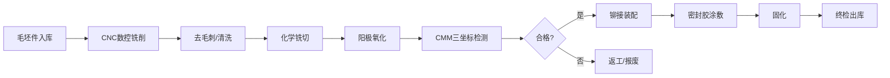

# 航空工业制造领域测试数据方案

**版本**：v1.0  
**日期**：2026年4月10日  
**关联文档**：关键技术验证计划 v1.0、技术方案文档 v1.0  
**领域**：航空工业制造（Aviation / Aerospace Manufacturing）  

---

## 目录

1. [航空制造领域特征分析](#1-航空制造领域特征分析)
2. [真实工厂参考基准](#2-真实工厂参考基准)
3. [三级测试产线定义](#3-三级测试产线定义)
4. [设备类型与工艺字典](#4-设备类型与工艺字典)
5. [DXF 测试底图生成脚本](#5-dxf-测试底图生成脚本)
6. [工艺约束测试数据（SOP片段）](#6-工艺约束测试数据sop片段)
7. [仿真参数校准基准](#7-仿真参数校准基准)
8. [附录：图层命名规范](#8-附录图层命名规范)

---

## 1. 航空制造领域特征分析

### 1.1 与通用制造的核心差异

| 维度 | 通用制造（汽车/电子） | 航空工业制造 |
|------|----------------------|-------------|
| **产品尺寸** | 数米级 | 十~百米级（机翼展长35m，机身长度38~73m） |
| **单站节拍** | 秒~分钟级 | 小时~天级（最终装配单站可达72h） |
| **批量** | 千~万级/年 | 数十~数百架/年（COMAC C919目标50架/年） |
| **精度要求** | mm级 | 0.01mm~0.1mm（蒙皮对接间隙≤0.3mm） |
| **产线模式** | 连续流水线 | **脉动式产线（Pulse Line）** / 固定站位装配 |
| **物料运输** | AGV/传送带 | 大型天车（26台@Boeing Everett）、AGV大件转运平台 |
| **环境管控** | 一般 | 洁净室（复合材料）、恒温恒湿、FOD管控区 |
| **安全区域** | 简单隔离 | 危化品区（密封剂、涂料）、射线检测(NDT禁区)、高压测试区 |
| **合规要求** | ISO 9001 | AS9100 + NADCAP + 适航条例(CAAC/FAA/EASA) |
| **厂房高度** | 6~12m | 25~35m（Boeing Everett柱高27m，门高25m） |
| **厂房跨度** | 18~36m | 60~100m+（容纳机翼展开） |

### 1.2 航空产线典型布局模式

#### 模式A：脉动式装配线（Pulse Line）

```
┌─────────────────────────────────────────────────────────┐
│                    主厂房（300m × 150m）                    │
│  ┌─────┐  ┌─────┐  ┌─────┐  ┌─────┐  ┌─────┐  ┌─────┐ │
│  │ ST-1 │→│ ST-2 │→│ ST-3 │→│ ST-4 │→│ ST-5 │→│ ST-6 │ │
│  │机身段│  │翼身对│  │系统安│  │地面测│  │喷漆站│  │交付准│ │
│  │对接  │  │接    │  │装    │  │试    │  │      │  │备    │ │
│  └──┬──┘  └──┬──┘  └──┬──┘  └──┬──┘  └──┬──┘  └──┬──┘ │
│     │        │        │        │        │        │      │
│  ===╤========╤========╤========╤========╤========╤===== │ ← 天车轨道
│     └────────┴────────┴────────┴────────┴────────┘      │
│              ↑ 脉动方向（每72h推进一个站位）                   │
└─────────────────────────────────────────────────────────┘
```

#### 模式B：固定站位装配（Boeing Everett风格）

```
┌─────────────────────────────────────────────────────────┐
│         主装配厂房（398,000 m², 高35m）                      │
│                                                         │
│  [767产线]  [777产线]  [777X产线]  [737MAX产线]             │
│   ↕ 隔墙      ↕ 隔墙      ↕ 隔墙       ↕                  │
│                                                         │
│  ─── 天车轨道（26台天车，50km轨道） ───                      │
│                                                         │
│  地下通道网络（3.75km）                                      │
│  共享自行车系统（1300辆）                                     │
└───────────┬─────────────────────────────────────────────┘
            │ 滑行道
            ↓
       [喷漆机库] → [飞行线] → [交付中心] → [跑道]
```

### 1.3 航空特有约束类型

| 约束类型 | 描述 | 系统影响 |
|----------|------|---------|
| **FOD管控区** | Foreign Object Debris，异物防护区域，要求封闭管理 | 布局时需设置隔离围栏和入口检查点 |
| **NADCAP特种工艺区** | 焊接、热处理、NDT等需专项认证区域 | 设备不可随意移动，需固定认证环境 |
| **适航冻结区** | 已通过适航认证的工艺区不可变更 | 布局优化时必须跳过此区域 |
| **EMC屏蔽区** | 航电测试需电磁兼容环境 | 周围不能放置大功率设备 |
| **恒温恒湿区** | 复合材料铺放/固化、精密测量 | 需HVAC系统隔离和气流方向控制 |
| **危化品隔离** | 密封剂、涂料、燃油系统测试 | 需防爆区、排风系统、安全距离 |
| **天车覆盖范围** | 大件吊装必须在天车行程范围内 | 大型组件站位必须位于天车轨道下方 |
| **高度限制** | 垂尾安装需≥15m净高 | 高大件装配站位需在高净空区域 |

---

## 2. 真实工厂参考基准

### 2.1 Boeing Everett Factory（世界最大飞机装配厂）

| 参数 | 数值 |
|------|------|
| **总占地** | 1,000英亩（400公顷） |
| **主厂房面积** | 98.3英亩（398,000 m²） |
| **厂房体积** | 472,370,319立方英尺（13,376,038 m³）—世界最大建筑 |
| **厂房高度** | 35m（114英尺） |
| **吊门尺寸** | 25m高 × 91~107m宽 × 6扇 |
| **天车数量** | 26台，轨道总长50km |
| **产线数量** | 6条（767、777、777X、737MAX） |
| **产线移动速度** | 1.5英寸/分钟（3.8cm/min） |
| **地下通道** | 3.75km隧道网络 |
| **员工** | 30,000人 / 3班制 |
| **建筑数量** | 200栋 |
| **复合材料翼厂** | 110,000 m² 独立厂房 |

### 2.2 Airbus A320 系列总装线

| 参数 | Toulouse (法) | Hamburg (德) | Tianjin (中) | Mobile (美) |
|------|-------------|-------------|-------------|-------------|
| **产品** | A320 | A318/A319/A321 | A319/A320/A321 | A320/A321 |
| **月产量** | ~25架 | ~15架 | ~6架 | ~5架 |
| **自动化** | 标准 | 4号线：7轴机器人 + AGV | 标准 | 标准 |
| **特色** | 原始FAL | 高度自动化 | 首个海外FAL | 美洲FAL |

### 2.3 COMAC C919 制造分工

| 部件 | 制造地 | 工艺特点 |
|------|--------|---------|
| 中央翼盒 / 外翼盒 / 翼面板 | 西安（AVIC西飞） | 大型结构件加工，铝锂合金8.8%、复合材料12% |
| 中机身段 | 南昌（AVIC洪都） | 大型对接装配 |
| 前/后机身 | 成都/沈阳 | 壁板铆接、蒙皮加工 |
| 总装配 | 上海浦东（COMAC） | 翼身对接、系统安装、测试 |
| **年产量目标** | 50架/年（2025） | 脉动式总装线 |

### 2.4 关键启示（用于测试数据设计）

> **设计3级测试产线所依据的真实尺度参照：**

| 复杂度 | 真实参照 | 面积量级 | 设备量级 |
|--------|---------|---------|---------|
| Tier-1 简单 | 单个机翼/尾翼部件车间 | 1,500~3,000 m² | 10~20台 |
| Tier-2 中等 | C919部段装配厂（洪都/西飞）| 8,000~15,000 m² | 40~80台 |
| Tier-3 复杂 | 脉动式最终总装线（COMAC浦东）| 30,000~50,000 m² | 150~300台 |

---

## 3. 三级测试产线定义

### 3.1 Tier-1：机翼前缘组件车间（简单）

**场景定位**：模拟一个航空结构件（机翼前缘）的零件加工与组装车间。

```
尺寸：60m × 30m × 8m（净高）
面积：1,800 m²
设备数：15台
工位数：6个
天车数：1台（5t桥式天车）
人员：20人/班
```

**布局草图**：

```
 60m
├──────────────────────────────────────────────────────┤
│                                                      │ 30m
│  ┌────┐  ┌────┐  ┌────┐       ┌──────────────┐     │
│  │CNC-1│  │CNC-2│  │CNC-3│       │ 检测间(CMM)   │     │
│  │数控铣│  │数控铣│  │钻铣复│       │ 恒温20±1°C   │     │ 
│  └────┘  └────┘  └────┘       └──────────────┘     │
│                                                      │
│  ═══════════════ 5t天车轨道 ═══════════════════      │
│                                                      │
│  ┌────┐  ┌────┐  ┌──────┐   ┌──────┐  ┌─────┐     │
│  │去毛刺│  │清洗站│  │化铣槽  │   │阳极氧│  │密封站│     │
│  │  W1  │  │  W2  │  │危化品区│   │化    │  │     │     │
│  └────┘  └────┘  └──────┘   └──────┘  └─────┘     │
│                                                      │
│  ┌────────────┐  ┌────────────┐                     │
│  │ 铆接工位×2   │  │ 胶接固化炉  │  [物料暂存区]       │
│  │ 手动+协作Bot │  │ 60°C~180°C │                     │
│  └────────────┘  └────────────┘                     │
│                                                      │
│  [入口] ─── [更衣间] ─── [FOD检查点] ─── [出口]      │
├──────────────────────────────────────────────────────┤
```

**工艺流程**：



**图层清单**：

| 图层名 | 颜色 | 线型 | 内容 |
|--------|------|------|------|
| `A-WALL` | 白 | Continuous | 墙体 |
| `A-COLS` | 灰 | Continuous | 柱网(6m×6m) |
| `E-CRANE` | 品红 | DASHED | 天车轨道与行程范围 |
| `M-EQUIP` | 青 | Continuous | 设备外形 |
| `M-EQUIP-SAFE` | 红 | DASHED | 设备安全区/维护区 |
| `P-FLOW` | 绿 | Continuous | 工艺路线（物流通道） |
| `S-ZONE-FOD` | 橙 | PHANTOM | FOD管控区边界 |
| `S-ZONE-CHEM` | 红 | PHANTOM | 危化品隔离区 |
| `S-ZONE-CLEAN` | 蓝 | PHANTOM | 恒温恒湿洁净区 |
| `T-TEXT` | 白 | Continuous | 标注与文字 |

---

### 3.2 Tier-2：机身段对接装配厂（中等）

**场景定位**：模拟C919中机身段在AVIC洪都的壁板铆接与段间对接装配。

```
尺寸：150m × 80m × 18m（净高）
面积：12,000 m²
设备数：55台
工位数：12个
天车数：4台（2×20t + 2×10t）
人员：120人/班
```

**布局草图**：

```
  150m
├──────────────────────────────────────────────────────────────────────┤
│                                                                      │ 80m
│  ====20t天车轨道-1==================================================│
│                                                                      │
│  ┌──────────┐  ┌──────────┐  ┌──────────┐  ┌──────────┐           │
│  │ 壁板铆接-1 │  │ 壁板铆接-2 │  │ 框段铆接-3 │  │ 框段铆接-4 │           │
│  │ 自动钻铆机 │  │ 自动钻铆机 │  │ 自动钻铆机 │  │ 手动铆接  │           │
│  │ (8m×4m)   │  │ (8m×4m)   │  │ (6m×4m)   │  │ (6m×3m)  │           │
│  └──────────┘  └──────────┘  └──────────┘  └──────────┘           │
│                                                                      │
│  ═══════════ 10t天车轨道-2 ════════════════════════════════         │
│                                                                      │
│  ┌──────────────────────────────────────────────┐                   │
│  │              段间对接工位（主站位）                 │                   │
│  │   ┌────────────────────────────┐              │                   │
│  │   │   对接型架(20m×6m×5m)       │              │                   │
│  │   │   机身段-1  ←→  机身段-2     │              │                   │
│  │   └────────────────────────────┘              │                   │
│  │   激光跟踪仪×2    数字化测量系统×1              │                   │
│  └──────────────────────────────────────────────┘                   │
│                                                                      │
│  ┌────────┐  ┌────────┐  ┌────────┐  ┌──────────────┐             │
│  │密封胶涂│  │ 清洗间  │  │ NDT检测│  │恒温检测间     │             │
│  │敷工位  │  │        │  │ (X射线) │  │(CMM+激光扫描)│             │
│  │        │  │        │  │⚠射线禁区│  │ 20±0.5°C     │             │
│  └────────┘  └────────┘  └────────┘  └──────────────┘             │
│                                                                      │
│  ═══════════ 20t天车轨道-3 ════════════════════════════════         │
│                                                                      │
│  ┌──────────┐  ┌──────────┐  ┌──────────┐  ┌──────────┐           │
│  │ 管路预装  │  │ 电缆布线  │  │ 系统集成  │  │ 功能测试  │           │
│  │ 工位-A   │  │ 工位-B   │  │ 工位-C   │  │ 工位-D   │           │
│  └──────────┘  └──────────┘  └──────────┘  └──────────┘           │
│                                                                      │
│  [大件进出口-1]              [AGV通道]             [大件进出口-2]      │
│  (12m×8m门)              ←──────────→              (12m×8m门)       │
├──────────────────────────────────────────────────────────────────────┤
```

**约束高亮**：

| 约束ID | 类型 | 描述 | 对布局的影响 |
|--------|------|------|-------------|
| C2-01 | 天车覆盖 | 段间对接工位必须在20t天车行程范围内 | 对接站位不可移出天车投影区域 |
| C2-02 | NDT禁区 | X射线检测运行时，周围15m为辐射禁区 | 禁区内不可安排其他工位 |
| C2-03 | 恒温区 | CMM检测间需20±0.5°C | 需远离热源设备（固化炉等） |
| C2-04 | 大件通道 | 机身段转运需净宽≥8m通道 | 主物流通道不可被设备占用 |
| C2-05 | 工艺顺序 | 壁板铆接 → 段间对接 → 系统安装 → 测试 | 工位布局需遵循工艺流向 |
| C2-06 | 密封剂时效 | 密封胶涂敷后4h内必须进入固化 | 密封站与固化间距离≤50m |
| C2-07 | 地面承重 | 对接型架区地面承重≥20t/m² | 需避开地下管沟区域 |
| C2-08 | 供电容量 | 自动钻铆机单台峰值功率150kW | 需靠近变电站分配柜 |

---

### 3.3 Tier-3：脉动式最终总装线（复杂）

**场景定位**：模拟类似COMAC C919浦东总装线的6站脉动式FAL（Final Assembly Line）。

```
尺寸：300m × 120m × 25m（净高）+ 附属区域200m × 60m
总面积：48,000 m²（含附属）
设备数：200+ 台
工位数：6个脉动站位 + 12个辅助站位
天车数：8台（4×30t + 4×10t）
AGV：6台大件转运平台（承重50t, 自动引导）
人员：500+人/班
```

**脉动总装线布局**：

```
 300m
├──────────────────────────────────────────────────────────────────────────────┤
│                        主总装厂房 (300m × 120m × 25m净高)                       │ 120m
│                                                                              │
│  ════════════════════ 30t天车轨道 A ══════════════════════════════════        │
│  ════════════════════ 30t天车轨道 B ══════════════════════════════════        │
│                                                                              │
│  ┌────────────┐  ┌────────────┐  ┌────────────┐  ┌────────────┐             │
│  │  Station-1   │  │  Station-2   │  │  Station-3   │  │  Station-4   │             │
│  │ 机身大部件   │  │ 翼身对接     │  │ 系统安装     │  │ 航电/内饰    │             │
│  │ 对接        │  │             │  │ (管路+电缆)  │  │ 安装        │             │
│  │             │  │ 起落架安装   │  │             │  │             │             │
│  │ [30m×25m]   │  │ [30m×25m]   │  │ [30m×25m]   │  │ [30m×25m]   │             │
│  │ 对接型架×2  │  │ 翼身工装×1  │  │ 工作平台×8  │  │ 工作平台×6  │             │
│  │ 激光跟踪仪×4│  │ 激光跟踪仪×2│  │ 扭矩枪×20  │  │ 测试设备×10 │             │
│  └──────┬─────┘  └──────┬─────┘  └──────┬─────┘  └──────┬─────┘             │
│  ──────┬┴──────────────┬┴──────────────┬┴──────────────┬┴───── AGV导引线     │
│        ↓                ↓                ↓                ↓                    │
│  ════════════════════ 10t天车轨道 C ══════════════════════════════════        │
│                                                                              │
│  ┌────────────┐  ┌────────────┐                                             │
│  │  Station-5   │  │  Station-6   │                                             │
│  │ 地面功能     │  │ 交付前检查   │                                             │
│  │ 测试(GFT)   │  │ 客户接收     │                                             │
│  │             │  │             │                                             │
│  │ [30m×25m]   │  │ [30m×25m]   │                                             │
│  │ 液压测试台×2│  │ 外观检查台×1│                                             │
│  │ 电气测试台×4│  │ 文件归档区×1│                                             │
│  └──────┬─────┘  └──────┬─────┘                                             │
│         │                │                                                    │
│  [大型铰链门 25m×100m]    └──→ [飞行线/跑道]                                  │
│                                                                              │
├──────────────────────────────────────────────────────────────────────────────┤
│                                                                              │
│               附属厂房 (200m × 60m)                                           │ 60m
│                                                                              │
│  ┌──────────┐ ┌──────────┐ ┌──────────┐ ┌──────────┐ ┌──────────┐         │
│  │ 复合材料   │ │ 喷漆机库  │ │ 发动机    │ │ 航电集成  │ │ 线缆预制  │         │
│  │ 铺放车间   │ │ (含排风)  │ │ 挂装区    │ │ 测试间    │ │ 车间      │         │
│  │ 🧊洁净室   │ │ ⚠防爆区  │ │          │ │ 📡屏蔽室  │ │          │         │
│  └──────────┘ └──────────┘ └──────────┘ └──────────┘ └──────────┘         │
│                                                                              │
│  ┌──────────┐ ┌──────────┐ ┌──────────┐ ┌────────────────────┐             │
│  │ 大型CMM   │ │ NDT中心   │ │ 密封胶    │ │ 动力站房             │             │
│  │ 检测间    │ │ (超声/X光)│ │ 配制间    │ │ (配电+空压+空调)     │             │
│  │ 🌡20±0.3° │ │ ⚠辐射区  │ │ ⚠危化品  │ │                    │             │
│  └──────────┘ └──────────┘ └──────────┘ └────────────────────┘             │
│                                                                              │
├──────────────────────────────────────────────────────────────────────────────┤
```

**脉动运行参数**：

| 参数 | 数值 |
|------|------|
| 脉动节拍 | 72小时（3天/站位） |
| 转运方式 | AGV大件平台（50t承重、激光导航） |
| 转运时间 | ≤2小时/次 |
| 并行飞机 | 6架（每站1架） |
| 年产量 | ~50架（300天 × 6站 ÷ 3天/节拍 ÷ 6站 = ~50架） |
| 脉动距离 | 约35m/次（站间距） |

**关键约束矩阵**：

| ID | 约束 | 类型 | 硬/软 | 描述 |
|----|------|------|-------|------|
| C3-01 | 脉动通道净空 | 空间 | 硬 | AGV通道宽≥10m, 高≥6m, 地面平整度±2mm |
| C3-02 | 天车独占 | 时序 | 硬 | 30t天车同一时间只服务一个站位 |
| C3-03 | 翼身对接精度 | 工艺 | 硬 | 使用激光跟踪仪，环境振动≤0.02mm |
| C3-04 | 复合材料恒温 | 环境 | 硬 | 铺放间温度23±2°C, 湿度≤65%RH |
| C3-05 | 喷漆排风 | 安全 | 硬 | 喷漆区需负压设计，VOC排放达标 |
| C3-06 | NDT排期 | 时序 | 软 | X射线检测夜班执行，减少辐射禁区时间 |
| C3-07 | 生产顺序 | 工艺 | 硬 | Station 1→2→3→4→5→6 不可跳站 |
| C3-08 | 发动机挂装 | 空间 | 硬 | 需30t天车 + 发动机专用挂装工装 |
| C3-09 | EMC测试 | 环境 | 硬 | 航电测试间2m屏蔽墙，测试时禁入 |
| C3-10 | 消防通道 | 安全 | 硬 | 每50m设消防通道，宽≥4m |

---

## 4. 设备类型与工艺字典

### 4.1 航空制造设备分类

```yaml
equipment_types:
  # === 机加工 ===
  cnc_5axis_mill:
    name: "五轴数控铣床"
    name_en: "5-Axis CNC Milling Machine"
    footprint: [6.0, 4.0]     # 长×宽(m)
    height: 3.5
    weight: 15000              # kg
    power: 80                  # kW
    safety_zone: 1.5           # m, 操作安全区
    process: ["milling", "profiling"]
    noise_db: 85
    
  cnc_drill_rivet:
    name: "自动钻铆机"
    name_en: "Automatic Drilling & Riveting Machine"
    footprint: [8.0, 4.0]
    height: 5.0
    weight: 25000
    power: 150
    safety_zone: 2.0
    process: ["drilling", "riveting"]
    noise_db: 95
    nadcap_required: true
    
  # === 成型/处理 ===
  autoclave:
    name: "热压罐（复合材料固化）"
    name_en: "Autoclave"
    footprint: [15.0, 5.0]
    height: 5.0
    weight: 80000
    power: 500
    safety_zone: 3.0
    process: ["curing"]
    temperature_range: [100, 400]  # °C
    cleanroom_required: false
    
  chemical_mill:
    name: "化学铣切槽"
    name_en: "Chemical Milling Tank"
    footprint: [8.0, 3.0]
    height: 2.5
    weight: 5000
    power: 20
    safety_zone: 3.0
    process: ["chemical_milling"]
    hazmat_zone: true
    ventilation_required: true
    
  anodize_tank:
    name: "阳极氧化槽"
    name_en: "Anodizing Tank"
    footprint: [6.0, 2.5]
    height: 2.0
    weight: 3000
    power: 60
    safety_zone: 2.0
    process: ["surface_treatment"]
    hazmat_zone: true
    
  paint_booth:
    name: "喷漆室"
    name_en: "Paint Booth / Spray Booth"
    footprint: [40.0, 15.0]     # 容纳整机
    height: 12.0
    weight: 50000
    power: 200
    safety_zone: 5.0
    process: ["painting", "coating"]
    hazmat_zone: true
    explosion_proof: true
    negative_pressure: true
    
  # === 装配 ===
  fuselage_jig:
    name: "机身对接型架"
    name_en: "Fuselage Join Jig / Fixture"
    footprint: [20.0, 6.0]
    height: 6.0
    weight: 30000
    power: 5
    safety_zone: 3.0
    process: ["assembly", "joining"]
    crane_required: "30t"
    
  wing_body_jig:
    name: "翼身对接工装"
    name_en: "Wing-Body Join Jig"
    footprint: [40.0, 8.0]
    height: 8.0
    weight: 45000
    power: 10
    safety_zone: 5.0
    process: ["assembly"]
    crane_required: "30t"
    vibration_limit: 0.02       # mm
    
  work_platform:
    name: "高空作业平台(对接专用)"
    name_en: "Assembly Work Platform / Dock"
    footprint: [10.0, 5.0]
    height: 12.0
    weight: 8000
    power: 5
    safety_zone: 2.0
    process: ["assembly", "installation"]
    
  # === 检测 ===
  cmm:
    name: "三坐标测量机"
    name_en: "Coordinate Measuring Machine"
    footprint: [4.0, 3.0]
    height: 3.0
    weight: 8000
    power: 5
    safety_zone: 1.0
    process: ["inspection"]
    temperature_control: [19.5, 20.5]  # °C
    humidity_max: 55                    # %RH
    
  laser_tracker:
    name: "激光跟踪仪"
    name_en: "Laser Tracker"
    footprint: [1.0, 1.0]
    height: 1.8
    weight: 50
    power: 0.5
    safety_zone: 0.5
    process: ["metrology"]
    vibration_limit: 0.01
    
  ndt_xray:
    name: "X射线无损检测设备"
    name_en: "X-Ray NDT System"
    footprint: [6.0, 4.0]
    height: 3.5
    weight: 12000
    power: 100
    safety_zone: 15.0           # 辐射安全距离
    process: ["ndt"]
    radiation_zone: true
    night_shift_preferred: true
    
  ndt_ultrasonic:
    name: "超声波无损检测"
    name_en: "Ultrasonic NDT System"
    footprint: [3.0, 2.0]
    height: 2.0
    weight: 500
    power: 5
    safety_zone: 1.0
    process: ["ndt"]
    
  # === 运输 ===
  overhead_crane_30t:
    name: "30吨桥式天车"
    name_en: "30t Overhead Bridge Crane"
    footprint: [0, 0]          # 轨道型，无地面占用
    height: 0                  # 安装于厂房顶部
    weight: 0
    power: 100
    rail_span: 30.0            # 跨度(m)
    travel_length: 150.0       # 行程(m)
    
  agv_heavy:
    name: "重载AGV转运平台"
    name_en: "Heavy-Duty AGV Transfer Platform"
    footprint: [12.0, 6.0]
    height: 0.8                # 平台高度
    weight: 5000
    power: 30
    payload: 50000             # 50t承重
    speed: 0.05                # m/s
    guidance: "laser"
```

### 4.2 工艺流程模板

| 产品类型 | 典型工序数 | 关键工艺 | 总周期 |
|----------|----------|---------|--------|
| 机翼前缘蒙皮 | 8~10 | 数铣→化铣→阳极→铆接→密封→固化 | 5~8天 |
| 机身壁板 | 10~15 | 蒙皮铣削→长桁加工→铆接→检测→密封 | 10~15天 |
| 机身段对接 | 6~8 | 段间对接→钻孔→铆接→密封→系统安装→测试 | 15~20天 |
| 总装配（C919级） | 6站×72h | 机身对接→翼身对接→系统安装→航电→GFT→交付 | 18天/架 |

---

## 5. DXF 测试底图生成脚本

### 5.1 概述

使用 `ezdxf` Python库生成符合航空制造场景的参数化DXF测试底图。每个层级生成独立文件，图层命名遵循附录规范。

### 5.2 Tier-1 生成脚本

```python
"""
航空制造测试底图生成器 - Tier-1: 机翼前缘组件车间
文件: test_data/generate_tier1.py

生成内容:
- 60m × 30m 厂房
- 6m×6m 柱网
- 15台设备（4种类型）
- 1条天车轨道
- FOD管控区、危化品区、恒温区
- 工艺流线
"""
import ezdxf
from ezdxf.enums import TextEntityAlignment
import math

def create_tier1_factory():
    doc = ezdxf.new('R2010')
    msp = doc.modelspace()
    
    # ========== 颜色定义 ==========
    WHITE, GRAY, RED, GREEN, BLUE, CYAN = 7, 8, 1, 3, 5, 4
    MAGENTA, ORANGE, YELLOW = 6, 30, 2
    
    # ========== 图层创建 ==========
    layers = {
        'A-WALL':        {'color': WHITE, 'linetype': 'Continuous'},
        'A-COLS':        {'color': GRAY,  'linetype': 'Continuous'},
        'A-DOOR':        {'color': WHITE, 'linetype': 'Continuous'},
        'E-CRANE':       {'color': MAGENTA, 'linetype': 'DASHED'},
        'M-EQUIP':       {'color': CYAN,  'linetype': 'Continuous'},
        'M-EQUIP-SAFE':  {'color': RED,   'linetype': 'DASHED'},
        'M-EQUIP-LABEL': {'color': WHITE, 'linetype': 'Continuous'},
        'P-FLOW':        {'color': GREEN, 'linetype': 'Continuous'},
        'S-ZONE-FOD':    {'color': ORANGE,'linetype': 'PHANTOM'},
        'S-ZONE-CHEM':   {'color': RED,   'linetype': 'PHANTOM'},
        'S-ZONE-CLEAN':  {'color': BLUE,  'linetype': 'PHANTOM'},
        'T-TEXT':        {'color': WHITE, 'linetype': 'Continuous'},
        'T-DIM':         {'color': YELLOW,'linetype': 'Continuous'},
    }
    
    for name, props in layers.items():
        doc.layers.add(name, color=props['color'])
    
    # ========== 参数 ==========
    W, H = 60.0, 30.0      # 厂房宽度、深度 (m)
    GRID = 6.0              # 柱网间距 (m)
    COL_SIZE = 0.5          # 柱截面 (m)
    WALL_THICK = 0.3        # 墙厚 (m)
    
    # ========== 墙体 ==========
    # 外墙 (矩形)
    wall_pts = [(0, 0), (W, 0), (W, H), (0, H), (0, 0)]
    msp.add_lwpolyline(wall_pts, dxfattribs={'layer': 'A-WALL', 'const_width': WALL_THICK})
    
    # ========== 柱网 ==========
    for x in range(0, int(W/GRID) + 1):
        for y in range(0, int(H/GRID) + 1):
            cx, cy = x * GRID, y * GRID
            if 0 < cx < W and 0 < cy < H:  # 跳过外墙上的柱子
                half = COL_SIZE / 2
                msp.add_lwpolyline(
                    [(cx-half, cy-half), (cx+half, cy-half), 
                     (cx+half, cy+half), (cx-half, cy+half), (cx-half, cy-half)],
                    close=True,
                    dxfattribs={'layer': 'A-COLS'}
                )
    
    # ========== 门 ==========
    doors = [
        (0, 3, 0, 6, "入口"),         # 左墙, y=3~6
        (W, 12, W, 18, "大件出入口"),   # 右墙
        (30, 0, 34, 0, "消防门"),      # 底墙
    ]
    for x1, y1, x2, y2, label in doors:
        msp.add_line((x1, y1), (x2, y2), dxfattribs={'layer': 'A-DOOR', 'color': 3})
        msp.add_text(label, height=0.4, 
                     dxfattribs={'layer': 'T-TEXT'}).set_placement(
            ((x1+x2)/2, (y1+y2)/2 + 0.8), align=TextEntityAlignment.MIDDLE_CENTER)
    
    # ========== 天车轨道 ==========
    crane_y1, crane_y2 = 12.0, 12.0
    # 天车轨道（两根平行线代表导轨）
    msp.add_line((3, crane_y1), (57, crane_y2), 
                 dxfattribs={'layer': 'E-CRANE'})
    msp.add_line((3, crane_y1 + 0.6), (57, crane_y2 + 0.6), 
                 dxfattribs={'layer': 'E-CRANE'})
    # 天车行程范围 (矩形虚线)
    msp.add_lwpolyline(
        [(3, 6), (57, 6), (57, 18), (3, 18), (3, 6)],
        dxfattribs={'layer': 'E-CRANE'}
    )
    msp.add_text("5T桥式天车行程范围", height=0.6,
                 dxfattribs={'layer': 'E-CRANE'}).set_placement(
        (30, 17), align=TextEntityAlignment.MIDDLE_CENTER)
    
    # ========== 设备定义 ==========
    # (x, y, w, h, name, equip_id, safety_zone, layer_suffix)
    equipment = [
        # CNC区
        (4, 20, 4, 3, "CNC-5轴铣-01", "EQ-001", 1.0, None),
        (12, 20, 4, 3, "CNC-5轴铣-02", "EQ-002", 1.0, None),
        (20, 20, 4, 3, "CNC-钻铣-03",  "EQ-003", 1.0, None),
        # 处理区
        (4, 2, 3, 2.5, "去毛刺-W1",    "EQ-004", 0.8, None),
        (10, 2, 3, 2.5, "清洗站-W2",    "EQ-005", 0.8, None),
        (16, 2, 5, 3, "化铣槽",         "EQ-006", 2.0, "CHEM"),
        (24, 2, 4, 2.5, "阳极氧化",     "EQ-007", 1.5, "CHEM"),
        (31, 2, 3, 2.5, "密封站",       "EQ-008", 1.0, None),
        # 装配区
        (4, 7, 8, 3, "铆接工位×2",      "EQ-009", 1.5, None),
        (16, 7, 6, 3, "胶接固化炉",     "EQ-010", 2.0, None),
        # 检测区 (恒温)
        (38, 20, 8, 6, "CMM检测间",     "EQ-011", 1.0, "CLEAN"),
    ]
    
    for x, y, w, h, name, eq_id, sz, zone_type in equipment:
        # 设备主体
        msp.add_lwpolyline(
            [(x, y), (x+w, y), (x+w, y+h), (x, y+h), (x, y)],
            close=True,
            dxfattribs={'layer': 'M-EQUIP'}
        )
        # 安全区
        msp.add_lwpolyline(
            [(x-sz, y-sz), (x+w+sz, y-sz), (x+w+sz, y+h+sz), 
             (x-sz, y+h+sz), (x-sz, y-sz)],
            close=True,
            dxfattribs={'layer': 'M-EQUIP-SAFE'}
        )
        # 设备标签
        msp.add_text(f"{eq_id}: {name}", height=0.35,
                     dxfattribs={'layer': 'M-EQUIP-LABEL'}).set_placement(
            (x + w/2, y + h/2), align=TextEntityAlignment.MIDDLE_CENTER)
    
    # ========== 功能分区 ==========
    # FOD管控区（整个车间）
    msp.add_lwpolyline(
        [(1, 1), (59, 1), (59, 29), (1, 29), (1, 1)],
        dxfattribs={'layer': 'S-ZONE-FOD'}
    )
    msp.add_text("FOD管控区", height=0.5,
                 dxfattribs={'layer': 'S-ZONE-FOD'}).set_placement(
        (55, 28), align=TextEntityAlignment.MIDDLE_CENTER)
    
    # 危化品区（化铣+阳极氧化区域）
    msp.add_lwpolyline(
        [(14, 0.5), (30, 0.5), (30, 6.5), (14, 6.5), (14, 0.5)],
        dxfattribs={'layer': 'S-ZONE-CHEM'}
    )
    msp.add_text("⚠ 危化品隔离区", height=0.4,
                 dxfattribs={'layer': 'S-ZONE-CHEM'}).set_placement(
        (22, 6.2), align=TextEntityAlignment.MIDDLE_CENTER)
    
    # 恒温洁净区（CMM检测间）
    msp.add_lwpolyline(
        [(36, 18.5), (48, 18.5), (48, 28), (36, 28), (36, 18.5)],
        dxfattribs={'layer': 'S-ZONE-CLEAN'}
    )
    msp.add_text("恒温检测区 20±1°C", height=0.4,
                 dxfattribs={'layer': 'S-ZONE-CLEAN'}).set_placement(
        (42, 27.5), align=TextEntityAlignment.MIDDLE_CENTER)
    
    # ========== 工艺流线 ==========
    flow_points = [
        (0, 4.5),      # 入口
        (6, 21.5),      # CNC-1
        (14, 21.5),     # CNC-2
        (22, 21.5),     # CNC-3
        (5.5, 3.25),    # 去毛刺
        (11.5, 3.25),   # 清洗
        (18.5, 3.5),    # 化铣
        (26, 3.25),     # 阳极氧化
        (42, 23),       # CMM
        (8, 8.5),       # 铆接
        (32.5, 3.25),   # 密封
        (19, 8.5),      # 固化
        (60, 15),       # 出口
    ]
    msp.add_lwpolyline(flow_points, dxfattribs={'layer': 'P-FLOW'})
    
    # ========== 导出 ==========
    filename = "tier1_wing_leading_edge_workshop.dxf"
    doc.saveas(filename)
    print(f"[OK] Tier-1 DXF generated: {filename}")
    print(f"     Size: {W}m × {H}m = {W*H:.0f} m²")
    print(f"     Equipment: {len(equipment)} items")
    print(f"     Layers: {len(layers)} layers")
    return filename

if __name__ == '__main__':
    create_tier1_factory()
```

### 5.3 Tier-2 生成脚本

```python
"""
航空制造测试底图生成器 - Tier-2: 机身段对接装配厂
文件: test_data/generate_tier2.py

生成内容:
- 150m × 80m 厂房
- 10m×10m 柱网
- 55台设备
- 4条天车轨道
- 段间对接主站位
- NDT辐射禁区、恒温区、危化品区
"""
import ezdxf
from ezdxf.enums import TextEntityAlignment
import random

def create_tier2_factory():
    doc = ezdxf.new('R2010')
    msp = doc.modelspace()
    
    # 图层定义
    layer_defs = {
        'A-WALL':        7,  'A-COLS':         8,  'A-DOOR':       3,
        'E-CRANE-20T':   6,  'E-CRANE-10T':    6,
        'M-EQUIP':       4,  'M-EQUIP-SAFE':   1,  'M-EQUIP-LABEL': 7,
        'P-FLOW-MAIN':   3,  'P-FLOW-AGV':    30,
        'S-ZONE-FOD':   30,  'S-ZONE-CHEM':    1,  'S-ZONE-CLEAN':  5,
        'S-ZONE-NDT':    1,  'S-ZONE-FIRE':    1,
        'T-TEXT':         7,  'T-DIM':          2,
    }
    for name, color in layer_defs.items():
        doc.layers.add(name, color=color)
    
    W, H = 150.0, 80.0
    GRID = 10.0
    
    # ========== 墙体+柱网 ==========
    msp.add_lwpolyline(
        [(0,0),(W,0),(W,H),(0,H),(0,0)], 
        dxfattribs={'layer':'A-WALL','const_width':0.4}
    )
    for x in range(0, int(W/GRID)+1):
        for y in range(0, int(H/GRID)+1):
            cx, cy = x * GRID, y * GRID
            if 0 < cx < W and 0 < cy < H:
                s = 0.35
                msp.add_lwpolyline(
                    [(cx-s,cy-s),(cx+s,cy-s),(cx+s,cy+s),(cx-s,cy+s),(cx-s,cy-s)],
                    close=True, dxfattribs={'layer':'A-COLS'}
                )
    
    # ========== 大门 ==========
    doors_data = [
        (0, 30, 0, 42, 12, "大件进口-1"),
        (W, 30, W, 42, 12, "大件进口-2"),
        (60, 0, 68, 0, 8,  "人员入口"),
        (100, 0, 106, 0, 6, "消防出口"),
    ]
    for x1,y1,x2,y2,_,label in doors_data:
        msp.add_line((x1,y1),(x2,y2), dxfattribs={'layer':'A-DOOR'})
        msp.add_text(label, height=0.8, dxfattribs={'layer':'T-TEXT'}).set_placement(
            ((x1+x2)/2, (y1+y2)/2+1.5), align=TextEntityAlignment.MIDDLE_CENTER)
    
    # ========== 天车轨道 ==========
    crane_tracks = [
        ('E-CRANE-20T', 68, 3, 147, "20T天车-A"),
        ('E-CRANE-10T', 38, 3, 147, "10T天车-B"),
        ('E-CRANE-20T', 20, 3, 147, "20T天车-C"),
        ('E-CRANE-10T', 55, 3, 100, "10T天车-D"),
    ]
    for layer, y_pos, x_start, x_end, label in crane_tracks:
        msp.add_line((x_start,y_pos),(x_end,y_pos), dxfattribs={'layer':layer})
        msp.add_line((x_start,y_pos+0.8),(x_end,y_pos+0.8), dxfattribs={'layer':layer})
        msp.add_text(label, height=0.6, dxfattribs={'layer':layer}).set_placement(
            ((x_start+x_end)/2, y_pos+2), align=TextEntityAlignment.MIDDLE_CENTER)
    
    # ========== 设备布局 ==========
    equipment_list = []
    
    # 壁板铆接区 (y=60~75)
    rivet_machines = [
        (10, 62, 8, 4, "自动钻铆机-01", "EQ-201"),
        (22, 62, 8, 4, "自动钻铆机-02", "EQ-202"),
        (34, 62, 6, 4, "框段铆接机-03", "EQ-203"),
        (44, 62, 6, 3, "手动铆接台-04", "EQ-204"),
    ]
    equipment_list.extend(rivet_machines)
    
    # 段间对接主站位 (y=40~55)
    join_station = [
        (30, 42, 20, 6, "对接型架(20m×6m)", "EQ-210"),
        (25, 50, 2, 1.5, "激光跟踪仪-L", "EQ-211"),
        (52, 50, 2, 1.5, "激光跟踪仪-R", "EQ-212"),
        (35, 50, 3, 1.5, "数字测量系统", "EQ-213"),
    ]
    equipment_list.extend(join_station)
    
    # 处理区 (y=25~35)
    treatment = [
        (10, 26, 5, 4, "密封胶涂敷工位", "EQ-220"),
        (20, 26, 4, 3, "清洗间", "EQ-221"),
        (30, 26, 6, 4, "NDT-X射线", "EQ-222"),
        (45, 26, 8, 6, "恒温检测间(CMM)", "EQ-223"),
    ]
    equipment_list.extend(treatment)
    
    # 系统安装区 (y=8~18)
    sys_install = [
        (10, 10, 8, 5, "管路预装工位-A", "EQ-230"),
        (25, 10, 8, 5, "电缆布线工位-B", "EQ-231"),
        (40, 10, 8, 5, "系统集成工位-C", "EQ-232"),
        (55, 10, 8, 5, "功能测试工位-D", "EQ-233"),
    ]
    equipment_list.extend(sys_install)
    
    # 辅助设备（散布）
    auxiliary = [
        (70, 62, 4, 3, "工具库", "EQ-240"),
        (80, 62, 3, 3, "紧固件库", "EQ-241"),
        (90, 62, 5, 4, "工艺准备间", "EQ-242"),
        (70, 26, 4, 4, "密封胶配制间", "EQ-243"),
        (80, 10, 6, 4, "液压测试台", "EQ-244"),
        (95, 10, 6, 4, "气密测试台", "EQ-245"),
    ]
    equipment_list.extend(auxiliary)
    
    # 绘制所有设备
    for x, y, w, h, name, eq_id in equipment_list:
        sz = 1.5  # 默认安全区
        msp.add_lwpolyline(
            [(x,y),(x+w,y),(x+w,y+h),(x,y+h),(x,y)],
            close=True, dxfattribs={'layer':'M-EQUIP'}
        )
        msp.add_lwpolyline(
            [(x-sz,y-sz),(x+w+sz,y-sz),(x+w+sz,y+h+sz),(x-sz,y+h+sz),(x-sz,y-sz)],
            close=True, dxfattribs={'layer':'M-EQUIP-SAFE'}
        )
        msp.add_text(f"{eq_id}\n{name}", height=0.5,
                     dxfattribs={'layer':'M-EQUIP-LABEL'}).set_placement(
            (x+w/2, y+h/2), align=TextEntityAlignment.MIDDLE_CENTER)
    
    # ========== NDT辐射禁区 ==========
    ndt_x, ndt_y = 30, 26
    ndt_r = 15.0  # 15m辐射安全距离
    msp.add_circle((ndt_x+3, ndt_y+2), ndt_r, dxfattribs={'layer':'S-ZONE-NDT'})
    msp.add_text("⚠ X射线辐射禁区(15m)", height=0.6,
                 dxfattribs={'layer':'S-ZONE-NDT'}).set_placement(
        (ndt_x+3, ndt_y+2+ndt_r+1), align=TextEntityAlignment.MIDDLE_CENTER)
    
    # ========== 恒温区 ==========
    msp.add_lwpolyline(
        [(43,24),(55,24),(55,34),(43,34),(43,24)],
        dxfattribs={'layer':'S-ZONE-CLEAN'}
    )
    msp.add_text("恒温检测区 20±0.5°C", height=0.5,
                 dxfattribs={'layer':'S-ZONE-CLEAN'}).set_placement(
        (49, 33.5), align=TextEntityAlignment.MIDDLE_CENTER)
    
    # ========== AGV通道 ==========
    msp.add_lwpolyline(
        [(3,36),(147,36),(147,40),(3,40),(3,36)],
        dxfattribs={'layer':'P-FLOW-AGV'}
    )
    msp.add_text("AGV大件转运通道 (净宽4m, 承重50t)", height=0.5,
                 dxfattribs={'layer':'P-FLOW-AGV'}).set_placement(
        (75, 38), align=TextEntityAlignment.MIDDLE_CENTER)
    
    # ========== 消防通道 ==========
    for fx in [50, 100]:
        msp.add_lwpolyline(
            [(fx,0),(fx+4,0),(fx+4,H),(fx,H),(fx,0)],
            dxfattribs={'layer':'S-ZONE-FIRE'}
        )
    
    # 导出
    filename = "tier2_fuselage_join_facility.dxf"
    doc.saveas(filename)
    print(f"[OK] Tier-2 DXF generated: {filename}")
    print(f"     Size: {W}m × {H}m = {W*H:.0f} m²")
    print(f"     Equipment: {len(equipment_list)} items")
    return filename

if __name__ == '__main__':
    create_tier2_factory()
```

### 5.4 Tier-3 生成脚本（简化版）

```python
"""
航空制造测试底图生成器 - Tier-3: 脉动式最终总装线
文件: test_data/generate_tier3.py

由于Tier-3复杂度较高(200+设备)，此处提供参数化框架，
通过配置文件驱动完整生成。
"""
import ezdxf
from ezdxf.enums import TextEntityAlignment
import json

# ========== 脉动站位配置 ==========
PULSE_STATIONS = [
    {
        "id": "ST-1", "name": "机身大部件对接",
        "position": (20, 60), "size": (30, 25),
        "equipment": [
            {"name": "对接型架-前机身",  "size": (12, 5), "offset": (2, 3)},
            {"name": "对接型架-后机身",  "size": (12, 5), "offset": (2, 12)},
            {"name": "激光跟踪仪×4",    "size": (1, 1),  "offset": (25, 5)},
            {"name": "高空作业平台×4",   "size": (8, 4),  "offset": (2, 19)},
            {"name": "临时紧固工具车",   "size": (2, 1),  "offset": (15, 3)},
        ]
    },
    {
        "id": "ST-2", "name": "翼身对接+起落架",
        "position": (55, 60), "size": (30, 25),
        "equipment": [
            {"name": "翼身对接工装",     "size": (25, 6), "offset": (2, 5)},
            {"name": "起落架安装台",     "size": (6, 4),  "offset": (2, 15)},
            {"name": "激光跟踪仪×2",    "size": (1, 1),  "offset": (28, 3)},
            {"name": "液压预充注台",     "size": (3, 2),  "offset": (12, 19)},
        ]
    },
    {
        "id": "ST-3", "name": "系统安装(管路+电缆)",
        "position": (90, 60), "size": (30, 25),
        "equipment": [
            {"name": "管路安装平台×4",   "size": (6, 5),  "offset": (2, 3)},
            {"name": "线束铺设平台×4",   "size": (6, 5),  "offset": (2, 12)},
            {"name": "扭矩工具站×10",   "size": (3, 2),  "offset": (20, 3)},
            {"name": "气密测试接口",     "size": (4, 2),  "offset": (20, 15)},
        ]
    },
    {
        "id": "ST-4", "name": "航电/内饰安装",
        "position": (125, 60), "size": (30, 25),
        "equipment": [
            {"name": "航电安装平台×3",   "size": (8, 4),  "offset": (2, 3)},
            {"name": "内饰安装平台×3",   "size": (8, 4),  "offset": (2, 12)},
            {"name": "功能测试设备×5",   "size": (4, 3),  "offset": (20, 3)},
            {"name": "座椅安装设备",     "size": (6, 3),  "offset": (20, 15)},
        ]
    },
    {
        "id": "ST-5", "name": "地面功能测试(GFT)",
        "position": (20, 20), "size": (30, 25),
        "equipment": [
            {"name": "液压测试台×2",     "size": (6, 4),  "offset": (2, 3)},
            {"name": "电气测试台×4",     "size": (4, 3),  "offset": (2, 12)},
            {"name": "燃油系统测试",     "size": (5, 4),  "offset": (15, 3)},
            {"name": "环控系统测试",     "size": (5, 3),  "offset": (15, 12)},
            {"name": "飞控系统测试",     "size": (4, 3),  "offset": (22, 18)},
        ]
    },
    {
        "id": "ST-6", "name": "交付前检查",
        "position": (55, 20), "size": (30, 25),
        "equipment": [
            {"name": "外观检查台",       "size": (20, 8), "offset": (5, 3)},
            {"name": "文档归档区",       "size": (6, 4),  "offset": (5, 15)},
            {"name": "客户验收接待",     "size": (8, 5),  "offset": (18, 15)},
        ]
    },
]

# ========== 附属厂房设施 ==========
AUXILIARY_FACILITIES = [
    {"name": "复合材料铺放车间(洁净室)", "position": (10, -50),  "size": (30, 20), "zone": "CLEAN"},
    {"name": "喷漆机库(防爆区)",         "position": (45, -50),  "size": (40, 15), "zone": "CHEM"},
    {"name": "发动机挂装区",             "position": (90, -50),  "size": (25, 15), "zone": None},
    {"name": "航电集成测试间(EMC屏蔽)",  "position": (120, -50), "size": (20, 15), "zone": "EMC"},
    {"name": "线缆预制车间",             "position": (145, -50), "size": (25, 15), "zone": None},
    {"name": "大型CMM检测间(恒温)",      "position": (10, -75),  "size": (20, 15), "zone": "CLEAN"},
    {"name": "NDT中心(X光+超声)",        "position": (35, -75),  "size": (25, 15), "zone": "NDT"},
    {"name": "密封胶配制间(危化品)",     "position": (65, -75),  "size": (15, 10), "zone": "CHEM"},
    {"name": "动力站房(配电+空压+空调)", "position": (85, -75),  "size": (40, 15), "zone": None},
]

def create_tier3_factory():
    doc = ezdxf.new('R2010')
    msp = doc.modelspace()
    
    # 图层
    layer_defs = {
        'A-WALL': 7, 'A-COLS': 8, 'A-DOOR': 3,
        'E-CRANE-30T': 6, 'E-CRANE-10T': 6,
        'M-EQUIP': 4, 'M-EQUIP-SAFE': 1, 'M-EQUIP-LABEL': 7,
        'P-FLOW-PULSE': 3, 'P-FLOW-AGV': 30,
        'S-ZONE-FOD': 30, 'S-ZONE-CHEM': 1, 'S-ZONE-CLEAN': 5,
        'S-ZONE-NDT': 1, 'S-ZONE-EMC': 6, 'S-ZONE-FIRE': 1,
        'T-TEXT': 7, 'T-DIM': 2, 'T-STATION': 3,
    }
    for name, color in layer_defs.items():
        doc.layers.add(name, color=color)
    
    MAIN_W, MAIN_H = 300.0, 120.0
    
    # 主厂房
    msp.add_lwpolyline(
        [(0,0),(MAIN_W,0),(MAIN_W,MAIN_H),(0,MAIN_H),(0,0)],
        dxfattribs={'layer':'A-WALL', 'const_width':0.5}
    )
    
    # 柱网 (12m×12m)
    for x in range(0, int(MAIN_W/12)+1):
        for y in range(0, int(MAIN_H/12)+1):
            cx, cy = x*12, y*12
            if 0 < cx < MAIN_W and 0 < cy < MAIN_H:
                s = 0.4
                msp.add_lwpolyline(
                    [(cx-s,cy-s),(cx+s,cy-s),(cx+s,cy+s),(cx-s,cy+s),(cx-s,cy-s)],
                    close=True, dxfattribs={'layer':'A-COLS'}
                )
    
    # 天车轨道 (30t × 2, 10t × 2)
    for y_pos, label, layer in [
        (95, "30T天车轨道-A", 'E-CRANE-30T'),
        (90, "30T天车轨道-B", 'E-CRANE-30T'),
        (55, "10T天车轨道-C", 'E-CRANE-10T'),
        (50, "10T天车轨道-D", 'E-CRANE-10T'),
    ]:
        msp.add_line((5,y_pos),(MAIN_W-5,y_pos), dxfattribs={'layer':layer})
        msp.add_text(label, height=0.8, dxfattribs={'layer':layer}).set_placement(
            (MAIN_W/2, y_pos+1.5), align=TextEntityAlignment.MIDDLE_CENTER)
    
    # 脉动站位
    eq_count = 0
    for station in PULSE_STATIONS:
        sx, sy = station['position']
        sw, sh = station['size']
        
        # 站位边界
        msp.add_lwpolyline(
            [(sx,sy),(sx+sw,sy),(sx+sw,sy+sh),(sx,sy+sh),(sx,sy)],
            dxfattribs={'layer':'T-STATION', 'const_width':0.2}
        )
        # 站位标签
        msp.add_text(f"{station['id']}: {station['name']}", height=1.0,
                     dxfattribs={'layer':'T-STATION'}).set_placement(
            (sx+sw/2, sy+sh-2), align=TextEntityAlignment.MIDDLE_CENTER)
        
        # 站位内设备
        for eq in station['equipment']:
            ex = sx + eq['offset'][0]
            ey = sy + eq['offset'][1]
            ew, eh = eq['size']
            eq_count += 1
            
            msp.add_lwpolyline(
                [(ex,ey),(ex+ew,ey),(ex+ew,ey+eh),(ex,ey+eh),(ex,ey)],
                close=True, dxfattribs={'layer':'M-EQUIP'}
            )
            msp.add_text(eq['name'], height=0.4,
                         dxfattribs={'layer':'M-EQUIP-LABEL'}).set_placement(
                (ex+ew/2, ey+eh/2), align=TextEntityAlignment.MIDDLE_CENTER)
    
    # AGV脉动通道
    msp.add_lwpolyline(
        [(5,56),(MAIN_W-5,56),(MAIN_W-5,59),(5,59),(5,56)],
        dxfattribs={'layer':'P-FLOW-AGV', 'const_width':0.15}
    )
    msp.add_text("AGV脉动通道 (50t承重, 激光导航)", height=0.6,
                 dxfattribs={'layer':'P-FLOW-AGV'}).set_placement(
        (MAIN_W/2, 57.5), align=TextEntityAlignment.MIDDLE_CENTER)
    
    # 脉动方向箭头
    msp.add_text("→ 脉动方向 (每72h推进35m) →", height=0.8,
                 dxfattribs={'layer':'P-FLOW-PULSE'}).set_placement(
        (MAIN_W/2, 53), align=TextEntityAlignment.MIDDLE_CENTER)
    
    # 附属厂房
    for aux in AUXILIARY_FACILITIES:
        ax, ay = aux['position']
        aw, ah = aux['size']
        msp.add_lwpolyline(
            [(ax,ay),(ax+aw,ay),(ax+aw,ay+ah),(ax,ay+ah),(ax,ay)],
            dxfattribs={'layer':'A-WALL', 'const_width':0.3}
        )
        msp.add_text(aux['name'], height=0.6,
                     dxfattribs={'layer':'T-TEXT'}).set_placement(
            (ax+aw/2, ay+ah/2), align=TextEntityAlignment.MIDDLE_CENTER)
        
        # 区域标记
        zone = aux.get('zone')
        if zone == 'CLEAN':
            layer = 'S-ZONE-CLEAN'
        elif zone == 'CHEM':
            layer = 'S-ZONE-CHEM'
        elif zone == 'NDT':
            layer = 'S-ZONE-NDT'
        elif zone == 'EMC':
            layer = 'S-ZONE-EMC'
        else:
            layer = None
        
        if layer:
            msp.add_lwpolyline(
                [(ax-1,ay-1),(ax+aw+1,ay-1),(ax+aw+1,ay+ah+1),
                 (ax-1,ay+ah+1),(ax-1,ay-1)],
                dxfattribs={'layer':layer}
            )
    
    # 消防通道 (每60m)
    for fx in range(60, int(MAIN_W), 60):
        msp.add_lwpolyline(
            [(fx,0),(fx+4,0),(fx+4,MAIN_H),(fx,MAIN_H),(fx,0)],
            dxfattribs={'layer':'S-ZONE-FIRE'}
        )
    
    # 大型铰链门
    msp.add_line((0, 10), (0, 35), dxfattribs={'layer':'A-DOOR'})
    msp.add_text("大型铰链门 25m×100m", height=0.8,
                 dxfattribs={'layer':'T-TEXT'}).set_placement(
        (-5, 22), align=TextEntityAlignment.MIDDLE_CENTER)
    
    # 导出
    filename = "tier3_pulse_line_fal.dxf"
    doc.saveas(filename)
    
    aux_eq = sum(3 for _ in AUXILIARY_FACILITIES)  # 每个附属区约3台主要设备
    total_eq = eq_count + aux_eq
    
    print(f"[OK] Tier-3 DXF generated: {filename}")
    print(f"     Main hall: {MAIN_W}m × {MAIN_H}m = {MAIN_W*MAIN_H:.0f} m²")
    print(f"     Stations: {len(PULSE_STATIONS)} pulse stations")
    print(f"     Equipment (main): {eq_count} items")
    print(f"     Auxiliary facilities: {len(AUXILIARY_FACILITIES)}")
    print(f"     Total estimated equipment: {total_eq}+")
    return filename

if __name__ == '__main__':
    create_tier3_factory()
```

### 5.5 运行方法

```bash
# 安装依赖
pip install ezdxf

# 分别生成三级测试底图
python test_data/generate_tier1.py   # → tier1_wing_leading_edge_workshop.dxf
python test_data/generate_tier2.py   # → tier2_fuselage_join_facility.dxf
python test_data/generate_tier3.py   # → tier3_pulse_line_fal.dxf
```

**生成文件预期**：

| 文件 | 大小估计 | 实体数 | 图层数 |
|------|---------|--------|--------|
| tier1_*.dxf | ~200KB | ~150 | 13 |
| tier2_*.dxf | ~800KB | ~500 | 17 |
| tier3_*.dxf | ~2MB | ~2000 | 20 |

---

## 6. 工艺约束测试数据（SOP片段）

### 6.1 Tier-1 SOP片段（用于LLM约束提取测试）

```markdown
## 机翼前缘蒙皮铣削工艺规程 SOP-WLE-001-A

### 1. 适用范围
本规程适用于C919机翼前缘蒙皮零件（件号：WLE-SK-001~012）的数控铣削加工。

### 2. 设备要求
- 五轴数控铣床，行程≥2000mm×1500mm×500mm
- 主轴转速范围：500~24000 RPM
- 定位精度：≤0.01mm

### 3. 材料要求
- 铝合金 2024-T3，厚度2.0mm~4.5mm
- 来料状态：经阳极氧化预处理

### 4. 环境要求
- **温度**：20°C ± 3°C
- **湿度**：≤70% RH
- 车间洁净度：无铁屑散落至复合材料区（>15m隔离距离）

### 5. 工艺流程

#### 5.1 装夹
- 使用真空吸盘工装（工装号：JIG-WLE-V01）
- 吸附压力：-0.06MPa~-0.08MPa
- **约束：零件变形量≤0.5mm**

#### 5.2 粗铣
- 刀具：Φ16 硬质合金立铣刀
- 切削速度：300 m/min
- 进给率：0.08 mm/tooth
- 切深：≤2.0mm
- **约束：粗铣后留精加工余量0.3mm**

#### 5.3 精铣
- 刀具：Φ10 球头铣刀
- 切削速度：400 m/min
- 进给率：0.04 mm/tooth
- 切深：≤0.3mm
- **约束：表面粗糙度 Ra ≤ 1.6μm**

#### 5.4 检测
- 在线测量（机床测头）：关键尺寸公差 ±0.05mm
- 离线CMM：全尺寸检测（首件+每批次30%抽检）
- **约束：CMM检测需在恒温室(20±1°C)中进行，零件需恒温4h**

### 6. 后续工序
- 铣削完成 → 去毛刺(2h内) → 清洗 → 转化铣车间
- **约束：零件铣削后裸露面72h内必须进行防腐处理**
```

### 6.2 LLM应提取的约束清单

| 约束ID | 类型 | 内容 | 来源章节 |
|--------|------|------|---------|
| WLE-C01 | 环境 | 温度 20°C ± 3°C | §4 |
| WLE-C02 | 环境 | 湿度 ≤70% RH | §4 |
| WLE-C03 | 空间 | 距复合材料区 ≥15m | §4 |
| WLE-C04 | 工艺 | 零件变形量 ≤0.5mm | §5.1 |
| WLE-C05 | 工艺 | 粗铣余量 0.3mm | §5.2 |
| WLE-C06 | 质量 | 表面粗糙度 Ra ≤ 1.6μm | §5.3 |
| WLE-C07 | 环境 | CMM检测 20±1°C + 恒温4h | §5.4 |
| WLE-C08 | 时序 | 铣削后2h内去毛刺 | §6 |
| WLE-C09 | 时序 | 裸露面72h内防腐处理 | §6 |

---

## 7. 仿真参数校准基准

### 7.1 航空总装仿真参考值

| 参数 | Tier-1(部件级) | Tier-2(部段级) | Tier-3(总装级) |
|------|---------------|---------------|---------------|
| **仿真时间范围** | 30天 | 90天 | 365天 |
| **时间步长** | 5min | 15min | 1h |
| **班制** | 单班8h | 双班16h | 三班24h(连续) |
| **设备OEE** | 85% | 80% | 75% |
| **人员出勤率** | 95% | 93% | 90% |
| **天车等待** | N/A | 平均15min | 平均30min |
| **AGV转运** | N/A | 30min/次 | 2h/次(脉动) |
| **质检返工率** | 3% | 5% | 2% |
| **瓶颈预期** | CNC机床占用 | 段间对接站 | Station-2翼身对接 |
| **年产量目标** | 500件/年 | 100段/年 | 50架/年 |

### 7.2 瓶颈识别验证准则

对于 Tier-3 脉动线仿真，系统应能识别以下已知瓶颈：

1. **Station-2（翼身对接）** 是节拍瓶颈——精度要求最高、天车占用时间最长
2. **30t天车** 在 Station-1 和 Station-2 之间产生资源冲突
3. **NDT检测** 的夜班排期约束导致 Station-3→4 之间产生等待
4. **漆面固化时间**（附属喷漆机库）不受脉动节拍控制，可能造成交付延误

如果 DES 仿真正确运行，上述4个瓶颈应在仿真报告中出现。

---

## 8. 附录：图层命名规范

### 8.1 DXF图层命名规则

```
[前缀]-[子类]-[修饰符]

前缀：
  A  = Architecture（建筑）
  E  = Equipment_Infrastructure（天车/管廊等）
  M  = Machine/Equipment（生产设备）
  P  = Process/Flow（工艺流线/物流）
  S  = Safety/Zone（安全区/功能区）
  T  = Text/Annotation（文字标注）

示例：
  A-WALL        → 建筑-墙体
  A-COLS        → 建筑-柱网
  A-DOOR        → 建筑-门
  E-CRANE-30T   → 基础设施-30t天车
  E-CRANE-10T   → 基础设施-10t天车
  M-EQUIP       → 设备-主体轮廓
  M-EQUIP-SAFE  → 设备-安全/维护区
  M-EQUIP-LABEL → 设备-标签
  P-FLOW-MAIN   → 工艺-主物流通道
  P-FLOW-AGV    → 工艺-AGV路径
  P-FLOW-PULSE  → 工艺-脉动方向
  S-ZONE-FOD    → 安全-FOD管控区
  S-ZONE-CHEM   → 安全-危化品区
  S-ZONE-CLEAN  → 安全-洁净/恒温区  
  S-ZONE-NDT    → 安全-辐射禁区
  S-ZONE-EMC    → 安全-电磁屏蔽区
  S-ZONE-FIRE   → 安全-消防通道
  T-TEXT        → 标注-通用文字
  T-DIM         → 标注-尺寸
  T-STATION     → 标注-站位编号
```

### 8.2 设备ID编码规则

```
EQ-[层级][序号]

层级编码：
  0xx = Tier-1 设备
  2xx = Tier-2 设备
  3xx = Tier-3 主线设备
  4xx = Tier-3 附属设备

示例：
  EQ-001  → Tier-1 第1台设备（CNC-5轴铣-01）
  EQ-210  → Tier-2 对接型架
  EQ-301  → Tier-3 Station-1 对接型架-前机身
  EQ-401  → Tier-3 附属-复合材料铺放机
```

### 8.3 约束ID编码规则

```
C[层级]-[序号]

C1-01  → Tier-1 约束 #01
C2-05  → Tier-2 约束 #05
C3-10  → Tier-3 约束 #10

工艺约束(SOP来源)：
[产品代号]-C[序号]
WLE-C01 → Wing Leading Edge 约束 #01
FSJ-C01 → Fuselage Section Join 约束 #01
FAL-C01 → Final Assembly Line 约束 #01
```

---

## 变更记录

| 版本 | 日期 | 作者 | 变更内容 |
|------|------|------|---------|
| v1.0 | 2026-04-10 | AI Architecture Team | 初始版本：基于Boeing/Airbus/COMAC真实参考建立三级测试产线 |
