# ProLine CAD 产线智能规划系统 —— 技术方案文档

**版本**：v1.0  
**日期**：2026年4月10日  
**关联PRD**：PRD-1 ~ PRD-5（产线+工艺PRD v1.2）  
**关联附录**：PRD全局附录_数据模型与接口规范 v1.0  
**状态**：初版发布  

---

## 目录

1. [文档概述](#1-文档概述)
2. [系统总览](#2-系统总览)
3. [应用架构](#3-应用架构)
4. [数据架构](#4-数据架构)
5. [技术架构](#5-技术架构)
6. [MCP 协议集成架构](#6-mcp-协议集成架构)
7. [接口规范](#7-接口规范)
8. [安全架构](#8-安全架构)
9. [部署架构](#9-部署架构)
10. [可观测性与运维](#10-可观测性与运维)
11. [原型验证计划（PoC）](#11-原型验证计划poc)
12. [技术风险与缓解](#12-技术风险与缓解)
13. [里程碑与交付计划](#13-里程碑与交付计划)

---

## 1. 文档概述

### 1.1 目的

本文档基于 PRD-1 ~ PRD-5 的业务需求，定义 ProLine CAD 产线智能规划系统的技术实现方案，覆盖应用架构、数据架构、技术架构、接口规范、安全设计、部署方案及原型验证计划。

### 1.2 读者

- 技术架构师、后端/前端开发工程师
- DevOps / SRE 工程师
- 项目经理、产品经理（架构评审）

### 1.3 术语表

| 缩写 | 全称 | 说明 |
|------|------|------|
| MCP | Model Context Protocol | AI模型上下文协议，本系统强制通信标准 |
| SoT | Single Source of Truth | 单一真理源 |
| DES | Discrete Event Simulation | 离散事件仿真 |
| PINN | Physics-Informed Neural Network | 物理信息神经网络 |
| RAG | Retrieval-Augmented Generation | 检索增强生成 |
| OEE | Overall Equipment Effectiveness | 设备综合效率 |
| JPH | Jobs Per Hour | 每小时产能 |
| BFF | Backend For Frontend | 服务于前端的后端 |
| CRDT | Conflict-free Replicated Data Type | 无冲突复制数据类型 |
| ADR | Architecture Decision Record | 架构决策记录 |

---

## 2. 系统总览

### 2.1 系统定位

ProLine CAD 是一个 **AI驱动的产线全生命周期规划平台**，覆盖"底图解析 → 工艺约束 → 自动布局 → 仿真优化 → 可研报告"五大阶段，以 **MCP协议** 作为模块间上下文交换的唯一通道。

### 2.2 系统上下文图

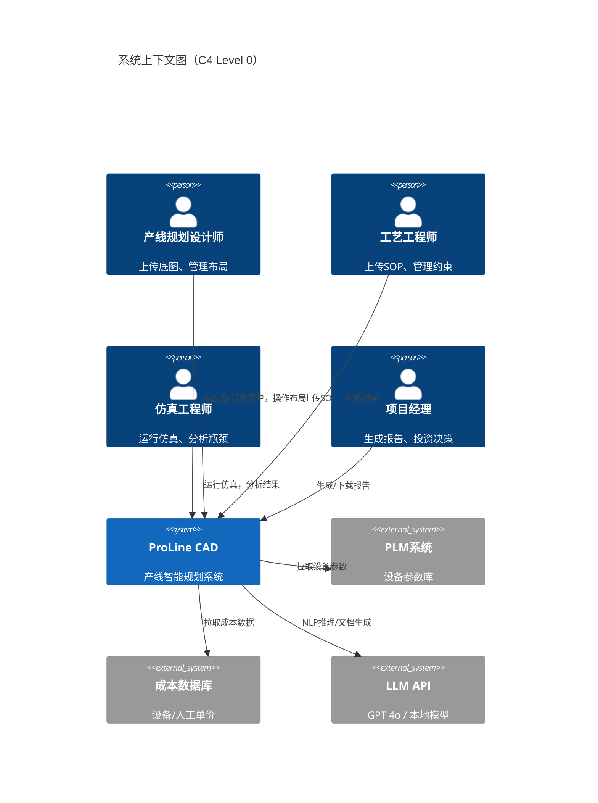

### 2.3 核心设计原则

| 原则 | 说明 |
|------|------|
| **MCP-First** | 所有AI Agent间通信必须通过MCP协议，禁止直接数据库耦合 |
| **上下文可追溯** | 每个数据产出物携带 `mcp_context_id`，支持全链路溯源 |
| **Agent独立部署** | 每个MCP Server（Agent）独立部署、独立扩缩容、独立版本 |
| **编排解耦** | 业务流程由Orchestrator编排，Agent只关注单一职责 |
| **渐进式复杂度** | MVP先实现串行流程，后续迭代支持并行/协同/闭环 |

---

## 3. 应用架构

### 3.1 分层架构总览

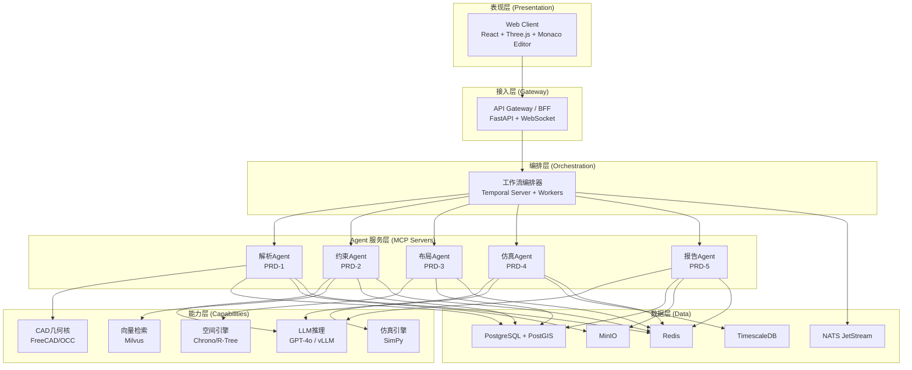

### 3.2 各层职责

#### 3.2.1 表现层

| 模块 | 技术 | 职责 |
|------|------|------|
| 底图工作台 | Three.js + React | 3D SiteModel预览、障碍物标注、Asset属性面板 |
| 工艺编辑器 | Monaco Editor + React | ConstraintSet JSON编辑、ProcessGraph可视化 |
| 布局沙箱 | Three.js + React DnD | 拖拽布局、实时碰撞高亮、自愈动画 |
| 仿真仪表盘 | ECharts + React | JPH柱状图、稼动率热力图、瓶颈清单 |
| 报告中心 | PDF.js + React | 报告预览、导出、追溯链导航 |

**前端关键设计**：
- **状态管理**：Zustand（轻量、TypeScript友好）
- **3D渲染**：Three.js + React Three Fiber（声明式3D渲染）
- **实时通信**：WebSocket（布局拖拽实时反馈）+ SSE（仿真进度推送）
- **文件上传**：分片上传到MinIO，支持断点续传

#### 3.2.2 接入层（BFF/API Gateway）

```python
# BFF 核心路由设计（FastAPI）
# /api/v1/projects         — 项目CRUD
# /api/v1/sites            — SiteModel管理
# /api/v1/assets           — Asset管理
# /api/v1/constraints      — ConstraintSet管理
# /api/v1/layouts          — Layout管理
# /api/v1/simulations      — 仿真管理
# /api/v1/reports          — 报告管理
# /api/v1/files/upload     — 文件上传
# /ws/layout/{layout_id}   — 布局实时交互WebSocket
# /ws/sim/{sim_id}/progress — 仿真进度WebSocket
```

**职责**：
- OAuth2/OIDC 认证 + RBAC 鉴权
- 请求限流（令牌桶，默认100 req/s/user）
- 请求路由到Orchestrator或直接查询
- WebSocket连接管理（布局拖拽、仿真进度）
- 协议转换（HTTP → MCP Tool Call）

#### 3.2.3 编排层（Temporal）

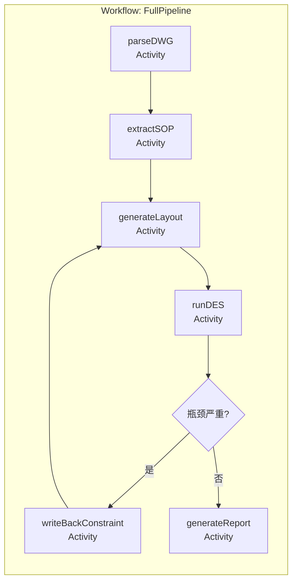

**Temporal Workflow 设计**：

| Workflow | 触发条件 | 包含Activities | 超时 |
|----------|----------|----------------|------|
| `FullPipelineWorkflow` | 用户点击"完整流水线" | parseDWG → extractSOP → generateLayout → runDES → generateReport | 30min |
| `ParseSiteWorkflow` | 上传底图 | parseDWG → instantiateAssets → alignCoordinate | 15min |
| `ConstraintWorkflow` | 上传SOP | extractSOP → retrieveNorm → validateConstraints | 5min |
| `LayoutWorkflow` | 点击"生成布局" | generateLayout → collisionCheck → autoHeal | 5min |
| `SimWorkflow` | 选择方案仿真 | runDES → identifyBottleneck | 10min |
| `ReportWorkflow` | 点击"生成报告" | gatherContext → calculateROI → generateReport | 10min |
| `FeedbackLoopWorkflow` | 瓶颈回写触发 | writeBackConstraint → generateLayout → runDES | 20min |

**Temporal Activity 实现原则**：
- 每个Activity内部调用对应MCP Server的Tool
- Activity设置重试策略：最多3次，指数退避
- 长时运行Activity（仿真）使用Heartbeat机制上报进度

#### 3.2.4 Agent 服务层

每个Agent独立实现为MCP Server，Tool Schema定义见 PRD全局附录第3节。

| Agent | 语言 | MCP传输 | 核心依赖 | 资源画像 |
|-------|------|---------|----------|----------|
| 解析Agent | Python | stdio | FreeCAD, OpenCascade, ODA File Converter | CPU密集，内存≤2GB |
| 约束Agent | Python | SSE | LangChain, Milvus Client, LLM SDK | I/O密集，LLM调用 |
| 布局Agent | Python | stdio | Shapely, R-Tree, 自研优化算法 | CPU密集 |
| 仿真Agent | Python | SSE | SimPy, NumPy, PyTorch (PINN) | CPU/GPU混合 |
| 报告Agent | Python | SSE | Jinja2, WeasyPrint, LLM SDK | I/O密集 |

---

## 4. 数据架构

### 4.1 数据存储分布

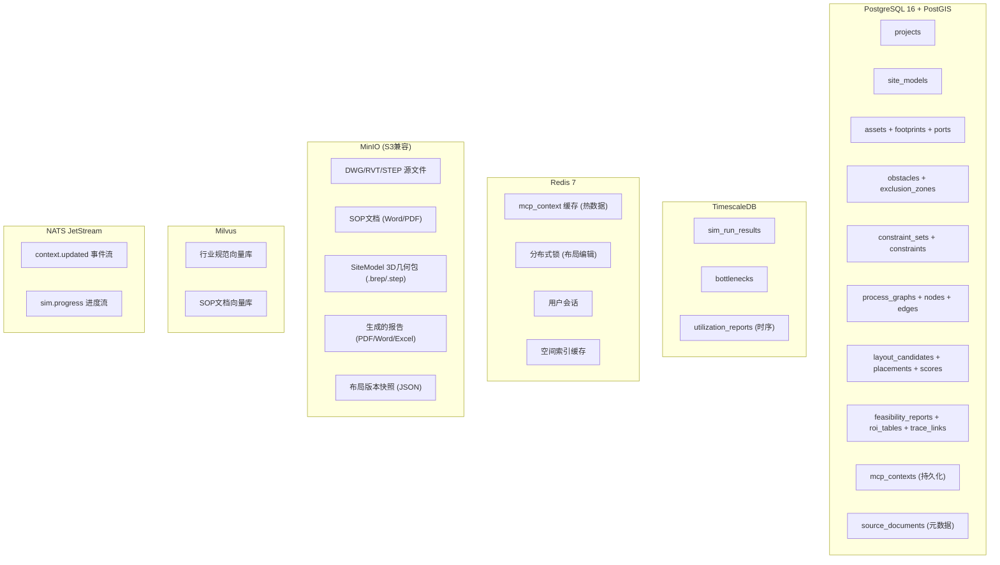

### 4.2 数据库Schema设计（核心表）

```sql
-- ==========================================
-- PostgreSQL Schema
-- ==========================================

CREATE EXTENSION IF NOT EXISTS "uuid-ossp";
CREATE EXTENSION IF NOT EXISTS "postgis";

-- 项目表
CREATE TABLE projects (
    project_id    TEXT PRIMARY KEY DEFAULT 'proj_' || substr(uuid_generate_v4()::text, 1, 8),
    project_name  TEXT NOT NULL,
    owner         TEXT NOT NULL,
    status        TEXT NOT NULL DEFAULT 'draft'
                  CHECK (status IN ('draft','in_progress','review','approved','archived')),
    created_at    TIMESTAMPTZ NOT NULL DEFAULT now(),
    updated_at    TIMESTAMPTZ NOT NULL DEFAULT now()
);

-- SiteModel表
CREATE TABLE site_models (
    site_guid         TEXT PRIMARY KEY,
    project_id        TEXT NOT NULL REFERENCES projects(project_id),
    coordinate_system TEXT NOT NULL DEFAULT '1:1 origin',
    origin_x          DOUBLE PRECISION NOT NULL DEFAULT 0,
    origin_y          DOUBLE PRECISION NOT NULL DEFAULT 0,
    origin_z          DOUBLE PRECISION NOT NULL DEFAULT 0,
    unit              TEXT NOT NULL DEFAULT 'mm',
    source_file_ref   TEXT,
    version           INT NOT NULL DEFAULT 1,
    mcp_context_id    TEXT,
    created_at        TIMESTAMPTZ NOT NULL DEFAULT now()
);
CREATE INDEX idx_site_project ON site_models(project_id);

-- 资产表
CREATE TABLE assets (
    asset_guid     TEXT PRIMARY KEY,
    site_guid      TEXT NOT NULL REFERENCES site_models(site_guid),
    asset_name     TEXT NOT NULL,
    asset_type     TEXT,
    plm_ref        TEXT,
    mcp_context_id TEXT,
    created_at     TIMESTAMPTZ NOT NULL DEFAULT now()
);
CREATE INDEX idx_asset_site ON assets(site_guid);

-- Footprint表
CREATE TABLE footprints (
    footprint_id    TEXT PRIMARY KEY DEFAULT 'fp_' || substr(uuid_generate_v4()::text, 1, 8),
    asset_guid      TEXT NOT NULL REFERENCES assets(asset_guid) ON DELETE CASCADE,
    geometry_type   TEXT NOT NULL DEFAULT 'rectangle',
    boundary_polygon GEOMETRY(Polygon, 0),
    width_mm        DOUBLE PRECISION,
    depth_mm        DOUBLE PRECISION,
    height_mm       DOUBLE PRECISION
);

-- Port表
CREATE TABLE ports (
    port_id     TEXT PRIMARY KEY DEFAULT 'port_' || substr(uuid_generate_v4()::text, 1, 8),
    asset_guid  TEXT NOT NULL REFERENCES assets(asset_guid) ON DELETE CASCADE,
    port_name   TEXT NOT NULL,
    port_type   TEXT CHECK (port_type IN ('input','output','bidirectional','service')),
    offset_x    DOUBLE PRECISION NOT NULL DEFAULT 0,
    offset_y    DOUBLE PRECISION NOT NULL DEFAULT 0,
    offset_z    DOUBLE PRECISION NOT NULL DEFAULT 0,
    direction   TEXT CHECK (direction IN ('north','south','east','west','up','down'))
);

-- 障碍物表
CREATE TABLE obstacles (
    obstacle_id TEXT PRIMARY KEY DEFAULT 'obs_' || substr(uuid_generate_v4()::text, 1, 8),
    site_guid   TEXT NOT NULL REFERENCES site_models(site_guid),
    label       TEXT,
    polygon     GEOMETRY(Polygon, 0),
    height      DOUBLE PRECISION
);

-- 禁区表
CREATE TABLE exclusion_zones (
    zone_id    TEXT PRIMARY KEY DEFAULT 'zone_' || substr(uuid_generate_v4()::text, 1, 8),
    site_guid  TEXT NOT NULL REFERENCES site_models(site_guid),
    reason     TEXT,
    polygon    GEOMETRY(Polygon, 0),
    zone_type  TEXT CHECK (zone_type IN ('structural_column','fire_escape','utility','custom'))
);

-- 约束集表
CREATE TABLE constraint_sets (
    constraint_set_id TEXT PRIMARY KEY,
    project_id        TEXT NOT NULL REFERENCES projects(project_id),
    version           INT NOT NULL DEFAULT 1,
    mcp_context_id    TEXT,
    created_at        TIMESTAMPTZ NOT NULL DEFAULT now()
);

-- 约束条目表
CREATE TABLE constraints (
    constraint_id       TEXT PRIMARY KEY,
    constraint_set_id   TEXT NOT NULL REFERENCES constraint_sets(constraint_set_id),
    constraint_type     TEXT NOT NULL CHECK (constraint_type IN ('hard','soft','preference')),
    rule_expression     TEXT NOT NULL,
    source_ref          TEXT,
    source_document_id  TEXT,
    severity            TEXT CHECK (severity IN ('critical','major','minor')),
    description         TEXT
);

-- 工序图表
CREATE TABLE process_graphs (
    graph_id          TEXT PRIMARY KEY,
    constraint_set_id TEXT NOT NULL REFERENCES constraint_sets(constraint_set_id),
    mcp_context_id    TEXT
);

CREATE TABLE process_nodes (
    node_id       TEXT PRIMARY KEY,
    graph_id      TEXT NOT NULL REFERENCES process_graphs(graph_id),
    station_name  TEXT NOT NULL,
    cycle_time_s  DOUBLE PRECISION,
    operator_count INT DEFAULT 1,
    metadata      JSONB
);

CREATE TABLE process_edges (
    edge_id      TEXT PRIMARY KEY,
    graph_id     TEXT NOT NULL REFERENCES process_graphs(graph_id),
    from_node_id TEXT NOT NULL REFERENCES process_nodes(node_id),
    to_node_id   TEXT NOT NULL REFERENCES process_nodes(node_id),
    edge_type    TEXT CHECK (edge_type IN ('conveyor','agv','manual','crane')),
    transport_params JSONB
);

-- 布局候选方案表
CREATE TABLE layout_candidates (
    layout_id         TEXT PRIMARY KEY,
    site_guid         TEXT NOT NULL REFERENCES site_models(site_guid),
    constraint_set_id TEXT NOT NULL REFERENCES constraint_sets(constraint_set_id),
    version           INT NOT NULL DEFAULT 1,
    total_score       DOUBLE PRECISION,
    mcp_context_id    TEXT,
    created_at        TIMESTAMPTZ NOT NULL DEFAULT now()
);

CREATE TABLE placements (
    placement_id  TEXT PRIMARY KEY,
    layout_id     TEXT NOT NULL REFERENCES layout_candidates(layout_id),
    asset_guid    TEXT NOT NULL REFERENCES assets(asset_guid),
    pos_x         DOUBLE PRECISION NOT NULL,
    pos_y         DOUBLE PRECISION NOT NULL,
    rotation_deg  DOUBLE PRECISION NOT NULL DEFAULT 0,
    is_locked     BOOLEAN NOT NULL DEFAULT false
);

CREATE TABLE score_breakdowns (
    score_id            TEXT PRIMARY KEY,
    layout_id           TEXT NOT NULL REFERENCES layout_candidates(layout_id),
    logistics_score     DOUBLE PRECISION,
    space_utilization   DOUBLE PRECISION,
    maintenance_access  DOUBLE PRECISION,
    safety_compliance   DOUBLE PRECISION,
    custom_scores       JSONB
);

-- 可研报告表
CREATE TABLE feasibility_reports (
    report_id          TEXT PRIMARY KEY,
    project_id         TEXT NOT NULL REFERENCES projects(project_id),
    adopted_layout_id  TEXT REFERENCES layout_candidates(layout_id),
    decision_reason    TEXT,
    mcp_context_id     TEXT,
    generated_at       TIMESTAMPTZ NOT NULL DEFAULT now()
);

CREATE TABLE roi_tables (
    roi_id               TEXT PRIMARY KEY,
    report_id            TEXT NOT NULL REFERENCES feasibility_reports(report_id),
    total_investment     DOUBLE PRECISION,
    annual_savings       DOUBLE PRECISION,
    payback_years        DOUBLE PRECISION,
    sensitivity_analysis JSONB,
    cost_breakdown       JSONB
);

CREATE TABLE mcp_trace_links (
    trace_id          TEXT PRIMARY KEY,
    report_id         TEXT NOT NULL REFERENCES feasibility_reports(report_id),
    source_context_id TEXT NOT NULL,
    source_agent      TEXT NOT NULL,
    description       TEXT
);

-- MCP Context 持久化表
CREATE TABLE mcp_contexts (
    context_id      TEXT PRIMARY KEY,
    source_agent    TEXT NOT NULL,
    version         INT NOT NULL DEFAULT 1,
    payload_type    TEXT NOT NULL,
    payload_ref     TEXT NOT NULL,
    parent_contexts TEXT[],
    subscribers     TEXT[],
    status          TEXT NOT NULL DEFAULT 'active'
                    CHECK (status IN ('active','superseded','expired','archived')),
    ttl_seconds     INT DEFAULT 86400,
    checksum_sha256 TEXT,
    created_at      TIMESTAMPTZ NOT NULL DEFAULT now()
);
CREATE INDEX idx_ctx_agent ON mcp_contexts(source_agent);
CREATE INDEX idx_ctx_status ON mcp_contexts(status);
```

```sql
-- ==========================================
-- TimescaleDB Schema（仿真时序数据）
-- ==========================================

CREATE TABLE sim_run_results (
    sim_id          TEXT PRIMARY KEY,
    layout_id       TEXT NOT NULL,
    jph             DOUBLE PRECISION,
    overall_oee     DOUBLE PRECISION,
    sim_duration_s  INT,
    mcp_context_id  TEXT,
    run_at          TIMESTAMPTZ NOT NULL DEFAULT now()
);

CREATE TABLE bottlenecks (
    bottleneck_id  TEXT PRIMARY KEY,
    sim_id         TEXT NOT NULL REFERENCES sim_run_results(sim_id),
    zone_ref       TEXT,
    reason_code    TEXT NOT NULL,
    evidence       TEXT,
    severity_score DOUBLE PRECISION
);

CREATE TABLE utilization_timeseries (
    sim_id         TEXT NOT NULL,
    station_id     TEXT NOT NULL,
    ts             TIMESTAMPTZ NOT NULL,
    utilization    DOUBLE PRECISION,
    buffer_level   INT,
    throughput     DOUBLE PRECISION
);
SELECT create_hypertable('utilization_timeseries', 'ts');
```

### 4.3 数据流转全景

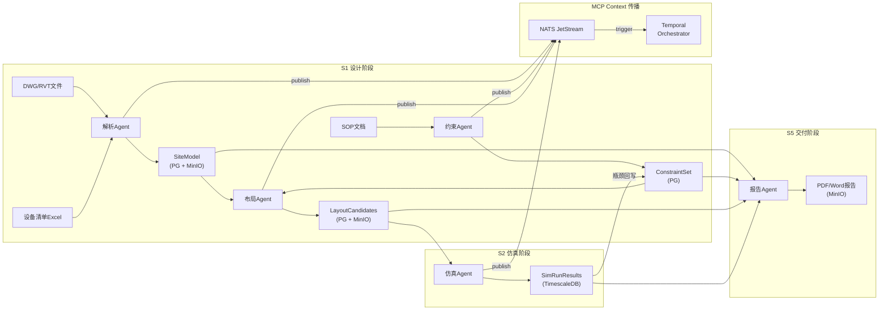

### 4.4 数据版本策略

| 实体 | 版本策略 | 说明 |
|------|----------|------|
| SiteModel | 递增version字段 + 全量快照到MinIO | 每次修改创建新version，旧版本保留 |
| ConstraintSet | 递增version + Copy-on-Write | 回写约束时版本+1 |
| Layout | 独立layout_id + version | 每次生成保留完整Placement |
| SimRunResult | 不可变（Append-Only） | 每次仿真产生新记录 |
| MCP Context | 状态流转：active → superseded | 新Context产生时旧Context标记superseded |

---

## 5. 技术架构

### 5.1 技术栈选型

| 层次 | 技术选型 | 版本 | 选型理由 |
|------|----------|------|----------|
| **前端框架** | React 18 + TypeScript | 18.3+ | 生态最成熟、Three.js集成好 |
| **3D渲染** | Three.js + React Three Fiber | r160+ | 声明式3D、WebGPU就绪 |
| **3D交互编辑** | @react-three/drei + cannon-es | — | 拖拽、碰撞、物理效果 |
| **图表** | ECharts 5 | 5.5+ | 热力图、桑基图支持 |
| **代码/JSON编辑** | Monaco Editor | — | VS Code同源、JSON Schema校验 |
| **状态管理** | Zustand | 4.x | 轻量、TypeScript原生 |
| **BFF** | FastAPI (Python) | 0.110+ | 异步、类型提示、OpenAPI自动生成 |
| **WebSocket** | FastAPI WebSocket + uvicorn | — | 布局实时交互 |
| **工作流编排** | Temporal | 1.24+ | 长时workflow、重试、版本化、可视化 |
| **MCP SDK** | mcp (Python官方SDK) | 1.x | 官方维护、支持stdio/SSE |
| **CAD几何核** | FreeCAD (Python API) | 0.21+ | 开源、STEP/BREP支持 |
| **几何库** | OpenCascade (via FreeCAD) | 7.7+ | B-Rep内核 |
| **DWG读取** | ODA File Converter + ezdxf | — | DWG→DXF转换 + Python解析 |
| **RVT读取** | pyRevit / IFC OpenShell | — | RVT→IFC中间格式 |
| **LLM框架** | LangChain | 0.2+ | Agent编排、Tool集成 |
| **LLM推理** | OpenAI GPT-4o API (MVP) / vLLM (生产) | — | 参见ADR-003 |
| **向量库** | Milvus | 2.4+ | 高性能、支持混合检索 |
| **Embedding** | text-embedding-3-large / bge-large-zh | — | 中英双语支持 |
| **空间索引** | Shapely + Rtree | — | 2D碰撞检测、最近邻 |
| **物理引擎** | Project Chrono (可选) | 9.0+ | 3D物理仿真（V2.0） |
| **DES仿真** | SimPy | 4.1+ | Python原生DES、轻量 |
| **PINN加速** | PyTorch | 2.3+ | 代理模型训练与推理 |
| **报告生成** | Jinja2 + WeasyPrint | — | HTML模板→PDF |
| **Excel生成** | openpyxl | — | ROI表导出 |
| **数据库** | PostgreSQL 16 + PostGIS 3.4 | — | 空间索引、JSON、强一致 |
| **时序数据库** | TimescaleDB | 2.14+ | 仿真时序数据优化 |
| **缓存** | Redis 7 | 7.2+ | Context缓存、分布式锁 |
| **对象存储** | MinIO | RELEASE.2024+ | S3兼容、私有部署 |
| **消息队列** | NATS JetStream | 2.10+ | 轻量、低延迟、持久化 |
| **容器运行时** | Docker + containerd | — | OCI标准 |
| **容器编排** | Kubernetes (K3s) | 1.29+ | 轻量K8s、适合中小规模 |
| **CI/CD** | GitHub Actions + ArgoCD | — | GitOps流水线 |
| **可观测性** | OpenTelemetry + Grafana + Loki + Tempo | — | 指标+日志+链路追踪 |
| **认证** | Keycloak (OIDC) | 24+ | 开源IdP、支持OAuth2/RBAC |

### 5.2 关键技术方案

#### 5.2.1 DWG/RVT 语义化解析方案

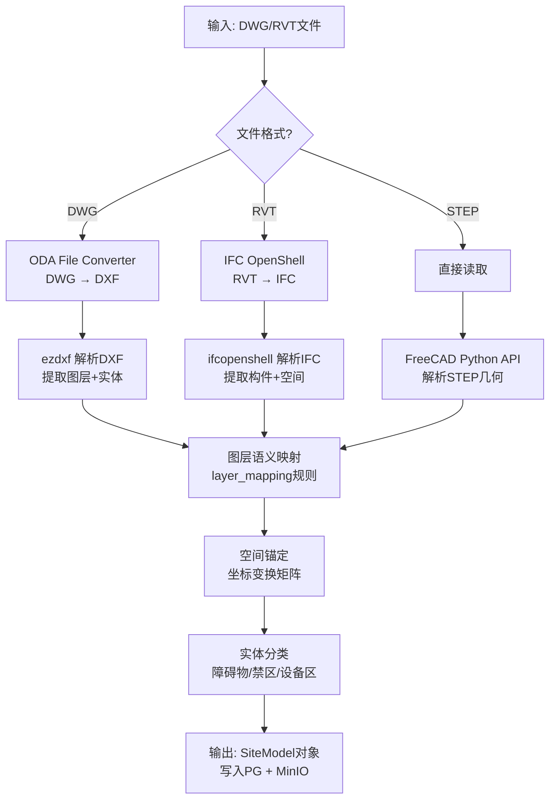

**技术难点与方案**：
- **图层命名不规范**：提供默认映射表 + 人工校核入口 + LLM辅助推测
- **坐标系不一致**：3点校准法（至少3个参考点）+ 仿射变换矩阵
- **大文件处理**：流式解析 + 分块处理，限制内存≤2GB

#### 5.2.2 实时布局自愈方案

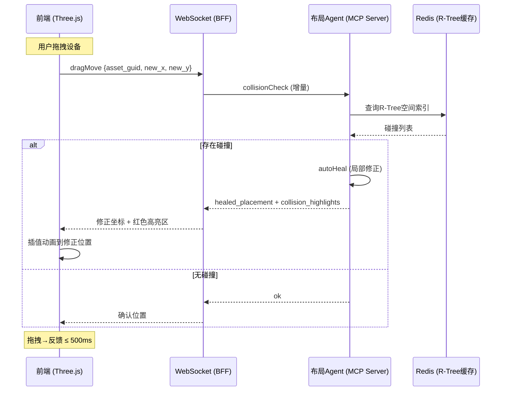

**性能优化策略**：
- R-Tree空间索引预加载到Redis（SiteModel加载时构建）
- 增量碰撞检测：只检测被移动的设备与邻域
- WebSocket双向通信，避免HTTP开销
- 前端乐观更新 + 服务端校正

#### 5.2.3 DES仿真 + PINN加速方案

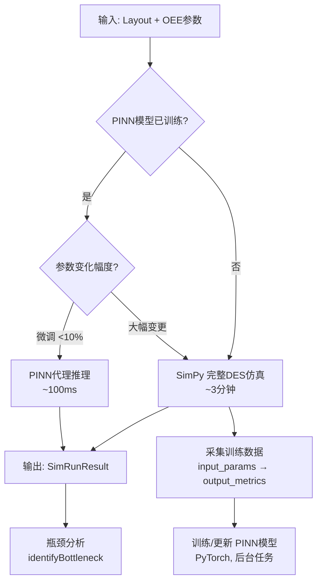

**SimPy DES 核心建模**：
- 每个工站建模为 `simpy.Resource`（含容量、OEE、故障率）
- 物流路径建模为 `simpy.Container`（缓冲区）
- 订单到达建模为 `simpy.Process`（按order_sequence生成）
- 输出指标：JPH、各工站稼动率、缓冲区水位、总OEE

#### 5.2.4 RAG 知识检索方案

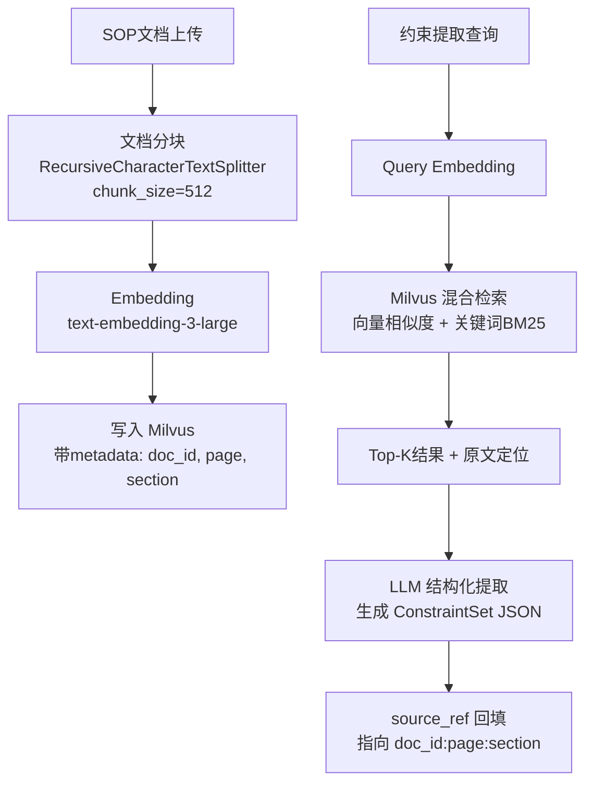

---

## 6. MCP 协议集成架构

### 6.1 总体拓扑

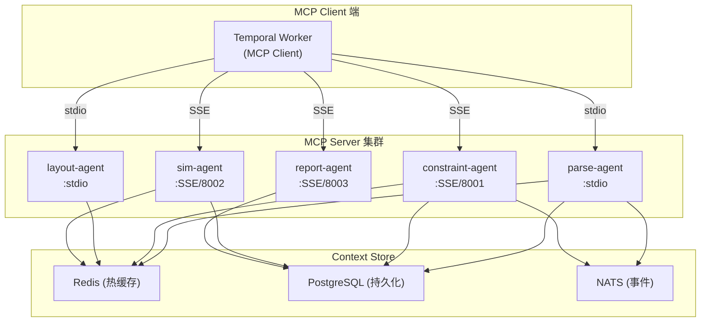

### 6.2 传输模式选择

| Agent | 传输模式 | 理由 |
|-------|----------|------|
| 解析Agent | **stdio** | 与Temporal Worker同节点部署，低延迟，无网络开销 |
| 约束Agent | **SSE** | 依赖LLM API（外部调用），耗时不确定，适合远程异步 |
| 布局Agent | **stdio** | 实时交互（拖拽自愈）要求极低延迟 |
| 仿真Agent | **SSE** | 可能跑在GPU节点，跨节点部署必须网络传输 |
| 报告Agent | **SSE** | 依赖LLM，可独立扩缩容 |

### 6.3 MCP Server 注册与发现

```python
# Temporal Worker 中的 MCP Client 配置
MCP_SERVERS = {
    "parse-agent": {
        "transport": "stdio",
        "command": "python",
        "args": ["-m", "agents.parse_agent.server"],
        "env": {"FREECAD_PATH": "/opt/freecad/bin"}
    },
    "constraint-agent": {
        "transport": "sse",
        "url": "http://constraint-agent:8001/sse",
        "headers": {"Authorization": "Bearer ${OAUTH_TOKEN}"}
    },
    "layout-agent": {
        "transport": "stdio",
        "command": "python",
        "args": ["-m", "agents.layout_agent.server"]
    },
    "sim-agent": {
        "transport": "sse",
        "url": "http://sim-agent:8002/sse",
        "headers": {"Authorization": "Bearer ${OAUTH_TOKEN}"}
    },
    "report-agent": {
        "transport": "sse",
        "url": "http://report-agent:8003/sse",
        "headers": {"Authorization": "Bearer ${OAUTH_TOKEN}"}
    }
}
```

---

## 7. 接口规范

### 7.1 BFF REST API

#### 7.1.1 API设计规范

- **Base URL**: `/api/v1`
- **认证**: Bearer Token（Keycloak签发）
- **Content-Type**: `application/json`（除文件上传用 `multipart/form-data`）
- **分页**: `?page=1&page_size=20`
- **错误响应格式**:

```json
{
  "error": {
    "code": 5001,
    "message": "不支持的文件格式",
    "detail": "期望 dwg/rvt/step，实际收到 .pdf",
    "trace_id": "abc-123"
  }
}
```

#### 7.1.2 核心API列表

| 方法 | 路径 | 说明 | 关联PRD |
|------|------|------|---------|
| POST | `/projects` | 创建项目 | — |
| GET | `/projects/{id}` | 获取项目详情 | — |
| POST | `/files/upload` | 上传DWG/RVT/SOP文件 | PRD-1,2 |
| POST | `/sites/parse` | 触发底图解析（异步，返回workflow_id） | PRD-1 |
| GET | `/sites/{site_guid}` | 获取SiteModel | PRD-1 |
| GET | `/sites/{site_guid}/assets` | 获取Asset列表 | PRD-1 |
| POST | `/constraints/extract` | 触发约束提取（异步） | PRD-2 |
| GET | `/constraints/{set_id}` | 获取ConstraintSet | PRD-2 |
| PUT | `/constraints/{set_id}/items/{id}` | 编辑单条约束 | PRD-2 |
| POST | `/layouts/generate` | 触发布局生成（异步） | PRD-3 |
| GET | `/layouts/{layout_id}` | 获取布局详情 | PRD-3 |
| POST | `/layouts/{layout_id}/collision-check` | 碰撞检测（同步） | PRD-3 |
| POST | `/simulations/run` | 触发仿真（异步） | PRD-4 |
| GET | `/simulations/{sim_id}` | 获取仿真结果 | PRD-4 |
| POST | `/simulations/{sim_id}/write-back` | 瓶颈回写约束 | PRD-4 |
| POST | `/reports/generate` | 触发报告生成（异步） | PRD-5 |
| GET | `/reports/{report_id}` | 获取报告详情 | PRD-5 |
| GET | `/reports/{report_id}/download` | 下载报告文件 | PRD-5 |
| GET | `/workflows/{workflow_id}/status` | 查询异步任务状态 | — |
| WS | `/ws/layout/{layout_id}` | 布局实时交互 | PRD-3 |
| WS | `/ws/sim/{sim_id}/progress` | 仿真进度推送 | PRD-4 |

#### 7.1.3 WebSocket 消息协议

**布局交互 (`/ws/layout/{layout_id}`)**:

```json
// Client → Server: 拖拽移动
{"type": "drag_move", "asset_guid": "asset_xxx", "x": 1200.5, "y": 800.3, "rotation": 45.0}

// Server → Client: 碰撞检测结果
{"type": "collision_result", "collisions": [...], "healed_placement": {...}}

// Server → Client: 自愈完成
{"type": "heal_complete", "placement": {"asset_guid": "...", "x": 1205, "y": 803, "rotation": 45.0}}
```

**仿真进度 (`/ws/sim/{sim_id}/progress`)**:

```json
// Server → Client: 进度更新
{"type": "progress", "percent": 45, "current_step": "DES运行中", "eta_seconds": 90}

// Server → Client: 仿真完成
{"type": "complete", "sim_id": "sim_xxx", "jph": 120, "bottleneck_count": 3}
```

### 7.2 MCP Tool 接口

详见 **PRD全局附录** 第3节 MCP Tool Schema 规范。所有Tool的 `inputSchema` / `outputSchema` 已在附录中完整定义。

---

## 8. 安全架构

### 8.1 认证与授权

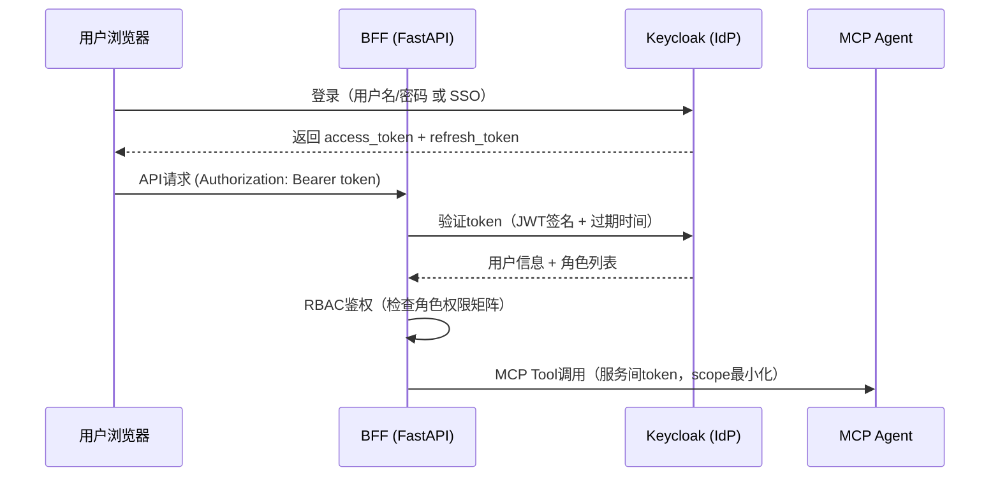

### 8.2 安全控制措施

| 维度 | 措施 | 说明 |
|------|------|------|
| **认证** | OAuth2 / OIDC (Keycloak) | 统一身份认证，支持SSO |
| **授权** | RBAC权限矩阵（见附录第6节） | 6角色、细粒度资源权限 |
| **传输加密** | TLS 1.3 (所有HTTP/WS/SSE) | 包括内部服务间通信 |
| **数据加密** | AES-256 at rest (MinIO server-side encryption) | 源文件和报告加密存储 |
| **输入校验** | Pydantic模型强校验 + 文件类型白名单 | 防注入、防恶意文件上传 |
| **文件上传安全** | 文件大小限制(500MB)、类型校验、病毒扫描(ClamAV) | 防恶意文件 |
| **API限流** | 令牌桶 100 req/s/user | 防DDoS和滥用 |
| **审计日志** | 全部MCP Context访问记录 | 写入PG审计表，保留365天 |
| **密钥管理** | HashiCorp Vault / K8s Secrets | 禁止硬编码密钥 |
| **SQL注入防护** | SQLAlchemy ORM参数化查询 | 禁止SQL拼接 |
| **CORS** | 白名单域名 | 仅允许前端域名访问 |

### 8.3 数据分级

| 数据级别 | 示例 | 保护措施 |
|----------|------|----------|
| **机密** | 投资金额、ROI报告、成本数据 | 加密存储 + 角色限制(owner/admin) |
| **内部** | SiteModel、Layout、仿真结果 | 项目级隔离 + 角色访问控制 |
| **一般** | 项目元数据、用户基本信息 | 常规访问控制 |

---

## 9. 部署架构

### 9.1 环境规划

| 环境 | 用途 | 基础设施 | 说明 |
|------|------|----------|------|
| **Dev** | 开发联调 | Docker Compose (单机) | 全部服务单机运行 |
| **Staging** | 集成测试/UAT | K3s (3节点) | 模拟生产拓扑 |
| **Production** | 正式生产 | K3s (5+节点) | 高可用、自动扩缩 |

### 9.2 Kubernetes 部署拓扑

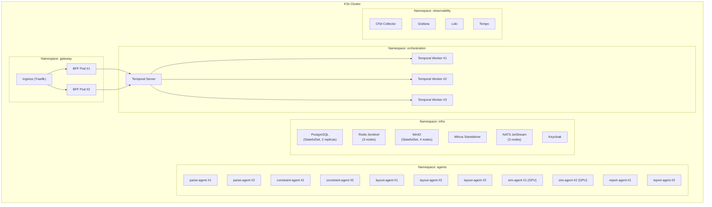

### 9.3 资源规划（生产环境）

| 服务 | CPU (requests/limits) | 内存 (requests/limits) | 副本数 | GPU | 存储 |
|------|-----------------------|-------------------------|--------|-----|------|
| BFF | 0.5c / 2c | 512Mi / 1Gi | 2 | — | — |
| Temporal Server | 1c / 2c | 1Gi / 2Gi | 1 (HA: 2) | — | — |
| Temporal Worker | 1c / 4c | 1Gi / 4Gi | 3 | — | — |
| parse-agent | 2c / 4c | 1Gi / 2Gi | 2 | — | — |
| constraint-agent | 0.5c / 2c | 512Mi / 1Gi | 2 | — | — |
| layout-agent | 2c / 4c | 1Gi / 2Gi | 2-3 | — | — |
| sim-agent | 2c / 4c | 2Gi / 4Gi | 2 | 1× T4/A10 | — |
| report-agent | 0.5c / 2c | 512Mi / 1Gi | 2 | — | — |
| PostgreSQL | 2c / 4c | 4Gi / 8Gi | 2 (主备) | — | 100Gi SSD |
| Redis | 0.5c / 1c | 1Gi / 2Gi | 3 (Sentinel) | — | 10Gi |
| MinIO | 1c / 2c | 2Gi / 4Gi | 4 | — | 500Gi SSD |
| Milvus | 2c / 4c | 4Gi / 8Gi | 1 | — | 50Gi SSD |
| NATS | 0.5c / 1c | 512Mi / 1Gi | 3 | — | 20Gi |
| vLLM (可选) | 4c / 8c | 16Gi / 32Gi | 1 | 1× A100 | — |

### 9.4 开发环境（Docker Compose）

```yaml
# docker-compose.dev.yml 核心服务概览
services:
  bff:
    build: ./services/bff
    ports: ["8000:8000"]
    depends_on: [postgres, redis, nats]

  temporal:
    image: temporalio/auto-setup:1.24
    ports: ["7233:7233"]
    depends_on: [postgres]

  temporal-worker:
    build: ./services/worker
    depends_on: [temporal]

  parse-agent:
    build: ./agents/parse-agent
    volumes: ["/opt/freecad:/opt/freecad"]

  constraint-agent:
    build: ./agents/constraint-agent
    ports: ["8001:8001"]

  layout-agent:
    build: ./agents/layout-agent

  sim-agent:
    build: ./agents/sim-agent
    ports: ["8002:8002"]

  report-agent:
    build: ./agents/report-agent
    ports: ["8003:8003"]

  postgres:
    image: postgis/postgis:16-3.4
    ports: ["5432:5432"]
    volumes: ["pg_data:/var/lib/postgresql/data"]

  timescaledb:
    image: timescale/timescaledb:latest-pg16
    ports: ["5433:5432"]

  redis:
    image: redis:7-alpine
    ports: ["6379:6379"]

  minio:
    image: minio/minio
    ports: ["9000:9000", "9001:9001"]
    command: server /data --console-address ":9001"

  milvus:
    image: milvusdb/milvus:v2.4-latest
    ports: ["19530:19530"]

  nats:
    image: nats:2.10-alpine
    ports: ["4222:4222"]
    command: "--jetstream"

  keycloak:
    image: quay.io/keycloak/keycloak:24.0
    ports: ["8080:8080"]
    command: start-dev
```

---

## 10. 可观测性与运维

### 10.1 可观测性三支柱

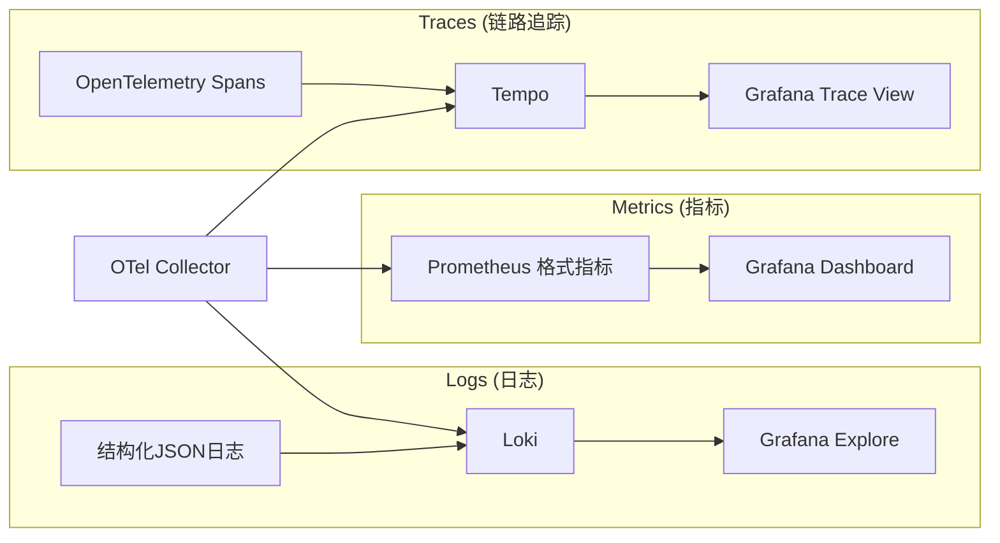

### 10.2 关键监控指标

| 指标 | 说明 | 告警阈值 |
|------|------|----------|
| `parsedwg_duration_seconds` | 底图解析耗时 | P99 > 30s |
| `layout_generation_duration_seconds` | 布局生成耗时 | P99 > 30s |
| `sim_run_duration_seconds` | 仿真运行耗时 | P99 > 300s |
| `collision_check_latency_ms` | 碰撞检测延迟 | P99 > 100ms |
| `autoheal_latency_ms` | 自愈修正延迟 | P99 > 500ms |
| `mcp_tool_call_duration_seconds` | MCP Tool调用耗时 | P99 > 60s |
| `mcp_context_publish_count` | Context发布数/分钟 | — (监控趋势) |
| `workflow_failure_rate` | Temporal Workflow失败率 | > 5% |
| `llm_api_latency_seconds` | LLM API延迟 | P99 > 10s |
| `db_connection_pool_usage` | 数据库连接池使用率 | > 80% |

### 10.3 日志规范

```json
{
  "timestamp": "2026-04-10T10:30:00.123Z",
  "level": "info",
  "service": "layout-agent",
  "trace_id": "abc123",
  "span_id": "def456",
  "mcp_context_id": "ctx_layout_20260410_001",
  "message": "generateLayout completed",
  "attributes": {
    "layout_id": "layout_q7r8s9t0",
    "candidate_count": 5,
    "duration_ms": 12500
  }
}
```

### 10.4 告警与On-Call

| 级别 | 触发条件 | 通知渠道 | 响应时间 |
|------|----------|----------|----------|
| **P0 Critical** | 数据库不可用 / 全部Agent宕机 | 电话 + 短信 | ≤15分钟 |
| **P1 High** | 单Agent宕机 / 仿真持续失败 | 企业微信/钉钉 | ≤1小時 |
| **P2 Medium** | 性能指标超阈值 / 错误率上升 | 邮件 | 当日处理 |
| **P3 Low** | 非关键指标异常 | 日报汇总 | 次周处理 |

---

## 11. 原型验证计划（PoC）

### 11.1 PoC 目标

在 **4周内** 验证核心技术可行性，打通"DWG上传 → SiteModel → 简单布局 → DES仿真 → 简单报告"的最小闭环。

### 11.2 PoC 范围

| 模块 | PoC范围（简化版） | 排除项 |
|------|---------------------|--------|
| PRD-1 解析 | 支持DWG解析，生成简化SiteModel（矩形障碍物） | RVT/STEP、3D几何、PLM集成 |
| PRD-2 约束 | 硬编码3条示例约束 + 1条LLM提取约束 | 完整RAG、冲突检测、多文档 |
| PRD-3 布局 | 生成1个布局方案，支持碰撞检测 | 多方案、自愈、拖拽交互 |
| PRD-4 仿真 | SimPy运行5工站DES，输出JPH | PINN、不确定性量化、瓶颈回写 |
| PRD-5 报告 | 生成简单PDF（固定模板） | ROI计算、多格式、追溯链 |
| MCP协议 | 2个Agent（解析+布局）通过MCP通信 | 全部5个Agent、SSE传输 |
| 前端 | 简单React页面 + 2D Canvas预览 | Three.js 3D、Monaco、仪表盘 |

### 11.3 PoC 技术验证点

| # | 验证点 | 成功标准 | 优先级 |
|---|--------|----------|--------|
| 1 | DWG解析可行性 | ODA + ezdxf成功解析样例DWG，提取图层 | P0 |
| 2 | MCP端到端通信 | Temporal Worker作为MCP Client成功调用parse-agent Tool | P0 |
| 3 | 空间碰撞检测性能 | R-Tree + Shapely碰撞检测 ≤ 100ms（50个Asset） | P0 |
| 4 | SimPy DES精度 | 5工站仿真JPH与手算误差 ≤ 10%（PoC放宽） | P1 |
| 5 | LLM约束提取能力 | GPT-4o从样例SOP中提取 ≥ 3条有效约束 | P1 |
| 6 | Temporal Workflow编排 | 全链路Workflow成功运行，含重试 | P1 |
| 7 | PDF报告生成 | Jinja2 + WeasyPrint输出带表格的PDF | P2 |

### 11.4 PoC 里程碑

| 周 | 目标 | 交付物 |
|----|------|--------|
| **W1** | 基础设施搭建 + DWG解析 | Docker Compose环境、DWG解析脚本、SiteModel JSON |
| **W2** | MCP通信 + 布局引擎 | 2个MCP Server、碰撞检测模块、布局生成算法原型 |
| **W3** | 仿真 + 约束 + Temporal | SimPy DES模型、LLM约束提取、Temporal Workflow串联 |
| **W4** | 前端 + 报告 + 全链路联调 | React简单UI、PDF报告、全链路Demo演示 |

### 11.5 PoC 项目结构

```
ProLine_CAD/
├── README.md
├── PRD/
│   ├── 产线+工艺PRD20260408.md
│   ├── PRD全局附录_数据模型与接口规范.md
│   └── 技术方案文档.md
├── docker-compose.dev.yml
├── services/
│   ├── bff/                    # FastAPI BFF
│   │   ├── Dockerfile
│   │   ├── requirements.txt
│   │   └── src/
│   │       ├── main.py
│   │       ├── routers/
│   │       ├── models/
│   │       └── auth/
│   └── worker/                 # Temporal Worker (MCP Client)
│       ├── Dockerfile
│       ├── requirements.txt
│       └── src/
│           ├── workflows/
│           ├── activities/
│           └── mcp_client.py
├── agents/
│   ├── parse-agent/            # PRD-1 MCP Server
│   │   ├── Dockerfile
│   │   ├── requirements.txt
│   │   └── src/
│   │       ├── server.py       # MCP Server入口
│   │       ├── tools/
│   │       │   ├── parse_dwg.py
│   │       │   ├── instantiate_assets.py
│   │       │   └── align_coordinate.py
│   │       └── cad_kernel/
│   ├── constraint-agent/       # PRD-2 MCP Server
│   │   └── src/
│   │       ├── server.py
│   │       └── tools/
│   │           ├── extract_sop.py
│   │           └── retrieve_norm.py
│   ├── layout-agent/           # PRD-3 MCP Server
│   │   └── src/
│   │       ├── server.py
│   │       └── tools/
│   │           ├── generate_layout.py
│   │           ├── collision_check.py
│   │           └── auto_heal.py
│   ├── sim-agent/              # PRD-4 MCP Server
│   │   └── src/
│   │       ├── server.py
│   │       └── tools/
│   │           ├── run_des.py
│   │           ├── identify_bottleneck.py
│   │           └── write_back_constraint.py
│   └── report-agent/           # PRD-5 MCP Server
│       └── src/
│           ├── server.py
│           └── tools/
│               ├── gather_context.py
│               ├── calculate_roi.py
│               └── generate_report.py
├── frontend/
│   ├── package.json
│   └── src/
│       ├── App.tsx
│       ├── pages/
│       ├── components/
│       └── stores/
├── db/
│   ├── migrations/
│   └── init.sql
├── infra/
│   ├── k8s/
│   │   ├── namespace.yaml
│   │   ├── gateway/
│   │   ├── orchestration/
│   │   ├── agents/
│   │   ├── infra/
│   │   └── observability/
│   └── terraform/              # 可选：云资源编排
└── tests/
    ├── unit/
    ├── integration/
    └── e2e/
```

---

## 12. 技术风险与缓解

| 风险ID | 风险描述 | 概率 | 影响 | 缓解措施 |
|--------|----------|------|------|----------|
| TR-001 | DWG图层命名不规范导致解析失败 | 高 | 中 | 默认映射表 + LLM辅助推测 + 人工校核 |
| TR-002 | LLM约束提取幻觉（生成不存在的规则） | 中 | 高 | source_ref强制回填 + 人工审核 + 置信度阈值 |
| TR-003 | 实时碰撞检测延迟超标（>100ms） | 低 | 中 | R-Tree预加载 + 增量检测 + WebSocket直连 |
| TR-004 | SimPy仿真复杂场景耗时>3分钟 | 中 | 中 | PINN代理加速 + 简化模型 + 异步执行 |
| TR-005 | MCP协议版本升级不兼容 | 低 | 高 | Schema版本化 + 向后兼容测试 + 灰度发布 |
| TR-006 | Temporal Worker内存泄漏 | 低 | 中 | 连接池上限 + 健康检查 + Pod自动重启 |
| TR-007 | GPU资源不足（仿真+PINN+vLLM竞争） | 中 | 高 | K8s资源配额 + 队列排队 + 按需扩缩 |
| TR-008 | 大文件上传（>100MB DWG）网络中断 | 中 | 低 | 分片上传 + 断点续传 + MinIO multipart |

---

## 13. 里程碑与交付计划

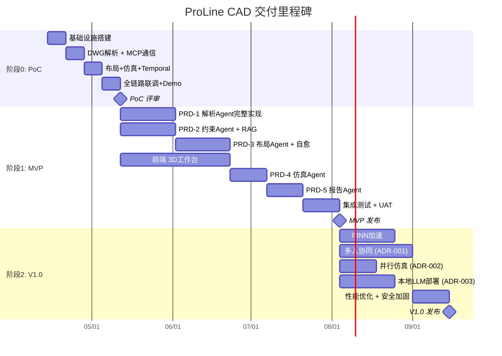

### 阶段交付物一览

| 阶段 | 目标日期 | 交付物 |
|------|----------|--------|
| **PoC** | 2026-05-09 | 全链路Demo、技术验证报告、风险评估更新 |
| **MVP** | 2026-08-01 | 可用产品（5 Agent + Frontend + Temporal）、用户手册 |
| **V1.0** | 2026-10-01 | 生产就绪版本、运维手册、性能测试报告 |

---

**文档结束**  
本技术方案文档应与 `产线+工艺PRD20260408.md` 及 `PRD全局附录_数据模型与接口规范.md` 配套使用。
