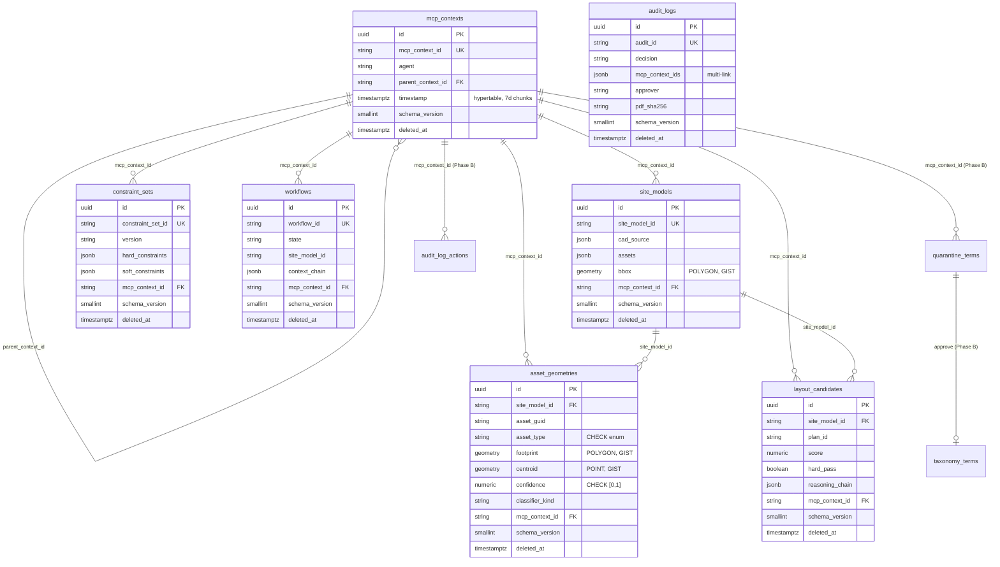

# 数据架构 (Data Architecture)

> 范围: ProLine CAD 当前已落地的 7 张表 (Alembic head = `0003_timescale_mcp`),
> 加 W2 Phase B 计划新增的 `taxonomy_terms` / `quarantine_terms` / `audit_log`
> (action-level)。本文档与 `shared/db_schemas.py` 是双源真理:Pydantic 字段
> 定义于 `shared/models.py`,DDL 定义于 `db/alembic/versions/`。

---

## 1. ER 图 (Phase A 完成态 + Phase B 预告)



---

## 2. Lineage (数据血缘) 关键路径

任意 `LayoutCandidate` 都可经 4 跳反推到原始上传:

```
LayoutCandidate
   |  site_model_id
   v
SiteModel
   |  mcp_context_id
   v
McpContext (parse stage)
   |  cad_source.dwg_hash       <-- JSONB 字段, 跨 MinIO 对账
   v
MinIO bucket "raw_dwg/<hash>"
   |  metadata.uploader
   v
audit_logs.approver / mcp_contexts.provenance.user_id
```

CHECK / 索引保障:
- `asset_geometries.asset_type` 受 `ck_asset_geom_asset_type_enum` 约束,与
  `shared.models.AssetType` 同源 (B4 drift CI 守护)
- `asset_geometries.confidence` 受 `[0,1]` CHECK 约束
- 所有 `*_mcp_context_id` 列均建索引 (反向 join 性能)
- 所有 `deleted_at` 列均建 `WHERE deleted_at IS NULL` 部分索引 (软删除查询)

Dashboard `/dashboard/lineage/<mcp_context_id>` 端点 (T2 Phase B) 复用此路径
做 4 段链式 join,后端无需新设计图。

---

## 3. 三层存储映射

| 层 | 存储引擎 | 表 / 对象 | 保留 | 写入方 |
|---|---|---|---|---|
| Hot | PG 16 + PostGIS + Timescale | mcp_contexts (近 30d 自动 retention) / site_models / asset_geometries / constraint_sets / layout_candidates / workflows / audit_logs | 30d (mcp), 永久 (业务表 + 软删除) | 各 Agent + Orchestrator |
| Warm | MinIO | `raw_dwg/<sha256>` (原 DWG/DXF), `render/<site_model_id>/*.png`, `snapshot/<site_model_id>.json` | 365d | ParseAgent, RenderAgent |
| Cold | S3 Glacier (or local cold) | `mcp_contexts_parquet/<yyyy>/<mm>/*.parquet` (>30d 导出), LLM 回放 jsonl | 7y | `scripts/export_cold_mcp_to_parquet.py` (Phase B) |

迁出规则: TimescaleDB retention policy 删除前由 cold-export job 写 Parquet
到 MinIO `cold/` bucket,再 lifecycle 到 Glacier。Job 失败则 retention 暂停。

---

## 4. Schema 演进契约

- **Alembic 是唯一入口**: `alembic revision --autogenerate -m "..."` -> 人审 diff
  -> 提交。永远不直接编辑 `db/migrations/001_initial.sql` 或已合入的 revision。
- **三步循环 CI**: `alembic upgrade head && alembic downgrade -1 && alembic upgrade head`
  在 PR 上必跑,失败即 merge block。
- **零停机字段重命名**: expand (新列) -> migrate (双写) -> contract (删旧列),
  分 3 个 PR 完成,中间至少跑一次发布。
- **schema_version 提升时机**: 任何 breaking change (字段含义变更、枚举值删除、
  约束收紧) 都要 `schema_version++`,旧客户端通过该列识别兼容性。
- **删除等同于设置 `deleted_at`**: 应用层查询默认带 `WHERE deleted_at IS NULL`;
  物理 DELETE 仅由季度归档 job 执行。
- **AssetType 等枚举的演进**: 新增值需同时更新 `shared/models.py::AssetType`、
  `shared/db_schemas.py::ASSET_TYPES` 和新建 alembic revision 变更 CHECK 约束;
  drift CI (B4) 守护三者同步。

---

## 5. Phase B 待新增对象 (W2)

| 对象 | 用途 | revision |
|---|---|---|
| `taxonomy_terms` | 已生效的资产词表 (gold + 已审 LLM + 人工) | 0004 |
| `quarantine_terms` | 待人审的隔离词条聚合 | 0004 |
| `audit_log_actions` | 谁/何时对什么做了什么 (Action-level,与 audit_logs 决策签发互补) | 0005 |
| `asset_geometries.embedding vector(384)` | pgvector 预留,Phase 5 启用 ivfflat | 0006 |
| CDC slot `parse_agent_cdc` | wal_level=logical + replication slot 占位 | 配置层 (B5) |

详细 DDL 草案见 ExcPlan/next3_tasks_execution_plan.md §3.4.2。
